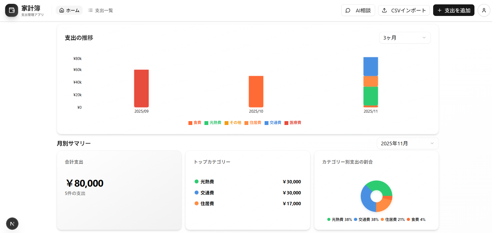

# 💰 Smart Household Account Book (スマート家計簿)

> モダンなWeb技術を活用した、直感的で使いやすい家計簿管理アプリケーション。支出の記録・分析・可視化を一つのプラットフォームで実現します。

## アプリケーション画面



**ダッシュボードの主な機能:**
- 📊 過去3ヶ月間の支出推移を棒グラフで表示
- 📋 月別の支出明細リスト（編集・削除機能付き）
- 📈 カテゴリー別支出の割合をドーナツグラフで可視化
- 📥 CSVインポート機能（一括登録）
- 📄 支出一覧ページ（全データの閲覧・編集・削除）

## 🎯 プロジェクト概要

スマート家計簿は、個人の支出を効率的に管理・分析するためのフルスタックWebアプリケーションです。最新の技術スタックを採用し、RESTful API設計、セキュアな認証、そして直感的なUIを実現しています。

### 主な特徴

- ✨ **モダンなUI/UX**: Next.js 15とTailwind CSS 4.xを使用したレスポンシブデザイン、shadcn/uiによる高品質なコンポーネント
- 🔐 **セキュアな認証**: AWS Cognitoによる認証・認可
- 📊 **データ可視化**: Rechartsによるインタラクティブなグラフ表示
- 🔄 **API設計**: OpenAPI/Swaggerによる型安全なAPI開発
- 🏗️ **DDDアーキテクチャ**: ドメイン駆動設計（DDD）の原則に従った設計で、保守性と拡張性を確保
- ⚡ **パフォーマンス最適化**: 月別サマリー計算をバックエンドで実行し、通信量とフロントエンド計算を削減
- 🐳 **コンテナ化**: Docker Composeによる簡単な環境構築

## 🛠️ 技術スタック

### フロントエンド
- **フレームワーク**: Next.js 15.5.4 (App Router)
- **UIライブラリ**: React 19.1.0
- **言語**: TypeScript 5.0
- **スタイリング**: Tailwind CSS 4.1 (PostCSS経由)
- **UIコンポーネント**: 
  - shadcn/ui (Radix UIベースのアクセシブルなコンポーネント)
  - Radix UI (ダイアログ、ドロップダウン、セレクト等)
  - Lucide React (アイコン)
  - Recharts 2.15 (グラフ可視化)
- **フォーム管理**: React Hook Form + Zod (バリデーション)
- **状態管理**: React Hooks + React Context
- **認証**: AWS Amplify (@aws-amplify/ui-react)
- **APIクライアント**: Axios (OpenAPI Generatorで自動生成)
- **ユーティリティ**:
  - date-fns (日付処理)
  - next-themes (ダークモード対応)
  - sonner (トースト通知)
  - class-variance-authority (UIコンポーネントバリアント管理)
  - Geist (フォント)

### バックエンド
- **フレームワーク**: Spring Boot 3.x
- **言語**: Java
- **データベース**: MySQL 8.0
- **認証**: AWS Cognito
- **API仕様**: OpenAPI 3.0 (Swagger)
- **依存性注入**: Spring Framework
- **アーキテクチャ**: ドメイン駆動設計（DDD）
  - **ドメイン層**: 値オブジェクト（ExpenseAmount、Category、ExpenseDate、MonthlySummary、CategorySummary）、リポジトリインターフェース
  - **アプリケーション層**: アプリケーションサービス（ユースケース実装）、DTO変換マッパー
  - **プレゼンテーション層**: REST APIコントローラー
- **データアクセス**: Spring Data JPA（ページネーション対応）

### インフラストラクチャ・ツール
- **コンテナ化**: Docker & Docker Compose
- **API設計**: OpenAPI Generator (コード自動生成)
- **バージョン管理**: Git

## 🚀 主な機能

### 1. 支出管理
- ✅ 支出の追加・編集・削除
- ✅ カテゴリー別の分類（食費、光熱費、住居費、交通費、その他）
- ✅ 日付による検索・フィルタリング
- ✅ 月別の支出一覧表示（ページネーション対応、必要な月のデータのみ取得）
- ✅ 月別サマリー取得（バックエンドで集計、通信量削減）

### 2. データ可視化
- 📊 **支出の推移**: 過去数ヶ月間の支出を棒グラフで表示（範囲指定APIから取得、フロントエンド計算削減）
- 🍩 **カテゴリー別割合**: ドーナツグラフによる支出割合の可視化
- 📈 **月別サマリー**: 合計支出、件数、トップカテゴリーの表示（バックエンドで集計、リアルタイム更新）

### 3. データインポート/エクスポート
- ✅ CSVファイルからの支出データインポート（複数件一括登録対応）
- 📤 データエクスポート機能（予定）

### 4. セキュリティ機能
- 🔐 AWS Cognitoによるユーザー認証・認可
- 🛡️ JWT トークンによるAPI認証
- 🔒 SQLインジェクション対策
- 🔐 環境変数による機密情報管理

## 📁 プロジェクト構造

```
SmartHouseholdAccountBook/
├── backend/                    # Spring Boot アプリケーション
│   ├── src/
│   │   ├── main/
│   │   │   ├── java/
│   │   │   │   └── com/example/backend/
│   │   │   │       ├── controller/              # REST API コントローラー
│   │   │   │       ├── application/             # アプリケーション層
│   │   │   │       │   ├── service/             # アプリケーションサービス（ユースケース実装）
│   │   │   │       │   └── mapper/              # DTO変換マッパー
│   │   │   │       ├── domain/                  # ドメイン層（ビジネスロジック）
│   │   │   │       │   ├── repository/          # リポジトリインターフェース
│   │   │   │       │   └── valueobject/         # 値オブジェクト（不変な値）
│   │   │   │       │       ├── ExpenseAmount.java    # 支出金額
│   │   │   │       │       ├── Category.java         # カテゴリー
│   │   │   │       │       ├── ExpenseDate.java      # 支出日付
│   │   │   │       │       ├── MonthlySummary.java   # 月別サマリー
│   │   │   │       │       └── CategorySummary.java  # カテゴリー別集計
│   │   │   │       ├── entity/                  # エンティティ（データベースのテーブルに対応するクラス。IDで管理され、可変である）
│   │   │   │       ├── auth/                    # 認証・認可関連
│   │   │   │       │   ├── filter/              # 認証フィルター
│   │   │   │       │   └── provider/            # 認証プロバイダー
│   │   │   │       ├── config/                  # 設定クラス
│   │   │   │       │   └── security/            # セキュリティ設定
│   │   │   │       ├── repository/              # リポジトリ実装（JPA）
│   │   │   │       ├── service/                 # サービス層（未使用）
│   │   │   │       └── api/                     # API関連（未使用）
│   │   │   └── resources/
│   │   │       └── application.properties       # アプリケーション設定
│   │   └── test/                                # テストコード
│   ├── pom.xml                                  # Maven依存関係
│   └── Dockerfile
│
├── frontend-nextjs/           # Next.js アプリケーション
│   ├── app/                   # App Router (Next.js 15)
│   │   ├── page.tsx           # ダッシュボードページ（ホーム）
│   │   ├── expenses/          # 支出一覧ページ
│   │   ├── login/             # ログインページ
│   │   ├── api/               # API Routes
│   │   ├── layout.tsx         # ルートレイアウト
│   │   └── globals.css        # グローバルスタイル
│   ├── src/
│   │   ├── components/         # React コンポーネント
│   │   │   ├── ui/           # shadcn/uiコンポーネント
│   │   │   ├── dashboard/    # ダッシュボード関連コンポーネント
│   │   │   ├── auth/         # 認証関連コンポーネント
│   │   │   └── expense-*.tsx # 支出関連コンポーネント
│   │   ├── hooks/             # カスタムフック
│   │   │   ├── use-expenses.ts           # 支出管理フック（全データ取得）
│   │   │   ├── use-monthly-expenses.ts   # 月別支出取得フック
│   │   │   ├── use-monthly-summary.ts   # 月別サマリー取得フック
│   │   │   ├── use-monthly-summary-range.ts # 範囲指定月別サマリー取得フック
│   │   │   └── use-available-months.ts  # 利用可能な月取得フック
│   │   ├── lib/               # ユーティリティ関数
│   │   │   └── formatters.ts  # フォーマッター
│   │   ├── contexts/          # React Context
│   │   │   └── auth-provider.tsx # 認証プロバイダー
│   │   ├── config/            # 設定ファイル
│   │   └── api/               # API クライアント
│   │       └── generated/    # OpenAPI Generatorで自動生成
│   ├── public/                # 静的ファイル
│   ├── components.json        # shadcn/ui設定
│   ├── postcss.config.mjs     # PostCSS設定（Tailwind CSS 4.x）
│   ├── package.json
│   └── tsconfig.json
│
├── docker/                     # Docker設定ファイル
│   └── mysql/                  # MySQL設定ファイル
│       ├── init.sql            # データベース初期化スクリプト
│       └── my.cnf              # MySQL設定ファイル
├── openapi/                    # API仕様書
│   └── openapi.yaml           # OpenAPI 3.0仕様
├── docs/                       # ドキュメント
│   └── images/                # スクリーンショット画像
├── docker-compose.yaml         # 本番環境用（Spring Boot + MySQL）
├── docker-compose.dev.yaml     # 開発環境用（MySQLのみ）
└── README.md
```

## 🏃‍♂️ セットアップと実行方法

### 前提条件
- Docker & Docker Compose がインストールされていること
- Node.js 18以上（フロントエンド開発用）
- Java 17以上 & Maven（バックエンド開発用）

### 1. リポジトリのクローン
```bash
git clone https://github.com/your-username/SmartHouseholdAccountBook.git
```

### 2. 環境変数の設定

#### フロントエンド
`frontend-nextjs/.env.local` を作成:
```env
NEXT_PUBLIC_API_URL=バックエンドAPIのベースURL
```

#### バックエンド
プロジェクトルートに `.env` を作成し、以下の環境変数を設定します：

```env
- `MYSQL_ROOT_PASSWORD`: MySQLのrootパスワード
- `MYSQL_DATABASE`: データベース名（デフォルト: demo）
- `SPRING_DATASOURCE_URL_DEV`: ローカル開発環境でのMySQL接続URL
- `COGNITO_JWK_SET_URL`: AWS CognitoのJWK Set URL（実際のCognito URLに変更してください）
```
### 3. ローカル開発環境の起動

最も効率的な開発方法です。MySQLのみDockerで起動し、Spring BootはローカルJVMで実行します。

#### ステップ1: MySQLをDockerで起動

```bash
# MySQLコンテナを起動
docker-compose -f docker-compose.dev.yaml up -d
```

#### ステップ2: Spring Bootをローカルで起動

**方法1: IDEから起動（推奨）**
1. Cursor/VS Codeで **F5キー** を押す
2. 「**Spring Boot (Local)**」を選択
3. アプリケーションが起動します

### 4. 本番環境での起動（Docker）

本番環境ではMySQL は外部（RDS等）を使用し、Spring BootのみDockerで起動します。

### 5. OpenAPI自動生成

OpenAPI仕様を変更した場合、コードを再生成します：

```bash
cd backend
mvn generate-sources -Plocal
```

**自動生成されるファイル:**
- `target/generated-sources/openapi/` 配下にAPIインターフェースとモデルクラスが生成されます

### 開発環境と本番環境の違い

| 項目 | ローカル開発（推奨） | 本番環境 |
|------|---------------------|---------|
| **MySQL** | Docker（localhost:3306） | 外部（RDS等） |
| **Spring Boot** | ローカルJVM | Docker |
| **起動方法** | Cursor F5キー | docker-compose up |
| **DevTools** | ✅ 有効（1-2秒再起動） | ❌ 無効 |
| **デバッグ** | IDEから直接 | リモートデバッグ（ポート5005） |
| **ログ** | IDEコンソール | docker logs |
| **ホットリロード** | 超高速 | なし |

#### 本番用イメージのビルド:
```bash
# 本番用Dockerfileを使用してビルド
docker build -f backend/Dockerfile -t smart-household-backend:prod .
```


## 🔒 セキュリティ実装

### 認証・認可
- **AWS Cognito**: マネージド認証サービスによるセキュアなユーザー管理
- **JWT認証**: トークンベースの認証によるステートレスなAPI設計
- **フィルター**: Spring Security によるリクエストフィルタリング

### データ保護
- **SQLインジェクション対策**: PreparedStatementによるパラメータ化クエリ
- **環境変数管理**: 機密情報のハードコーディングを防止
- **HTTPS**: 本番環境での通信暗号化（推奨）

## 📊 API設計

このプロジェクトでは、OpenAPI 3.0仕様を使用してAPIを設計しています。

### 主要エンドポイント

#### 支出管理
- `GET /api/expenses` - 支出一覧取得（オプション: `month` クエリパラメータで月別フィルタリング）
- `POST /api/expenses` - 支出追加
- `PUT /api/expenses/{id}` - 支出更新
- `DELETE /api/expenses/{id}` - 支出削除

#### 月別サマリー・集計
- `GET /api/expenses/summary` - 月別サマリー取得（クエリパラメータ: `month` 必須）
  - レスポンス: 合計金額、件数、カテゴリー別集計（金額降順でソート済み）
- `GET /api/expenses/summary/range` - 範囲指定で月別サマリー取得（クエリパラメータ: `startMonth`, `endMonth` 必須）
  - レスポンス: 指定範囲の各月のサマリー配列
- `GET /api/expenses/months` - 利用可能な月のリスト取得
  - レスポンス: 月の文字列配列（YYYY-MM形式、降順でソート済み）

### パフォーマンス最適化

- **月別フィルタリング**: 必要な月のデータのみ取得することで通信量を削減
- **バックエンド集計**: 月別サマリー計算をバックエンドで実行し、フロントエンドの計算負荷を削減
- **ページネーション対応**: 月別支出取得APIはページネーション対応（現在は全件取得）

詳細は `openapi/openapi.yaml` を参照してください。

## 🏗️ アーキテクチャ設計

### ドメイン駆動設計（DDD）

このプロジェクトは、ドメイン駆動設計（DDD）の原則に従って設計されています。

#### レイヤー構造

1. **ドメイン層** (`domain/`)
   - **値オブジェクト**: 不変な値（ExpenseAmount、Category、ExpenseDate、MonthlySummary、CategorySummary）
   - **リポジトリインターフェース**: データアクセスの抽象化
   - **責務**: ビジネスロジックとドメインルールの実装

2. **アプリケーション層** (`application/`)
   - **サービス**: ユースケースの実装（ExpenseApplicationService）
   - **マッパー**: ドメインオブジェクトとDTOの変換
   - **責務**: ユースケースの調整とトランザクション管理

3. **プレゼンテーション層** (`controller/`)
   - **コントローラー**: REST APIエンドポイントの実装
   - **責務**: HTTPリクエスト/レスポンスの処理

#### 値オブジェクトの利点

- **不変性**: 値オブジェクトは不変（immutable）であり、予期しない変更を防止
- **バリデーション**: コンストラクタでバリデーションを実行し、不正な値の作成を防止
- **ドメイン表現**: ビジネス概念をコードで明確に表現
- **再利用性**: 複数の場所で安全に再利用可能

## 🚧 今後の拡張予定

- [ ] AIチャット機能の追加
- [x] CSVインポート機能 ✅
- [x] 月別サマリーAPI ✅
- [ ] ページネーション対応 ✅
- [ ] 収入管理機能の追加
- [ ] 予算設定・管理機能
- [ ] レポート生成機能（PDF出力）
- [ ] データエクスポート機能
- [ ] 複数通貨対応
- [ ] モバイルアプリ（React Native）
- [ ] 家計簿テンプレート機能
- [ ] 共同家計簿機能（複数ユーザー）
- [ ] 自動分類機能（AI）


