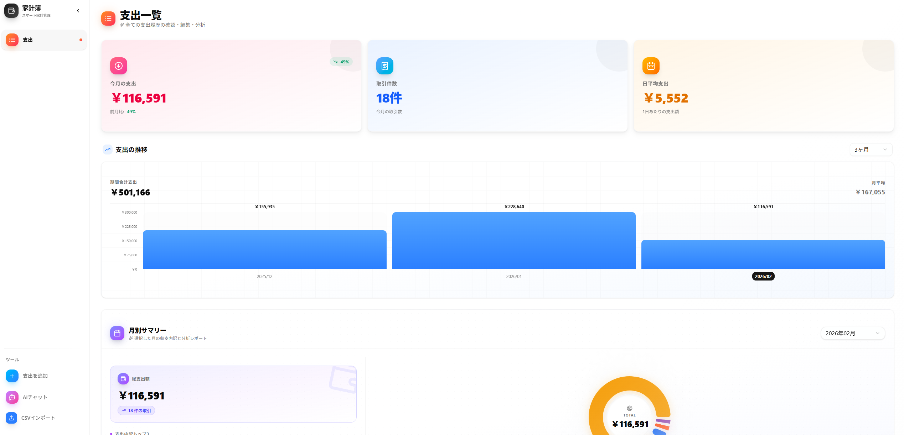
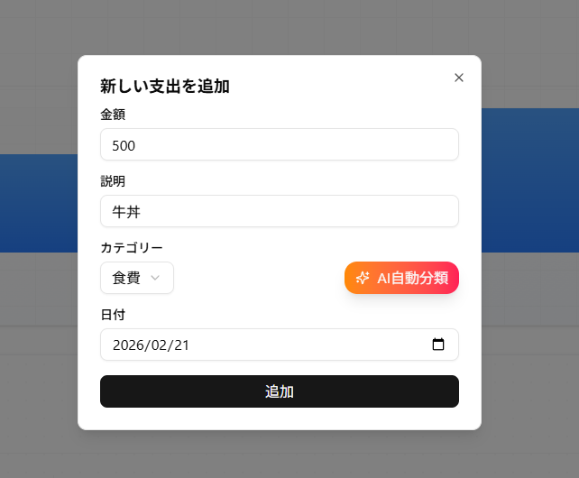
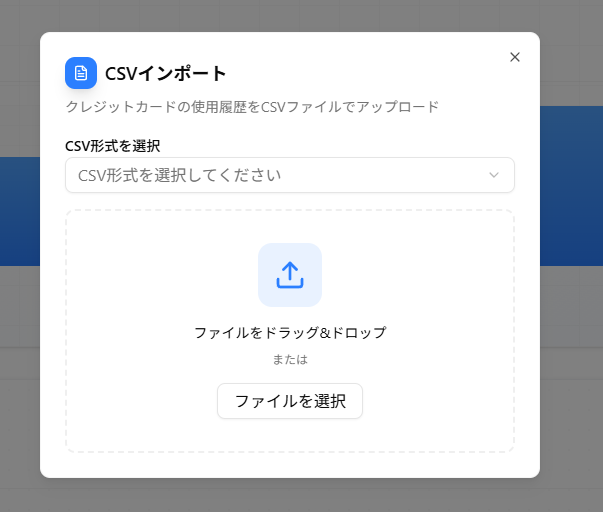

# 💰 Smart Household Account Book (スマート家計簿)

> モダンなWeb技術を活用した、直感的で使いやすい家計簿管理アプリケーション。支出の記録・分析・可視化を一つのプラットフォームで実現します。

## アプリケーション画面

<div style="display: flex; gap: 8px; flex-wrap: wrap; align-items: flex-end;">
  
  
  
</div>

## 🎯 概要

フルスタックの家計簿Webアプリ。支出の記録・分析・可視化、CSV取込、AWS Cognito認証、OpenAI連携のAIアドバイザーを備えます。Next.js + Spring Boot、OpenAPI/DDDで構成されています。

## 🛠️ 技術スタック

- **フロントエンド**: Next.js 15 (App Router), React 19, TypeScript, Tailwind CSS 4, shadcn/ui, Recharts, AWS Amplify, OpenAPI Generator
- **バックエンド**: Spring Boot 3.5, Java 21, MySQL 8, AWS Cognito, OpenAI API, DDD（ドメイン・アプリケーション・プレゼンテーション層）
- **インフラ**: Docker Compose, OpenAPI 3.0

## 🚀 主な機能

- **支出管理**: 追加・編集・削除、カテゴリ分類、月別一覧・サマリー
- **データ可視化**: 棒グラフ（推移）、ドーナツグラフ（カテゴリ別割合）
- **CSVインポート**: 一括登録（三井住友カード形式等対応）
- **AI家計アドバイザー**: チャット形式のアドバイス、会話履歴、支出に基づくカテゴリ提案
- **認証**: AWS Cognito + JWT

## 📁 プロジェクト構造

```
SmartHouseholdAccountBook/
├── backend/                 # Spring Boot（controller / application / domain / entity / auth / config）
├── frontend-nextjs/         # Next.js（app/, src/components, hooks, api, config）
├── openapi/                 # OpenAPI 仕様
├── docker/                  # MySQL 設定
├── docker-compose.*.yaml    # 開発・本番用 Compose
└── docs/
```

## 🏃‍♂️ セットアップと実行方法

### 前提条件
- Docker & Docker Compose がインストールされていること
- Node.js 18以上（フロントエンド開発用）
- Java 21 & Maven（バックエンド開発用）

### 1. リポジトリのクローン
```bash
git clone https://github.com/your-username/SmartHouseholdAccountBook.git
```

### 2. 環境変数の設定

#### フロントエンド
`frontend-nextjs/.env.local` を作成し、以下の環境変数を設定します：

```env
# バックエンドAPIのベースURL
NEXT_PUBLIC_API_BASE_URL=http://localhost:8080

# AWSリージョン
NEXT_PUBLIC_AWS_REGION=ap-northeast-1

# Cognito User Pool ID（形式: ap-northeast-1_xxxxxxxxxx）
NEXT_PUBLIC_COGNITO_USER_POOL_ID=your-user-pool-id

# Cognito Client ID
NEXT_PUBLIC_COGNITO_CLIENT_ID=your-client-id
```

- `.env.local` は `.gitignore` に含まれるため Git にコミットされません
- AWS Cognito の値は AWS コンソールで取得してください
- 変更後は開発サーバーを再起動してください

#### バックエンド
プロジェクトルートに `.env` を作成し、以下の環境変数を設定します：

```env
# MySQL
MYSQL_ROOT_USER=root
MYSQL_ROOT_PASSWORD=your-password
MYSQL_DATABASE=demo

# データソースURL（開発: localhost / 本番Docker: mysql ホスト名）
SPRING_DATASOURCE_URL_DEV=jdbc:mysql://localhost:3306/demo
SPRING_DATASOURCE_URL_PROD=jdbc:mysql://mysql:3306/demo

# Cognito（JWT検証用）
COGNITO_JWK_SET_URL=https://cognito-idp.<region>.amazonaws.com/<user-pool-id>/.well-known/jwks.json
COGNITO_ISSUER_URL=https://cognito-idp.<region>.amazonaws.com/<user-pool-id>
COGNITO_CLIENT_ID=your-client-id

# OpenAI（AIチャット・カテゴリ提案で使用）
OPENAI_API_KEY=your-openai-api-key

# 任意: CORS 許可オリジン（未設定時は http://localhost:3000）
# CORS_ALLOWED_ORIGINS=http://localhost:3000
```
### 3. 本番環境での起動（Docker）

```bash
docker-compose -f docker-compose.mysql.yaml up -d
docker-compose -f docker-compose.backend.yaml up -d
```

MySQLを外部（RDS等）で運用する場合は、`docker-compose.backend.yaml` の環境変数で接続先を指定してください。

### 4. OpenAPI コード生成

OpenAPI 仕様（`openapi/openapi.yaml`）を変更した場合、バックエンド・フロントエンドのコードを再生成します。

**バックエンド（Java）**
```bash
cd backend
mvn generate-sources -Plocal
```
→ `target/generated-sources/openapi/` に API インターフェース・モデルが生成されます。

**フロントエンド（TypeScript）**
```bash
cd frontend-nextjs
npm run generate:api
```
→ `src/api/generated/` に API クライアントが生成されます。

## 📊 API設計

### 主要エンドポイント

#### 支出管理
- `GET /api/expenses` - 支出一覧取得（オプション: `month` で月別フィルタ）
- `POST /api/expenses` - 支出追加
- `PUT /api/expenses/{id}` - 支出更新
- `DELETE /api/expenses/{id}` - 支出削除
- `POST /api/expenses/upload-csv` - CSV 一括アップロード

#### 月別サマリー・集計
- `GET /api/expenses/summary` - 月別サマリー取得（`month` 必須）
- `GET /api/expenses/summary/range` - 範囲指定で月別サマリー（`startMonth`, `endMonth` 必須）
- `GET /api/expenses/months` - 利用可能な月のリスト取得

#### AI
- `GET /api/ai/chat` - 会話履歴取得
- `POST /api/ai/chat` - AIチャット送信（過去30日間の支出をコンテキストに利用）
- `POST /api/ai/category` - 支出内容からカテゴリをAI提案

詳細は `openapi/openapi.yaml` を参照してください。

