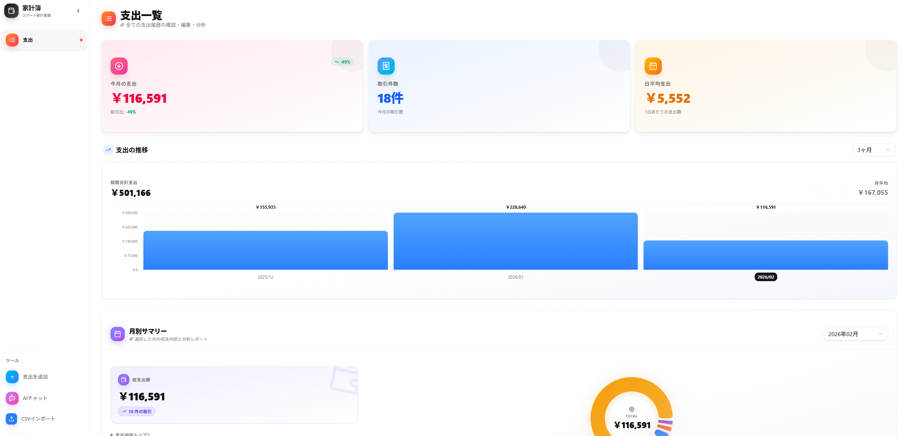
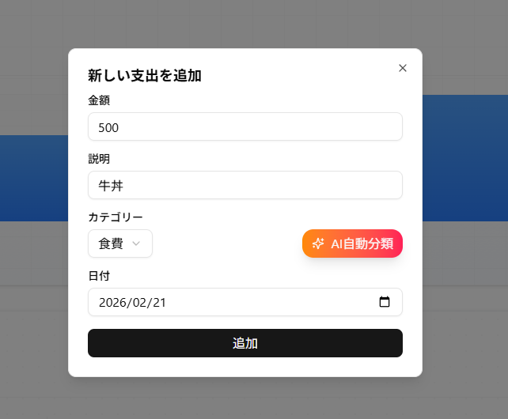
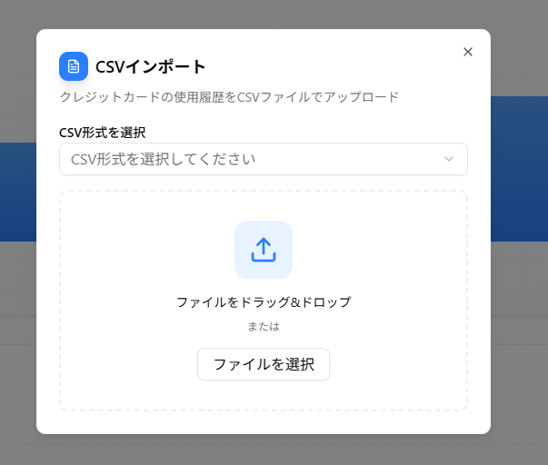

# Smart Household Account Book

学習用に設計したフルスタック家計簿アプリです。  
「入力しやすい」「振り返りやすい」「改善につなげやすい」を目標に、Next.js フロントエンドと Spring Boot バックエンドで実装しています。

## このプロジェクトでできること

- 支出の登録・編集・削除
- 月ごとの一覧表示とサマリー表示
- CSV 一括インポート（三井住友カードの新旧フォーマット対応）
- AI によるカテゴリ提案
- AI による月次レポート生成（キャッシュ利用あり）
- AWS Cognito ベースの認証（JWT 検証）

## アプリ画面

<div style="display: flex; gap: 8px; flex-wrap: wrap; align-items: flex-end;">
  
  
  
</div>

## 技術スタック

### フロントエンド

- Next.js 15.5（App Router）
- React 19 / TypeScript 5
- Tailwind CSS 4 / shadcn-ui
- AWS Amplify（Cognito 連携）
- OpenAPI Generator（TypeScript Axios クライアント）

### バックエンド

- Spring Boot 4.0.6
- Java 25 / Maven Wrapper
- Spring Data JPA / Hibernate
- MySQL 8 / Flyway
- Spring Security（OAuth2 Resource Server）
- Resilience4j / Caffeine Cache / Actuator
- OpenAPI Generator（Spring インターフェース生成）

### CI / 品質

- GitHub Actions（`mvn verify`）
- CodeQL（Java + TypeScript）
- JaCoCo（カバレッジレポート）

## ディレクトリ構成

```text
SmartHouseholdAccountBook/
├── backend/                 # Spring Boot API
├── frontend-nextjs/         # Next.js アプリ
├── openapi/                 # OpenAPI 仕様と paths/components
├── docker/
│   ├── compose/             # 実行モード別 compose ファイル
│   └── scripts/             # 起動補助スクリプト（stack.sh）
└── docs/                    # 学習用ドキュメント
```

## クイックスタート

### 前提

- Docker / Docker Compose
- Node.js 18 以上
- Java 25（ローカルで Spring を起動する場合）

### 1) リポジトリを取得

```bash
git clone <your-repo-url>
cd SmartHouseholdAccountBook
```

### 2) 環境変数を設定

#### ルート `.env`（バックエンド / Docker 用）

```env
# MySQL（root はコンテナ運用・init 用。Spring には渡さない）
MYSQL_ROOT_PASSWORD=your-strong-password
MYSQL_DATABASE=household_book

# Flyway / アプリ専用ユーザー（init スクリプトで作成）
MYSQL_FLYWAY_USER=flyway_user
MYSQL_FLYWAY_PASSWORD=your-flyway-password
MYSQL_APP_USER=app_user
MYSQL_APP_PASSWORD=your-app-password

# DataSource（ローカル IDE / dev 用）
SPRING_DATASOURCE_URL_DEV=jdbc:mysql://localhost:3306/household_book?serverTimezone=UTC&characterEncoding=UTF-8
SPRING_DATASOURCE_URL_PROD=jdbc:mysql://mysql:3306/household_book?serverTimezone=UTC&characterEncoding=UTF-8

# Cognito (JWT 検証)
COGNITO_JWK_SET_URL=https://cognito-idp.<region>.amazonaws.com/<user-pool-id>/.well-known/jwks.json
COGNITO_ISSUER_URL=https://cognito-idp.<region>.amazonaws.com/<user-pool-id>
COGNITO_CLIENT_ID=your-client-id

# OpenAI
OPENAI_API_KEY=your-openai-api-key
OPENAI_API_URL=https://api.openai.com/v1

# CORS
CORS_ALLOWED_ORIGINS=http://localhost:3000
```

#### `frontend-nextjs/.env.local`（フロント用）

```env
NEXT_PUBLIC_API_BASE_URL=http://localhost:8080
NEXT_PUBLIC_AWS_REGION=ap-northeast-1
NEXT_PUBLIC_COGNITO_USER_POOL_ID=your-user-pool-id
NEXT_PUBLIC_COGNITO_CLIENT_ID=your-client-id
```

### 3) 起動方法を選ぶ

#### A. 一番簡単（推奨）

バックエンド + MySQL + フロント（Next.js）をまとめて起動:

```bash
./docker/scripts/stack.sh up single-host-local
```

停止:

```bash
./docker/scripts/stack.sh down single-host-local
```

#### B. Spring をローカルで起動したい場合

MySQL のみ Docker で起動:

```bash
docker compose --project-directory "$(pwd)" --env-file .env \
  -f docker/compose/docker-compose.dev.yaml up -d
```

バックエンド:

```bash
cd backend
./mvnw spring-boot:run -Plocal
```

フロントエンド:

```bash
cd frontend-nextjs
npm install
npm run dev
```

## 開発でよく使うコマンド

### バックエンド

```bash
cd backend
./mvnw verify
./mvnw test
./mvnw generate-sources -Plocal
```

### フロントエンド

```bash
cd frontend-nextjs
npm install
npm run dev
npm run build
npm run lint
npm run generate:api
```

## OpenAPI 連携

`openapi/openapi.yaml` を変更したら、両方のコード生成を実行します。

- バックエンド生成先: `backend/target/generated-sources/openapi/`
- フロント生成先: `frontend-nextjs/src/api/generated/`

## API エンドポイント（現行）

### 支出

- `GET /api/expenses`
- `POST /api/expenses`
- `PUT /api/expenses/{id}`
- `DELETE /api/expenses/{id}`
- `POST /api/expenses/upload-csv`

### 集計

- `GET /api/expenses/summary`
- `GET /api/expenses/summary/range`
- `GET /api/expenses/months`

### AI

- `POST /api/ai/category`
- `GET /api/expenses/report`（`generate` パラメータで生成/キャッシュ切替）

詳細仕様は `openapi/openapi.yaml` を参照してください。

## セキュリティと運用の考え方

- 認証は AWS Cognito + JWT で実施
- DB スキーマは Flyway で管理し、JPA の DDL 自動変更は無効化（`validate`）
- シークレット（`.env` / `.env.local`）は Git 管理しない
- OpenAI 呼び出しには Retry / Circuit Breaker / Rate Limiter を適用
- ヘルスチェックは Actuator（`/actuator/health`）を利用

## CI / CodeQL

- `CI`: PR と `main` push で `backend` に対して `mvn verify` を実行
- `CodeQL`: PR / `main` / 週次で Java と TypeScript を静的解析

設定ファイル:

- `.github/workflows/ci.yml`
- `.github/workflows/codeql.yml`

## 学習ドキュメント

- バックエンド学習ガイド: `docs/backend/README.md`
- インフラ学習ガイド: `docs/infrastructure/README.md`

このプロジェクトは「実装しながら理解する」前提のため、README は入口、`docs/` は詳細教材という役割で分けています。

