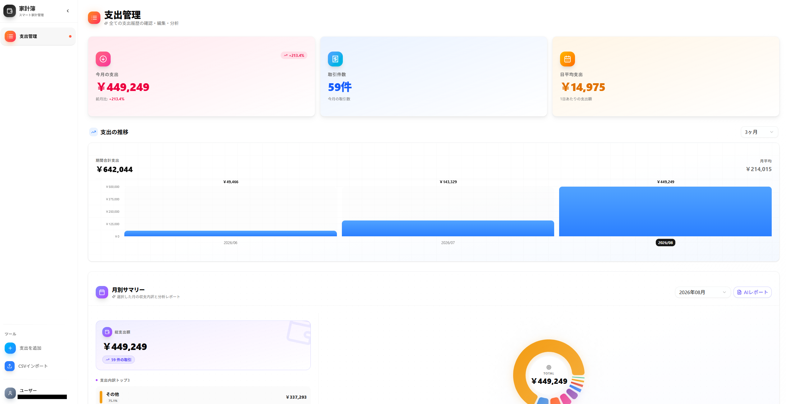
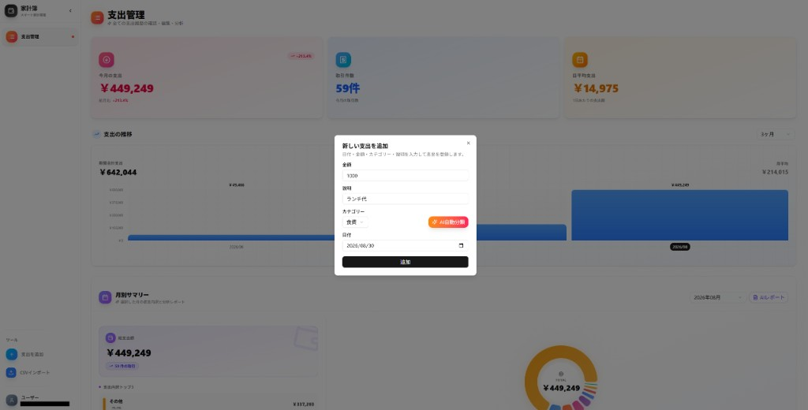
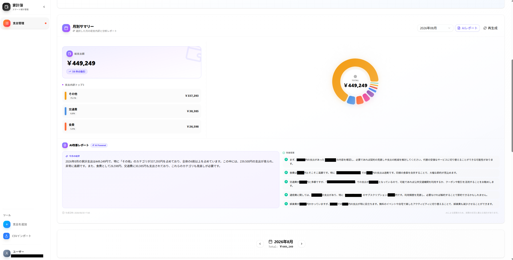
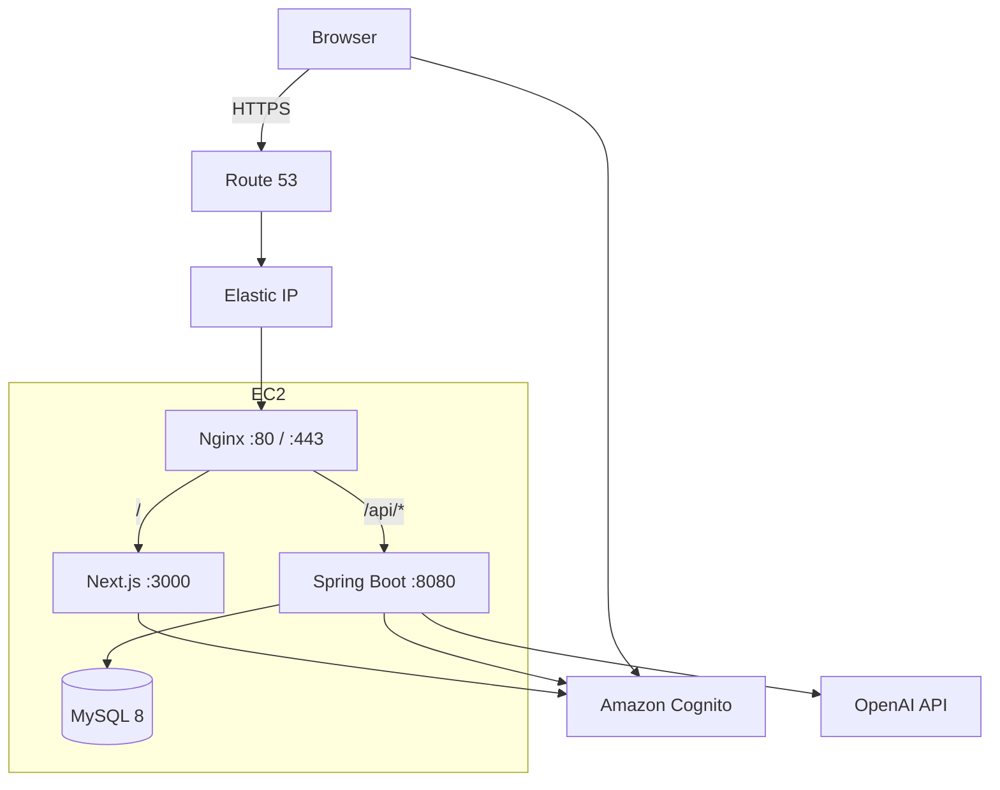
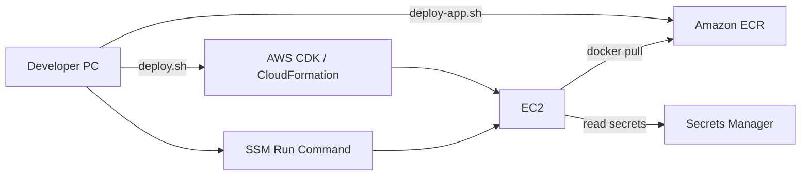

# SmartHouseholdAccountBook

家計管理・生成 AI 分析 Web アプリです。支出の登録・集計、CSV 取り込み、OpenAI API による支出分類・家計分析・改善提案を提供します。

## 公開デモ

- URL: [https://smart-household-account-book.com/](https://smart-household-account-book.com/)
- AWS 利用料金を抑えるため、通常はサーバーを停止しています。
- 動作画面は下記の「GUI サンプル」で確認できます。

## GUI サンプル

### 支出管理ダッシュボード



### 支出の追加



### 月別サマリー・AI 家計分析レポート



## 主な機能

- 支出の登録・編集・削除、月次一覧・サマリー
- CSV 一括インポート（三井住友カードの新旧フォーマット対応）
- OpenAI API による支出カテゴリ提案
- OpenAI API による月次レポート生成（キャッシュあり）
- Amazon Cognito による認証（JWT 検証）

## 技術スタック

### フロントエンド

- Next.js 15（App Router） / React 19 / TypeScript
- Tailwind CSS / shadcn-ui
- AWS Amplify（Cognito 連携）
- OpenAPI Generator（TypeScript Axios クライアント）

### バックエンド

- Spring Boot / Java 25 / Maven
- Spring Data JPA / Hibernate / MySQL 8 / Flyway
- Spring Security（OAuth2 Resource Server）
- Resilience4j / Caffeine Cache / Actuator
- OpenAPI Generator（Spring インターフェース生成）

### 認証・品質

- Amazon Cognito + JWT
- JUnit / MockMvc
- GitHub Actions（ビルド・テスト）
- CodeQL / OSV Scanner

### インフラ

- Docker / Docker Compose
- Amazon ECR / EC2
- AWS CDK（Java）
- Route 53 / Nginx + Let's Encrypt / Secrets Manager / SSM

## インフラ構成

EC2 1 台上で Docker Compose（MySQL + Backend + Frontend）を動かし、Nginx で HTTPS 終端します。イメージは ECR、秘密情報は Secrets Manager、認証は既存の Cognito User Pool を利用します。

### リクエストの流れ


```mermaid
flowchart TB
    User[Browser]
    R53[Route 53]
    EIP[Elastic IP]
    Cognito[Amazon Cognito]
    OpenAI[OpenAI API]

    subgraph EC2["EC2"]
        Nginx[Nginx :80 / :443]
        Next[Next.js :3000]
        Backend[Spring Boot :8080]
        MySQL[(MySQL 8)]
    end

    User -->|HTTPS| R53
    R53 --> EIP
    EIP --> Nginx
    Nginx -->|"/"| Next
    Nginx -->|"/api/*"| Backend
    User --> Cognito
    Next --> Cognito
    Backend --> Cognito
    Backend --> MySQL
    Backend --> OpenAI
```

### デプロイ・運用


```mermaid
flowchart LR
    Dev[Developer PC]
    CDK[AWS CDK / CloudFormation]
    ECR[Amazon ECR]
    SSM[SSM Run Command]
    SM[Secrets Manager]
    EC2[EC2]

    Dev -->|deploy.sh| CDK
    CDK --> EC2
    Dev -->|deploy-app.sh| ECR
    Dev --> SSM
    SSM --> EC2
    EC2 -->|docker pull| ECR
    EC2 -->|read secrets| SM
```

## ディレクトリ構成

```text
SmartHouseholdAccountBook/
├── backend/              # Spring Boot API
├── frontend-nextjs/      # Next.js
├── openapi/              # OpenAPI 仕様（双方のコード生成元）
├── docker/               # Compose・起動スクリプト・MySQL 初期化
├── infra/                # AWS CDK（ECR / EC2 など）
└── .github/workflows/    # CI / CodeQL
```

## クイックスタート

### 前提

- Docker / Docker Compose

### 1. クローン

```bash
git clone https://github.com/DRS22DownForce/SmartHouseholdAccountBook.git
cd SmartHouseholdAccountBook
```

### 2. 環境変数

`.env.example` をコピーして `.env` を作成し、MySQL / Cognito / OpenAI / CORS / `SPRING_PROFILES_ACTIVE` / `NEXT_PUBLIC_*` を設定します。

```env
SPRING_PROFILES_ACTIVE=dev
NEXT_PUBLIC_API_BASE_URL=http://localhost:8080
NEXT_PUBLIC_AWS_REGION=ap-northeast-1
NEXT_PUBLIC_COGNITO_USER_POOL_ID=your-user-pool-id
NEXT_PUBLIC_COGNITO_CLIENT_ID=your-client-id
```

`.env` およびシークレットは Git 管理外です。

### 3. 起動

```bash
./docker/scripts/stack.sh up dev
```

- UI: http://localhost:3000
- API: http://localhost:8080

停止:

```bash
./docker/scripts/stack.sh down dev
```

`prod`（本番寄せ Compose）や `db`（MySQL のみ）も `stack.sh` で利用できます。

## AWS デプロイ・起動

AWS CLI で認証後、環境固有の CDK 設定を作成します。`infra/cdk.context.json` は機密情報を含むため、Git にコミットしないでください。

```bash
aws configure
aws sts get-caller-identity
cp infra/cdk.context.example.json infra/cdk.context.json
```

`infra/cdk.context.json` を編集してから、次の順に実行します。

```bash
./infra/scripts/deploy.sh
./infra/scripts/init-secrets.sh
./infra/scripts/deploy-app.sh
```

停止した EC2 の再起動、課金停止、AWS リソースの完全削除には次のコマンドを使います。

```bash
./infra/scripts/resume.sh   # EC2 を再起動
./infra/scripts/pause.sh    # EC2 を停止
./infra/scripts/destroy.sh  # AWS リソースを完全削除
```

CDK の設定項目など、詳しい手順は [`infra/README.md`](infra/README.md) を参照してください。

## 開発コマンド

### バックエンド

```bash
cd backend
./mvnw verify
./mvnw test
./mvnw generate-sources -Plocal
```

### フロントエンド

```bash
cd frontend-nextjs
npm install
npm run generate:api
npm run dev
npm run lint
npm run build
```

### OpenAPI

`openapi/openapi.yaml` 変更後は双方で生成を実行します。

| 生成先 | パス |
| --- | --- |
| バックエンド | `backend/target/generated-sources/openapi/` |
| フロントエンド | `frontend-nextjs/src/api/generated/` |

## API

### 支出

- `GET /api/expenses`
- `POST /api/expenses`
- `PUT /api/expenses/{id}`
- `DELETE /api/expenses/{id}`
- `POST /api/expenses/upload-csv`

### 集計

- `GET /api/expenses/summary`
- `GET /api/expenses/summary/range`
- `GET /api/expenses/months`

### AI

- `POST /api/ai/category`
- `GET /api/expenses/report`（`generate` で生成 / キャッシュ切替）

詳細は [`openapi/openapi.yaml`](openapi/openapi.yaml) を参照してください。

## セキュリティ・運用

- 認証: Cognito + JWT（Amplify / OAuth2 Resource Server）
- DB スキーマ: Flyway（JPA DDL 自動変更は無効、`validate`）
- シークレット: `.env` / Secrets Manager（リポジトリ外）
- OpenAI 呼び出し: Retry / Circuit Breaker / Rate Limiter（Resilience4j）
- ヘルスチェック: Actuator（`/actuator/health`）

## CI

| Workflow | 内容 |
| --- | --- |
| [`.github/workflows/ci.yml`](.github/workflows/ci.yml) | Backend `mvn verify` / Frontend generate・lint・build |
| [`.github/workflows/codeql.yml`](.github/workflows/codeql.yml) | Java / TypeScript 静的解析 |

