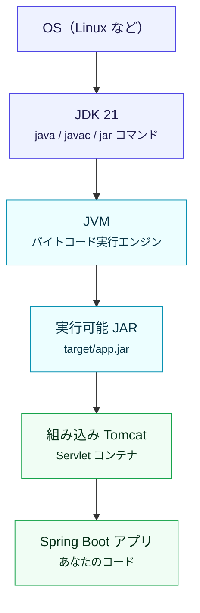
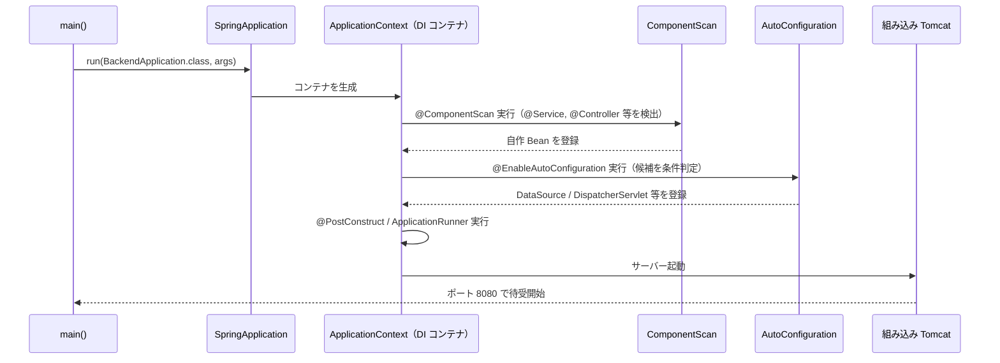
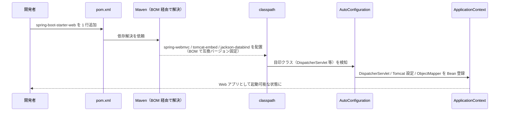
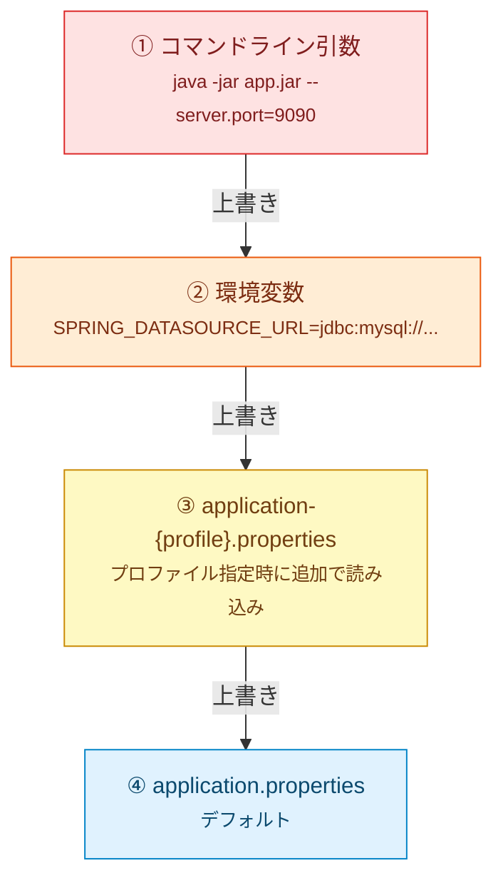
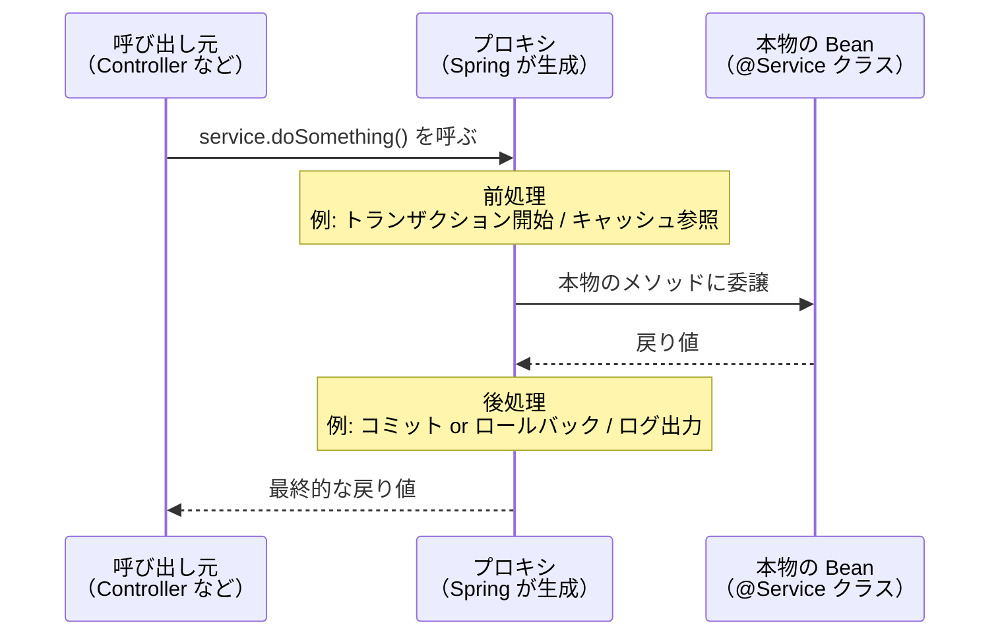

# 01. Spring Core — Spring の土台

> この章で学ぶこと: **Spring Boot とは何か**、**DI/IoC コンテナ**、**Bean の種類**、**Starter と AutoConfiguration**、**外部化設定**、**AOP とプロキシ**。Spring のどの章を読むときも前提となる内容です。

## 目次

1. [Spring Boot とは](#spring-boot-とは)
2. [実行環境のレイヤー](#実行環境のレイヤー)
3. [起動シーケンス](#起動シーケンス)
4. [DI / IoC コンテナ](#di--ioc-コンテナ)
5. [Bean の種類](#bean-の種類)
6. [Bean のスコープ](#bean-のスコープ)
7. [Starter の仕組み](#starter-の仕組み)
8. [AutoConfiguration](#autoconfiguration)
9. [条件付き Bean](#条件付き-bean)
10. [外部化設定 (Externalized Configuration)](#外部化設定-externalized-configuration)
11. [型安全な設定 @ConfigurationProperties](#型安全な設定-configurationproperties)
12. [Bean ライフサイクル](#bean-ライフサイクル)
13. [AOP とプロキシ](#aop-とプロキシ)

---

## Spring Boot とは

Spring Boot は、**Java でアプリケーションを素早く作るための「規約集 + 自動設定」の仕組み**です。Spring Framework という歴史の長い DI フレームワークに対して、「XML 設定をたくさん書くのが大変」「依存ライブラリのバージョンを合わせるのが大変」といった問題を解決する目的で登場しました。

| 項目 | 素の Spring Framework | Spring Boot |
|------|----------------------|-------------|
| XML 設定 | 大量に必要 | 基本不要（`application.properties` のみ） |
| ライブラリのバージョン管理 | 自分で合わせる | Starter が BOM で管理 |
| Web サーバー | 外部の Tomcat に WAR をデプロイ | 組み込み Tomcat が JAR に同梱 |
| 起動方法 | アプリサーバー経由 | `java -jar app.jar` |

**結論: Spring Boot は Spring Framework を簡単に使うためのラッパー**です。内部では Spring Framework が動いています。

### BOM（Bill of Materials）とは

**BOM は「ライブラリのバージョン表」だけを宣言した特殊な `pom.xml`**です。Spring Boot では `spring-boot-dependencies` がそれで、Tomcat / Jackson / Hibernate など数百のライブラリについて、**互いに矛盾しない動作確認済みの組み合わせ**がバージョン表として載っています。

登場人物の役割分担:

| | 役割 |
|---|------|
| **Starter**（`spring-boot-starter-web` 等） | **何を使うか**（ライブラリ名のリスト）（ライブラリのバージョンは記載していない） |
| **BOM**（`spring-boot-dependencies`） | **どのバージョンを使うか**（バージョン表） |
| **`spring-boot-starter-parent`** | 上記 BOM ＋ Maven プラグイン設定をまとめた**親 POM** |

このプロジェクトは `backend/pom.xml` で `<parent>` に `spring-boot-starter-parent:3.5.13` を指定しているため、内部で同じ `3.5.13` の BOM が使われ、**Starter 側の依存にバージョンを書かずに済み**、かつ**互換性のない組み合わせを踏みにくく**なっています。ここがアプリ全体の「基準バージョン」で、書き換えると依存群のバージョンが一斉に切り替わります。

### このプロジェクトでの位置づけ

- バージョン: `spring-boot-starter-parent` `3.5.13`（`backend/pom.xml`）
- 言語: Java 21
- 実行形式: 実行可能 JAR（Maven のビルド出力は `target/app.jar`。`pom.xml` の `<finalName>app</finalName>` で固定）

---

## 実行環境のレイヤー

`java -jar target/app.jar`（またはコンテナ内の `java -jar app.jar`）でアプリが動くとき、どのレイヤーが重なっているのかを整理します。



| レイヤー | 役割 |
|----------|------|
| **JDK** | Java を「開発する」＋「実行する」ための一式。`javac`（コンパイラ）、`java`（JVM 起動）、`jar` など |
| **JVM** | `.class`（バイトコード）を解釈・実行する仮想マシン |
| **JAR** | Java Archive。Spring Boot では **fat JAR**（アプリ＋依存＋Tomcat を同梱）になる |
| **組み込み Tomcat** | `spring-boot-starter-web` に付属。HTTP を受ける Servlet コンテナ |
| **Spring Boot アプリ** | あなたの Controller や Service |

### Servlet コンテナとは

**Servlet API** に従って HTTP を受け取り、リクエストを `HttpServletRequest` に変換して **Servlet** に渡す実行基盤です。Spring MVC では **`DispatcherServlet` が Servlet の 1 つ**として登録されます。組み込み Tomcat は、その Servlet コンテナを **アプリの JAR に同梱**したものです。

用語の関係を整理すると次のとおりです。

- **Servlet コンテナ** … 役割・種類の名前（HTTP を受けて Servlet に渡す実行基盤）
- **Tomcat** … その役割を持った製品名（Apache が作った代表的な実装。他に Jetty / Undertow など）
- **組み込み Tomcat** … その Tomcat を**アプリの JAR の中に同梱した形態**（`java -jar` だけで起動できる）

### JAR と WAR の違い（参考）

| 形式 | デプロイ方法 | Web サーバー |
|------|--------------|-------------|
| **WAR**（従来） | 外部 Tomcat に配置 | 外部 Tomcat が必要 |
| **JAR**（Spring Boot） | `java -jar` で直接起動 | 組み込み Tomcat が JAR 内 |

---

## 起動シーケンス

`main` から `SpringApplication.run` を呼ぶと、Spring は内部で DI コンテナを立ち上げ、Bean を登録し、Tomcat を起動します。この一連の流れを知っておくと、デバッグや障害調査が楽になります。



### 図の補足: 起動時コールバック

#### `@PostConstruct` と `ApplicationRunner`

いずれも起動時のコールバックですが、**タイミングと単位**が違います。`@SpringBootApplication` の直後の説明と、後半の「Bean ライフサイクル」で整理します。

### @SpringBootApplication の中身

`BackendApplication` に付いている `@SpringBootApplication` は、3 つのアノテーションの合成です。

```java
@SpringBootApplication  // ↓ これと同じ
@Configuration
@EnableAutoConfiguration
@ComponentScan
public class BackendApplication { ... }
```

| アノテーション | 役割 |
|----------------|------|
| **@Configuration** | このクラスを「Bean 定義の設定クラス」として扱う。`@Bean` メソッドで Bean を追加できる |
| **@EnableAutoConfiguration** | クラスパスに応じて必要な Bean を自動登録（Starter の核） |
| **@ComponentScan** | このクラスと同じパッケージ以下をスキャンし、`@Component` 系クラスを Bean として登録 |

> **ポイント**: だから `BackendApplication` は**パッケージのルート**に置く必要があります。置く場所を間違えると、子パッケージの Bean がスキャンされません。

#### プロジェクトでの例

本プロジェクトの起動クラスは `backend/src/main/java/com/example/backend/BackendApplication.java` にあります。

```java
@SpringBootApplication
public class BackendApplication {
    public static void main(String[] args) {
        SpringApplication.run(BackendApplication.class, args);
    }
}
```

- `com.example.backend` パッケージの**ルート**に置かれているため、配下の `controller` / `service` / `repository` などがすべて `@ComponentScan` で拾われます。
- `main` が呼ばれると `ApplicationContext` が起動し、組み込み Tomcat が 8080 番ポートで待ち受け開始します。

---

## DI / IoC コンテナ

### 「依存性注入」とは

あるクラスが別のクラスを使う関係を**依存関係**と呼びます。DI（Dependency Injection）は、**自分で `new` しない。誰かから受け取る**という考え方です。

```java
public class ExpenseController {
    private final ExpenseApplicationService service;

    public ExpenseController(ExpenseApplicationService service) {
        this.service = service;
    }
}
```

上のコードでは `ExpenseController` は `service` を自分で `new` しません。**Spring が `new` して、コンストラクタに渡してくれます**。これにより:

- テストで `service` をモックに差し替えられる
- `service` の実装（DB 版 / メモリ版）を切り替えられる
- クラス間の結合が疎になる

### IoC コンテナ（ApplicationContext）

Spring が Bean を作って保持するメモリ上の「箱」を **IoC コンテナ**（`ApplicationContext`）と呼びます。

Spring が起動時に依存関係を解析し、**正しい順序で Bean を作って、引数として渡していく**のが DI の実体です。

### 補足: DI の対象はコンテナ上の Bean

Spring の依存性注入が自動で効くのは、**IoC コンテナに登録された Bean**（`@Component` 系や `@Bean` の戻り値など）に限られます。`new` しただけのオブジェクトはコンテナの外なので、**コンストラクタ注入の対象にはなりません**（テストで手で `new` して渡すのは別）。

### 3 つの注入方法と推奨

| 方法 | 書き方 | 推奨度 |
|------|--------|--------|
| **コンストラクタ注入** | コンストラクタ引数で受け取る | ◎ 推奨 |
| セッター注入 | `setXxx()` で受け取る | △ 必要な場合のみ |
| フィールド注入 | `@Autowired private Xxx xxx;` | × 非推奨 |

**コンストラクタ注入が推奨される理由:**

1. **必須依存が明示される**: 引数がないとインスタンス化できない
2. **`final` にできる**: 不変性が保証され、誤代入を防げる
3. **テストしやすい**: テストで普通に `new` して注入できる
4. **循環依存に気づきやすい**: コンパイル時 / 起動時に検出できる

### Lombok の `@RequiredArgsConstructor`

このプロジェクトでは Lombok を使うクラスが多いので、実際には以下のように書かれている場合もあります。

```java
@Service
@RequiredArgsConstructor  // ← final フィールド用のコンストラクタを自動生成
public class ExpenseApplicationService {
    private final ExpenseRepository expenseRepository;
    private final UserRepository userRepository;
}
```

### プロジェクトでの例（コンストラクタ注入）

Lombok を使わずに明示的に書くと次の形になります。本プロジェクトのサービス層はすべてこの形（またはこれと等価な `@RequiredArgsConstructor` 版）で統一されています。

```java
@Service
public class ExpenseApplicationService {
    private final ExpenseRepository expenseRepository;
    private final UserRepository userRepository;

    public ExpenseApplicationService(
            ExpenseRepository expenseRepository,
            UserRepository userRepository) {
        this.expenseRepository = expenseRepository;
        this.userRepository = userRepository;
    }
}
```

- フィールドはすべて `final` にしておくことで、**DI 後は差し替え不可**になり、マルチスレッド環境でも安全です。
- `ExpenseRepository` は `@Repository` 相当の Bean、`UserRepository` も同様で、両方とも IoC コンテナが組み立ててから渡してくれます。

---

## Bean の種類

`@Component` を付けたクラスは Bean として登録されますが、**役割を明示するための特殊化されたアノテーション**がいくつかあります。

| アノテーション | 役割 | プロジェクトでの例 |
|----------------|------|--------------------|
| **@Component** | 汎用的な Bean | 特殊化が当てはまらない場合 |
| **@Service** | ビジネスロジック層 | `ExpenseApplicationService`, `AiCategoryService` |
| **@Repository** | データアクセス層。JPA 例外を Spring 例外に変換する付加機能あり | `ExpenseRepository` (インターフェース、実装は動的生成) |
| **@Controller** | Web リクエストを扱う（HTML 返却用） | 本プロジェクトでは未使用 |
| **@RestController** | `@Controller` + `@ResponseBody`。JSON を返す REST API 用 | `ExpenseController`, `AiCategoryController` |
| **@Configuration** | Bean 定義を書く設定クラス | `CacheConfig`, `SecurityConfig` |

### @Bean と @Configuration

Starter が自動で作ってくれない Bean を、**自分で 1 つだけ定義したいとき**に `@Bean` を使います。

| アノテーション | 付ける場所 | 役割 |
|----------------|------------|------|
| **@Configuration** | クラス | 「このクラスは Bean 定義を持つ」と宣言 |
| **@Bean** | メソッド | メソッドの戻り値を Bean として登録 |

#### プロジェクトでの例（`CacheConfig`）

本プロジェクトの [`config/cache/CacheConfig.java`](../../backend/src/main/java/com/example/backend/config/cache/CacheConfig.java) は、`@Configuration` + `@Bean` で `CacheManager` を自作登録する典型例です。

```java
@Configuration
public class CacheConfig {

    @Bean
    public CacheManager cacheManager() {
        return new SimpleCacheManager();
    }
}
```

- クラスに `@Configuration` を付けることで、このクラスは**スキャン対象の設定クラス**になります。
- `cacheManager()` の**戻り値**が `CacheManager` 型の Bean として IoC コンテナに登録され、`@Cacheable` 等が裏で参照します。
- 同じ型の Bean が AutoConfiguration 側にもあり得ますが、こちらを自分で定義すると `@ConditionalOnMissingBean` によって自動設定側が引っ込むため、**自分の設定が優先**されます。

---

## Bean のスコープ

Bean が「どのタイミングで何個作られるか」を決めるのが**スコープ**です。

| スコープ | 説明 | 使いどころ |
|----------|------|-----------|
| **singleton**（デフォルト） | アプリ起動時に 1 個だけ作り、ずっと使い回す | ほぼ全てのサービス・リポジトリ |
| **prototype** | 注入のたびに新しいインスタンスを作る | 状態を持つ一時オブジェクト |
| **request** | HTTP リクエストごとに 1 個 | リクエスト固有の情報を保持する場合 |
| **session** | HTTP セッションごとに 1 個 | セッション固有の情報（今回は JWT なので未使用） |

### スコープの指定方法

- **コンポーネント**: クラスに `@Scope("prototype")` のように付ける。
- **`@Bean` メソッド**: メソッドに `@Scope(...)` を付ける。
- **Web の request / session** など、singleton の Bean から注入する場合は **`proxyMode`**（例: `ScopedProxyMode.TARGET_CLASS`）が必要になることがあります。
- **省略時**は **`singleton`**（アプリ全体で基本 1 インスタンス）。

### なぜ `proxyMode` が必要か（寿命ミスマッチ対策）

singleton Bean は **アプリ起動時に 1 回だけ** 作られるのに対し、`request` / `session` Bean は **リクエスト／セッション発生時** に作られます。つまり起動時点では request スコープの Bean はまだ存在しません。そのまま注入すると「そのとき作った 1 個をずっと使い回す」ことになり、本来の「リクエストごとに別インスタンス」という意味が消えてしまいます。

そこで `proxyMode = ScopedProxyMode.TARGET_CLASS` を付けると、Spring は本物ではなく **プロキシ（代理人オブジェクト）** を注入します。プロキシはメソッドが呼ばれた瞬間に「いまのリクエストに対応する本物の Bean」へ処理を転送するため、singleton の中でも常に正しいインスタンスが使えます。

```java
@Component
@Scope(value = "request", proxyMode = ScopedProxyMode.TARGET_CLASS)
public class UserContext { /* ... */ }
```

- `TARGET_CLASS`: CGLIB でクラスを継承してプロキシを作る（インターフェースなしでも OK）。**通常はこちらを選べば問題なし**。
- `INTERFACES`: インターフェースを実装している Bean 用（JDK 動的プロキシ）。

### `session` スコープのライフサイクル（HTTP セッションごとに 1 個）

**ブラウザ（厳密にはセッション ID）単位**でインスタンスが 1 つ作られ、**同じ HTTP セッション**の間は同じオブジェクトを使い回します。セッションがタイムアウトや `invalidate()` で無効になると、その Bean も**破棄対象**になります。サーバー側セッションを使わない **JWT 中心の REST API** では、このスコープは通常使いません。

> **中級ポイント**: singleton Bean の中で、状態を持つフィールド（カウンタや `Map` など）を扱うとスレッドセーフでなくなります。複数リクエストが同時にアクセスするためです。基本は**不変（final）なフィールドのみ持つ**のが鉄則。

---

## Starter の仕組み

**Starter** は「ある機能に必要な依存ライブラリ＋デフォルト設定を一括で入れるパッケージ」です。`spring-boot-starter-xxx` を `pom.xml` に追加するだけで、その機能に必要なものが揃います。



### このプロジェクトで使っている主な Starter

| Starter | 役割 |
|---------|------|
| **spring-boot-starter-parent** | 親 POM。Spring Boot のバージョン・プラグイン・依存のバージョン管理を一括で行う |
| **spring-boot-starter-web** | Web API 用。組み込み Tomcat、Spring MVC、Jackson など |
| **spring-boot-starter-data-jpa** | JPA + Hibernate。リポジトリとトランザクション |
| **spring-boot-starter-security** | 認証・認可の基盤 |
| **spring-boot-starter-oauth2-resource-server** | JWT 検証 |
| **spring-boot-starter-validation** | Bean Validation |
| **spring-boot-starter-cache** | キャッシュ抽象化 |
| **spring-boot-starter-actuator** | 運用監視 |
| **spring-boot-starter-test** | JUnit 5 / Mockito / AssertJ など |

いずれの Starter も**バージョン指定を省略**できるのは、冒頭で説明した `spring-boot-dependencies`（BOM）が親 POM 経由で効いているためです。

---

## AutoConfiguration

Spring Boot の**自動設定**とは、クラスパス、設定値、既存 Bean の有無などを見て、Spring Boot 側が「このアプリに必要そう」と判断した Bean 定義を自動で登録する仕組みです。`@SpringBootApplication` の中にある `@EnableAutoConfiguration` が、この自動設定を有効にします。

### 自動設定の流れ

「クラスパスを走査」と聞くと全ファイルを舐めているように感じますが、実際は**あらかじめ用意された自動設定クラスの候補を条件判定する**処理です。ポイントは **Starter が「条件判定の目印になるクラス」を classpath に持ち込んでくれる**ことにあります。

1. **Starter を追加する**: `spring-boot-starter-web` のような Starter が、必要な実ライブラリをまとめて classpath に入れます。
2. **候補リストを読む**: `spring-boot-autoconfigure.jar` 内の `META-INF/spring/org.springframework.boot.autoconfigure.AutoConfiguration.imports` から、自動設定クラスの候補一覧を読みます。
3. **条件を判定する**: `@ConditionalOnClass(DispatcherServlet.class)` のような条件を見て、「この自動設定を有効にしてよいか」を判断します。
4. **設定値を読み込む**: 必要に応じて `application.properties` や `application.yml` の値を `@ConfigurationProperties` で Java オブジェクトに束縛します。
5. **Bean 定義を登録する**: 条件に合った自動設定クラスの中で、`@Bean` メソッドなどにより `DataSource`、`DispatcherServlet`、`ObjectMapper` のような Bean が登録されます。

```java
@AutoConfiguration
@ConditionalOnClass(DispatcherServlet.class) // Starter が持ち込んだクラスを検知
public class DispatcherServletAutoConfiguration { ... }
```

結果として、`pom.xml` に `spring-boot-starter-web` を 1 行書くだけで「目印クラスの提供 → 条件成立 → 設定値の読み込み → Bean 登録」が連鎖し、Web アプリとして動く状態が整います。

### `@AutoConfiguration` は自動スキャンされない

`@AutoConfiguration` は「自動設定クラスである」という印ですが、これを付けるだけで自動的にスキャンされるわけではありません。

```text
× @AutoConfiguration を付ければ自動スキャンされる
○ @AutoConfiguration を付けて、AutoConfiguration.imports に登録すると候補になる
```

自作ライブラリで自動設定を配布する場合は、次のように自動設定クラスを作ります。

```java
@AutoConfiguration
@ConditionalOnClass(SomeLibraryClient.class)
public class SomeLibraryAutoConfiguration {

    @Bean
    @ConditionalOnMissingBean
    SomeLibraryClient someLibraryClient() {
        return new SomeLibraryClient();
    }
}
```

さらに、このクラスの完全修飾名を `AutoConfiguration.imports` に登録します。

```text
# META-INF/spring/org.springframework.boot.autoconfigure.AutoConfiguration.imports
com.example.SomeLibraryAutoConfiguration
```

この登録があることで、`@EnableAutoConfiguration` が候補として読み込めます。`@ComponentScan` のように、自分のパッケージ配下から `@AutoConfiguration` 付きクラスを探し回るわけではありません。

### 自動設定は Bean を作るだけではない

自動設定の中心は Bean 定義の登録ですが、多くの場合は**設定値の読み込み**も一緒に行います。ただし、「設定値だけをどこかに直接セットして終わり」というより、設定値を Java オブジェクトに束縛し、その値を使って Bean を組み立てる形がよく使われます。

```text
× 自動設定 = Bean を作るだけ
○ 自動設定 = 条件に応じて Bean 定義を登録し、その Bean に必要な設定値も結びつける
```

```java
@ConfigurationProperties(prefix = "mail")
public class MailProperties {
    private String host;
    private int port;

    // getter / setter
}

@AutoConfiguration
@EnableConfigurationProperties(MailProperties.class)
public class MailAutoConfiguration {

    @Bean
    @ConditionalOnMissingBean
    MailClient mailClient(MailProperties properties) {
        return new MailClient(properties.getHost(), properties.getPort());
    }
}
```

この例では、`mail.host` や `mail.port` の設定値が `MailProperties` に入り、その値を使って `MailClient` Bean が作られます。つまり、自動設定は「条件判定」「設定値の束縛」「Bean 登録」を組み合わせて、アプリがすぐ動く初期状態を用意してくれます。

### `@AutoConfiguration` と `@Configuration` の違い

`@AutoConfiguration` は `@Configuration` を内包した**特別版**で、違いは「条件の有無」ではありません（条件アノテーションはどちらでも使えます）。本質は次の 2 点です。

| 観点 | `@Configuration` | `@AutoConfiguration` |
|---|---|---|
| **発見経路** | `@ComponentScan` で自分のパッケージから拾われる | `AutoConfiguration.imports` に登録されたものを `@EnableAutoConfiguration` が拾う |
| **実行タイミング** | 通常の Bean 定義として評価 | **ユーザーの `@Configuration` より後**に評価（後出しで補う立場） |

「後出し」であるため `@ConditionalOnMissingBean` と組み合わせ、「ユーザーが自分で Bean を定義していれば自動設定はスキップ」という **ユーザー優先** の挙動を実現できます。そのためライブラリで配布する設定に使われます。

---

## 条件付き Bean

Bean はいつも無条件に登録されるとは限りません。Spring では `@Profile` や `@Conditional*` アノテーションを使って、「この Bean を登録してよいか」を起動時に判断できます。

| アノテーション | 条件 |
|----------------|------|
| **@Profile("prod")** | プロファイル `prod` が有効なときだけ |
| **@ConditionalOnProperty(name="...", havingValue="...")** | プロパティが特定の値のときだけ |
| **@ConditionalOnClass(...)** | クラスパスに指定したクラスがあるときだけ |
| **@ConditionalOnMissingBean(X.class)** | X 型の Bean がまだ登録されていないときだけ |
| **@ConditionalOnBean(X.class)** | X 型の Bean が既にあるときだけ |

### なぜ重要か

条件付き Bean を使うと、環境や依存ライブラリに応じて登録する Bean を切り替えられます。AutoConfiguration でも同じ仕組みが使われ、**「H2 がクラスパスにあれば H2 用の DataSource を、MySQL がクラスパスにあれば MySQL 用を」**といった自動判定が行われます。また、**あなたが自前で `@Bean` を定義すれば、AutoConfiguration 側は `@ConditionalOnMissingBean` で身を引く**ため、上書きできるようになっています。

### プロジェクトの例

```java
@Bean
@Profile("!test")  // test プロファイル以外で有効
public UserRegistrationFilter userRegistrationFilter() { ... }
```

`@ActiveProfiles("test")` が付いたテストでは、この Bean は登録されません。

---

## 外部化設定 (Externalized Configuration)

**設定をコードの外に置き、環境（開発/本番）やデプロイ先で変えられるようにする**仕組みです。同じ JAR を、設定だけ変えて複数環境で動かせます。

### 優先順位（上ほど優先）



### プロファイル

環境ごとにファイルを分けられます。

| ファイル | 読み込みタイミング |
|----------|---------------------|
| `application.properties` | 常に読み込まれる（デフォルト） |
| `application-test.properties` | `spring.profiles.active=test` のときに**追加で**読み込まれ、同じキーは上書き |
| `application-prod.properties` | `spring.profiles.active=prod` のとき |

### 環境変数による上書き

`SPRING_DATASOURCE_URL` のように**大文字＋アンダースコア**で書くと、`spring.datasource.url` に対応します。これにより:

- ソースに秘密情報を書かなくてよい（12-Factor App の「設定を環境に持つ」）
- Docker/ECS で環境変数として渡すだけで設定が切り替わる

### プロジェクトの例

```properties
# application.properties
spring.datasource.url=${SPRING_DATASOURCE_URL_DEV}
spring.datasource.username=${MYSQL_ROOT_USER}
openai.api.key=${OPENAI_API_KEY}
```

`${...}` で環境変数を参照しています。実は**この書き方がなくても**、環境変数 `SPRING_DATASOURCE_URL` を設定すれば `spring.datasource.url` に反映されます。

---

## 型安全な設定 @ConfigurationProperties

`application.properties` の値を読むには主に 2 つの方法があります。

### @Value と @ConfigurationProperties の比較

| 項目 | `@Value` | `@ConfigurationProperties` |
|------|----------|---------------------------|
| 対象 | 1 つのプロパティ | 関連するプロパティ群 |
| 型変換 | 文字列ベース | 強い（List, Duration 等も OK） |
| バリデーション | ほぼ不可 | `@Validated` で可能 |
| IDE 補完 | × | ◎（`spring-boot-configuration-processor`） |
| テストしやすさ | △ | ◎ |
| ネスト対応 | × | ◎（内側に Record / クラスを持てる） |

**結論**: 「一つの設定カテゴリが複数プロパティを持つ」場合は `@ConfigurationProperties` が圧倒的に便利です。

### プロジェクトでの例（`CorsProperties`）

本プロジェクトの [`config/security/CorsProperties.java`](../../backend/src/main/java/com/example/backend/config/security/CorsProperties.java) は `@ConfigurationProperties` + `@Validated` の典型例です。

```java
@Component
@ConfigurationProperties(prefix = "cors")
@Validated
public class CorsProperties {
    @NotEmpty(message = "許可するオリジンは必須です")
    private List<String> allowedOrigins;
    @NotNull
    private List<String> allowedMethods;
}
```

```properties
cors.allowed-origins=https://example.com,https://app.example.com
cors.allowed-methods=GET,POST,PUT,DELETE
```

- **prefix** で `cors.*` のプロパティを一括バインド
- `@Validated` と `@NotEmpty` で**起動時に設定の検証**ができる。設定漏れがあれば起動失敗
- キーは `allowedOrigins` のようにキャメルケースで書けば、`allowed-origins`（ケバブケース）とマッチする

### 本プロジェクトの主な設定クラス

| ファイル | 役割 |
|----------|------|
| [`config/cache/CacheConfig.java`](../../backend/src/main/java/com/example/backend/config/cache/CacheConfig.java) | `@Configuration` + `@Bean` で `CacheManager` を登録（[Bean の種類](#bean-の種類)を参照） |
| [`config/security/SecurityConfig.java`](../../backend/src/main/java/com/example/backend/config/security/SecurityConfig.java) | Spring Security のフィルタチェーンを `@Bean` で定義 |
| [`config/security/CorsProperties.java`](../../backend/src/main/java/com/example/backend/config/security/CorsProperties.java) | `@ConfigurationProperties(prefix = "cors")` で CORS 設定を型安全に読み込み |
| [`config/security/JwtProperties.java`](../../backend/src/main/java/com/example/backend/config/security/JwtProperties.java) | `@ConfigurationProperties` で JWT の JWKS URL 等を読み込み |

`CacheConfig` と `SecurityConfig` は「**コードで Bean を組み立てる**」ための `@Configuration`、`CorsProperties` と `JwtProperties` は「**値を受け取るだけ**」の `@ConfigurationProperties` と、役割がはっきり分かれている点に注目してください。

---

## Bean ライフサイクル

### なぜフックが必要か

アプリには「**特定のタイミングで 1 回だけやりたい処理**」があります。たとえば:

- **起動時**: よく使うデータをあらかじめメモリに読み込んでおきたい（最初のユーザーを待たせないため。「キャッシュのウォームアップ」と呼ばれます）
- **起動時**: DB や外部サービスに繋がるか確認したい
- **終了時**: 開いていたファイルや接続をきれいに閉じたい

これらは「普段のメソッド呼び出し」ではなく「**Bean が生まれた直後**」や「**アプリが終了する直前**」という**節目**で動かしたい処理です。Spring はそういう節目ごとに処理を差し込む仕組み（フック）を用意しています。

### 最小コード例

```java
@Component
public class CacheWarmer {

    private final ProductRepository repository;

    public CacheWarmer(ProductRepository repository) {
        this.repository = repository;
    }

    @PostConstruct
    void warmUp() {
        repository.findAll();
    }

    @PreDestroy
    void cleanUp() {
        // リソース解放などを書く場所
    }
}
```

### 「Bean 1 個の初期化」と「アプリ全体の起動処理」は別物

`@PostConstruct` は **その Bean 専用**の初期化です。一方「DB マイグレ結果の確認」「サンプルデータ投入」のように**アプリ全体として 1 回やりたい起動処理**は `ApplicationRunner` を使います。

| | `@PostConstruct` | `ApplicationRunner` |
|---|------------------|---------------------|
| **単位** | その Bean 1 個 | アプリケーション全体 |
| **タイミング** | その Bean の DI が終わった直後 | すべての Bean が揃い、コンテキストが完成した後 |
| **用途例** | その Bean 自身のキャッシュ初期化・検証 | 起動バッチ、初期データ投入 |

```java
@Component
public class StartupTask implements ApplicationRunner {
    @Override
    public void run(ApplicationArguments args) {
        // アプリ全体の起動後に 1 回だけ動く
    }
}
```

### このプロジェクトでの使い分け方針

本プロジェクトは**コンストラクタ注入**を採用しているため、軽い初期化はコンストラクタで済ませて OK です。次の場合だけ `@PostConstruct` に分けます:

- **DI された別の Bean を呼ぶ**重い初期化（例: リポジトリを使ってキャッシュ投入）
- **例外を投げたくない / ログを出したい**ような初期化処理（コンストラクタで重い処理を書くのは避ける）

---

## AOP とプロキシ

Spring の**最も重要な仕組みの一つ**です。`@Transactional`、`@Cacheable`、`@Async`、Resilience4j の `@Retry` など、Spring 系の「メソッドに付けるだけで動く」機能は**全てプロキシベース AOP**で実現されています。

### プロキシの仕組み

Spring は Bean を DI コンテナに登録するとき、特定のアノテーションが付いていると**本物の Bean の代わりに「プロキシ（偽物）」を登録**します。呼び出し元はプロキシを通じて本物にアクセスします。



プロキシは「メソッドの前後に処理を差し込む」役割を担います。

### よく使われる AOP 系アノテーション

| アノテーション | 差し込まれる処理 |
|----------------|-------------------|
| **@Transactional** | 前: トランザクション開始 / 後: コミット or ロールバック |
| **@Cacheable** | 前: キャッシュ参照、ヒットすれば本物を呼ばず返す |
| **@Async** | 別スレッドで本物を実行 |
| **@RateLimiter / @Retry / @CircuitBreaker**（Resilience4j） | 呼び出し制限、リトライ、フォールバック |

### ⚠️ self-invocation の罠（中級必須ポイント）

**同一クラス内でメソッドを呼ぶと、プロキシを通らないため AOP が効きません**。

```java
@Service
public class MyService {

    public void outer() {
        inner();  // ← this.inner() と同じ。プロキシを経由しない！
    }

    @Transactional  // ← このアノテーションが効かない！
    public void inner() {
        // ...
    }
}
```

**理由**: `this.inner()` は自分自身のメソッドを直接呼ぶだけで、Spring のプロキシを経由しないためです。外部 Bean から `myService.inner()` で呼べば効きます。

**対策:**
1. メソッドを別クラスに切り出し、DI で受け取る（王道）
2. 自分自身を DI してもらう（アンチパターン寄り）
3. `AopContext.currentProxy()` を使う（`@EnableAspectJAutoProxy(exposeProxy=true)` が必要、こちらもアンチパターン寄り）

**覚え方**: 「Spring の魔法は**外から呼ばれたとき**だけ効く」

### プロジェクトでの例

本プロジェクトでも AOP は随所で使われています。いずれも**別 Bean（Controller → Service など）から呼ばれる**ことでプロキシ経由となり、効いています。

- `@Transactional`: サービス層のメソッドに付与し、DB 更新の一貫性を保証（例: `ExpenseApplicationService` の更新系メソッド）
- `@Cacheable`: `AiCategoryService` などで外部 API 結果をキャッシュ
- Spring Security のフィルタチェーン: `SecurityConfig` で組み立てられるチェーンはプロキシではなく Filter ですが、考え方（呼び出しの前後に処理を差し込む）は共通

---

## この章のまとめ

- **Spring Boot = Spring Framework + 自動設定 + Starter + 組み込みサーバー**
- **DI / IoC コンテナ**が Bean 同士の依存関係を解決する
- **コンストラクタ注入**を使うこと
- **Starter** と **AutoConfiguration** の組み合わせで、設定なしで動く
- **`@ConfigurationProperties`** で型安全な設定をする
- **AOP はプロキシベース**であり、**self-invocation では効かない**

次章では、HTTP リクエストが入ってから JSON が返るまでの Web 層を解説します。

→ [02. Web 層](./02-web.md)
