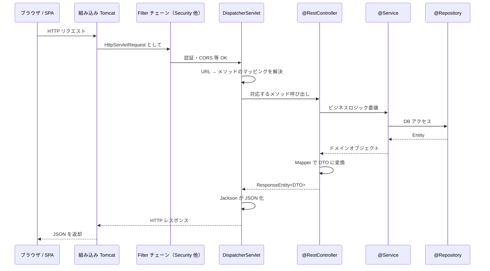
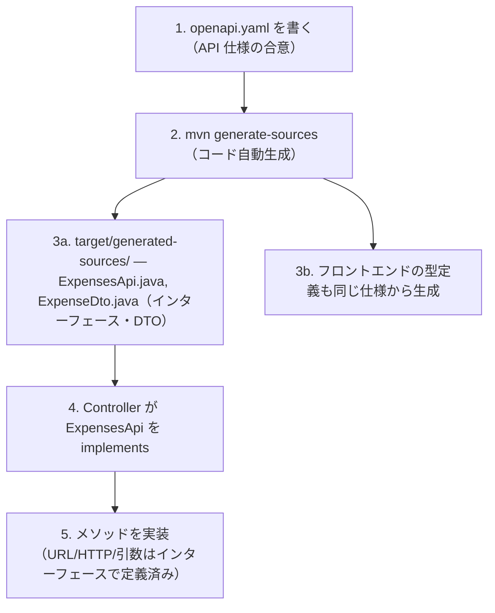
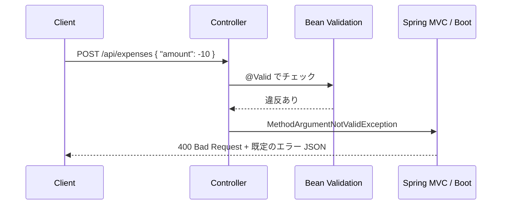
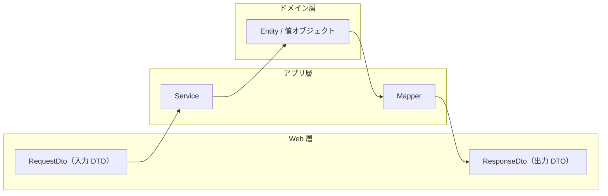

# 02. Web 層 — HTTP が入って JSON が返るまで

> この章で学ぶこと: **Spring MVC と DispatcherServlet**、**REST API 設計**、**OpenAPI 仕様駆動開発**、**Controller**、**Bean Validation**、**DTO/Mapper**、**Jackson**、**HTTP クライアント**、**グローバル例外処理**。

## 目次

1. [HTTP リクエストの流れ](#http-リクエストの流れ)
2. [REST API 設計の基本](#rest-api-設計の基本)
3. [OpenAPI 仕様駆動開発](#openapi-仕様駆動開発)
4. [@Controller と @RestController](#controller-と-restcontroller)
5. [リクエストマッピング](#リクエストマッピング)
6. [引数バインディング](#引数バインディング)
7. [戻り値の返し方](#戻り値の返し方)
8. [Bean Validation](#bean-validation)
9. [DTO と Mapper パターン](#dto-と-mapper-パターン)
10. [Jackson による JSON シリアライズ](#jackson-による-json-シリアライズ)
11. [HTTP クライアント（外部 API 呼び出し）](#http-クライアント外部-api-呼び出し)
12. [グローバル例外処理](#グローバル例外処理)
13. [認証・認可エラーと業務エラーの責務分担](#認証認可エラーと業務エラーの責務分担)

---

## HTTP リクエストの流れ

ブラウザから「`GET /api/expenses?month=2025-01`」が届いて、JSON が返るまで。



### キーとなるコンポーネント

| コンポーネント | 役割 |
|----------------|------|
| **Tomcat (Servlet コンテナ)** | ソケットで HTTP を受信、`HttpServletRequest`/`HttpServletResponse` に変換 |
| **Filter チェーン** | Servlet の前処理。認証・CORS などを担当。[第 4 章](./04-security.md)で詳細 |
| **DispatcherServlet** | Spring MVC の唯一の Servlet。URL と HTTP メソッドを見て対応する Controller を呼ぶ |
| **@RestController** | あなたの API 実装。薄く、サービス層に委譲する |
| **Jackson** | 戻り値を JSON に変換（Starter に同梱） |

**DispatcherServlet はたった 1 つ**です。Spring MVC は起動時にこの 1 つだけを Tomcat に登録し、あとは内部で URL ごとに Controller に振り分けます。

---

## REST API 設計の基本

REST API を設計するときに押さえておきたい基礎です。

### HTTP メソッドと冪等性

| メソッド | 用途 | 冪等性 | 安全性 |
|---------|------|--------|--------|
| **GET** | 取得 | ◎ | ◎（副作用なし） |
| **POST** | 作成 | × | × |
| **PUT** | 更新（全置換） | ◎ | × |
| **PATCH** | 更新（部分） | △ | × |
| **DELETE** | 削除 | ◎ | × |

**冪等性（idempotent）**: 同じリクエストを何回送っても結果が同じになる性質。ネットワーク不調でリトライしたときに安全かどうか、という観点で重要です。

- `GET /api/expenses/1` を 10 回投げても DB は変わらない → 冪等
- `POST /api/expenses` を 10 回投げると 10 件作られる → 非冪等

### ステータスコードの設計指針

| コード | 意味 | 使いどころ |
|--------|------|-----------|
| **200 OK** | 成功 | GET の成功、`ResponseEntity.ok(dto)` |
| **201 Created** | 作成成功 | POST でリソース作成 |
| **204 No Content** | 成功・ボディなし | DELETE の成功、PUT でボディを返さない |
| **400 Bad Request** | リクエストが不正 | バリデーション違反、フォーマット不正 |
| **401 Unauthorized** | 認証が必要 | JWT 不正・期限切れ |
| **403 Forbidden** | 認証済みだが権限なし | 他人のリソースにアクセス |
| **404 Not Found** | リソースなし | `GET /api/expenses/999` で存在しない ID |
| **409 Conflict** | 状態の競合 | 楽観ロックの失敗など |
| **429 Too Many Requests** | レート制限 | Resilience4j の RateLimiter で検出 |
| **500 Internal Server Error** | サーバー内部エラー | 想定外の例外 |

### ページネーションの定石

一覧 API では、一度に全件を返さずページに分ける。Spring Data の `Pageable` / `Page` が定番。

```
GET /api/expenses?month=2025-01&page=0&size=20
```

- `page`: ページ番号（**0 始まり**）
- `size`: 1 ページあたりの件数

**Spring Data で覚える 3 つ**

`Pageable` は **入力**（どう切り取るかの条件）、`Page<T>` は **出力**（その条件で取れた 1 ページ分＋メタ情報）。

| 名前 | 役割 |
|------|------|
| `Pageable` | ページ番号・件数・（任意）ソートをまとめた **取得条件**。多くは `PageRequest.of(page, size)` で生成 |
| `PageRequest` | `Pageable` の一般的な実装。`page` は **0 始まり** |
| `Page<T>` | リポジトリの **戻り値**。`content`（一覧）に加え `totalElements`・`totalPages`・`number` など |

**このプロジェクト**: OpenAPI で `Page` / `Pageable` をそのまま表現しにくいため、クエリは `page` / `size` の整数で受け、`PageRequest.of` で `Pageable` にして下位層へ渡す。レスポンスは `ExpensePageDto` に一覧とページ情報を載せる。`@Min` / `@Max` で `size` に上限を付け、過大な 1 回取得を防ぐ。

---

## OpenAPI 仕様駆動開発

このプロジェクトが採用している重要な手法です。**API の仕様を YAML で書き、そこから Java インターフェースを自動生成**します。

### 通常の開発 vs 仕様駆動開発

| 項目 | 通常（コードファースト） | 仕様駆動（スペックファースト） |
|------|------------------------|-------------------------------|
| 一次情報 | Java コード | `openapi.yaml` |
| フロント用の型 | 手で書く or 生成 | 仕様から自動生成 |
| 仕様と実装のズレ | 起きやすい | 起きにくい（同じ仕様から生成） |
| チーム開発 | バックが書き切るまで待つ | 仕様が固まればフロント・バック並行開発 |

### 開発フロー



### このプロジェクトの例

仕様ファイル: `openapi/openapi.yaml`
生成先: `backend/target/generated-sources/openapi/`

生成された `ExpensesApi` は、例えば以下のようなメソッドが定義されています:

```java
@Validated
public interface ExpensesApi {
    @RequestMapping(
        method = RequestMethod.GET,
        value = "/api/expenses",
        produces = { "application/json" }
    )
    ResponseEntity<PagedExpenseResponseDto> apiExpensesGet(
        @NotNull @Pattern(regexp = "^\\d{4}-\\d{2}$") @RequestParam String month,
        @Min(0) @RequestParam(defaultValue = "0") Integer page,
        @Min(1) @Max(50) @RequestParam(defaultValue = "20") Integer size
    );
}
```

Controller はこれを `implements` するだけで、**URL・HTTP メソッド・バリデーションを二重定義せずに済みます**。

```java
@RestController
public class ExpenseController implements ExpensesApi {
    // apiExpensesGet を実装するだけ
}
```

**メリット**:
- URL の typo ができない
- バリデーションを仕様書と実装で二重管理しなくていい
- フロントエンドの TypeScript 型も同じ YAML から生成できる（一貫性）

---

## @Controller と @RestController

| アノテーション | 戻り値の扱い | 用途 |
|----------------|--------------|------|
| **@Controller** | ビュー名として解釈（HTML のテンプレート名） | サーバー側レンダリング（Thymeleaf 等） |
| **@RestController** | `@Controller` + `@ResponseBody`。全メソッドの戻り値がそのまま HTTP Body に | REST API（JSON を返す） |

REST API では必ず `@RestController` を使います。このプロジェクトでは全ての Controller が `@RestController` です。

---

## リクエストマッピング

「どの URL と HTTP メソッドで、どのメソッドを呼ぶか」を決めるのがマッピングです。

### 使うアノテーション

| アノテーション | 対応する HTTP メソッド |
|----------------|------------------------|
| `@GetMapping` | GET |
| `@PostMapping` | POST |
| `@PutMapping` | PUT |
| `@DeleteMapping` | DELETE |
| `@PatchMapping` | PATCH |
| `@RequestMapping` | 汎用（method 属性で指定） |

### プロジェクトのスタイル

OpenAPI 生成のインターフェースに**既にマッピングが書かれている**ので、Controller で追加のアノテーションを書く必要はありません。

```java
@RestController
public class ExpenseController implements ExpensesApi {
    @Override
    public ResponseEntity<PagedExpenseResponseDto> apiExpensesGet(
            String month, Integer page, Integer size) {
        // 実装
    }
}
```

---

## 引数バインディング

リクエストの各部分を Java の引数として受け取る仕組みです。

| アノテーション | 対象 | 例 |
|----------------|------|-----|
| **@RequestBody** | HTTP ボディ（JSON など） | POST/PUT で送る DTO |
| **@RequestParam** | クエリパラメータ | `?page=0&size=20` の `page`/`size` |
| **@PathVariable** | URL パス内の変数 | `/api/expenses/{id}` の `id` |
| **@RequestHeader** | HTTP ヘッダ | `Authorization` ヘッダ（通常はフィルターで処理） |
| **MultipartFile（型）** | `multipart/form-data` の**ファイルパート** | `file` などのパート名と引数名を対応させる（CSV アップロード） |

### MultipartFile と multipart/form-data（ファイルアップロード）

ブラウザやクライアントが **ファイルを送る**とき、HTTP では多くの場合 **`Content-Type: multipart/form-data`** が使われます。1 つのリクエストの中に、**複数の「パート」**（テキスト欄・ファイル欄など）が並びます。境界文字列（boundary）で区切られた塊なので、**JSON 1 本分の `application/json`（`@RequestBody`）とは別物**です。

**Spring がやっていること（ざっくり）**

1. リクエストを `MultipartResolver`（既定は Servlet 標準の multipart 処理）で解析する。
2. パート名（フォームの `name`）と、コントローラメソッドの**引数名**（または `@RequestPart` / `@RequestParam` で指定した名前）を対応づける。
3. ファイルパートを **`MultipartFile` オブジェクト**として渡す。中身はすぐに全部メモリに載せず、**`getInputStream()` や `transferTo()` で読む**設計にもできる（実装やサイズ次第で一時ファイルに退避されることもある）。

**このプロジェクトの例（`/api/expenses/upload-csv`）**

- OpenAPI 上は `multipart/form-data` で **`file`**（binary）と **`csvFormat`**（文字列）の 2 パート。
- コントローラでは `MultipartFile file` と `String csvFormat` として受け取る。**引数名 `file` がパート名 `file` と一致**しているので、余計なアノテーションなしでもバインドされやすい（明示したい場合は `@RequestPart("file")` など）。

```java
// イメージ（実装は ExpenseController が OpenAPI 生成インターフェースに沿っている）
public ResponseEntity<CsvUploadResponseDto> apiExpensesUploadCsvPost(
        MultipartFile file,   // パート名 "file" ← 引数名と揃える
        String csvFormat      // パート名 "csvFormat"
) { ... }
```

### 引数バインディングの例

```java
@PostMapping("/api/expenses")
public ResponseEntity<ExpenseDto> create(
    @Valid @RequestBody ExpenseRequestDto request  // JSON ボディ
) { ... }

@GetMapping("/api/expenses/{id}")
public ResponseEntity<ExpenseDto> get(
    @PathVariable Long id                           // URL 内の id
) { ... }

@GetMapping("/api/expenses")
public ResponseEntity<PagedExpenseResponseDto> list(
    @RequestParam String month,                     // ?month=2025-01
    @RequestParam(defaultValue = "0") int page
) { ... }
```

---

## 戻り値の返し方

| 戻り値の型 | 意味 |
|-----------|------|
| **ResponseEntity&lt;T&gt;** | HTTP ステータスと Body を明示。推奨 |
| **T のみ** | Body のみ、ステータスは 200 |
| **void** | ステータス 200、Body なし |

### ResponseEntity の作り方

```java
// 200 OK
return ResponseEntity.ok(dto);

// 201 Created
return ResponseEntity.status(HttpStatus.CREATED).body(dto);

// 204 No Content
return ResponseEntity.noContent().build();

// 404 Not Found (通常は例外で処理した方がよい)
return ResponseEntity.notFound().build();
```

REST API では「作成は 201」「削除は 204」のように**ステータスを意図的に分ける**ため、このプロジェクトでは一貫して `ResponseEntity` を使います。

---

## Bean Validation

入力値を宣言的に検証する仕組みです。`spring-boot-starter-validation` で使えます。

### @Valid と @Validated の違い

| アノテーション | 付ける場所 | 役割 |
|----------------|-----------|------|
| **@Valid** | メソッド引数（Jakarta Bean Validation 標準） | そのオブジェクトと、ネストしたオブジェクトの制約を検証。Controller の `@RequestBody` と相性が良い |
| **@Validated** | クラスやインターフェース（Spring 拡張） | クラスのメソッド引数の検証を有効化。`@ConfigurationProperties` や `@RequestParam`/`@PathVariable` の検証に必要 |

### 主な制約アノテーション（Jakarta Validation）

| アノテーション | 意味 |
|----------------|------|
| `@NotNull` | null 不可 |
| `@NotEmpty` | null および空文字・空コレクション不可 |
| `@NotBlank` | null / 空文字 / 空白のみ不可（文字列用） |
| `@Size(min, max)` | 文字列やコレクションの長さの範囲 |
| `@Min` / `@Max` | 数値の範囲 |
| `@Pattern(regexp=...)` | 正規表現 |
| `@Email` | メールアドレス形式 |

### 対象別の違い（中級で混乱しやすい）

| 対象 | 引数に付けるもの | クラスに必要なもの | 失敗時の例外 |
|------|------------------|-------------------|--------------|
| `@RequestBody` のオブジェクト | `@Valid` | 不要（DTO に `@Validated` は不要） | `MethodArgumentNotValidException` |
| `@RequestParam` / `@PathVariable` | `@Min` などの制約 | **`@Validated`**（クラスに必須） | `ConstraintViolationException` |
| サービスのメソッド引数 | `@Min` などの制約 | **`@Validated`**（クラスに必須） | `ConstraintViolationException` |
| `@ConfigurationProperties` | `@Min` などの制約 | **`@Validated`**（クラスに必須） | 起動失敗 |

**覚え方**: `@RequestBody` だけは例外的に `@Valid` で動く。それ以外は `@Validated` をクラスに付ける必要がある。

**補足（よくある疑問）**:

- **`@RequestParam` / `@PathVariable` に `@Valid` は不要か？**  
  表の典型（`@Min` などを **引数そのもの**に付ける）では **不要**。`@Valid` は「オブジェクト全体（ネスト含む）を検証する」用途が主で、`@RequestBody` の DTO とセットで使う。クエリやパスは **`@Validated` をコントローラに付けたうえで、各引数に制約を付ける**。
- **「サービスのメソッド引数」と「制約」**  
  **引数**＝サービスメソッドのパラメータ（例: `register(String email, int age)` の `email` / `age`）。**制約**＝その引数に付ける Bean Validation（`@NotNull`, `@Min`, `@Size` など）。サービスクラスに `@Validated` を付け、他 Bean から **Spring のプロキシ経由で呼ぶ**と検証が走る。

### 失敗時の流れ

`@RequestBody` の検証で失敗すると `MethodArgumentNotValidException` がスローされます。**このプロジェクトの `GlobalExceptionHandler` にはこの型のハンドラーはない**ため、**Spring MVC / Spring Boot の既定処理**が動き、概ね **400 Bad Request** とエラー詳細が返ります（ボディは `ErrorResponse` 形式とは限らない）。



### プロジェクトの例

`CorsProperties` では起動時バリデーション:

```java
@Component
@ConfigurationProperties(prefix = "cors")
@Validated
public class CorsProperties {
    @NotEmpty(message = "許可するオリジンは必須です")
    private List<String> allowedOrigins;
}
```

OpenAPI 生成の `ExpensesApi` には `@Validated` が付いているので、`@RequestParam` の `@Min(0)` 等も効きます。

---

## DTO と Mapper パターン

**Entity を API のレスポンスに直接使わない**はバックエンドの鉄則です。

### なぜ Entity を直接返してはいけないか

| 問題 | 理由 |
|------|------|
| **情報漏洩** | Entity には内部用のフィールド（作成日時、内部フラグ等）が入っている |
| **循環参照** | `@ManyToOne` 等の双方向リレーションで JSON 化時に無限ループ |
| **破壊的変更** | DB カラム変更が即座に API レスポンスに反映され、フロントが壊れる |
| **遅延ロード問題** | LAZY の関連を JSON 化しようとすると `LazyInitializationException` |
| **API 仕様の分離** | DB の形と API の形は別の関心事 |

### レイヤーと型の対応



### プロジェクトの実装

- 入力 DTO: `ExpenseRequestDto`（OpenAPI 生成）
- 出力 DTO: `ExpenseDto`, `PagedExpenseResponseDto`（OpenAPI 生成）
- Mapper: [`ExpenseMapper`](../../backend/src/main/java/com/example/backend/application/mapper/ExpenseMapper.java)

```java
@Component
public class ExpenseMapper {
    public ExpenseDto toDto(Expense expense) {
        ExpenseDto dto = new ExpenseDto();
        dto.setId(expense.getId());
        dto.setAmount(expense.getAmount().getValue());
        dto.setDescription(expense.getDescription());
        // ...
        return dto;
    }
}
```

Controller では必ず Mapper を通します。

```java
Expense expense = service.findById(id);
ExpenseDto dto = mapper.toDto(expense);
return ResponseEntity.ok(dto);
```

> **発展**: 手書き Mapper が大変なときは [MapStruct](https://mapstruct.org/) という自動生成ライブラリもあります。今後のトピックとして [appendix-future.md](./appendix-future.md) に記載。

---

## Jackson による JSON シリアライズ

Jackson は `spring-boot-starter-web` に同梱されている JSON ライブラリです。**Bean ↔ JSON の自動変換**を担当します。

### 日付型の扱い

Java 8 の `LocalDate` / `OffsetDateTime` / `Instant` を JSON にするには、`JavaTimeModule` が必要です。Spring Boot は自動で登録してくれます。

```java
public class ExpenseDto {
    private LocalDate date;         // "2025-01-15"
    private OffsetDateTime createdAt; // "2025-01-15T10:00:00Z"
}
```

プロジェクトの `application.properties`:

```properties
# JSON の日時シリアライズを UTC に揃える
spring.jackson.time-zone=UTC
```

**この設定の意味**:

- Jackson が日時型（`Instant` / `OffsetDateTime` / `Date` など）を JSON 文字列に変換するときに使う**タイムゾーンを UTC に固定**する。
- これがないと **JVM のデフォルト TZ**（サーバーの環境依存：例 `Asia/Tokyo`）で出力されてしまい、同じ瞬間でも環境ごとに文字列が変わる。本番・ステージング・ローカルで JSON が微妙にズレる典型的な事故を防げる。
- 方針としては「**API は常に UTC で入出力、表示するブラウザ側でユーザーのローカル TZ に変換**」にするのが定番。DB・ログ・API をすべて UTC に揃えておくと、夏時間や TZ 切替のバグに悩まされにくい。
- なお `LocalDate`（例: `2025-01-15`）のように **TZ を持たない型**は、この設定の影響を受けない（そもそも変換不要）。

---

## HTTP クライアント（外部 API 呼び出し）

バックエンドが別の API を呼ぶときに使うのが HTTP クライアントです。

### Spring 系 HTTP クライアントの比較

| クライアント | 導入バージョン | 同期/非同期 | 推奨度 |
|--------------|---------------|-------------|--------|
| **RestTemplate** | 古くから | 同期のみ | △（メンテナンスモード） |
| **WebClient** | Spring 5 (WebFlux) | 非同期 / リアクティブ | ◎（非同期が欲しいとき） |
| **RestClient** | Spring 6.1 / Boot 3.2 | 同期 | ◎（Spring Boot 3 系の新標準） |
| **HttpClient** (Java 標準) | Java 11 | 両対応 | ◯（Spring と無関係でよい時） |

**指針**:
- 新規の同期呼び出し → **`RestClient`**（今後の推奨）
- 非同期・ストリーミング → **`WebClient`**
- 既存コードのメンテ → `RestTemplate` のまま

### プロジェクトの例（OpenAiClient）

OpenAI API を呼ぶ `OpenAiClient` は `RestTemplate` ベースで実装されています。Resilience4j のアノテーションで耐障害性を付けています（詳細は[第 5 章](./05-operations.md)）。

```java
@Component
public class OpenAiClient {
    private final RestTemplate restTemplate;

    @RateLimiter(name = "openai")
    @Retry(name = "openai")
    @CircuitBreaker(name = "openai", fallbackMethod = "fallback")
    public String callText(String prompt) { ... }
}
```

---

## グローバル例外処理

Controller で発生した例外を **1 箇所にまとめて**処理する仕組みです。各 Controller に `try-catch` を書かずに済みます。

| アノテーション | 役割 |
|----------------|------|
| **@ControllerAdvice** | 全 Controller 共通の例外処理クラスに付ける |
| **@ExceptionHandler(E.class)** | 例外 E を処理するメソッドに付ける |

### エラーレスポンスの統一形式

**`GlobalExceptionHandler` が拾った例外**は、OpenAPI 定義の `ErrorResponse`（`message` + `timestamp`）を返します。

```json
{
  "message": "Expense not found: id=999",
  "timestamp": "2026-04-18T10:00:00Z"
}
```

一方、**ハンドラー未登録の例外**（バリデーション違反 `MethodArgumentNotValidException` 含む）は **Spring Boot 既定の JSON**（`BasicErrorController` 由来）で返るため、フィールドが異なります。

```json
{
  "timestamp": "2026-04-19T10:00:00.000+00:00",
  "status": 400,
  "error": "Bad Request",
  "message": "Validation failed ...",
  "path": "/api/expenses"
}
```

完全に `ErrorResponse` 形式へ揃えたい場合は、その例外型向けの `@ExceptionHandler` を追加します。

### プロジェクトの実装

[`GlobalExceptionHandler.java`](../../backend/src/main/java/com/example/backend/exception/GlobalExceptionHandler.java) は型ごとにステータスと `ErrorResponse` を返します。タイムスタンプは `Instant.now().atOffset(ZoneOffset.UTC)` で UTC に固定。

```java
@ControllerAdvice
public class GlobalExceptionHandler {

    @ExceptionHandler(ExpenseNotFoundException.class)
    public ResponseEntity<ErrorResponse> handleNotFound(ExpenseNotFoundException e) {
        return ResponseEntity.status(HttpStatus.NOT_FOUND)
                .body(new ErrorResponse(e.getMessage(), Instant.now().atOffset(ZoneOffset.UTC)));
    }
    // UserNotFoundException           → 404
    // RequestNotPermitted / QuotaExceededException → 429
    // AiServiceException              → 500
    // CsvUploadException              → 例外が保持する HttpStatus（400 / 500）
}
```

**このクラスにないもの**（= Boot 既定にフォールバック）

- `Exception.class` のフォールバックハンドラー（未登録例外は概ね 500）
- `MethodArgumentNotValidException`（バリデーション違反は既定処理で 400）

---

## 認証・認可エラーと業務エラーの責務分担

エラーの処理場所を**誰が扱うか**で整理しましょう。

| エラーの種類 | 処理する場所（このプロジェクト） | ステータス |
|--------------|----------------------------------|-----------|
| **認証されていない** | Spring Security のフィルター | 401 Unauthorized |
| **認証済みだが権限なし** | Spring Security の認可チェック | 403 Forbidden |
| **バリデーション違反**（`@Valid` 等） | **`GlobalExceptionHandler` では未登録** → Spring MVC / Boot の**既定処理** | 400 Bad Request（ボディ形式は既定 JSON） |
| **業務例外**（登録済みの型のみ） | [`GlobalExceptionHandler`](../../backend/src/main/java/com/example/backend/exception/GlobalExceptionHandler.java) | 例: 404（`ExpenseNotFoundException` / `UserNotFoundException`）、400（`IllegalArgumentException`）、429（`RequestNotPermitted` / `QuotaExceededException`）、500（`AiServiceException`）、`CsvUploadException` は内部の `HttpStatus` |
| **レート制限超過**（Resilience4j） | 上記 `@ExceptionHandler(RequestNotPermitted.class)` | 429 Too Many Requests |
| **想定外の例外**、または **ハンドラー未登録の例外型** | **`GlobalExceptionHandler` にフォールバックはない** → Spring Boot の**既定** | 500 Internal Server Error（多くの場合。`@ResponseStatus` 付き例外などは別） |


**覚え方**: 「**401/403 は Security**。**`ErrorResponse` で揃えたい業務例外は `GlobalExceptionHandler` に型を登録する**。**登録していない・想定外は Boot 既定**（形式が `ErrorResponse` と限らない）」

---

## この章のまとめ

- **HTTP は Tomcat → Filter → DispatcherServlet → @RestController → Service** の順で流れる
- **OpenAPI 仕様駆動**でインターフェースを生成し、`implements` で実装する
- **DTO と Mapper パターン**で Entity を API に漏らさない
- **`@Valid` は `@RequestBody`、`@Validated` はクラス**（その他すべて）
- **`GlobalExceptionHandler`（`@ControllerAdvice`）** で、**登録した例外型**について `ErrorResponse` を返す
- **401/403 は Security**、**バリデーションと未登録例外は Boot 既定**（必要なら `@ExceptionHandler` を足して統一）

次章では、Service から Repository を経由して DB にアクセスする「データ層」を解説します。

→ [03. データ層](./03-data.md)
