# 03. データ層 — DB から取ってきて保存するまで

> この章で学ぶこと: **JPA/Hibernate/Spring Data JPA の関係**、**Entity**、**リポジトリ**、**クエリメソッドと JPQL**、**永続コンテキストとトランザクション**、**Propagation/Isolation**、**楽観ロック**、**N+1 問題**、**HikariCP**、**Flyway**。

## 目次

1. [JPA / Hibernate / Spring Data JPA の関係](#jpa--hibernate--spring-data-jpa-の関係)
2. [Entity とは](#entity-とは)
3. [主要アノテーション](#主要アノテーション)
4. [永続コンテキストとエンティティの状態遷移](#永続コンテキストとエンティティの状態遷移)
5. [リポジトリパターン](#リポジトリパターン)
6. [クエリメソッドと JPQL](#クエリメソッドと-jpql)
7. [SQL インジェクション対策の仕組み](#sql-インジェクション対策の仕組み)
8. [トランザクション基礎](#トランザクション基礎)
9. [トランザクション詳細（Propagation / Isolation）](#トランザクション詳細propagation--isolation)
10. [楽観ロックと悲観ロック](#楽観ロックと悲観ロック)
11. [関連の詳細（cascade / orphanRemoval / fetch）](#関連の詳細cascade--orphanremoval--fetch)
12. [N+1 問題と対策](#n1-問題と対策)
13. [HikariCP コネクションプール](#hikaricp-コネクションプール)
14. [Flyway（DB マイグレーション）](#flywaydb-マイグレーション)
15. [JDBC ドライバと DataSource](#jdbc-ドライバと-datasource)

---

## JPA / Hibernate / Spring Data JPA の関係

よく混同される 3 つの用語の関係を整理しましょう。

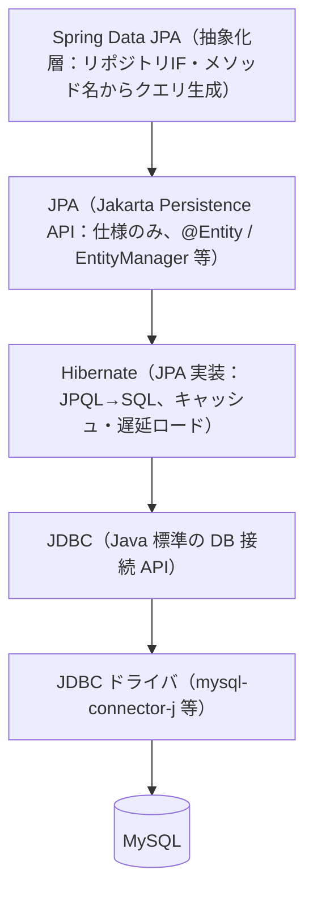

| レイヤー | 役割 |
|----------|------|
| **Spring Data JPA** | 「リポジトリインターフェースを書くだけでメソッドが自動実装される」仕組み |
| **JPA** | Java 標準の ORM 仕様。インターフェースとアノテーションだけ定義されている |
| **Hibernate** | JPA の代表的な実装。Spring Boot のデフォルト |
| **JDBC** | Java 標準の DB 接続 API（SQL を直接扱う） |
| **JDBC ドライバ** | 特定の DB 用のJDBCの実装（MySQL / H2 / PostgreSQL など） |

**覚え方**: Spring Data JPA は「JPA を**使いやすく**したもの」、Hibernate は「JPA の**実装**」。

### イメージ

3 つの関係は「注文する人」「注文を受け付ける窓口」「実際に DB と話す人」に分けると理解しやすいです。

```text
Service
  ↓ 「支出を保存して」「このユーザーの支出を探して」と依頼する
Spring Data JPA
  ↓ Repository のメソッドを解釈して、JPA/Hibernate に処理を渡す
Hibernate
  ↓ Entity を SQL に変換して、実際に DB とやりとりする
Database
```

つまり、Spring Data JPA は Hibernate の代わりではありません。**Hibernate を直接使うと毎回書くことになる定型コードを、Repository として簡単に使えるようにしてくれる層**です。

### Spring Data JPA がしてくれること

Spring Data JPA の主な仕事は、**Repository の実装を自動で作ること**です。

```java
public interface ExpenseRepository extends JpaRepository<Expense, Long> {
    List<Expense> findByUserAndDateBetween(User user, LocalDate start, LocalDate end);
}
```

このようにインターフェースを書くだけで、Spring Data JPA は次のようなことをしてくれます。

- `save()`、`findById()`、`deleteById()` などの基本的な CRUD メソッドを用意する
- `findByUserAndDateBetween` のようなメソッド名を読み取り、検索条件を組み立てる
- Repository の実装クラスを自動生成し、Spring の Bean として登録する
- Service から `@RequiredArgsConstructor` などで注入して使えるようにする
- ページング、ソート、件数取得などのよくある処理を簡単にする

Hibernate を直接使う場合は、`EntityManager` を使って次のようなコードを書く必要があります。

```java
@Repository
public class ExpenseRepository {
    @PersistenceContext
    private EntityManager entityManager;

    public Expense findById(Long id) {
        return entityManager.find(Expense.class, id);
    }

    public void save(Expense expense) {
        entityManager.persist(expense);
    }
}
```

これでも動きますが、Repository ごとに似たようなコードが増えます。Spring Data JPA を使うと、**よくある DB 操作は `JpaRepository` に任せて、アプリ固有の検索条件だけを書く**形にできます。

### Hibernate がしてくれること

Hibernate の主な仕事は、**Java の Entity と DB のテーブルを変換すること**です。

たとえば Java 側で次のように書いたとします。

```java
Optional<Expense> expense = expenseRepository.findById(1L);
```

Spring Data JPA は Repository メソッドの呼び出しを受け取り、最終的には Hibernate に処理を渡します。Hibernate は Entity の定義を見ながら、DB に送る SQL を作ります。

```sql
SELECT * FROM expenses WHERE id = 1;
```

Hibernate はほかにも次のようなことをしています。

- `@Entity`、`@Table`、`@Column` などを見て、Java クラスと DB テーブルを対応付ける
- JPQL や Repository の検索条件を SQL に変換する
- DB から取得した行を Java オブジェクトに変換する
- トランザクション中の Entity の変更を追跡し、コミット時に `UPDATE` する
- `FetchType.LAZY` のような遅延ロードを処理する
- 永続コンテキストを使って、同じ Entity を何度も DB から取り直さないように管理する

---

## Entity とは

**Entity（エンティティ）**: データベースのテーブルに対応する Java クラスです。DB の 1 行（レコード）を 1 つの Java オブジェクトとして表現します。

### Entity と値オブジェクトの違い（DDD の基本）

| 特徴 | Entity | 値オブジェクト |
|------|--------|---------------|
| **識別子** | ID を持つ（`@Id`） | 持たない |
| **可変性** | 可変（状態が変わる） | 不変（immutable） |
| **等価性** | ID で比較 | 値で比較 |
| **ライフサイクル** | 作成→更新→削除の履歴を持つ | 使い捨て、差し替え |
| **例** | `User`, `Expense` | `ExpenseAmount`, `Category` |

プロジェクトの例:
- Entity: `User`, `Expense`, `MonthlyReport`
- 値オブジェクト: `ExpenseAmount`, `ExpenseDate`, `CategoryType`

### Entity の役割

1. **DB とのマッピング**: Java オブジェクトと DB テーブルを対応付ける
2. **状態管理**: データの変更を追跡し、DB に反映する
3. **リレーション管理**: 他の Entity との関係を定義（`@ManyToOne` 等）

---

## 主要アノテーション

### Entity 本体

| アノテーション | 役割 |
|----------------|------|
| **@Entity** | このクラスが Entity だと宣言 |
| **@Table(name="...")** | テーブル名を指定（省略時はクラス名） |
| **@Id** | 主キー |
| **@GeneratedValue(strategy=IDENTITY)** | DB の自動採番（MySQL の AUTO_INCREMENT） |
| **@Column(nullable=false, length=100)** | カラムの詳細設定 |
| **@Enumerated(EnumType.STRING)** | enum を文字列として保存 |
| **@Version** | 楽観ロック用バージョン番号（後述） |

### リレーション

| アノテーション | 意味 |
|----------------|------|
| **@ManyToOne** | 多対一（複数の支出が 1 ユーザーに属する） |
| **@OneToMany** | 一対多 |
| **@OneToOne** | 一対一 |
| **@ManyToMany** | 多対多（中間テーブルを経由） |
| **@JoinColumn** | 外部キーのカラム名を指定 |

### 値オブジェクトの埋め込み

| アノテーション | 役割 |
|----------------|------|
| **@Embeddable** | 「このクラスは Entity に埋め込める」と宣言 |
| **@Embedded** | 値オブジェクトを Entity に埋め込む |

### インデックス

```java
@Table(name = "expenses", indexes = {
    @Index(name = "idx_expense_user_date", columnList = "user_id, expense_date")
})
```

**ポイント**: WHERE 句や ORDER BY でよく使う列にインデックスを張ると検索が速くなります。ただし書き込みは遅くなるので貼りすぎ注意。

### プロジェクトの Entity 例

```java
@Entity
@Getter
@NoArgsConstructor(access = AccessLevel.PROTECTED)
@Table(name = "expenses")
public class Expense {
    @Id
    @GeneratedValue(strategy = GenerationType.IDENTITY)
    private Long id;

    @Column(nullable = false)
    private String description;

    @Embedded
    private ExpenseAmount amount;    // 値オブジェクト

    @Embedded
    private ExpenseDate date;

    @Embedded
    private Category category;

    @ManyToOne(fetch = FetchType.LAZY)
    @JoinColumn(name = "user_id", nullable = false)
    private User user;
}
```

### JPA の決まりごと

- Entity には `protected` または `public` の**引数なしコンストラクタ**が必要（`@NoArgsConstructor(access=PROTECTED)` を Lombok で付けるのが定石）
- `@Embeddable` クラスも同様に引数なしコンストラクタが必要
- Entity のフィールドは `private` で、Lombok の `@Getter` でアクセサを生成。必須ではないが値を読むために普通は付ける。

---

## 永続コンテキストとエンティティの状態遷移

**永続コンテキスト（Persistence Context）**: トランザクションの間だけ存在する「メモリ上の Entity キャッシュ」です。Hibernate はこの中で Entity を追跡し、コミット時に DB と同期します。

### Entity が取りうる 4 つの状態

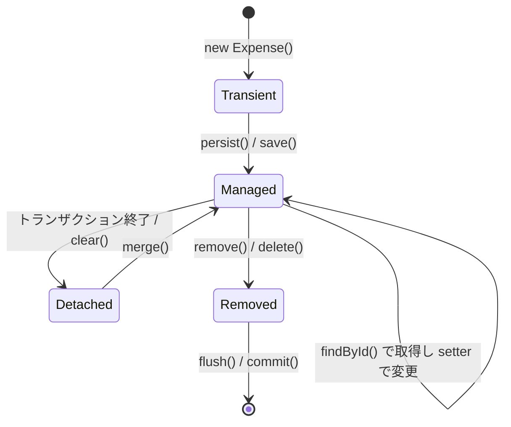

| 状態 | 意味 |
|------|------|
| **transient（一時）** | `new` したばかりで DB にも永続コンテキストにもない |
| **managed（管理下）** | 永続コンテキストに入っていて、変更が追跡されている |
| **detached（切り離された）** | DB にはあるが、もう追跡されていない（トランザクション終了後等） |
| **removed（削除予定）** | 削除マークが付いた状態。コミット時に DELETE が発行される |

### 「save を呼ばなくても DB に反映される」仕組み（dirty checking）

```java
@Transactional
public void updateAmount(Long id, int newAmount) {
    Expense expense = repository.findById(id).orElseThrow();  // managed
    expense.changeAmount(new ExpenseAmount(newAmount));         // 変更
    // save() を呼ばなくても、コミット時に自動で UPDATE が発行される！
}
```

これは **Hibernate が永続コンテキスト内の Entity の変更を検知する (dirty checking)** からです。明示的な `save()` は不要です。

> **注意**: detached 状態の Entity を変更しても反映されません。`merge()` で managed に戻してから変更する必要があります。

更新処理では、Service メソッドに `@Transactional` を付けるのが基本です。`@Transactional` がない場合、`findById()` の内部だけで短いトランザクションが終わり、その後の Entity が detached になることがあります。

```java
public void updateTitle(Long id, String title) {
    Manga manga = mangaRepository.findById(id).orElseThrow(); // 取得後に detached になる可能性がある
    manga.changeTitle(title);                                // DB に反映されない可能性がある
}
```

---

## リポジトリパターン

Spring Data JPA では、**インターフェースを定義するだけでリポジトリが自動実装**されます。

```java
public interface ExpenseRepository extends JpaRepository<Expense, Long> {
    List<Expense> findByUserAndDateBetween(User user, LocalDate start, LocalDate end);
}
```

実装クラスは書かずとも動きます。内部では Spring が**動的プロキシ**を生成し、DI コンテナに Bean として登録します。

### 裏側の役割分担

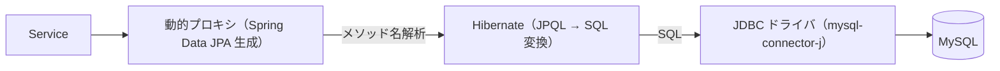

| 層 | 役割 |
|----|------|
| 動的プロキシ | メソッド名（`findByUser...`）を解析して JPQL を組み立てる |
| Hibernate | JPQL → SQL に変換。永続コンテキストを管理 |
| JDBC ドライバ | 実際に DB と通信 |

**H2 と MySQL で同じコードが動く**のは、この構造のおかげ。違いは JDBC ドライバと Hibernate の Dialect だけ。

### JpaRepository が提供するメソッド（抜粋）

| メソッド | 動作 |
|---------|------|
| `save(entity)` | 新規保存または更新 |
| `findById(id)` | 主キーで 1 件取得 |
| `findAll()` | 全件取得（実運用では使わない） |
| `findAll(Pageable)` | ページング付き全件取得 |
| `deleteById(id)` | 削除 |
| `count()` | 件数 |
| `existsById(id)` | 存在確認 |

---

## クエリメソッドと JPQL

### 1. メソッド名からの自動生成（クエリメソッド）

メソッド名の規則に従って書くと、Spring Data JPA が自動で JPQL を生成します。

```java
List<Expense> findByUser(User user);
List<Expense> findByUserAndDateBetween(User user, LocalDate start, LocalDate end);
Optional<Expense> findByIdAndUser(Long id, User user);
```

| キーワード | 意味 |
|------------|------|
| `findBy` | SELECT |
| `And` / `Or` | 条件結合 |
| `Between` | BETWEEN |
| `GreaterThan` / `LessThan` | > / < |
| `Like` / `Containing` | LIKE |
| `OrderBy...Asc/Desc` | ORDER BY |
| `Top`/`First` | LIMIT |

### 2. @Query で JPQL を直接書く

複雑なクエリは `@Query` で明示的に書きます。

```java
@Query("""
    SELECT e FROM Expense e
    WHERE e.user = :user
      AND e.date.date >= :start
      AND e.date.date <= :end
    ORDER BY e.date.date DESC
""")
List<Expense> findInRange(
    @Param("user") User user,
    @Param("start") LocalDate start,
    @Param("end") LocalDate end);
```

### JPQL と SQL の違い

| 項目 | SQL | JPQL |
|------|-----|------|
| 対象 | テーブル・カラム | Entity クラス・プロパティ |
| 例 | `SELECT * FROM expense WHERE user_id = ?` | `SELECT e FROM Expense e WHERE e.user = :user` |
| DB 依存性 | 強い（方言が違う） | 弱い（Hibernate が DB に合わせて変換） |
| テーブル名変更への耐性 | 書き直し必要 | Entity クラスを変えればそのまま |

**H2 と MySQL で同じ JPQL が動く**のはこのため。

### @Param の重要性

`@Param("user")` で宣言した名前が JPQL 内の `:user` と対応します。**SQL インジェクション対策としても必須**です（次節）。

---

## SQL インジェクション対策の仕組み

**SQL インジェクション**とは、ユーザー入力に SQL の断片を仕込まれて意図しないクエリが実行される攻撃です。

### 危険な例（やってはいけない）

```java
// 文字列連結で SQL を組み立てる → 脆弱
String sql = "SELECT * FROM users WHERE email = '" + input + "'";
// input = "' OR '1'='1" → 全件取得されてしまう
```

### JPA / JDBC が守ってくれる仕組み

**PreparedStatement（プリペアドステートメント）**: SQL の**構造**と**値**を分けて DB に送る仕組み。

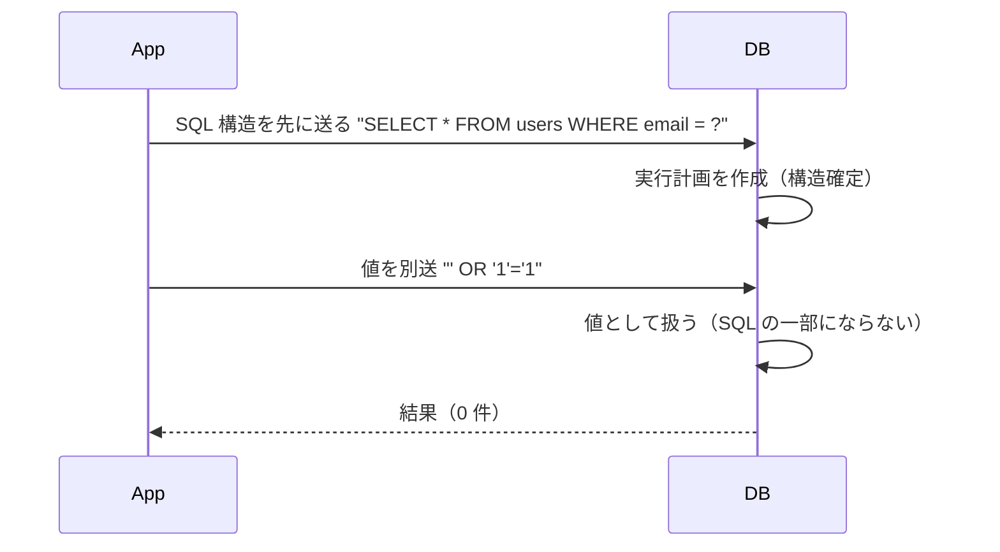

値は**絶対に SQL の構造を変えられない**ため、`' OR '1'='1` のような文字列を渡されても、「そういう email を持つユーザー」を探すだけで安全です。

### JPA ではどう守られるか

- `@Query` の `:param` / `@Param` → PreparedStatement でバインド
- クエリメソッド（`findByEmail(email)`）→ 内部で PreparedStatement
- `EntityManager.createQuery(...).setParameter(...)` → PreparedStatement

**つまり、JPA の標準的な書き方をしている限り、SQL インジェクションは起きません**。

### 注意: ネイティブクエリでの文字列連結は危険

```java
@Query(value = "SELECT * FROM users WHERE email = '" + email + "'", nativeQuery = true)  // NG!
```

この書き方は文字列連結なのでアウトです。必ず `:param` を使うこと。

---

## トランザクション基礎

**トランザクション**: 複数の DB 操作を「全部成功」か「全部取り消し」のどちらかにする仕組み。途中で例外が起きたら全部ロールバックしてデータ整合性を保ちます。

### @Transactional の基本動作

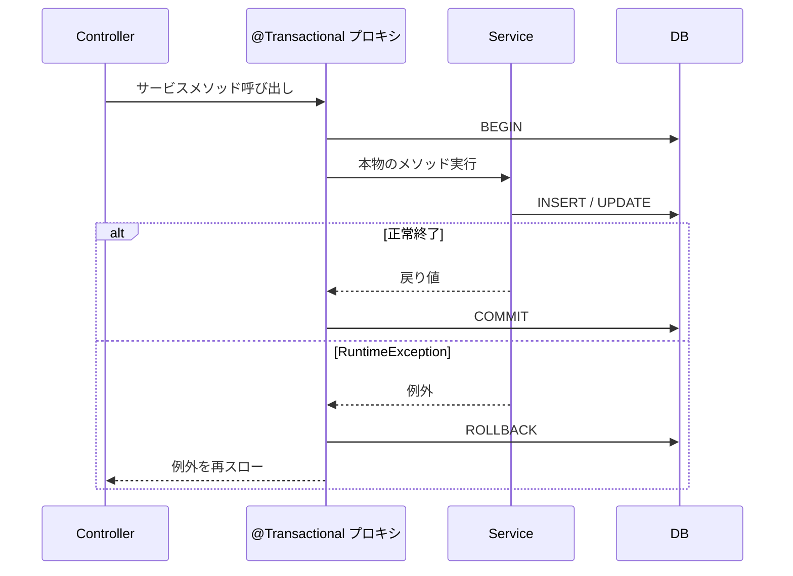

| 項目 | 説明 |
|------|------|
| **開始** | `@Transactional` メソッドの冒頭 |
| **コミット** | メソッドが正常終了 |
| **ロールバック** | `RuntimeException`（未チェック例外）が発生 |

### readOnly 最適化

参照だけのメソッドでは `readOnly = true` を付けましょう。

```java
@Transactional(readOnly = true)
public ExpenseDto getById(Long id) { ... }
```

- 書き込み用の準備（dirty checking）を省略
- DB 側でも読み取り最適化が効く場合がある

### どこに付けるか

サービス層のメソッドに付けるのが原則です。**「1 リクエスト = 1 トランザクション」**が基本。

```java
@Service
public class ExpenseApplicationService {
    @Transactional
    public Expense create(CreateCommand cmd) {
        User user = userRepository.findById(cmd.userId).orElseThrow();
        Expense expense = new Expense(...);
        expense.setUser(user);
        return expenseRepository.save(expense);
    }
}
```

---

## トランザクション詳細（Propagation / Isolation）

中級で必要になる話題です。

### Propagation（伝播）

**すでにトランザクションがある状態で、別の `@Transactional` メソッドを呼んだらどうなるか**を決めます。

| Propagation | 意味 | 使いどころ |
|-------------|------|-----------|
| **REQUIRED**（デフォルト） | 既存があれば参加、なければ新規作成 | 99% これで OK |
| **REQUIRES_NEW** | 常に新規トランザクション（既存は一時停止） | 外側がロールバックしてもこっちだけコミットしたい（監査ログ等） |
| **NESTED** | 既存の中にセーブポイントを作る | 部分的にロールバックしたい |
| **SUPPORTS** | あれば参加、なければトランザクションなしで実行 | 読み取り専用の補助メソッド |
| **MANDATORY** | 既存必須、なければ例外 | トランザクション内でしか呼んではいけないメソッド |
| **NEVER** | トランザクションがあれば例外 | 明示的にトランザクション外で実行 |

### 例: 監査ログを確実に残したい

```java
@Transactional(propagation = Propagation.REQUIRES_NEW)
public void writeAuditLog(String message) {
    auditRepository.save(new AuditLog(message));
}
```

呼び出し元のトランザクションがロールバックしても、この監査ログだけは残ります。

`REQUIRES_NEW` で始まったトランザクションは、メソッドが正常終了した時点でそこでコミットされます。外側のトランザクションとは別物なので、外側が後でロールバックしても、すでにコミット済みの内容は基本的に残ります。

逆に `REQUIRES_NEW` 側で例外が起きた場合、まずロールバックされるのはその新しいトランザクションだけです。ただし、その例外を呼び出し元で `catch` せず外側まで伝えると、外側のトランザクションも失敗扱いになってロールバックされます。

### Isolation（分離レベル）

**同時に動く複数のトランザクションから、どのようにデータを見るか**を決めます。

| Isolation | dirty read | non-repeatable read | phantom read |
|-----------|-----------|---------------------|--------------|
| READ_UNCOMMITTED | 起きる | 起きる | 起きる |
| READ_COMMITTED（PostgreSQL デフォルト） | 防ぐ | 起きる | 起きる |
| **REPEATABLE_READ**（MySQL InnoDB デフォルト） | 防ぐ | 防ぐ | 多くの場合防ぐ |
| SERIALIZABLE | 全て防ぐ（遅い） | | |

| 用語 | 意味 |
|------|------|
| **dirty read** | 他トランザクションの未コミット値が見える |
| **non-repeatable read** | 同じ行を 2 回読むと値が変わる |
| **phantom read** | 同じ条件で SELECT すると行数が変わる |

**ほとんどのアプリは DB のデフォルトのままで OK**。明示的に変えるのは、高い整合性が必要な金融系・在庫管理系。

### ⚠️ self-invocation の罠（再掲）

第 1 章で説明した通り、**同一クラス内から `@Transactional` メソッドを呼んでも効きません**。

```java
@Service
public class MyService {
    public void outer() {
        inner();  // ← @Transactional が効かない！
    }

    @Transactional
    public void inner() { ... }
}
```

対策: メソッドを別 Bean に切り出し、DI で受け取る。

---

## 楽観ロックと悲観ロック

複数のユーザーが同時に同じレコードを更新しようとしたとき、どう競合を解決するか。

### 楽観ロック（Optimistic Lock）

「衝突は滅多に起きない」前提で、衝突時に後勝ちを拒否します。**`@Version`** を使います。
更新のたびにバージョン番号は増えますが、通常は自分で `+1` せず、JPA/Hibernate が自動で更新します。

```java
@Entity
public class Expense {
    @Id
    private Long id;

    @Version
    private Long version;  // 更新のたびに +1 される
}
```

更新時は内部的に `WHERE id = ? AND version = ?` のように、取得時のバージョンと一致するか確認します。
先に別の人が更新してバージョンが変わっていると、更新対象が見つからず `OptimisticLockException` になります。

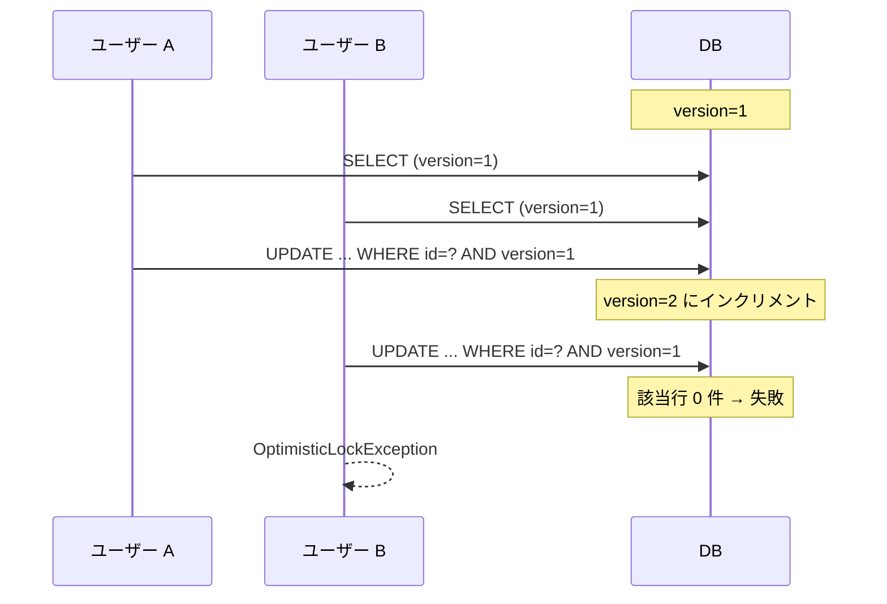

**メリット**: ロックを取らないので性能が良い。
**デメリット**: 衝突時は再試行が必要。

### 悲観ロック（Pessimistic Lock）

「衝突する」前提で、SELECT 時に**行ロックを取る**。`SELECT ... FOR UPDATE` を発行します。
`FOR UPDATE` は「この行をこれから更新するので、他のトランザクションは更新できないように待たせる」という意味です。
ロックは通常、トランザクションが commit / rollback されるまで保持されます。

```java
@Lock(LockModeType.PESSIMISTIC_WRITE)
@Query("SELECT e FROM Expense e WHERE e.id = :id")
Optional<Expense> findByIdForUpdate(@Param("id") Long id);
```

**メリット**: 確実に衝突を防げる。
**デメリット**: 他のトランザクションが待たされる。デッドロックのリスク。

### 使い分け

| シナリオ | 推奨 |
|----------|------|
| 編集画面で競合を検知したい | 楽観ロック |
| 在庫引き落とし等の短時間処理 | 悲観ロック |
| 基本的に衝突しない | 楽観ロック |

---

## 関連の詳細（cascade / orphanRemoval / fetch）

### cascade（波及）

親 Entity に対する操作を子 Entity にも波及させます。

| CascadeType | 意味 |
|-------------|------|
| `PERSIST` | 親の save 時に子も save |
| `MERGE` | 親の merge 時に子も merge |
| `REMOVE` | 親の delete 時に子も delete |
| `ALL` | 全部 |

```java
@OneToMany(cascade = CascadeType.ALL, orphanRemoval = true)
private List<Item> items;
```

### orphanRemoval

親のコレクションから外れた子を自動で削除する。

```java
order.getItems().remove(item);  // ← item が DB からも削除される
```

**親子関係と外部キー**: 1 対多では、多くの場合「1 側」が親 Entity、「多側」が子 Entity です。DB では子テーブル（多側）に外部キーを置き、親テーブル（1 側）の主キーを参照します。JPA では、この外部キーを持つ側を「関連の所有側」と呼びます。

例: `Expense` 1 件に複数の `Item` が属するなら、`Expense` が親、`Item` が子です。外部キーは `items.expense_id` のように `Item` 側に置き、`expenses.id` を参照します。

### fetch（遅延ロード / 即時ロード）

| FetchType | 意味 |
|-----------|------|
| **LAZY**（デフォルト `@OneToMany`, `@ManyToMany`） | 関連先にアクセスするときに初めて SELECT |
| **EAGER**（デフォルト `@ManyToOne`, `@OneToOne`） | 親を取るときに一緒に SELECT |

**指針**: **基本は LAZY**、必要なときに `JOIN FETCH` で取る。EAGER は裏で勝手に JOIN されるため、性能が読みにくくなる。

プロジェクトでも `@ManyToOne(fetch = FetchType.LAZY)` を明示しています。

---

## N+1 問題と対策

### 何が問題か

`fetch=LAZY` の関連を持つ Entity のリストを取って、それぞれの関連にアクセスすると、**1（元の SELECT）＋ N（各関連の SELECT）** 回クエリが発行されます。

```java
List<Expense> expenses = expenseRepository.findAll();  // 1 回目の SELECT
for (Expense e : expenses) {
    String userName = e.getUser().getName();  // ← ここで N 回 SELECT
}
```

expenses が 100 件あれば、**101 回のクエリ**が発行されます。性能的に致命的。

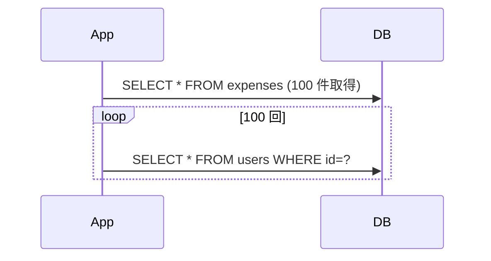

### 対策 1: JOIN FETCH

JPQL で明示的に JOIN してまとめて取る。

```java
@Query("SELECT e FROM Expense e JOIN FETCH e.user WHERE e.date >= :start")
List<Expense> findWithUser(@Param("start") LocalDate start);
```

発行される SQL は 1 本:
```sql
SELECT e.*, u.* FROM expenses e JOIN users u ON e.user_id = u.id WHERE ...
```

### 対策 2: @EntityGraph

アノテーションで fetch を指定する。

```java
@EntityGraph(attributePaths = {"user"})
List<Expense> findByDateBetween(LocalDate start, LocalDate end);
```

### 検知方法

開発時は `spring.jpa.show-sql=true` と `logging.level.org.hibernate.SQL=DEBUG` で実際に発行される SQL を見る。**リスト系 API の一覧取得は必ず疑う**。

---

## HikariCP コネクションプール

**コネクションプール**: DB への接続は開閉に時間がかかるため、**接続を使い回す**ためのプール。Spring Boot は **HikariCP** を標準で使います（世界最速クラスと言われる）。

### プールがなかったら

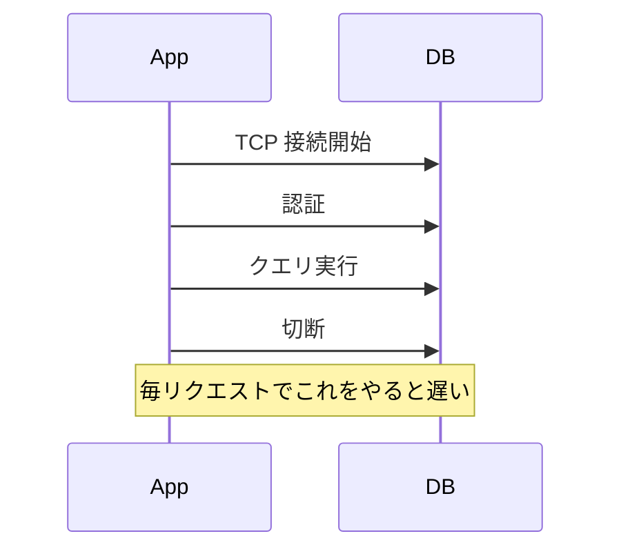

### プールあり

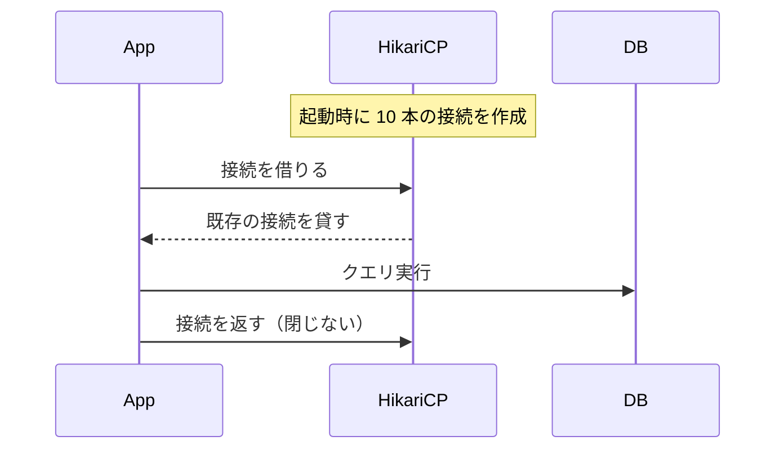

### トランザクションとの関係

`@Transactional` の中で DB アクセスが発生すると、基本的にプールから **1 本のコネクション** を借ります。同じトランザクション中の SQL はそのコネクションで実行され、`commit` / `rollback` 後にプールへ返されます。

つまり、コネクションは「閉じる」のではなく、次の処理で再利用できるように **返却**されます。

### 主な設定

| プロパティ | デフォルト | 意味 |
|-----------|-----------|------|
| `spring.datasource.hikari.maximum-pool-size` | 10 | プールの最大接続数 |
| `spring.datasource.hikari.minimum-idle` | maximum-pool-size | 最小アイドル接続数 |
| `spring.datasource.hikari.connection-timeout` | 30000 ms | 接続取得の待機タイムアウト |
| `spring.datasource.hikari.idle-timeout` | 600000 ms | アイドル接続の破棄時間 |
| `spring.datasource.hikari.max-lifetime` | 1800000 ms | 接続の最大寿命 |

### プール枯渇の症状

- HTTP リクエストが `connection-timeout` 後に 500 エラー
- ログに `HikariPool-1 - Connection is not available, request timed out after 30000ms`
- 実態: `@Transactional` が長時間走り続けてプールを占有、or `maximum-pool-size` が小さすぎる

### 原因と対処

| 原因 | 対処 |
|------|------|
| 長時間のトランザクション | 処理を短くする、外部 API 呼び出しを Tx 外に出す |
| プールサイズ不足 | `maximum-pool-size` を増やす（ただし DB 側の max_connections も要確認） |
| Tx リーク（閉じてない） | `@Transactional` を付け忘れていないか |

---

## Flyway（DB マイグレーション）

**Flyway**: DB スキーマをバージョン管理するツール。「未適用の SQL だけを順に実行」してくれる。

### 起動時の流れ

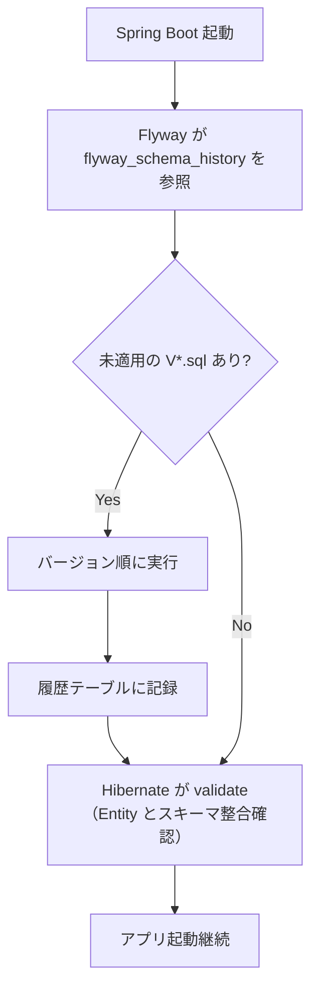

### ファイル命名規則

`backend/src/main/resources/db/migration/V{バージョン}__{説明}.sql`

| 例 | 意味 |
|----|------|
| `V1__initial_schema.sql` | 1 番目。初回スキーマ |
| `V2__add_user_email_column.sql` | 2 番目。カラム追加 |
| `V3__create_index_expense_date.sql` | 3 番目。インデックス追加 |

**重要**:
- `V` は大文字
- バージョンと説明の間はアンダースコア**2 つ**
- 一度適用された SQL は**変更してはいけない**（修正したいなら新しい V を追加）

### プロジェクトの設定

```properties
# application.properties
spring.jpa.hibernate.ddl-auto=validate  # Hibernate はスキーマを触らず、整合だけ確認
```

```properties
# application-test.properties
spring.flyway.enabled=false  # テストでは Flyway を無効化
spring.jpa.hibernate.ddl-auto=create-drop  # Entity からスキーマを自動生成
```

### 本番 / 開発 / テストの使い分け

| 環境 | スキーマ管理 | 理由 |
|------|-------------|------|
| 本番 | Flyway | 変更履歴を確実に残す |
| 開発 | Flyway | 本番と同じ経路で動作確認 |
| テスト | Hibernate `create-drop` | H2 に毎回スキーマを作り直す方が速い |

---

## JDBC ドライバと DataSource

### JDBC ドライバの役割

| DB | ドライバ | 用途 |
|----|---------|------|
| MySQL | `mysql-connector-j` | 本番・開発 |
| H2 | `h2` | テスト（インメモリ） |

Maven の設定では、MySQL ドライバは `runtime`、H2 ドライバは `test` scope で追加している。
そのため、通常実行時は MySQL ドライバが入り、テスト時は H2 と MySQL の両方のドライバがクラスパスに入る。

ここでいう「ドライバ」は、DB と話すための Java のライブラリ（jar）のこと。中には `com.mysql.cj.jdbc.Driver` や `org.h2.Driver` のような `.class` ファイルが含まれている。

### Spring Boot の AutoConfiguration

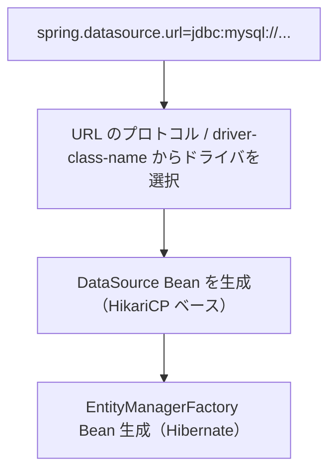

`spring.datasource.url` は、接続先 DB を表す JDBC URL。先頭の `jdbc:mysql` や `jdbc:h2:mem` から DB の種類を判断できる。
`spring.datasource.driver-class-name` が指定されている場合は、そのクラス名も使ってドライバを決める。

つまりテスト時に H2 と MySQL の両方のドライバがクラスパスにあっても、`jdbc:h2:mem:testdb` や `org.h2.Driver` の設定から H2 が選ばれ、H2 用の `DataSource` Bean が作られる。
実行時は `jdbc:mysql://...` や `com.mysql.cj.jdbc.Driver` から MySQL が選ばれ、MySQL 用の `DataSource` Bean が作られる。
`Connection` は Bean として直接作られるのではなく、この `DataSource` から必要なときに取得される。

### H2 と MySQL の違い

| 項目 | H2 | MySQL |
|------|----|-------|
| タイプ | インメモリ（`jdbc:h2:mem:testdb`） | ネットワーク経由 |
| 起動 | JVM 起動時に自動 | 別プロセスとして起動 |
| データ永続 | プロセス終了で消える | ディスクに保存 |
| Dialect | `H2Dialect` | `MySQLDialect` |
| 用途 | テスト | 開発・本番 |

---

## この章のまとめ

- **Spring Data JPA = JPA を簡単に使う抽象化**、実装は Hibernate
- **Entity の状態（transient/managed/detached/removed）** を理解する
- **dirty checking** により `save()` なしでも変更が反映される
- **クエリメソッド / JPQL / @Query** を使い分ける
- **`:param` バインディング**で SQL インジェクションは自動的に防がれる
- **`@Transactional`** はサービス層に付ける。**self-invocation では効かない**
- **N+1 問題**は `JOIN FETCH` / `@EntityGraph`
- **HikariCP** のプール枯渇はよくある障害源
- **Flyway** で本番・開発のスキーマを一元管理

次章では、このリクエストを「誰から来たのか」を判断するセキュリティを解説します。

→ [04. セキュリティ](./04-security.md)
