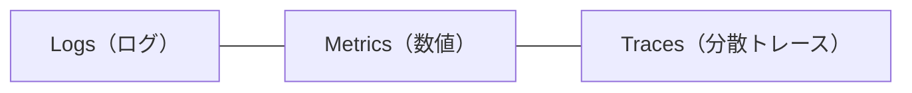
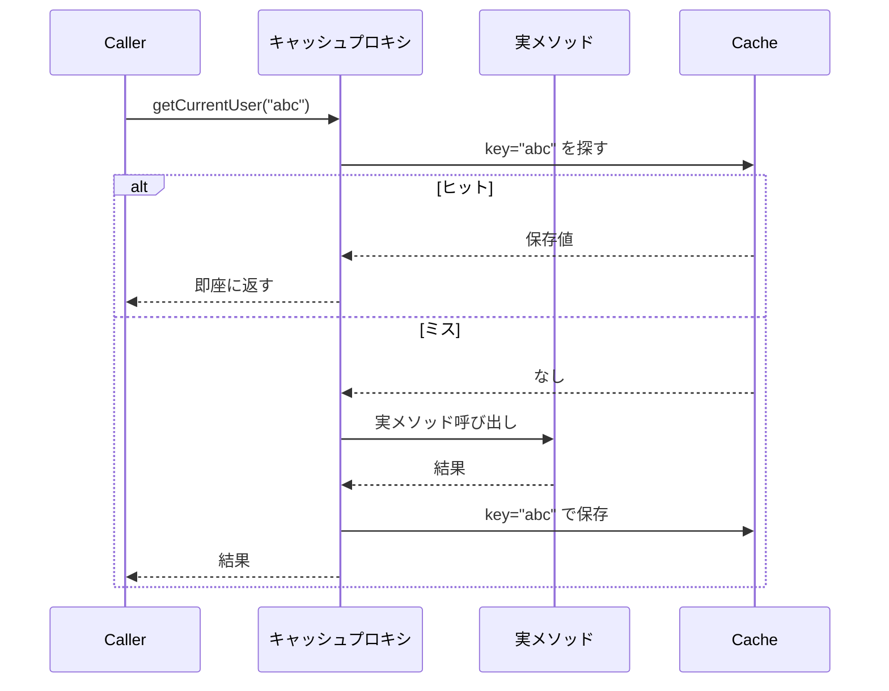
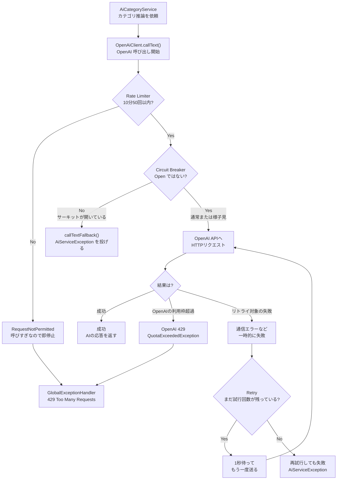
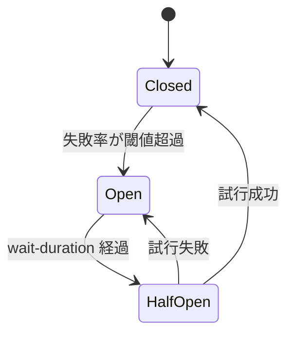
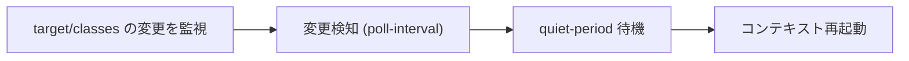

# 05. 運用・耐障害 — 本番で倒れないための仕組み

> この章で学ぶこと: **ロギング（SLF4J/Logback）**、**Actuator による監視**、**Observability の基礎**、**Spring Cache**、**Resilience4j（Rate Limiter / Retry / Circuit Breaker）**、**イベント駆動・非同期処理の概要**、**DevTools**。

## 目次

1. [ロギング](#ロギング)
2. [Spring Boot Actuator](#spring-boot-actuator)
3. [Observability の基礎](#observability-の基礎)
4. [Spring Cache](#spring-cache)
5. [Resilience4j](#resilience4j)
6. [GlobalExceptionHandler での 429 変換](#globalexceptionhandler-での-429-変換)
7. [イベント駆動（概要）](#イベント駆動概要)
8. [非同期処理（概要）](#非同期処理概要)
9. [Spring Boot DevTools](#spring-boot-devtools)

---

## ロギング

**ログは本番運用の命綱**。障害調査の 9 割はログを読むことから始まります。

### Java のロギングの全体像


| 層 | 役割 |
|----|------|
| **SLF4J**（Simple Logging Facade for Java） | ロギング API。アプリコードはこれに依存する |
| **Logback** | SLF4J の実装。Spring Boot の標準 |
| **Log4j2** | 別実装。必要なら差し替え可能 |

**ポイント**: アプリコードは SLF4J に依存するだけなので、実装を差し替えられます。

### Spring Boot でのロガー取得

```java
// 方法 1: 素の SLF4J
private static final Logger logger = LoggerFactory.getLogger(MyClass.class);

// 方法 2: Lombok
@Slf4j
public class MyClass {
    // log.info(...) が使える
}
```

`@Slf4j` は Lombok のアノテーションで、`private static final Logger log = LoggerFactory.getLogger(MyClass.class);` 相当のフィールドを自動生成します。
そのため、クラス内で `log.info(...)` / `log.warn(...)` / `log.error(...)` のようにすぐログを書けます。

### ログレベルの使い分け

| レベル | 使いどころ | 例 |
|--------|-----------|-----|
| **ERROR** | 対応が必要な異常 | DB 接続失敗、想定外例外 |
| **WARN** | 動くが注意すべき状況 | 非推奨 API 使用、リトライ発生 |
| **INFO** | 運用上の重要イベント | アプリ起動、設定読み込み完了 |
| **DEBUG** | 開発時の詳細情報 | メソッドの入出力値 |
| **TRACE** | さらに詳細 | ループ内の状態 |

**本番の推奨設定**: root は WARN / INFO、自作パッケージは INFO、Hibernate の SQL は本番では OFF（パフォーマンス影響）。

プロジェクトの例:

設定先: `backend/src/main/resources/application.properties`。

```properties
logging.level.root=WARN
logging.level.com.smarthouseholdaccountbook.backend=WARN
logging.level.org.hibernate.SQL=WARN
logging.level.org.springframework=WARN
```

`logging.level.<パッケージ名>=<レベル>` の形で指定します。`root` は全体のデフォルト、`com.smarthouseholdaccountbook.backend` は自作コード配下、`org.springframework` は Spring 本体配下のように、パッケージ名が細かいほど優先されます。

### 正しいログの書き方

```java
// NG: 文字列連結（ログレベル判定前にコスト発生）
log.debug("User: " + user + ", count: " + count);

// OK: プレースホルダ（出力されない場合は連結されない）
log.debug("User: {}, count: {}", user, count);

// 例外はメッセージと例外オブジェクトを分けて
log.error("failed to save expense: id={}", id, e);
```

この例では `{}` に `id` が入り、最後の `e` は例外オブジェクトとして扱われます。
そのため、ログメッセージに加えて例外名・例外メッセージ・スタックトレースが出力され、原因調査がしやすくなります。

出力イメージ:

```text
ERROR ... failed to save expense: id=123
java.lang.RuntimeException: database connection failed
    at com.smarthouseholdaccountbook.backend...
```

### MDC（Mapped Diagnostic Context）— リクエスト追跡

**MDC**: ログにリクエスト固有の情報（リクエスト ID、ユーザー ID 等）を自動付与する仕組み。

```java
MDC.put("requestId", UUID.randomUUID().toString());
try {
    log.info("processing");
} finally {
    MDC.clear();
}
```

本番では、リクエスト開始時に Filter で `MDC.put("requestId", ...)` し、終了時に `MDC.clear()` するのが定石です。
ただし、MDC に値を入れるだけではログに表示されません。Logback 側の出力パターンに `%X{requestId}` を含める必要があります。

設定先: `backend/src/main/resources/application.properties`。

```properties
logging.pattern.console=%d{yyyy-MM-dd HH:mm:ss} %-5level [%X{requestId}] %logger - %msg%n
```

**使い道**: リクエストが複数のメソッドをまたいでも、同じ `requestId` でログを検索できるため、障害調査がしやすくなります。

### 構造化ログ（本番運用向け）

本番では、ログを**テキスト**ではなく**JSON**で出力し、CloudWatch Logs Insights や Datadog で検索しやすくする方式が主流です。

```json
{"timestamp":"2026-04-18T10:00:00Z","level":"INFO","logger":"ExpenseService","message":"created","expenseId":123,"userId":"u-456","requestId":"abc"}
```

これを実現するには、Logback の設定ファイルである `src/main/resources/logback-spring.xml` で JSON エンコーダ（`LogstashEncoder` 等）を設定します。

まず、Maven に JSON ログ用のライブラリを追加します。

追加先: `backend/pom.xml` の `<dependencies>` 内。

```xml
<dependency>
    <groupId>net.logstash.logback</groupId>
    <artifactId>logstash-logback-encoder</artifactId>
</dependency>
```

次に、`logback-spring.xml` で「コンソールに JSON 形式で出す」設定を書きます。

設定先: `backend/src/main/resources/logback-spring.xml`。

```xml
<?xml version="1.0" encoding="UTF-8"?>
<configuration>
    <springProfile name="prod">
        <appender name="JSON_CONSOLE" class="ch.qos.logback.core.ConsoleAppender">
            <encoder class="net.logstash.logback.encoder.LogstashEncoder" />
        </appender>

        <root level="INFO">
            <appender-ref ref="JSON_CONSOLE" />
        </root>
    </springProfile>
</configuration>
```

この設定では、ログは JSON ファイルとして保存されるのではなく、アプリの**標準出力**に JSON 形式で 1 行ずつ出力されます。

```text
Spring Boot アプリ
  ↓ JSON ログを標準出力へ出す
Docker / ECS / EC2 などの実行環境
  ↓ 標準出力をログとして収集
CloudWatch Logs / Datadog など
  ↓
検索・集計・アラートに利用
```

つまり、アプリ自身が CloudWatch に直接ログを送るのではなく、アプリは標準出力にログを書き、実行環境やログエージェントがそれを回収します。

開発環境では読みやすい通常のテキストログ、本番環境では検索しやすい JSON ログ、というように `springProfile` で分けるのが扱いやすいです。

---

## Spring Boot Actuator

**Actuator** は、アプリの稼働状況を HTTP で確認できる Spring Boot の監視機能です。
ロードバランサやコンテナ基盤が「このアプリにリクエストを流してよいか」を判断するために使います。

### 公開するエンドポイント

このプロジェクトでは、最低限のヘルスチェックだけを公開します。

| パス | 用途 |
|------|------|
| `GET /actuator/health` | 総合ヘルス（UP/DOWN） |
| `GET /actuator/health/liveness` | 生存確認 |
| `GET /actuator/health/readiness` | 受付可能確認 |

### liveness と readiness の違い

| 項目 | liveness | readiness |
|------|----------|-----------|
| 見るもの | アプリが生きているか | リクエストを受け付けられるか |
| 失敗時 | コンテナを再起動する | LB から一時的に外す |
| 例 | アプリがハングした | 起動直後、DB 接続準備中、一時的な DB 障害 |

**ポイント**: `liveness` は「再起動すべきか」、`readiness` は「今リクエストを流してよいか」を判断するためのものです。

### おすすめ設定

外部公開する Actuator は `health` だけにします。
`metrics`, `env`, `beans` などは内部情報が多いため、本番では公開しません。

| プロパティ | 意味 |
|-----------|------|
| `management.endpoints.web.exposure.include=health` | 公開するエンドポイントを health のみに限定 |
| `management.endpoint.health.show-details=when_authorized` | 詳細情報は認証済みの場合だけ表示 |
| `management.health.livenessstate.enabled=true` | liveness を有効化 |
| `management.health.readinessstate.enabled=true` | readiness を有効化 |
| `management.endpoint.health.group.liveness.include=livenessState` | liveness ではアプリの生存状態だけを見る |
| `management.endpoint.health.group.readiness.include=readinessState` | readiness では受付可能状態だけを見る |

**グループ定義**とは、`/actuator/health/liveness` や `/actuator/health/readiness` で「どのチェック項目を見るか」を決める設定です。

例えば `liveness` に DB チェックを入れると、一時的な DB 障害でもアプリが再起動される可能性があります。
そのため、`liveness` は `livenessState` のみにして、外部依存の影響を受けにくくします。

### Security との連携

`SecurityConfig` では、Actuator の `health` だけを認証なしで許可します。

```java
.requestMatchers(EndpointRequest.to(HealthEndpoint.class)).permitAll()
```

他の Actuator エンドポイントは `exposure.include` に含めないため、本番では公開されません。

---

## Observability の基礎

**Observability（可観測性）**: アプリの内部状態を外から観察できること。

### 3 つの柱



| 柱 | 内容 | 例 |
|----|------|-----|
| **Logs** | イベントの記録 | 「ユーザー 123 が支出を追加した」 |
| **Metrics** | 数値の時系列 | リクエスト数、レスポンスタイム、ヒープ使用量 |
| **Traces** | リクエストが複数サービスを流れる経路 | Gateway → Service A → Service B → DB |

### Micrometer（Spring 標準のメトリクス API）

Micrometer は SLF4J の Metrics 版。**アプリコードは Micrometer に依存し、実装（Prometheus / CloudWatch / Datadog）を差し替える**構造です。

Actuator を入れると、デフォルトで JVM / HTTP リクエスト / DB プール等のメトリクスが自動収集されます。

```java
@Component
public class ExpenseMetrics {
    private final Counter expensesCreated;

    public ExpenseMetrics(MeterRegistry registry) {
        this.expensesCreated = registry.counter("expenses.created");
    }

    public void recordCreated() {
        expensesCreated.increment();
    }
}
```

このコードは、支出が作成された回数を `expenses.created` という名前のメトリクスとして記録するための小さな部品です。

- `MeterRegistry`: Micrometer のメトリクス登録窓口です。Prometheus、CloudWatch、Datadog など、実際にどこへ送るかの違いをここで吸収します。
- `Counter`: 「回数」を数えるためのメトリクスです。支出作成数、ログイン成功数、API 呼び出し回数のように、基本的に増えるだけの値に向いています。
- `registry.counter("expenses.created")`: `expenses.created` という名前の Counter を取得または作成します。メトリクス名は監視画面で検索・集計するときのキーになります。
- `recordCreated()`: 支出作成が成功したタイミングで呼び出すメソッドです。`increment()` により Counter の値が 1 増えます。

使う側のイメージは、支出登録処理が正常に完了したあとで `expenseMetrics.recordCreated()` を呼ぶ形です。
これにより「今日どれくらい支出が登録されたか」「急に登録数が減っていないか」「リリース後に作成処理が止まっていないか」を、ログを 1 件ずつ読まなくても数値で確認できます。

```java
@Service
public class ExpenseApplicationService {
    private final ExpenseMetrics expenseMetrics;

    public ExpenseApplicationService(ExpenseMetrics expenseMetrics) {
        this.expenseMetrics = expenseMetrics;
    }

    public void createExpense(...) {
        // DB への保存など、支出作成処理を行う

        // 作成に成功したあとだけ Counter を増やす
        expenseMetrics.recordCreated();
    }
}
```

注意点として、メトリクスにはユーザー名、メールアドレス、支出メモなどの個人情報を入れません。
メトリクスは「何回起きたか」「どれくらい時間がかかったか」のような集計用の数値に寄せると、安全で扱いやすくなります。

### 本プロジェクトの現状

`management.endpoints.web.exposure.include=health` なので metrics は未公開。本番で監視するなら `metrics` と `prometheus` を追加し、外部の監視基盤に集める流れになります（今後）。

---

## Spring Cache

**キャッシュ**: メソッドの戻り値を保存しておき、同じ引数で呼ばれたら再実行せず保存値を返す仕組み。

### 使う場面

- DB アクセスが重い
- 外部 API 呼び出しを減らしたい
- 計算コストが高い

### @EnableCaching と @Cacheable

```java
@Configuration
@EnableCaching
public class CacheConfig { ... }

@Service
public class UserApplicationService {
    //value = "users"はキャッシュ領域をしている
    @Cacheable(value = "users", key = "@currentAuthProvider.getCurrentSub()")
    public User getCurrentUser() {
        return userRepository.findBySub(...);
    }
}
```

| アノテーション | 役割 |
|----------------|------|
| **@EnableCaching** | Spring のキャッシュ AOP を有効化 |
| **@Cacheable(value, key)** | メソッドの戻り値をキャッシュ。キーは SpEL で指定 |
| **@CacheEvict** | キャッシュを消す（更新時に使う） |
| **@CachePut** | 実行結果で常にキャッシュを更新 |

### 仕組み（AOP）



**これも AOP**（[第 1 章参照](./01-spring-core.md#aop-とプロキシ)）。同一クラス内の呼び出しでは効かないので注意。

### SpEL で key を指定する

key はメソッド引数や他の Bean から作れます。

| 書き方 | 意味 |
|--------|------|
| `#description` | 引数 `description` の値 |
| `#user.id` | 引数 `user` の `id` フィールド |
| `@currentAuthProvider.getCurrentSub()` | Bean `currentAuthProvider` のメソッドの戻り値 |

### Cache 実装（Caffeine）

Spring Boot は**キャッシュの抽象化**だけ提供し、実装は別ライブラリ（Caffeine、Redis 等）。プロジェクトでは **Caffeine**（Java 用の高性能オンヒープキャッシュ）を使用。

```java
@Configuration
@EnableCaching
public class CacheConfig {
    @Bean
    public CacheManager cacheManager() {
        CaffeineCache users = new CaffeineCache("users",
            Caffeine.newBuilder()
                .expireAfterWrite(30, TimeUnit.MINUTES)
                .maximumSize(200)
                .build());
        CaffeineCache aiCategory = new CaffeineCache("aiCategory",
            Caffeine.newBuilder()
                .expireAfterWrite(60, TimeUnit.MINUTES)
                .maximumSize(500)
                .build());
        SimpleCacheManager manager = new SimpleCacheManager();
        manager.setCaches(List.of(users, aiCategory));
        return manager;
    }
}
```

| キャッシュ名 | 最大件数 | 期限 | 用途 |
|------------|---------|------|------|
| `users` | 200 | 30 分 | 認証中ユーザー情報 |
| `aiCategory` | 500 | 60 分 | AI カテゴリ推論結果 |

### インメモリ vs 分散キャッシュ

| 種類 | 特徴 | プロジェクトの選択 |
|------|------|--------------------|
| **インメモリ**（Caffeine） | 速い、シンプル、インスタンス毎に別 | ◎ 本プロジェクト |
| **分散**（Redis） | インスタンス間で共有、高可用 | スケール時に検討 |

---

## Resilience4j

**外部依存（DB や外部 API）が不安定でも、アプリ全体を倒さない**ための耐障害ライブラリ。プロジェクトでは OpenAI API 呼び出しに適用しています。

### 3 つの主要機能

| 機能 | 役割 | 例 |
|------|------|-----|
| **Rate Limiter** | 送信レートを制限（クライアント側のガード） | 「10 分で 50 回まで」 |
| **Retry** | 一時障害で自動再試行 | 「ネットワークエラーなら 3 回まで」 |
| **Circuit Breaker** | 連続失敗時に呼び出しを遮断 | 「50% 失敗したら 30 秒は呼ばない」 |

これらもアノテーションベース（= 裏で AOP）。

### 処理の流れ

Resilience4j は、OpenAI API を呼ぶ前後に「安全装置」を挟みます。

1. まず **Rate Limiter** が「呼びすぎていないか」を確認する
2. 次に **Circuit Breaker** が「今、外部 API を呼んでよい状態か」を確認する
3. 呼んでよければ OpenAI API に HTTP リクエストを送る
4. 通信エラーのような一時的な失敗だけ **Retry** で再試行する



`Rate Limiter` は「こちらから送りすぎないための入口チェック」、`Circuit Breaker` は「失敗が続く外部 API をしばらく呼ばないための遮断機」、`Retry` は「たまたま失敗した通信をやり直す仕組み」です。

### 各機能の詳細

#### Rate Limiter

```properties
resilience4j.ratelimiter.instances.openai.limit-for-period=50
resilience4j.ratelimiter.instances.openai.limit-refresh-period=600s
resilience4j.ratelimiter.instances.openai.timeout-duration=0
```

| プロパティ | 意味 |
|-----------|------|
| `limit-for-period` | 1 期間に許可する呼び出し数 |
| `limit-refresh-period` | 期間の長さ |
| `timeout-duration=0` | 制限到達時に待たず即座に例外（429 を速く返す） |

#### Retry

```properties
resilience4j.retry.instances.openai.max-attempts=3
resilience4j.retry.instances.openai.wait-duration=1s
resilience4j.retry.instances.openai.retry-exceptions[0]=org.springframework.web.client.ResourceAccessException
resilience4j.retry.instances.openai.retry-exceptions[1]=org.springframework.web.client.RestClientException
```

| プロパティ | 意味 |
|-----------|------|
| `max-attempts` | 最大試行回数（初回＋リトライ） |
| `wait-duration` | リトライ間の待機 |
| `retry-exceptions` | この例外のときだけリトライ |

**注意**: OpenAI からの 429（`QuotaExceededException`）はリトライしません。クォータ超過は叩いても回復しないため。

#### Circuit Breaker

```properties
resilience4j.circuitbreaker.instances.openai.failure-rate-threshold=50
resilience4j.circuitbreaker.instances.openai.sliding-window-size=5
resilience4j.circuitbreaker.instances.openai.wait-duration-in-open-state=30s
resilience4j.circuitbreaker.instances.openai.minimum-number-of-calls=5
```

| プロパティ | 意味 |
|-----------|------|
| `failure-rate-threshold` | 失敗率閾値 |
| `sliding-window-size` | 直近 N 件で計算 |
| `wait-duration-in-open-state` | 開いた後の待機時間 |
| `minimum-number-of-calls` | この回数呼ばれてから判定開始 |

#### Circuit Breaker の状態遷移



| 状態 | 動作 |
|------|------|
| **Closed**（通常） | 全リクエスト通す |
| **Open**（遮断） | 呼び出さずにフォールバック実行 |
| **HalfOpen**（半開） | 少しだけ通して様子見 |

### プロジェクトの例

```java
@Component
public class OpenAiClient {
    @RateLimiter(name = "openai")
    @Retry(name = "openai")
    @CircuitBreaker(name = "openai", fallbackMethod = "callTextFallback")
    public String callText(String systemPrompt, String userPrompt) {
        // 実際の HTTP 呼び出し
    }

    // fallback は「元メソッドと同じ引数 + Throwable」にする
    private String callTextFallback(String systemPrompt, String userPrompt, Throwable t) {
        throw new AiServiceException("AI service is unavailable", t);
    }
}
```

3 つのアノテーションを重ね掛けし、同じインスタンス名 `openai` で設定を参照します。

#### fallbackMethod は全部に指定しなくてよい？

`fallbackMethod` を指定しない場合は、Resilience4j が発生させた例外、または最後に失敗した例外がそのまま呼び出し元へ投げられます。

| 機能 | `fallbackMethod` を指定しない場合 |
|------|--------------------------------------|
| `RateLimiter` | 上限到達時に `RequestNotPermitted` がそのまま投げられる |
| `Retry` | 最大試行回数を使い切ると、最後に発生した例外がそのまま投げられる |
| `CircuitBreaker` | Open 状態で呼ばれると `CallNotPermittedException` がそのまま投げられる |

このプロジェクトでは `RateLimiter` の `RequestNotPermitted` は `GlobalExceptionHandler` で 429 に変換します。

---

## GlobalExceptionHandler での 429 変換

Resilience4j が投げる `RequestNotPermitted`（レート制限）と、OpenAI 由来の `QuotaExceededException`（クォータ超過）は、どちらも API として **429 Too Many Requests** で返したい。`@ControllerAdvice` で統一します。

| 例外 | 発生 | ハンドリング |
|------|------|-------------|
| `RequestNotPermitted` | Resilience4j の Rate Limiter | 429 + 「リクエスト数が上限を超えました」 |
| `QuotaExceededException` | OpenAI API が 429 を返した | 429 + 「利用枠を超過しました」 |

```java
@ExceptionHandler(RequestNotPermitted.class)
public ResponseEntity<ErrorResponse> handleRateLimit(RequestNotPermitted e) {
    return ResponseEntity.status(429)
        .body(new ErrorResponse("リクエスト数が上限を超えました", OffsetDateTime.now()));
}
```

---

## イベント駆動（概要）

> **詳細は今後**。ここでは概要のみ。

**イベント駆動**: 「あるドメインイベントが起きたら、関心のある別のコンポーネントが反応する」仕組み。Spring には組み込みのイベント機構があります。

| 要素 | 役割 |
|------|------|
| **ApplicationEventPublisher** | イベントを発行する Bean |
| **@EventListener** | イベントを購読するメソッドに付ける |
| **@TransactionalEventListener** | トランザクションの特定フェーズ（COMMIT 後等）で実行 |

```java
// 発行側
publisher.publishEvent(new ExpenseCreatedEvent(expense.getId()));

// 購読側
@EventListener
public void onCreated(ExpenseCreatedEvent e) { ... }
```

**使い道**: 「支出が作成されたら、月次レポートを再計算」「ユーザー登録されたら、通知メールを送る」等、**副次的な処理**を本体から切り離して疎結合にする。

---

## 非同期処理（概要）

このプロジェクトでは、AI カテゴリー推論のバッチ処理で使っています。大量の支出説明文を 10 件ずつのチャンクに分け、複数チャンクを並列で OpenAI API に問い合わせます。

### プロジェクトでの実装

まず `AsyncConfig` で、AI カテゴリー推論専用の Executor を Bean 登録しています。

```java
@Bean(name = "aiCategoryTaskExecutor")
public Executor aiCategoryTaskExecutor() {
    ThreadPoolTaskExecutor executor = new ThreadPoolTaskExecutor();
    executor.setCorePoolSize(3);
    executor.setMaxPoolSize(3);
    executor.setQueueCapacity(100);
    executor.setThreadNamePrefix("ai-category");
    executor.initialize();
    return executor;
}
```

`aiCategoryTaskExecutor` は「AI カテゴリー推論用の作業者グループ」です。`corePoolSize` と `maxPoolSize` を 3 にしているため、同時に動くチャンク処理は最大 3 つです。外部 API を一気に呼びすぎないようにしつつ、1 件ずつ順番に処理するより待ち時間を短くできます。

`AiCategoryService` では、この Executor を使って各チャンクを並列実行します。

```java
List<CompletableFuture<Map<String, CategoryType>>> futures = chunks.stream()
        .map(chunk -> CompletableFuture.supplyAsync(
                () -> predictCategoriesBatchChunk(chunk),
                executor))
        .collect(Collectors.toList());
```

`CompletableFuture.supplyAsync()` は「戻り値がある処理を、別スレッドで実行する」メソッドです。第 1 引数の `() -> predictCategoriesBatchChunk(chunk)` が実行したい処理、第 2 引数の `executor` が実行場所です。

ここでは第 2 引数に、Spring が管理する `aiCategoryTaskExecutor` を渡しています。これにより、Java の非同期 API を使いつつ、スレッド数やキューの管理は Spring 側に寄せています。

| 要素 | 役割 |
|------|------|
| `ThreadPoolTaskExecutor` | Spring が提供するスレッドプール実装 |
| `corePoolSize=3` / `maxPoolSize=3` | 同時実行数を 3 に制限し、外部 API を呼びすぎない |
| `queueCapacity=100` | すぐ実行できないタスクを一時的に待たせる |
| `CompletableFuture<T>` | 非同期処理の結果をあとで受け取る型 |
| `join()` | 全チャンクの完了を待ち、結果をまとめる |

この実装は「リクエストを受けたらすぐレスポンスを返す」バックグラウンド処理ではありません。`join()` で完了を待つため、目的は **レスポンスを即返すことではなく、複数の OpenAI API 呼び出しを同時に進めて待ち時間を短くすること**です。

### `@Async` との関係

Spring では、メソッドに `@Async` を付けて非同期化する方法もあります。

```java
@Async("aiCategoryTaskExecutor")
public CompletableFuture<ReportResult> generateReport(Long userId) {
    ...
}
```

ただし、このプロジェクトの AI カテゴリー推論では `@Async` ではなく、`CompletableFuture.supplyAsync(..., executor)` を使っています。`@Async` は「メソッド全体」を別スレッドで実行する書き方で、今回の実装は「メソッド内で作った複数チャンク」を並列実行する書き方です。

**注意**: `@Async` は AOP ベースなので、同一クラス内から自分の `@Async` メソッドを呼んでも非同期になりません（[self-invocation の罠](./01-spring-core.md#️-self-invocation-の罠中級必須ポイント)）。

### Java 標準の非同期処理との違い

Java 標準だけでも、`ExecutorService` と `CompletableFuture` で非同期処理は書けます。

```java
ExecutorService executor = Executors.newFixedThreadPool(3);

CompletableFuture<Map<String, CategoryType>> future =
        CompletableFuture.supplyAsync(() -> predictCategoriesBatchChunk(chunk), executor);
```

ただし Spring Boot アプリでは、`ThreadPoolTaskExecutor` を Bean にして Spring に管理させる方が扱いやすいです。

| 観点 | Java 標準だけで書く場合 | Spring の Executor を使う場合 |
|------|--------------------------|-------------------------------|
| 管理 | 自分で `shutdown()` などを考える | Spring のライフサイクルに乗せやすい |
| 設定 | 各クラスに散らばりやすい | `AsyncConfig` に集約できる |
| DI | 自分で渡す | `@Qualifier` で用途別 Executor を注入できる |
| 運用 | スレッド名や上限管理を忘れやすい | スレッド名・上限・キューを明示しやすい |

まとめると、このプロジェクトの非同期処理は、**Spring 管理のスレッドプールで AI 分類のチャンク処理を安全に並列化する仕組み**です。

---

## Spring Boot DevTools

**DevTools**: 開発時にコード変更を検知し、Spring コンテキストを自動再起動するツール。

### 仕組み



2 つのクラスローダー（base / restart）を使い、依存ライブラリは再ロードせず**自作クラスだけ**再ロードするため、起動が速いのが特徴。

### 設定（application.properties）

```properties
spring.devtools.restart.enabled=true
spring.devtools.restart.poll-interval=1000
spring.devtools.restart.quiet-period=400
```

### 本番での扱い

`pom.xml` に `<optional>true</optional>` が付いているため、`mvn package` で作った JAR では DevTools は**自動的に無効**になります。

```xml
<dependency>
    <groupId>org.springframework.boot</groupId>
    <artifactId>spring-boot-devtools</artifactId>
    <optional>true</optional>
</dependency>
```

---

## この章のまとめ

- **ロギングは SLF4J + Logback**、プレースホルダ `{}` を使う、MDC でリクエスト追跡
- **Actuator** の `health` はロードバランサとの連携に必須。**liveness と readiness は別物**
- **Observability は Logs / Metrics / Traces の 3 本柱**、Micrometer が標準
- **Spring Cache** は AOP ベース、実装は Caffeine を DI
- **Resilience4j** の **Rate Limiter / Retry / Circuit Breaker** で外部依存から身を守る
- **非同期処理** は Spring 管理の `ThreadPoolTaskExecutor` と `CompletableFuture` で、AI 分類のチャンク処理を並列化している
- **`@Async` / `@EventListener` は AOP** なので self-invocation 注意

次章では、これらを安心して開発し続けるためのテストを扱います。

→ [06. テスト](./06-testing.md)
