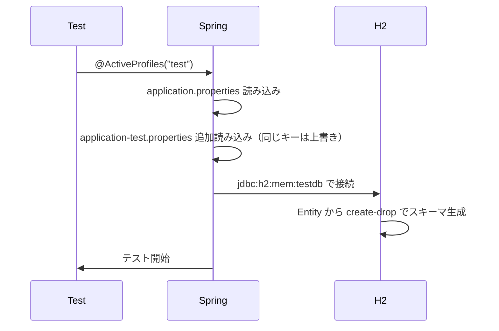
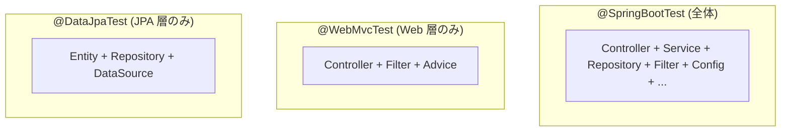

# 06. テスト — 壊れていないことを継続的に保証する

> この章で学ぶこと: **JUnit 5**、**Mockito**、**AssertJ**、**テスト種別の選び方**、**Spring Boot のテストアノテーション**、**スライステスト**、**MockMvc**、**JaCoCo**。

## 目次

1. [テストピラミッド](#テストピラミッド)
2. [JUnit 5](#junit-5)
3. [Mockito](#mockito)
4. [AssertJ](#assertj)
5. [テスト用 DB（H2）](#テスト用-dbh2)
6. [Spring Boot のテストアノテーション](#spring-boot-のテストアノテーション)
7. [スライステストの使い分け](#スライステストの使い分け)
8. [MockMvc vs RANDOM_PORT + TestRestTemplate](#mockmvc-vs-random_port--testresttemplate)
9. [@MockitoBean の使いどころ](#mockitobean-の使いどころ)
10. [JaCoCo（カバレッジ）](#jacococバレッジ)
11. [テストの実行方法](#テストの実行方法)

---

## テストピラミッド

| 種別 | 使うもの | 例 |
|------|---------|------|
| **ユニットテスト** | JUnit 5 + Mockito | `ExpenseAmountTest`, `ExpenseApplicationServiceTest` |
| **リポジトリテスト** | `@DataJpaTest` + H2 + AssertJ | `ExpenseRepositoryTest` |
| **統合テスト** | `@SpringBootTest` + MockMvc | `ExpenseControllerIntegrationTest` |

---

## JUnit 5

テストのベースとなるフレームワーク。

### 主なアノテーション

| アノテーション | 役割 |
|----------------|------|
| **@Test** | テストメソッドを示す |
| **@DisplayName("日本語")** | IDE・レポートでの表示名 |
| **@BeforeEach** | 各テストの前に実行 |
| **@AfterEach** | 各テストの後に実行 |
| **@BeforeAll** | 全テストの前に 1 回（static メソッド） |
| **@AfterAll** | 全テストの後に 1 回 |
| **@Nested** | ネストしたテストクラス |
| **@ParameterizedTest** | 複数の入力値で同じテスト |
| **@Disabled** | 一時的にスキップ |

### よく使うアサーション

```java
import static org.junit.jupiter.api.Assertions.*;

assertEquals(expected, actual);
assertTrue(condition);
assertNotNull(obj);
assertThrows(IllegalArgumentException.class, () -> method());
```

### テストの基本構造（AAA パターン）

```java
@Test
@DisplayName("金額が正の数なら ExpenseAmount を作成できる")
void createExpenseAmount_正常() {
    // Arrange（準備）
    int value = 1000;

    // Act（実行）
    ExpenseAmount amount = new ExpenseAmount(value);

    // Assert（検証）
    assertEquals(1000, amount.getValue());
}
```

---

## Mockito

**モック**: 本物の代わりに使う偽物のオブジェクト。依存を切り離してテスト対象だけを検証するために使います。

### セットアップ

```java
@ExtendWith(MockitoExtension.class)
class ExpenseServiceTest {

    @Mock
    private ExpenseRepository repository;

    @InjectMocks
    private ExpenseService service;  // repository が注入される
}
```

| アノテーション | 役割 |
|----------------|------|
| **@ExtendWith(MockitoExtension.class)** | Mockito を有効化 |
| **@Mock** | モックオブジェクトの宣言 |
| **@InjectMocks** | テスト対象にモックを注入 |

### @InjectMocks の注入順


コンストラクタ注入が成立すれば、それで完結。プロジェクトのクラスは全て**コンストラクタ注入**なので、常にこのパスになります。

つまり `@InjectMocks` は、テスト対象クラスを作るときに必要な `@Mock` オブジェクトをコンストラクタへ自動で渡します。セッターやフィールドへ直接入れる方法は、コンストラクタで注入できない場合だけ使われます。

### スタブ（when / thenReturn）

「メソッドが呼ばれたらこれを返せ」と仕込みます。

スタブは基本的に `@Mock` で作った依存先に設定します。`@InjectMocks` のテスト対象に設定すると、確認したい本物の処理まで偽物にしてしまうため、通常は行いません。

```java
// 固定値を返す
when(repository.findById(1L)).thenReturn(Optional.of(expense));

// 例外を投げる
when(repository.findById(999L)).thenThrow(new NotFoundException());

// 引数に応じた値を返す
when(repository.save(any(Expense.class)))
    .thenAnswer(inv -> inv.getArgument(0));  // 渡された引数をそのまま返す
```

### 引数マッチャー

```java
import static org.mockito.ArgumentMatchers.*;

any()                  // どんな引数でも
any(Expense.class)     // 指定型なら何でも
eq(1L)                 // この値のときだけ
anyLong(), anyString() // 型別
```

**注意**: 引数が複数あるときに `eq` と `any` を混ぜるときは、**全引数をマッチャーで書く**必要があります。

```java
// NG: 1 つだけマッチャー
when(repo.find(eq(user), start, end));  // エラー

// OK: 全部マッチャー
when(repo.find(eq(user), any(), any()));
```

### 検証（verify）

「実際に呼ばれたか」を確認します。

```java
verify(repository, times(1)).save(any());    // 1 回呼ばれた
verify(repository, never()).save(any());      // 呼ばれていない
verify(repository).save(any());               // 1 回（times(1) の省略形）

// 引数まで検証
verify(csvService).upload(eq(mockFile), eq(CsvFormat.OLD));
```

---

## AssertJ

JUnit 標準より読みやすいアサーションライブラリ。Spring Boot Starter Test に同梱。

### 基本形

```java
import static org.assertj.core.api.Assertions.*;

assertThat(actual).isEqualTo(expected);
```

メソッドチェーンで「何を期待しているか」が自然に読めます。

### よく使う例

```java
// 文字列
assertThat(message).contains("費").isNotBlank();

// 数値
assertThat(count).isGreaterThan(0).isLessThanOrEqualTo(100);
assertThat(score).isBetween(1, 10);

// コレクション
assertThat(list).hasSize(2);
assertThat(list).containsExactly(a, b);     // 順序一致
assertThat(list).containsExactlyInAnyOrder(b, a);  // 順序無視

// Optional
assertThat(opt).isPresent();
assertThat(opt).hasValue(expected);

// 例外
assertThatThrownBy(() -> service.execute())
    .isInstanceOf(IllegalArgumentException.class)
    .hasMessage("金額は正の数である必要があります");

// リスト要素の抽出と検証
assertThat(messages)
    .extracting(Message::getCreatedAt)
    .isSortedAccordingTo(Comparator.reverseOrder());
```

### JUnit `assertEquals` との違い

```java
// JUnit
assertEquals(expected, actual, "金額が一致しない");

// AssertJ
assertThat(actual).as("金額").isEqualTo(expected);
```

AssertJ の方が失敗時のエラーメッセージが圧倒的に親切。

---

## テスト用 DB（H2）

### セットアップ

`src/test/resources/application-test.properties`:

```properties
spring.datasource.url=jdbc:h2:mem:testdb;DB_CLOSE_DELAY=-1
spring.jpa.hibernate.ddl-auto=create-drop
spring.flyway.enabled=false
```

| 設定 | 意味 |
|------|------|
| `jdbc:h2:mem:testdb` | メモリ上に `testdb` を作成 |
| `DB_CLOSE_DELAY=-1` | プロセス終了まで DB を保持 |
| `ddl-auto=create-drop` | コンテキスト起動時にスキーマ作成、終了時に削除 |
| `flyway.enabled=false` | Flyway はテストでは動かさない |

H2 データベースが作成されるまでの流れは次の通りです。

1. テストで `test` プロファイルを有効にする
2. Spring Boot が `application-test.properties` を読み込む
3. `spring.datasource.url=jdbc:h2:mem:testdb;DB_CLOSE_DELAY=-1` を見て、H2 用の DataSource を作る
4. テスト時のクラスパスにある H2 の JDBC ドライバを使って、メモリ上に `testdb` を作成する
5. `ddl-auto=create-drop` により、Entity をもとにテーブルを作成する

### プロファイル切替のシーケンス



### @DataJpaTest のトランザクション

`@DataJpaTest` を付けたテストは**デフォルトでトランザクション内で実行され、終了時にロールバック**されます。なので `@BeforeEach` で `deleteAll()` を呼ぶ必要はありません。

```java
@DataJpaTest
class ExpenseRepositoryTest {

    @Autowired
    private ExpenseRepository expenseRepository;

    @Autowired
    private UserRepository userRepository;

    @Test
    void saveしたデータはテスト終了時にロールバックされる() {
        User user = userRepository.save(new User("cognito-sub", "test@example.com"));
        Expense expense = new Expense(
            "昼食",
            new ExpenseAmount(800),
            new ExpenseDate(LocalDate.of(2024, 1, 10)),
            CategoryType.FOOD,
            user
        );

        expenseRepository.save(expense);

        assertThat(expenseRepository.findByUser(user)).hasSize(1);
    } // ここでトランザクションがロールバックされ、保存したデータは残らない
}
```

このため、次のテストメソッドには前のテストで保存したデータが残りません。

逆に `@SpringBootTest` はロールバックしない（または controller 経由だとトランザクションが共有されない）ので、必要なら自前でクリアします。

---

## Spring Boot のテストアノテーション

| アノテーション | 起動する Bean | 用途 |
|----------------|--------------|------|
| **@SpringBootTest** | アプリ全体 | 統合テスト。Controller ~ Repository まで実機に近い構成 |
| **@DataJpaTest** | JPA 関連のみ（Entity / Repository / DataSource） | リポジトリ単体 |
| **@WebMvcTest** | Web 層のみ（Controller / Filter / `@ControllerAdvice`） | Controller 単体 |
| **@JsonTest** | Jackson 関連のみ | シリアライズ / デシリアライズの検証 |
| **@RestClientTest** | HTTP クライアント関連のみ | RestClient / RestTemplate |
| **@AutoConfigureMockMvc** | `@SpringBootTest` と組み合わせて `MockMvc` を有効化 | 統合テストで HTTP を模倣 |
| **@ActiveProfiles("test")** | — | `application-test.properties` を読み込む |
| **@MockitoBean** | — | Spring コンテキスト内の特定 Bean をモックに差し替え |

### 起動する Bean の範囲の違い



**速度**: Data/Web < SpringBootTest

**狭いほど速く、起動する Bean が少ない**ので、単体テストは狭いスライスを選びましょう。

---

## スライステストの使い分け

「どのアノテーションを選ぶか」の指針。

| 状況 | 推奨 | 理由 |
|------|------|------|
| Service のロジックを検証 | 素の JUnit + Mockito | Spring コンテキスト不要、速い |
| Repository のクエリを検証 | `@DataJpaTest` | H2 で SQL を実行、余計な Bean を起動しない |
| Controller のマッピング・バリデーション | `@WebMvcTest` + `@MockitoBean`（Service） | Web 層だけ起動、速い |
| Jackson の JSON 変換検証 | `@JsonTest` | ObjectMapper だけ起動 |
| 「全部つないで動く」検証 | `@SpringBootTest` + `@AutoConfigureMockMvc` | 本番に近い |
| 外部 API クライアントの検証 | `@RestClientTest` | MockRestServiceServer で応答を模倣 |

### @WebMvcTest と @MockitoBean

`@WebMvcTest` は、Controller などの **Web 層だけを Spring で起動する**テストです。URL、HTTP メソッド、JSON 変換、バリデーション、ステータスコードなどを確認したいときに使います。

- Web 層のテスト用なので、`MockMvc` は基本的に自動で使えるようになります。
- Service や Repository などは起動対象外なので、Controller が依存する Service は `@MockitoBean` でモックとして Spring コンテキストに登録します。

### @WebMvcTest の例

```java
@WebMvcTest(ExpenseController.class)
class ExpenseControllerTest {

    @Autowired MockMvc mockMvc;

    @MockitoBean
    ExpenseApplicationService service;

    @Test
    void 存在しないIDは404() throws Exception {
        when(service.findById(999L)).thenThrow(new ExpenseNotFoundException("not found"));

        mockMvc.perform(get("/api/expenses/999"))
               .andExpect(status().isNotFound());
    }
}
```

---

## MockMvc vs RANDOM_PORT + TestRestTemplate

API の統合テストには 2 つのスタイルがあります。

### 用語

`MockMvc` は、テストコードから Controller に HTTP リクエストを送ったように検証できる Spring のテスト用ツールです。実際のサーバは起動せず、`GET /api/expenses` のようなリクエスト、レスポンスのステータス、JSON の中身などを確認できます。

`@AutoConfigureMockMvc` は、`@SpringBootTest` で起動したアプリに対して `MockMvc` を自動設定するためのアノテーションです。本物の HTTP サーバは起動せず、Spring MVC の内部にリクエストを投げて API の動きを確認できます。

### 比較

| 項目 | MockMvc | RANDOM_PORT + TestRestTemplate |
|------|---------|--------------------------------|
| Tomcat を起動 | **しない** | する |
| 実行速度 | 速い | やや遅い |
| テスト範囲 | DispatcherServlet 以降 | HTTP クライアントから実通信 |
| `@SpringBootTest` と併用 | `@AutoConfigureMockMvc` | `webEnvironment = RANDOM_PORT` |
| Filter の挙動 | ほぼ再現 | 完全に再現 |

### MockMvc の例

```java
@SpringBootTest
@AutoConfigureMockMvc
@ActiveProfiles("test")
class ExpenseApiTest {

    @Autowired MockMvc mockMvc;

    @Test
    void 一覧取得() throws Exception {
        mockMvc.perform(get("/api/expenses?month=2025-01")
                  .header("Authorization", "Bearer xxx"))
               .andExpect(status().isOk())
               .andExpect(jsonPath("$.content").isArray());
    }
}
```

### RANDOM_PORT の例

```java
@SpringBootTest(webEnvironment = SpringBootTest.WebEnvironment.RANDOM_PORT)
class ExpenseApiE2ETest {

    @Autowired TestRestTemplate rest;

    @Test
    void 一覧取得() {
        ResponseEntity<String> res = rest.getForEntity("/api/expenses?month=2025-01", String.class);
        assertThat(res.getStatusCode()).isEqualTo(HttpStatus.OK);
    }
}
```

**指針**: 速さ優先 = MockMvc、完全再現優先 = RANDOM_PORT。

---

## @MockitoBean の使いどころ

`@MockitoBean`（以前の `@MockBean`）は、**Spring コンテキスト内の特定 Bean をモックに差し替える**アノテーション。

### 使うべき場面

| 場面 | 理由 |
|------|------|
| 外部 API クライアント | 実際の API を呼びたくない |
| ランダム値・時刻を使う Bean | テストを決定的にしたい |
| DB に依存する Bean を Controller テストで使う | 高速化 |

### 使う例

```java
@SpringBootTest
@AutoConfigureMockMvc
class ExpenseApiTest {

    @MockitoBean
    OpenAiClient openAiClient;  // 実 API を叩かない

    @Test
    void AI分類() throws Exception {
        when(openAiClient.callText(any())).thenReturn("食費");

        mockMvc.perform(post("/api/ai/categorize")
                  .contentType(MediaType.APPLICATION_JSON)
                  .content("{\"description\":\"スーパー\"}"))
               .andExpect(jsonPath("$.category").value("食費"));
    }
}
```

### @Mock との違い

| アノテーション | スコープ |
|----------------|---------|
| `@Mock` | ローカルなモック（テストクラス内のみ） |
| `@MockitoBean` | Spring コンテキストに登録（他の Bean に DI される） |

**覚え方**: `@SpringBootTest` 系で Bean 差し替えをしたいときだけ `@MockitoBean`。

---

## JaCoCo（カバレッジ）

**JaCoCo**: 実行された行・ブランチを計測するツール。

### 確認方法

```bash
mvn test                                  # テスト実行とともにカバレッジ収集
open target/site/jacoco/index.html        # レポートを開く
```

### 見られる指標

| 指標 | 意味 |
|------|------|
| **Lines** | 実行された行の割合 |
| **Branches** | if 分岐がどちらも通ったか |
| **Methods** | 呼ばれたメソッドの割合 |
| **Classes** | インスタンス化されたクラスの割合 |

### カバレッジの注意点

- **100% が目的ではない**: 重要なパスをテストすることが本質
- **getter/setter 等は除外**してよい（値があるだけ）
- **分岐カバレッジ**を重視する（Lines だけでは if の両方をチェックしていない）

---

## テストの実行方法

### Maven

```bash
# 全テスト
mvn test

# 指定クラス
mvn test -Dtest=ExpenseAmountTest

# 指定メソッド
mvn test -Dtest=ExpenseAmountTest#createExpenseAmount_正常な値

# テストをスキップしてビルド
mvn package -DskipTests
```

### IDE

IDE（IntelliJ / VSCode / Cursor）のテスト UI から、個別メソッドを実行するのが日常のワークフロー。

---

## この章のまとめ

- **テストピラミッド**: ユニットを多く、統合は少なく
- **スライステスト**で起動する Bean を絞り、高速化
- **JUnit 5 + Mockito + AssertJ** の 3 点セット
- `@DataJpaTest` は H2、`@WebMvcTest` は Service をモック、`@SpringBootTest` は全体起動
- **MockMvc** は Tomcat なしで高速。完全再現なら **RANDOM_PORT**
- `@MockitoBean` で Spring 管理 Bean をモックに差し替え
- **JaCoCo** で網羅率を可視化（ただし数字だけを追わない）

---

これで基本編は終わりです。さらに深く学びたいトピックは以下へ。

→ [appendix. 今後書く予定](./appendix-future.md)
→ [README に戻る](./README.md)
