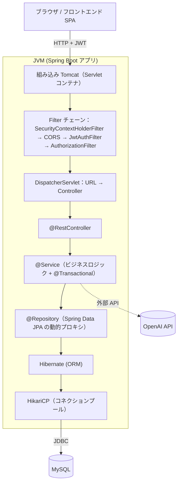

# バックエンド学習ドキュメント

> このフォルダは、Smart Household Account Book のバックエンドに使われている技術を**学習用**にまとめたドキュメント群です。

## このドキュメントのねらい

- 読者像: **Java の文法は分かるが、Spring / Web バックエンドの経験は浅い**人
- ゴール: **Spring の中級バックエンドエンジニア**として現場で通用する知識を、プロジェクトの実装を通じて身につける
- プロジェクトの解説だけでなく、フレームワーク一般の知識（「なぜその仕組みが必要なのか」「他の選択肢との違い」）も併記しています

---

## 学習ロードマップ

番号順に読むことを推奨します。1 と 2 を読むと Web API の骨格が掴め、3 まで読むと DB 込みで一通り動かせる感覚が身につきます。

| 章 | タイトル | ひとことで | 主な登場技術 |
|----|----------|-----------|--------------|
| [01](./01-spring-core.md) | Spring Core | Spring そのものの土台。DI・Bean・起動・設定 | Spring Boot, AutoConfiguration, `@ConfigurationProperties`, AOP |
| [02](./02-web.md) | Web 層 | HTTP が入ってきて JSON で返るまで | Spring MVC, `@RestController`, Bean Validation, Jackson, `RestClient`, OpenAPI |
| [03](./03-data.md) | データ層 | DB から取ってきて保存するまで | Spring Data JPA, Hibernate, トランザクション, Flyway, HikariCP |
| [04](./04-security.md) | セキュリティ | 誰からのリクエストかを判断する | Spring Security, JWT, OAuth2, CORS, CSRF |
| [05](./05-operations.md) | 運用・耐障害 | 本番で倒れないための仕組み | ロギング, Actuator, Spring Cache, Resilience4j |
| [06](./06-testing.md) | テスト | 壊れていないことを継続的に保証する | JUnit 5, Mockito, AssertJ, MockMvc, `@SpringBootTest` |
| [appendix](./appendix-future.md) | 今後書く予定 | 重要度を下げて後回しにしたトピック | Maven/MySQL/Docker/Lombok/OpenAPI Generator/DDD 詳細 など |

---

## バックエンドの全体像

1 リクエストが入って 1 レスポンスが返るまでの、代表的な流れです。



各ボックスがどの章で扱われるかは上の表を参照してください。

---

## アーキテクチャの置き場所（パッケージ構成）

```
backend/src/main/java/com/example/backend/
├── BackendApplication.java          ... 起動クラス (@SpringBootApplication)
├── controller/                       ... Web 層 (第 2 章)
├── application/
│   ├── service/                      ... アプリケーションサービス (第 3 章, 第 5 章)
│   └── mapper/                       ... Entity ↔ DTO 変換 (第 2 章)
├── entity/                           ... JPA エンティティ (第 3 章)
├── valueobject/                      ... 値オブジェクト (第 3 章)
├── repository/                       ... Spring Data JPA リポジトリ (第 3 章)
├── auth/
│   ├── filter/                       ... セキュリティフィルター (第 4 章)
│   └── provider/                     ... 現在ユーザー取得
├── config/
│   ├── security/                     ... SecurityConfig / CorsProperties / JwtProperties (第 4 章)
│   ├── cache/                        ... CacheConfig (第 5 章)
│   └── async/                        ... 非同期設定
└── exception/                        ... GlobalExceptionHandler (第 2 章)
```

---

## 学習の進め方のコツ

1. **まず動かす**: `mvn spring-boot:run` でアプリを起動し、`GET /actuator/health` が `UP` を返すことを確かめる
2. **章を読む**: 各章の冒頭の「この章で学ぶこと」→「図解」→「本文」の順に読む
3. **実コードを開く**: 章末に「プロジェクトでの実装」セクションがあるので、そこで紹介されたファイルを実際に開いて読む
4. **手を動かす**: 小さな API エンドポイントや Entity を追加して、壊してみる
5. **テストを書く**: 第 6 章を読んだら、自分が追加した機能にテストを書いて動作を保証する

---

## 参考リンク

| リソース | 用途 |
|----------|------|
| [Spring Boot Reference](https://docs.spring.io/spring-boot/docs/current/reference/htmlsingle/) | Spring Boot の公式マニュアル。迷ったら一次情報 |
| [Spring Framework Reference](https://docs.spring.io/spring-framework/reference/) | DI / AOP / MVC の詳細 |
| [Spring Data JPA Reference](https://docs.spring.io/spring-data/jpa/reference/) | リポジトリ仕様 |
| [Spring Security Reference](https://docs.spring.io/spring-security/reference/) | 認証・認可 |
| [Baeldung](https://www.baeldung.com/) | Spring の実用的なチュートリアルが豊富 |

フロントエンド（Next.js / React）の学習は [docs/frontend/README.md](../frontend/README.md) を参照してください。
