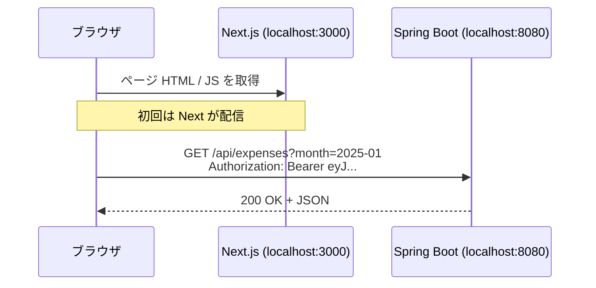

# 01. Web と TypeScript — フロントの前提知識

> この章で学ぶこと: **ブラウザと HTTP の基本**、**SPA と CORS**、**JSON**、**環境変数**、**TypeScript の読み方**、**npm と package.json**。

## 目次

1. [フロントエンドとバックエンドの役割分担](#フロントエンドとバックエンドの役割分担)
2. [HTTP の基本（バックエンド視点の復習）](#http-の基本バックエンド視点の復習)
3. [SPA とこのプロジェクト](#spa-とこのプロジェクト)
4. [CORS とは](#cors-とは)
5. [JSON と型](#json-と型)
6. [環境変数（NEXT_PUBLIC_*）](#環境変数next_public_)
7. [TypeScript の要点](#typescript-の要点)
8. [npm と package.json](#npm-と-packagejson)
9. [プロジェクトでの実装](#プロジェクトでの実装)

---

## フロントエンドとバックエンドの役割分担

| 役割 | バックエンド（Spring Boot） | フロントエンド（Next.js） |
|------|------------------------------|---------------------------|
| データの永続化 | MySQL に保存 | しない（API 経由で取得） |
| ビジネスルール | サービス層で検証 | 入力の簡易チェック程度 |
| 認証の検証 | JWT を検証（正） | トークンを付けて送る |
| 画面表示 | しない（JSON API） | HTML/CSS/React で描画 |

**覚え方**: フロントは「ユーザーが触る窓口」、バックエンドは「データとルールの本丸」です。セキュリティ上、**最終的な検証は必ずバックエンド**で行います。

---

## HTTP の基本（バックエンド視点の復習）

[バックエンド第 2 章](../backend/02-web.md) と同じ HTTP を、今度は**ブラウザが送る側**として見ます。



| 項目 | フロントでの意味 |
|------|------------------|
| **URL** | `NEXT_PUBLIC_API_BASE_URL` + `/api/expenses` |
| **メソッド** | `GET` 取得 / `POST` 作成 / `PUT` 更新 / `DELETE` 削除 |
| **ヘッダ** | `Authorization: Bearer <JWT>` を API 呼び出し時に付与 |
| **ボディ** | POST/PUT では JSON（例: 支出の金額・カテゴリ） |
| **ステータス** | 200 成功 / 401 未認証 / 404 なし / 500 サーバーエラー |

フロントはステータスコードに応じて、トースト表示や再ログイン案内を行います（[第 4 章](./04-api-integration.md) のエラーハンドリング参照）。

---

## SPA とこのプロジェクト

**SPA（Single Page Application）** は、ページ全体を毎回サーバーから HTML で受け取るのではなく、**JavaScript が画面を差し替えながら** API からデータを取る方式です。

このプロジェクトの Next.js は **App Router** (app/ をルートに、ディレクトリと URL を対応づける仕組み)を使いますが、メイン画面（`/expenses`）は `"use client"` の **クライアントコンポーネント**中心です。つまり実質的には「React の SPA + Next がルーティングとビルドを担当」というイメージで問題ありません。

---

## CORS とは

ブラウザは**セキュリティのため**、JavaScript から別オリジン（スキーム・ホスト・ポートが違う）へ勝手にリクエストできません。

- フロント: `http://localhost:3000`
- API: `http://localhost:8080`

→ **オリジンが違う**ため、バックエンドが `Access-Control-Allow-Origin` などの CORS ヘッダを返す必要があります。

本プロジェクトではルート `.env` の `CORS_ALLOWED_ORIGINS=http://localhost:3000` で許可しています（[バックエンド第 4 章](../backend/04-security.md)）。

**ポイント**: Postman や curl では CORS は発生しません。**ブラウザから API を叩くときだけ**気にします。

---

## JSON と型

API のやり取りは JSON です。Java の DTO に相当するものを、フロントでは TypeScript の **interface / type** で表現します。

```typescript
// 画面で使いやすい形（src/lib/types.ts など）
export interface Expense {
  id: string
  amount: number
  category: string
  description: string
  date: string
}
```

OpenAPI から生成される `ExpenseDto` と、画面用の `Expense` を分ける理由は [第 4 章](./04-api-integration.md) で説明します（バックエンドの Entity / DTO 分離と同じ考え方です）。

---

## 環境変数（NEXT_PUBLIC_*）

Next.js では、**ブラウザに露出してよい値**だけ `NEXT_PUBLIC_` プレフィックスを付けます。 `NEXT_PUBLIC_`を付けていない環境変数はNode.js上で動くNextサーバでのみ、使える。

| 変数 | 用途 |
|------|------|
| `NEXT_PUBLIC_API_BASE_URL` | Spring Boot のベース URL（例: `http://localhost:8080`） |
| `NEXT_PUBLIC_AWS_REGION` | Cognito のリージョン |
| `NEXT_PUBLIC_COGNITO_USER_POOL_ID` | User Pool ID |
| `NEXT_PUBLIC_COGNITO_CLIENT_ID` | アプリクライアント ID |

設定ファイル: `frontend-nextjs/.env.local`（`.gitignore` 対象）。

**セキュリティ注意**

- `OPENAI_API_KEY` のような秘密は**フロントに置かない**（バックエンドのみ）
- Cognito の Client ID は公開前提だが、**User Pool の設計**（パスワードポリシー、MFA 等）で守る
- API キーを `NEXT_PUBLIC_` にすると全世界に漏れる

---

## TypeScript の要点

Java 経験者向けに、読みコードで押さえる最小セットです。

| Java | TypeScript |
|------|------------|
| `String name` | `name: string` |
| `List<Expense>` | `Expense[]` |
| `Optional` / null | `string \| undefined` や `?` |
| `interface` / `record` | `interface` / `type` |
| メソッド | 関数 `function foo()` や `const foo = () => {}` |
| `CompletableFuture` | `Promise` + `async/await` |

### undefined / null / ?

JavaScript では「値が無い」状態が **2 種類**あります。TypeScript は型で区別できます。

| 記法 | 意味 | Java で近いイメージ |
|------|------|---------------------|
| `undefined` | 未代入・引数省略・プロパティ無し | 引数を渡さなかったとき |
| `null` | 意図的に「空」と決めた値 | `null` |
| `?`（型） | 省略可能（無いときは `undefined`） | `Optional` / 省略可能な引数 |
| `?.`（式） | 左が `null`/`undefined` ならそこで止める | null チェックの短縮 |
| `??` | 左が `null`/`undefined` のときだけ右を使う | `.orElse()` |

```typescript
// ? はプロパティ・引数が「あってもなくてもよい」＝ 実質 | undefined
function fetchExpenses(month: string, page?: number) { }

interface User {
  id: string
  nickname?: string  // 省略可 → nickname: string | undefined と同じ
}

// 安全にたどる・デフォルト値
const amount = item?.price ?? 0
```

### async / await

API 呼び出しは非同期です。`await` で結果が返るまで待ちます。

ブラウザの JavaScript は **イベントループ**（1本の実行ラインでイベントを順に処理する仕組み）で動きます。`await` で止まるのは **その `async` 関数の続きだけ** で、通信待ちのあいだもクリックや描画など **他の処理は回り続けます**（画面全体が固まるわけではない）。Java の同期メソッドでスレッドをブロックするイメージとは違います。

```typescript
const page = await fetchMonthlyExpenses("2025-01", 0, 10)
console.log(page.content.length)
```

### 配列操作

```typescript
const names = expenses.map((e) => e.category)
const foodOnly = expenses.filter((e) => e.category === "食費")
```

### import パス

`tsconfig.json` で `@/*` → `src/*` にエイリアスしています。

```typescript
import type { Expense } from "@/lib/types"
```

---

## npm と package.json

| 用語 | 意味 | Maven との対応 |
|------|------|----------------|
| **npm** | Node のパッケージマネージャ | Maven コマンド |
| **package.json** | 依存関係とスクリプト定義 | `pom.xml` |
| **node_modules/** | ダウンロードされたライブラリ | ローカルリポジトリ相当 |
| **package-lock.json** | バージョン固定（実際にインストールされたバージョンを記録） | 依存のロック |

主要スクリプト（`frontend-nextjs/package.json`）:

| スクリプト | 内容 |
|-----------|------|
| `npm run dev` | 開発サーバー起動 |
| `npm run build` | 本番用ビルド |
| `npm run generate:api` | OpenAPI → TypeScript クライアント生成 |

---

## プロジェクトでの実装

### 環境変数の読み込み

[`apiClient.ts`](../../frontend-nextjs/src/api/apiClient.ts) で API のベース URL を参照しています。

- **`process`** … Node.js が動いているときの「実行環境」に関する情報
- **`process.env`** … その中の環境変数（environment variables）をまとめたオブジェクト

```typescript
function getBasePath(): string {
    return process.env.NEXT_PUBLIC_API_BASE_URL || '';
}
```

未設定のままだとリクエスト先が空になり、実行時エラーになります。`.env.local` を必ず用意してください（README のクイックスタート参照）。

### 型定義

[`types.ts`](../../frontend-nextjs/src/lib/types.ts) に画面ドメインの型を集約しています。章を進めるうちに、生成 DTO との違いが分かってきます。

---

## この章のまとめ

- フロントは**表示と操作**、バックエンドは**データと検証**
- ブラウザから API を叩くときは **CORS** と **JWT ヘッダ** が重要
- 秘密情報は `NEXT_PUBLIC_` に載せない
- TypeScript は **型 + async/await** が読めればこのプロジェクトは追える

次章では、画面を部品として組み立てる **React** の核心を解説します。

→ [02. React](./02-react.md)
