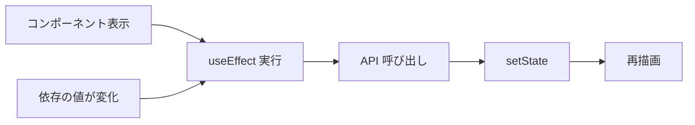
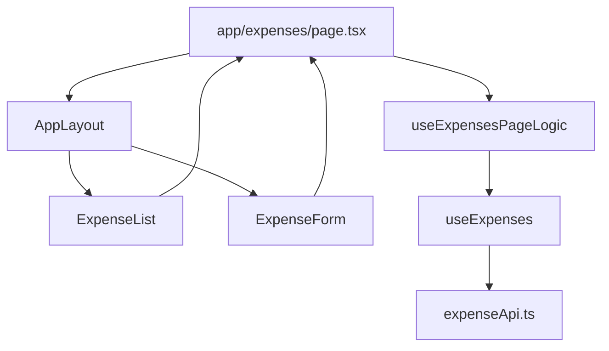

# 02. React — 画面を部品として組み立てる

> この章で学ぶこと: **コンポーネント**、**JSX**、**props**、**state**、**useEffect**、**カスタムフック**、**イベント処理**、**このプロジェクトでの責務分離**。

## 目次

1. [React とは](#react-とは)
2. [コンポーネントと JSX](#コンポーネントと-jsx)
3. [props — 親から子へ渡すデータ](#props--親から子へ渡すデータ)
4. [state — 画面内で変わるデータ](#state--画面内で変わるデータ)
5. [useEffect — 副作用](#useeffect--副作用)
6. [カスタムフック](#カスタムフック)
7. [イベントとコールバック](#イベントとコールバック)
8. [再レンダリングのイメージ](#再レンダリングのイメージ)
9. [プロジェクトでの責務分離](#プロジェクトでの責務分離)
10. [プロジェクトでの実装](#プロジェクトでの実装)

---

## React とは

React は、UI を**コンポーネント**という再利用可能な部品の組み合わせで作る JavaScript ライブラリです。

バックエンドでいうと:

| バックエンド | React |
|--------------|-------|
| クラス / メソッド | 関数コンポーネント `function MyPage()` |
| メソッドの引数 | `props` |
| インスタンスフィールド | `useState` で持つ state |
| サービス層の呼び出し | カスタムフックや API 関数 |

---

## コンポーネントと JSX

コンポーネントは**関数**です。戻り値が UI になります。

```tsx
export function Hello({ name }: { name: string }) {
  return <p>こんにちは、{name} さん</p>
}
```

`return` の中の HTML 風記法を **JSX** と呼びます。実際は `React.createElement` に変換されます。

| JSX | 意味 |
|-----|------|
| `className="flex"` | HTML の `class`（`class` は JS の予約語のため別名） |
| `{name}` | JavaScript 式の埋め込み |
| `<Button />` | 別コンポーネントの利用 |

---

## props — 親から子へ渡すデータ

**props** は読み取り専用の入力です。子コンポーネントは props を書き換えません。

```tsx
interface ExpenseListProps {
  expenses: Expense[]
  onDelete: (id: string) => void
}

export function ExpenseList({ expenses, onDelete }: ExpenseListProps) {
  // expenses を map して行を描画
}
```

バックエンドの「Controller が Service の結果を DTO に載せて返す」に近いのは、**親ページが hooks でデータを取り、子に props で渡す**パターンです。

---

## state — 画面内で変わるデータ

ユーザー操作や API 結果で変わる値は **state** に置きます。

```tsx
const [open, setOpen] = useState(false)
```

- `open`: 現在の値
- `setOpen`: 値を更新する関数（これを呼ぶと再描画が走る）

### useState の典型例

| 用途 | 例 |
|------|-----|
| ダイアログの開閉 | `useState(false)` |
| フォーム入力 | `useState({ amount: 0, category: "" })` |
| 一覧データ | `useState<Expense[]>([])` |
| ローディング | `useState(true)` |

[`expense-form.tsx`](../../frontend-nextjs/src/components/expense-form.tsx) では、ダイアログの `open` と `formData` を state で管理しています。

---

## useEffect — 副作用

**副作用**とは、描画以外の処理（API 取得、タイマー、DOM 操作など）です。

```tsx
useEffect(() => {
  fetchData()
}, [month, page])
```

第 2 引数の配列は**依存配列**です。`month` か `page` が変わったときだけ `fetchData` が再実行されます。



### 注意点（初心者がハマりやすい）

| パターン | 挙動 |
|----------|------|
| 依存配列 `[]` | マウント時のみ 1 回 |
| 依存配列 `[month]` | `month` 変更のたび |
| 依存配列なし | **毎回の描画後**に実行（ほぼ使わない） |

[`use-monthly-expenses.ts`](../../frontend-nextjs/src/hooks/use-monthly-expenses.ts) は、`month` / `page` / `size` が変わるたびに API から一覧を取り直します。

---

## カスタムフック

**カスタムフック**とは、`useState` や `useEffect` など React のフックを使ったロジックを、`use` で始まる関数にまとめたものです。ロジックをファイルに分離して再利用します。

```tsx
export function useExpenses() {
  const addExpenseItem = useCallback(async (data: ExpenseFormData) => {
    await createExpense(data)
    toast.success("支出を追加しました")
  }, [])

  return { addExpenseItem, /* ... */ }
}
```

### useCallback

関数をメモ化し、不要な再生成を抑えます。依存配列が空 `[]` なら、コンポーネントの生存中は同じ関数参照を保ちます。

### このプロジェクトのフック一覧（代表）

| フック | 役割 |
|--------|------|
| `useExpenses` | 支出 CRUD + トースト |
| `useMonthlyExpenses` | 月別一覧（ページネーション） |
| `useExpensesPageLogic` | ページ単位の操作と refreshTrigger |
| `useRefreshTrigger` | 更新後に複数データを再取得 |
| `useExpenseSummary` | 今月サマリー |

**設計の意図**: UI コンポーネントは見た目に集中し、**データ取得・更新は hooks** に寄せています（バックエンドの Controller / Service 分離に似ています）。

---

## イベントとコールバック

ボタンクリックなどは、親から渡した関数を呼びます。

```tsx
<Button onClick={() => onDelete(expense.id)}>削除</Button>
```

子は「削除して」と親に依頼し、親（またはページの hook）が API を呼ぶ——という**単方向データフロー**が React の基本です。

---

## 再レンダリングのイメージ

1. `setState` や親からの props 変更が起きる
2. そのコンポーネント関数が**もう一度実行**される
3. 新しい JSX が計算され、差分だけ DOM が更新される

パフォーマンス上、大きな一覧では `key` をリスト項目に付けます（React がどの行が変わったか識別するため）。

```tsx
{expenses.map((e) => (
  <ExpenseRow key={e.id} expense={e} />
))}
```

---

## プロジェクトでの責務分離



| 層 | やること | やらないこと |
|----|----------|--------------|
| **page.tsx** | レイアウト組み立て、hook の結果を配線 | 生の `fetch` を直書きしない |
| **components/** | 表示・入力・イベント発火 | API URL を知らない |
| **hooks/** | state、API 呼び出し、エラー表示 | JSX を大量に書かない |
| **api/** | HTTP・DTO 変換 | UI の状態を持たない |

---

## プロジェクトでの実装

### ページでの hook の利用

[`app/expenses/page.tsx`](../../frontend-nextjs/app/expenses/page.tsx):

```tsx
const {
  refreshTrigger,
  handleAddExpense,
  handleUpdateExpense,
  handleDeleteExpense,
} = useExpensesPageLogic()

const summaryData = useExpenseSummary(refreshTrigger)
```

`refreshTrigger` は数値をインクリメントするだけですが、依存する hook が「再取得」を走らせる**合図**になります（[第 4 章](./04-api-integration.md) 参照）。

### refreshTrigger パターン

[`use-expenses-page-logic.ts`](../../frontend-nextjs/src/hooks/use-expenses-page-logic.ts):

```typescript
const handleAddExpense = useCallback(async (data: ExpenseFormData) => {
    await addExpenseItem(data)
    setRefreshTrigger((prev) => prev + 1)
}, [addExpenseItem])
```

一覧・グラフ・サマリーなど**複数ウィジェット**を一度に更新したいとき、React Query のようなキャッシュライブラリを使わず、シンプルに「トリガー番号」を渡す方式を採用しています。

---

## この章のまとめ

- UI は**コンポーネント**の入れ子で作る
- データは **props で下へ**、イベントは **コールバックで上へ**
- 変わる値は **useState**、API 取得は **useEffect**
- ロジックの再利用は **カスタムフック**
- このプロジェクトは **page → hooks → api** の流れを守っている

次章では、ファイルパスが URL になる **Next.js App Router** を解説します。

→ [03. Next.js](./03-nextjs.md)
