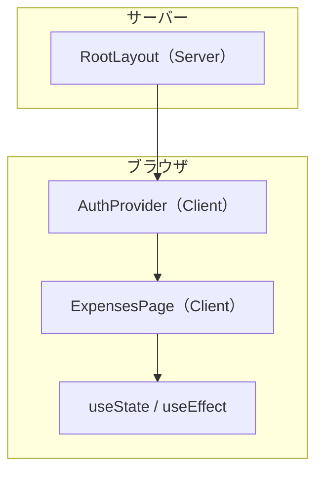

# 03. Next.js — ルーティングとアプリの骨格

> この章で学ぶこと: **Next.js とは**、**App Router**、**ファイルベースルーティング**、**layout と page**、**Server / Client Component**、**`"use client"`**、**開発サーバーとビルド**。

## 目次

1. [Next.js とは](#nextjs-とは)
2. [App Router と Pages Router](#app-router-と-pages-router)
3. [ファイルベースルーティング](#ファイルベースルーティング)
4. [layout.tsx と page.tsx](#layouttsx-と-pagetsx)
5. [Server Component と Client Component](#server-component-と-client-component)
6. [use client のルール](#use-client-のルール)
7. [ナビゲーション](#ナビゲーション)
8. [開発と本番ビルド](#開発と本番ビルド)
9. [プロジェクトでの実装](#プロジェクトでの実装)

---

## Next.js とは

Next.js は **React の上に載るフレームワーク**です。次をまとめて提供します。

| 機能 | 説明 |
|------|------|
| **ルーティング** | URL とファイルの対応 |
| **ビルド** | TypeScript・バンドル・最適化 |
| **開発サーバー** | ホットリロード付き `npm run dev` |
| **（任意）SSR/SSG** | サーバーで HTML を生成 |

このプロジェクトは **App Router（`app/` ディレクトリ）** を使います。メイン画面はクライアント中心ですが、Next が配信・ビルドの枠組みを担います。

---

## App Router と Pages Router

| | App Router（本プロジェクト） | Pages Router（旧方式） |
|--|------------------------------|------------------------|
| 置き場所 | `app/` | `pages/` |
| レイアウト | `layout.tsx` でネスト可能 | `_app.tsx` など |
| デフォルト | Server Component | クライアント中心 |

新規プロジェクトでは App Router が標準です。ドキュメントも [App Router](https://nextjs.org/docs/app) を参照してください。

---

## ファイルベースルーティング

`app` 以下のフォルダ構造が URL になります。

```text
app/
├── layout.tsx      → 全ルート共通
├── page.tsx        → /
└── expenses/
    └── page.tsx    → /expenses
```

| ファイル | URL |
|----------|-----|
| `app/page.tsx` | `/` |
| `app/expenses/page.tsx` | `/expenses` |

バックエンドの `@GetMapping("/api/expenses")` にパスを書くのではなく、**フォルダと `page.tsx` で URL が決まる**——という違いを覚えておくと混乱しません。

---

## layout.tsx と page.tsx

### layout.tsx

**複数ページで共通の枠**です。ネストできます。

[`app/layout.tsx`](../../frontend-nextjs/app/layout.tsx) では:

- フォント（Geist）の適用
- 全体 CSS（`globals.css`）
- `AuthProvider` で全ページを認証 UI で包む

```tsx
export default function RootLayout({ children }: { children: React.ReactNode }) {
  return (
    <html lang="ja">
      <body>
        <AuthProvider>{children}</AuthProvider>
      </body>
    </html>
  )
}
```

### page.tsx

その URL の**本体コンテンツ**です。

---

## Server Component と Client Component

App Router では、**デフォルトは Server Component** です。

| | Server Component | Client Component |
|--|------------------|------------------|
| 実行場所 | サーバー（ビルド時 / リクエスト時） | ブラウザ |
| hooks（useState 等） | 使えない | 使える |
| ブラウザ API | 使えない | 使える |
| 宣言 | 不要（デフォルト） | ファイル先頭に `"use client"` |



---

## use client のルール

ファイルの**先頭**に書きます。

```tsx
"use client"

import { useState } from "react"
```

### いつ必要か

- `useState`, `useEffect`, カスタムフックを使う
- `onClick` などイベントハンドラがある
- Amplify の `useAuthenticator` を使う

### このプロジェクトの方針

主要画面は **`"use client"` 付き**です。理由:

- Cognito ログイン（Amplify）はブラウザで動く
- 支出一覧はマウント後に API を叩く（useEffect）
- グラフ・フォームはインタラクティブ

SSR で HTML を先に出す最適化は、学習段階では優先度を下げて問題ありません。

---

## ナビゲーション

### リンク

```tsx
import Link from "next/link"

<Link href="/expenses">支出一覧</Link>
```

### プログラムから遷移

[`app/page.tsx`](../../frontend-nextjs/app/page.tsx) では、トップ `/` を `/expenses` にリダイレクトしています。

```tsx
"use client"

import { useEffect } from "react"
import { useRouter } from "next/navigation"

export default function RootPage() {
  const router = useRouter()
  useEffect(() => {
    router.replace("/expenses")
  }, [router])
  return null
}
```

- `useRouter`: App Router 用のルーター（`next/navigation`）
- `replace`: 履歴を残さず置き換え（戻るボタンで `/` に戻らない）

---

## 開発と本番ビルド

| コマンド | 用途 |
|----------|------|
| `npm run dev` | 開発（ポート 3000、ホットリロード） |
| `npm run build` | 本番用静的解析 + ビルド |
| `npm run start` | ビルド成果物の起動 |

Docker の single-host 構成では、ビルド済み Next をコンテナで動かします（[インフラ第 2 章](../infrastructure/02-docker.md)）。

### .next ディレクトリ

ビルドキャッシュです。**Git 管理しません**。ローカルで消して再ビルドすると不具合が直ることがあります。

---

## プロジェクトでの実装

### ディレクトリと役割

| パス | 役割 |
|------|------|
| `app/layout.tsx` | 認証プロバイダ・フォント |
| `app/page.tsx` | `/` → `/expenses` |
| `app/expenses/page.tsx` | メインの家計簿 UI |
| `app/globals.css` | Tailwind のエントリ |

### メインページの構成

[`app/expenses/page.tsx`](../../frontend-nextjs/app/expenses/page.tsx) は次を組み合わせています。

- `useAuthenticator` — ログインユーザー情報
- `AppLayout` — サイドバー + メイン
- `ExpenseList`, `ExpenseTrendChart`, サマリー系セクション
- `useExpensesPageLogic` — CRUD 後の refresh

読み方のコツ: **上から JSX の構造**、**中盤で hooks の配線**、**子コンポーネントは props だけ**、と分けて読むと追いやすいです。

### パスエイリアス

[`tsconfig.json`](../../frontend-nextjs/tsconfig.json):

```json
"paths": {
  "@/*": ["./src/*"]
}
```

`@/hooks/use-expenses` は `src/hooks/use-expenses` を指します。

---

## この章のまとめ

- Next.js は **React + ルーティング + ビルド**
- `app/**/page.tsx` が URL、`layout.tsx` が共通枠
- hooks やイベントには **`"use client"`** が必要
- このプロジェクトは **クライアント中心**で API と連携する

次章では、OpenAPI 生成クライアントを使った **バックエンド API 連携**を解説します。

→ [04. API 連携](./04-api-integration.md)
