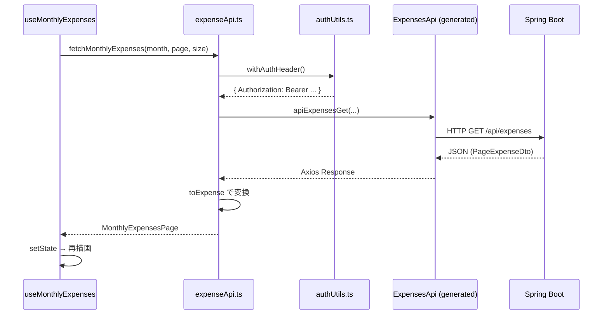

# 04. API 連携 — バックエンドを呼び出すまで

> この章で学ぶこと: **OpenAPI 仕様駆動（フロント側）**、**生成クライアント**、**Mapper パターン**、**認証ヘッダ**、**カスタムフックとの接続**、**エラーハンドリング**、**refreshTrigger**。

## 目次

1. [全体の流れ](#全体の流れ)
2. [OpenAPI 仕様駆動（フロント）](#openapi-仕様駆動フロント)
3. [生成コードと手書きコードの境界](#生成コードと手書きコードの境界)
4. [apiClient と expenseApi](#apiclient-と-expenseapi)
5. [Mapper パターン](#mapper-パターン)
6. [認証ヘッダの付与](#認証ヘッダの付与)
7. [フックから API を呼ぶ](#フックから-api-を呼ぶ)
8. [エラーハンドリング](#エラーハンドリング)
9. [refreshTrigger による再取得](#refreshtrigger-による再取得)
10. [プロジェクトでの実装](#プロジェクトでの実装)

---

## 全体の流れ



バックエンドの [第 2 章](../backend/02-web.md) で学んだ REST API が、ここでは **Axios 経由の TypeScript 呼び出し**として現れます。

---

## OpenAPI 仕様駆動（フロント）

契約の単一ソースはリポジトリ直下の [`openapi/openapi.yaml`](../../openapi/openapi.yaml) です。

| 端 | 生成コマンド | 出力先 |
|----|-------------|--------|
| バックエンド | `./mvnw generate-sources -Plocal` | `backend/target/generated-sources/openapi/` |
| フロント | `npm run generate:api` | `frontend-nextjs/src/api/generated/` |

`package.json` の定義:

```json
"generate:api": "npx openapi-generator-cli generate -i ../openapi/openapi.yaml -g typescript-axios -o ./src/api/generated"
```

**手順（API を変更したとき）**

1. `openapi/openapi.yaml` を編集
2. バックエンドで Controller インターフェースを再生成・実装を合わせる
3. フロントで `npm run generate:api`
4. `expenseApi.ts` や Mapper が新しい型・メソッドに合うか確認

---

## 生成コードと手書きコードの境界

| ディレクトリ | 編集 |
|--------------|------|
| `src/api/generated/` | **しない**（再生成で上書き） |
| `src/api/expenseApi.ts` など | **する**（アプリ向けの薄いラッパ） |
| `src/api/expenseMappers.ts` | **する**（DTO → 画面型） |

バックエンドで「生成インターフェースを `implements` する」のと同様、フロントは**生成クライアントをラップ**して使います。

---

## apiClient と expenseApi

### apiClient.ts

[`apiClient.ts`](../../frontend-nextjs/src/api/apiClient.ts) は生成クラスの**ファクトリ**です。

```typescript
export function getExpenseApiClient(): ExpensesApi {
    return new ExpensesApi(new Configuration({
        basePath: getBasePath()
    }));
}
```

`basePath` は `NEXT_PUBLIC_API_BASE_URL` から取得します。

### expenseApi.ts

[`expenseApi.ts`](../../frontend-nextjs/src/api/expenseApi.ts) は**アプリ向けの関数 API**です。

```typescript
export async function fetchMonthlyExpenses(
    month: string,
    page?: number,
    size?: number
): Promise<MonthlyExpensesPage> {
    const api = getExpenseApiClient();
    const options = await withAuthHeader();
    const response = await api.apiExpensesGet(month, page, size, options);
    const dto = response.data;
    return {
        content: (dto.content ?? []).map(toExpense),
        totalElements: dto.totalElements ?? 0,
        // ...
    };
}
```

コンポーネントは `ExpensesApi` を直接知らず、`fetchMonthlyExpenses` だけ呼びます。

---

## Mapper パターン

バックエンドの Entity / DTO 分離と同じく、フロントでも**API の形**と**画面で使いやすい形**を分けます。

| 型 | 出どころ | 例 |
|----|----------|-----|
| `ExpenseDto` | OpenAPI 生成 | `id` が number など |
| `Expense` | `src/lib/types.ts` | `id` を `string` に統一 |
| `ExpenseFormData` | フォーム用 | 送信前の入力 |

[`expenseMappers.ts`](../../frontend-nextjs/src/api/expenseMappers.ts):

```typescript
export function toExpense(dto: ExpenseDto): Expense {
    return {
        id: String(dto.id),
        amount: dto.amount ?? 0,
        category: dto.category ?? '',
        description: dto.description ?? '',
        date: dto.date ?? '',
        createdAt: new Date().toISOString(),
    };
}
```

`??` は **null / undefined のとき右側を使う**演算子です（Java の `Optional.orElse` に近い）。

---

## 認証ヘッダの付与

[`authUtils.ts`](../../frontend-nextjs/src/api/authUtils.ts):

```typescript
export async function withAuthHeader(): Promise<{ headers: { Authorization: string } }> {
    const token = await getJwtToken();
    return {
        headers: {
            Authorization: `Bearer ${token}`,
        },
    };
}
```

バックエンドの `JwtAuthFilter` が同じ形式のトークンを検証します（[バックエンド第 4 章](../backend/04-security.md)）。

**401 が返ったとき**は、トークン期限切れや未ログインの可能性があります。フロントは [エラーハンドリング](#エラーハンドリング) でトーストを出します。

---

## フックから API を呼ぶ

[`use-monthly-expenses.ts`](../../frontend-nextjs/src/hooks/use-monthly-expenses.ts) のパターン:

1. `useState` で一覧・件数・ロード済みフラグを保持
2. `useCallback` で `fetchData` を定義
3. `useEffect` で `month` / `page` / `size` 変更時に `fetchData` 実行
4. エラー時は `showApiErrorMessage`

ページネーションはバックエンドの `page`（0 始まり）と `size` をそのまま渡します（[バックエンド第 2 章](../backend/02-web.md) のページネーションと一致）。

---

## エラーハンドリング

[`api-error-handler.ts`](../../frontend-nextjs/src/lib/api-error-handler.ts):

```typescript
export function showApiErrorMessage(error: unknown, defaultMessage: string): void {
  if (error && typeof error === "object" && "response" in error) {
    const apiError = error as { response?: { status?: number } }
    if (apiError.response?.status === 401) {
      toast.error("認証エラー: 再ログインしてください")
      return
    }
    if (apiError.response?.status === 404) {
      toast.error("データが見つかりませんでした")
      return
    }
  }
  toast.error(defaultMessage)
}
```

| 層 | 役割 |
|----|------|
| **Spring `GlobalExceptionHandler`** | 業務例外 → `ErrorResponse` JSON |
| **Spring Security** | 401 / 403 |
| **フロント** | ステータスに応じたユーザー向けメッセージ（トースト） |

バックエンドのエラーボディ形式と完全にパースして表示する実装にはしていません。学習を進めたら、`response.data.message` を読む拡張も検討できます。

通知 UI には [Sonner](https://sonner.emilkowal.ski/) を使用（`toast.success` / `toast.error`）。

---

## refreshTrigger による再取得

1 画面に**複数のデータソース**（一覧・グラフ・サマリー）があるとき、CRUD 後にすべて更新する必要があります。

本プロジェクトでは **数値トリガー**を使います。

```typescript
// 更新後
setRefreshTrigger((prev) => prev + 1)

// 別 hook 側
useRefreshTrigger(refreshTrigger, fetchMonthlySummary, fetchAvailableMonths)
```

[`use-refresh-trigger.ts`](../../frontend-nextjs/src/hooks/use-refresh-trigger.ts) は、`refreshTrigger > 0` のときだけ再取得関数を実行します（初回マウントでは走らない）。

**他の選択肢（参考）**: TanStack Query（React Query）はキャッシュと再検証を自動化できる。学習用に依存を増やさず、明示的なトリガー方式を採用しています。

---

## プロジェクトでの実装

### API 一覧（フロントから呼ぶ主なもの）

| 関数（例） | HTTP | 用途 |
|------------|------|------|
| `fetchMonthlyExpenses` | GET `/api/expenses` | 月別一覧 |
| `createExpense` | POST `/api/expenses` | 1 件追加 |
| `uploadCsvFile` | POST `/api/expenses/upload-csv` | CSV インポート |
| `updateExpense` | PUT | 更新 |
| `deleteExpense` | DELETE | 削除 |
| `predictCategory` | POST `/api/ai/category` | AI カテゴリ |

詳細は [`openapi/openapi.yaml`](../../openapi/openapi.yaml) と README の API 一覧を参照。

### CSV アップロード

[`csv-upload-dialog.tsx`](../../frontend-nextjs/src/components/csv-upload-dialog.tsx) は、フロントで CSV をパース（[`csv-parser.ts`](../../frontend-nextjs/src/lib/csv-parser.ts)）し、整形したデータを API に送るか、バックエンドの upload エンドポイントを使う——実装を開いてフローを確認してください。

---

## この章のまとめ

- **openapi.yaml → generate:api → generated/** の順でクライアントを更新
- **expenseApi + Mapper** で画面型に変換してから hooks に渡す
- 認証は **`withAuthHeader()`** で Bearer を付与
- 複数ウィジェットの更新は **refreshTrigger**

次章では、Tailwind と shadcn-ui による **UI の作り方**を解説します。

→ [05. UI とスタイル](./05-ui-and-styling.md)
