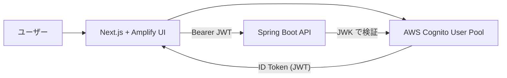
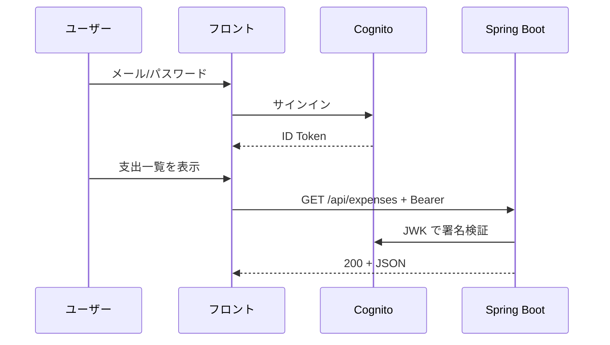

# 06. 認証 — Cognito と JWT

> この章で学ぶこと: **フロントにおける認証の役割**、**AWS Cognito / Amplify**、**Authenticator**、**JWT の取得と API への付与**、**バックエンドとの対応**、**セキュリティ上の注意**。

## 目次

1. [フロントの認証でやること・やらないこと](#フロントの認証でやることやらないこと)
2. [Cognito と Amplify の関係](#cognito-と-amplify-の関係)
3. [ログイン UI（Authenticator）](#ログイン-uiauthenticator)
4. [JWT を API に載せる](#jwt-を-api-に載せる)
5. [バックエンドとの対応](#バックエンドとの対応)
6. [環境変数と設定ファイル](#環境変数と設定ファイル)
7. [ログアウトとユーザー表示](#ログアウトとユーザー表示)
8. [セキュリティ上の注意](#セキュリティ上の注意)
9. [プロジェクトでの実装](#プロジェクトでの実装)

---

## フロントの認証でやること・やらないこと

| やること | やらないこと |
|----------|--------------|
| ログイン・サインアップ UI | JWT の署名検証（改ざんチェック） |
| トークンの取得・保持（Amplify が担当） | パスワードのサーバー保存 |
| API リクエストに `Authorization` を付与 | 最終的な認可・所有権チェック |

**正しい検証はバックエンド**（`JwtAuthFilter` + Cognito JWK）で行います（[バックエンド第 4 章](../backend/04-security.md)）。

フロントは「ログイン済みユーザーとしてトークンを送る」責務です。

---

## Cognito と Amplify の関係



| 用語 | 説明 |
|------|------|
| **User Pool** | ユーザーアカウントを管理する Cognito のコンテナ |
| **App Client** | フロントアプリ用のクライアント ID（公開可） |
| **ID Token** | ログイン後に発行される JWT（ユーザー識別に使用） |
| **Amplify** | ブラウザから Cognito を呼ぶ SDK + UI |

---

## ログイン UI（Authenticator）

[`auth-provider.tsx`](../../frontend-nextjs/src/contexts/auth-provider.tsx):

```tsx
"use client"

import { Amplify } from "aws-amplify"
import { Authenticator, translations } from "@aws-amplify/ui-react"
import "@aws-amplify/ui-react/styles.css"
import awsConfig from "@/config/aws-exports"

Amplify.configure(awsConfig)

export function AuthProvider({ children }: AuthProviderProps) {
  return <Authenticator>{children}</Authenticator>
}
```

- 未ログイン: ログイン / サインアップ画面が表示される
- ログイン後: `children`（アプリ本体）が表示される

[`app/layout.tsx`](../../frontend-nextjs/app/layout.tsx) で全体を包んでいるため、**すべてのページが認証の内側**にあります。

日本語ラベルは `I18n.putVocabularies` で上書きしています。

---

## JWT を API に載せる

[`authUtils.ts`](../../frontend-nextjs/src/api/authUtils.ts):

```typescript
import { fetchAuthSession } from 'aws-amplify/auth';

async function getJwtToken(): Promise<string> {
    const session = await fetchAuthSession();
    const token = session.tokens?.idToken?.toString();
    if (!token) {
        throw new Error('認証トークンの取得に失敗しました');
    }
    return token;
}
```

各 API 関数は `withAuthHeader()` を await してから生成クライアントを呼びます。

```typescript
const options = await withAuthHeader();
await api.apiExpensesGet(month, page, size, options);
```

### 401 が返ったとき

[`api-error-handler.ts`](../../frontend-nextjs/src/lib/api-error-handler.ts) が「再ログインしてください」とトースト表示します。原因の切り分け:

| 原因 | 確認方法 |
|------|----------|
| トークン期限切れ | 再ログインで直るか |
| `COGNITO_*` 設定不一致 | フロント `.env.local` とバックエンド `.env` |
| CORS | Network タブでプリフライト失敗していないか |

---

## バックエンドとの対応

| 設定 | フロント | バックエンド |
|------|----------|--------------|
| User Pool / Client | `NEXT_PUBLIC_COGNITO_*` | `COGNITO_CLIENT_ID` |
| Issuer / JWK | （Amplify が自動） | `COGNITO_ISSUER_URL`, `COGNITO_JWK_SET_URL` |
| CORS | ブラウザが送信 | `CORS_ALLOWED_ORIGINS` |

フロントとバックエンドで **同じ User Pool / Client** を指している必要があります。

認証フロー全体:



---

## 環境変数と設定ファイル

[`aws-exports.ts`](../../frontend-nextjs/src/config/aws-exports.ts) が Amplify 用の設定オブジェクトです。

```typescript
const awsConfig = {
    aws_project_region: process.env.NEXT_PUBLIC_AWS_REGION || "ap-northeast-1",
    aws_user_pools_id: process.env.NEXT_PUBLIC_COGNITO_USER_POOL_ID || "your-user-pool-id",
    aws_user_pools_web_client_id: process.env.NEXT_PUBLIC_COGNITO_CLIENT_ID || "your-client-id",
    aws_cognito_username_attributes: ["EMAIL"],
    // ...
};
```

`frontend-nextjs/.env.local` の例はルート [README](../../README.md) を参照。

---

## ログアウトとユーザー表示

[`app/expenses/page.tsx`](../../frontend-nextjs/app/expenses/page.tsx):

```tsx
const { user, signOut } = useAuthenticator((context) => [context.user])
const username = useMemo(() => getUserDisplayName(user), [user])
```

- `useAuthenticator`: ログイン状態とユーザー属性へアクセス
- `signOut`: ログアウト処理を `AppLayout` / `user-menu` から呼ぶ

[`user-utils.ts`](../../frontend-nextjs/src/lib/user-utils.ts) で表示名を整形しています。

---

## セキュリティ上の注意

1. **秘密鍵・API キーをフロントに置かない** — `NEXT_PUBLIC_` はビルドに埋め込まれ誰でも見られる
2. **XSS** — React はデフォルトで文字列をエスケープするが、`dangerouslySetInnerHTML` は使わない
3. **トークンの保存** — Amplify がブラウザストレージでトークンを管理する（自前で `localStorage` に JWT を書かない）。XSS 対策（入力のエスケープ、`dangerouslySetInnerHTML` を使わない等）が重要
4. **HTTPS** — 本番は必ず TLS（Cookie / トークン盗聴防止）
5. **認可** — 「ログイン済み」だけでは不十分。他人の `expenseId` へのアクセスはバックエンドで拒否する

Cognito Client ID は公開情報ですが、**User Pool のパスワードポリシー・MFA・レート制限**で守ります。

---

## プロジェクトでの実装

### 設定の流れ

1. AWS で User Pool と App Client を作成
2. ルート `.env` に `COGNITO_*` を設定（バックエンド）
3. `frontend-nextjs/.env.local` に `NEXT_PUBLIC_COGNITO_*` を設定
4. `stack.sh up` または `npm run dev` で起動
5. ブラウザでサインアップ → 確認メール → ログイン
6. DevTools → Network で API に `Authorization` が付いているか確認

### バックエンド学習との接続

- セッション認証 vs JWT: [バックエンド 04 章](../backend/04-security.md)
- CORS: 同章 + [フロント 01 章](./01-web-and-typescript.md)
- OpenAPI のセキュリティ定義: [バックエンド 02 章](../backend/02-web.md)

---

## この章のまとめ

- ログイン UI は **Amplify Authenticator**
- API には **ID Token を Bearer で付与**
- **検証は Spring Security + Cognito JWK**
- 環境変数はフロント・バックエンドで **同じ Pool / Client** を指す

---

## フロントエンド学習の次のステップ

ここまで読めば、このリポジトリのフロントを**読む・小さく直す・API と一緒にデバッグする**ことができます。さらに伸ばすなら:

| トピック | 内容 |
|----------|------|
| テスト | React Testing Library、MSW で API をモック |
| 状態管理 | TanStack Query でキャッシュと再取得 |
| フォーム | react-hook-form + zod（package に既に依存あり） |
| E2E | Playwright でログイン〜一覧表示 |
| アクセシビリティ | Radix のキーボード操作を活かした UI レビュー |

バックエンドと合わせて学ぶ場合は、[docs/backend/README.md](../backend/README.md) のロードマップと並行して進めると、認証・OpenAPI・Docker の理解が一本の線でつながります。
