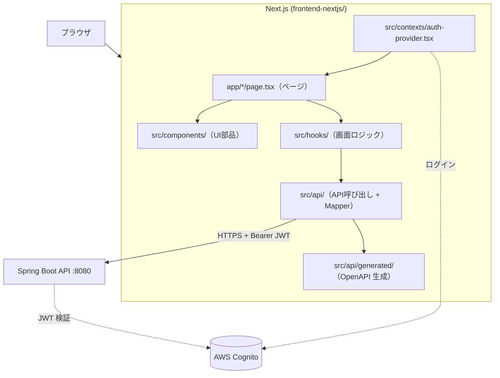

# フロントエンド学習ドキュメント

> このフォルダは、Smart Household Account Book のフロントエンドに使われている技術を**学習用**にまとめたドキュメント群です。

## このドキュメントのねらい

- 読者像: **バックエンド（Spring Boot）の経験はあるが、フロントエンドの経験は浅い**人
- ゴール: **このプロジェクトの画面と API 連携を読み書きできる**こと。さらに、React / Next.js の一般的な考え方を中級レベルまで身につける
- プロジェクトの解説だけでなく、「なぜその仕組みが必要なのか」「バックエンドとどう対応するか」も併記しています

バックエンドの学習は [docs/backend/README.md](../backend/README.md)、インフラは [docs/infrastructure/README.md](../infrastructure/README.md) を参照してください。

---

## 学習ロードマップ

番号順に読むことを推奨します。1 と 2 を読むと React の考え方が掴め、4 まで読むとバックエンド API との連携が一通り追えるようになります。

| 章 | タイトル | ひとことで | 主な登場技術 |
|----|----------|-----------|--------------|
| [01](./01-web-and-typescript.md) | Web と TypeScript | ブラウザと HTTP の前提、TS の読み方 | HTTP, CORS, JSON, TypeScript, npm |
| [02](./02-react.md) | React | 画面を部品として組み立てる | コンポーネント, props, state, hooks |
| [03](./03-nextjs.md) | Next.js | ルーティングとアプリの骨格 | App Router, layout, `"use client"` |
| [04](./04-api-integration.md) | API 連携 | バックエンドを呼び出すまで | OpenAPI Generator, Axios, カスタムフック |
| [05](./05-ui-and-styling.md) | UI とスタイル | 見た目と部品ライブラリ | Tailwind CSS, shadcn-ui, Radix UI |
| [06](./06-auth.md) | 認証 | ログインと JWT の付与 | AWS Amplify, Cognito |

---

## フロントエンドの全体像

ユーザーがブラウザで操作してから、Spring Boot API が JSON を返すまでの流れです（バックエンド側の詳細は [第 4 章（セキュリティ）](../backend/04-security.md) を参照）。



各ボックスがどの章で扱われるかは上の表を参照してください。

---

## アーキテクチャの置き場所（ディレクトリ構成）

```
frontend-nextjs/
├── app/                          ... ページとルーティング（第 3 章）
│   ├── layout.tsx                ... 全ページ共通レイアウト
│   ├── page.tsx                  ... / → /expenses へリダイレクト
│   ├── globals.css               ... 全体スタイル
│   └── expenses/
│       └── page.tsx              ... 支出一覧（メイン画面）
├── src/
│   ├── api/                      ... API 層（第 4 章）
│   │   ├── generated/            ... OpenAPI から自動生成（手編集しない）
│   │   ├── apiClient.ts
│   │   ├── authUtils.ts
│   │   ├── expenseApi.ts
│   │   └── expenseMappers.ts
│   ├── components/               ... UI コンポーネント（第 2・5 章）
│   │   ├── layout/
│   │   └── ui/                   ... shadcn-ui ベースの部品
│   ├── contexts/                 ... 認証プロバイダ（第 6 章）
│   ├── hooks/                    ... カスタムフック（第 2・4 章）
│   ├── lib/                      ... 型・ユーティリティ
│   └── config/
│       └── aws-exports.ts        ... Cognito 設定
├── package.json
└── .env.local                    ... 環境変数（Git 管理外）
```

**バックエンドとの対応イメージ**

| フロント | バックエンド（このプロジェクト） |
|----------|----------------------------------|
| `app/expenses/page.tsx` | `@RestController` の入口に近い |
| `src/hooks/use-expenses.ts` | `@Service` のオーケストレーションに近い |
| `src/api/expenseApi.ts` | HTTP クライアント + DTO 変換 |
| `src/lib/types.ts` | 画面用のドメイン型（API DTO とは別） |
| `openapi/openapi.yaml` | 両端の契約（共有） |

---

## 技術スタック（このプロジェクト）

| カテゴリ | 採用技術 | バージョン（目安） |
|----------|----------|-------------------|
| フレームワーク | Next.js（App Router） | 15.5 |
| UI ライブラリ | React | 19 |
| 言語 | TypeScript | 5 |
| スタイル | Tailwind CSS | 4 |
| UI 部品 | shadcn-ui（Radix UI ベース） | — |
| HTTP クライアント | Axios（OpenAPI 生成） | — |
| 認証 | AWS Amplify + Cognito | — |
| トースト通知 | Sonner | — |
| グラフ | Recharts | — |

---

## 学習の進め方のコツ

1. **まず動かす**: `cd frontend-nextjs && npm install && npm run dev` で `http://localhost:3000` を開く（バックエンドも起動しておくと API まで試せる）
2. **章を読む**: 各章の冒頭の「この章で学ぶこと」→「図解」→「本文」の順に読む
3. **実コードを開く**: 章末の「プロジェクトでの実装」で紹介されたファイルを IDE で開く
4. **Network タブを見る**: ブラウザの開発者ツールで `/api/expenses` のリクエスト・レスポンス・`Authorization` ヘッダを確認する
5. **小さく触る**: ラベル文言の変更、トーストメッセージの変更など、画面にすぐ反映される修正から始める

---

## よく使うコマンド

```bash
cd frontend-nextjs
npm install          # 依存関係のインストール
npm run dev          # 開発サーバー（ポート 3000）
npm run build        # 本番ビルド
npm run lint         # ESLint
npm run generate:api # OpenAPI から TypeScript クライアント生成
```

`openapi/openapi.yaml` を変更したら、バックエンドの生成に加え **`npm run generate:api`** を実行してください。

---

## 参考リンク

| リソース | 用途 |
|----------|------|
| [React Learn](https://react.dev/learn) | React の公式チュートリアル |
| [Next.js Docs (App Router)](https://nextjs.org/docs/app) | Next.js の公式ドキュメント |
| [TypeScript Handbook](https://www.typescriptlang.org/docs/handbook/intro.html) | TypeScript の型の考え方 |
| [Tailwind CSS Docs](https://tailwindcss.com/docs) | ユーティリティクラスの一覧 |
| [AWS Amplify Auth (Gen 2)](https://docs.amplify.aws/react/build-a-backend/auth/) | Cognito 連携の公式ガイド |
