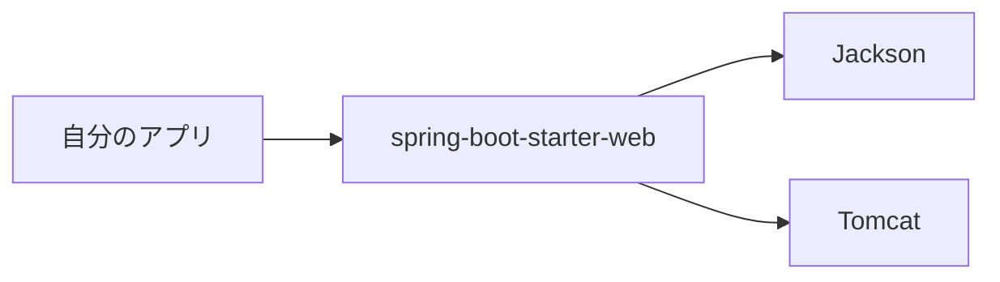
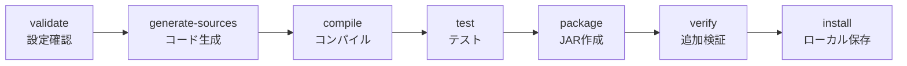

# 01. Maven：Java プロジェクトのビルド道具

> この章で学ぶこと: **Maven とは何か**、**`pom.xml` の読み方**、**依存関係の管理**、**ビルドライフサイクル**、**Maven Wrapper**、**このプロジェクトでの OpenAPI 生成と JAR 作成**。

## 目次

1. [Maven とは](#maven-とは)
2. [Maven が解決してくれること](#maven-が解決してくれること)
3. [`pom.xml` の基本](#pomxml-の基本)
4. [依存関係と Starter](#依存関係と-starter)
5. [ビルドライフサイクル](#ビルドライフサイクル)
6. [プラグインとゴール](#プラグインとゴール)
7. [Maven Wrapper](#maven-wrapper)
8. [このプロジェクトでの Maven](#このプロジェクトでの-maven)
9. [よく使うコマンド](#よく使うコマンド)
10. [セキュリティとパフォーマンスの注意点](#セキュリティとパフォーマンスの注意点)

---

## Maven とは

Maven は、Java プロジェクトで使う**ビルドツール**です。

ビルドツールとは、次のような作業を自動で行う道具です。

| 作業 | 何をするか |
|------|-----------|
| 依存関係の取得 | Spring Boot や MySQL ドライバなどのライブラリをダウンロードする |
| コンパイル | `.java` ファイルを JVM が読める `.class` に変換する |
| テスト実行 | JUnit などのテストを実行する |
| パッケージ化 | 実行できる JAR ファイルを作る |
| コード生成 | OpenAPI 仕様から Java のインターフェースやモデルを生成する |

手作業でこれらを行うと、必要なライブラリのバージョンをそろえたり、実行順序を覚えたりする必要があります。Maven はその手順を `pom.xml` にまとめ、コマンド1つで再現できるようにします。

---

## Maven が解決してくれること

### 依存関係の管理

Java アプリは、自分で書いたコードだけでは動きません。Spring Boot、Hibernate、Jackson、MySQL ドライバなど、多くのライブラリを使います。

Maven では、使いたいライブラリを `pom.xml` に書きます。

```xml
<dependency>
    <groupId>org.springframework.boot</groupId>
    <artifactId>spring-boot-starter-web</artifactId>
</dependency>
```

この設定を書くと、Maven は Maven Central などのリポジトリから必要なファイルを取得します。

### 推移的依存関係

ライブラリ A がライブラリ B を必要としている場合、自分で B を書かなくても Maven が一緒に取得します。これを**推移的依存関係**と呼びます。



初心者のうちは「`pom.xml` に書いたライブラリ以外もたくさん入っている」ことに驚きますが、これは Maven が必要な部品をまとめて取得しているためです。

---

## `pom.xml` の基本

`pom.xml` は Maven の設定ファイルです。POM は **Project Object Model** の略で、「このプロジェクトは何者で、どうビルドするか」を書くファイルです。

本プロジェクトでは `backend/pom.xml` がバックエンドの Maven 設定です。

### プロジェクトの識別情報

```xml
<groupId>com.example</groupId>
<artifactId>backend</artifactId>
<version>0.0.1-SNAPSHOT</version>
```

| 項目 | 意味 |
|------|------|
| `groupId` | 組織やドメインのようなまとまり |
| `artifactId` | 成果物の名前。このプロジェクトでは `backend` |
| `version` | 成果物のバージョン。`SNAPSHOT` は開発中という意味 |

ビルドすると、最終的に `backend-0.0.1-SNAPSHOT.jar` のような名前の JAR が作られます。

### Spring Boot の親 POM

```xml
<parent>
    <groupId>org.springframework.boot</groupId>
    <artifactId>spring-boot-starter-parent</artifactId>
    <version>3.5.13</version>
    <relativePath />
</parent>
```

この親 POM により、Spring Boot が推奨するライブラリのバージョンや Maven プラグイン設定をまとめて使えます。

大事なポイントは、Spring Boot Starter の依存関係にバージョンを書かなくてよいことです。

```xml
<dependency>
    <groupId>org.springframework.boot</groupId>
    <artifactId>spring-boot-starter-web</artifactId>
</dependency>
```

`<version>` がありません。これは書き忘れではなく、Spring Boot の BOM が「この Spring Boot バージョンではこのライブラリバージョンを使う」と管理してくれているためです。

### Java バージョン

```xml
<properties>
    <java.version>21</java.version>
</properties>
```

このプロジェクトは Java 21 を前提にしています。ローカルで開発する場合も、Docker 内でビルドする場合も、Java 21 にそろえるのが安全です。

---

## 依存関係と Starter

Spring Boot の Starter は、よく使うライブラリのセットです。

たとえば `spring-boot-starter-web` には、Web API を作るために必要な Spring MVC、組み込み Tomcat、JSON 変換用の Jackson などが含まれます。

| 依存関係 | このプロジェクトでの役割 |
|----------|--------------------------|
| `spring-boot-starter-web` | REST API を作る |
| `spring-boot-starter-data-jpa` | JPA / Hibernate で DB にアクセスする |
| `spring-boot-starter-security` | 認証・認可の土台 |
| `spring-boot-starter-oauth2-resource-server` | JWT を検証する |
| `spring-boot-starter-validation` | リクエスト値を検証する |
| `spring-boot-starter-actuator` | ヘルスチェックや監視用エンドポイントを提供する |
| `spring-boot-starter-test` | JUnit / Mockito / AssertJ などのテスト基盤 |

### scope とは

`scope` は「その依存関係をいつ使うか」を表します。

```xml
<dependency>
    <groupId>com.h2database</groupId>
    <artifactId>h2</artifactId>
    <scope>test</scope>
</dependency>
```

`test` はテスト時だけ使うという意味です。本番の JAR には不要なため、実行環境を軽くできます。

```xml
<dependency>
    <groupId>com.mysql</groupId>
    <artifactId>mysql-connector-j</artifactId>
    <scope>runtime</scope>
</dependency>
```

`runtime` は実行時に必要という意味です。MySQL ドライバはコンパイル時よりも、アプリが DB に接続するときに必要になります。

---

## ビルドライフサイクル

Maven には「どの順番で作業するか」が決まっています。これを**ライフサイクル**と呼びます。

代表的な流れは次の通りです。



Maven では、後ろのフェーズを実行すると前のフェーズも順番に実行されます。

たとえば次のコマンドを実行すると、`compile` や `test` も含めて `package` まで進みます。

```bash
./mvnw package
```

この仕組みにより、「JAR を作る前にコンパイルとテストを忘れた」というミスを防げます。

---

## プラグインとゴール

Maven の**プラグイン**は、ビルド中に実行する追加機能のまとまりです。たとえば、Spring Boot の JAR を作る、OpenAPI からコードを生成する、テストカバレッジを測る、といった処理はプラグインが担当します。

**ゴール**は、プラグインが持つ具体的な処理1つです。たとえば `openapi-generator-maven-plugin` の `generate` ゴールは、OpenAPI 仕様から Java コードを生成します。

```xml
<phase>generate-sources</phase>
<goals>
    <goal>generate</goal>
</goals>
```

**フェーズ**は、そのゴールをビルドライフサイクルのどこで実行するかを指定します。この例では、`generate-sources` フェーズに来たら `generate` ゴールを実行します。

つまり、プラグインは「道具箱」、ゴールは「その道具箱の中にある具体的な道具」、フェーズは「その道具を使うタイミング」と考えると分かりやすいです。

---

## Maven Wrapper

Maven Wrapper は、プロジェクトに同梱された Maven 起動スクリプトです。

本プロジェクトでは次のファイルが使われます。

```text
backend/
├── mvnw
├── mvnw.cmd
└── .mvn/wrapper/maven-wrapper.properties
```

`backend/.mvn/wrapper/maven-wrapper.properties` では Maven `3.9.9` を使う設定になっています。

```properties
distributionUrl=https://repo.maven.apache.org/maven2/org/apache/maven/apache-maven/3.9.9/apache-maven-3.9.9-bin.zip
```

ローカルに Maven を直接インストールしていなくても、`./mvnw` を使うと指定された Maven が自動で使われます。

### なぜ `mvn` より `./mvnw` を推奨するのか

チーム開発では、開発者ごとに Maven のバージョンが違うとビルド結果が変わることがあります。`./mvnw` を使うと、全員が同じ Maven バージョンで実行できます。

```bash
cd backend
./mvnw test
```

---

## このプロジェクトでの Maven

### OpenAPI からコードを生成する

本プロジェクトでは、OpenAPI 仕様ファイルから Java の API インターフェースとモデルクラスを生成します。

設定は `backend/pom.xml` の `openapi-generator-maven-plugin` にあります。

```xml
<plugin>
    <groupId>org.openapitools</groupId>
    <artifactId>openapi-generator-maven-plugin</artifactId>
    <version>7.13.0</version>
    <executions>
        <execution>
            <phase>generate-sources</phase>
            <goals>
                <goal>generate</goal>
            </goals>
        </execution>
    </executions>
</plugin>
```

`generate-sources` フェーズで生成されるため、`./mvnw package` のような通常のビルドでも自動生成が先に実行されます。

### 生成コードをコンパイル対象に追加する

OpenAPI Generator が作ったコードは `target/generated-sources/openapi` に出力されます。

このままだと Maven がコンパイル対象として見つけられないため、`build-helper-maven-plugin` でソースディレクトリに追加しています。

```xml
<source>${project.build.directory}/generated-sources/openapi/src/main/java</source>
```

### プロファイルで OpenAPI ファイルの場所を切り替える

ローカル実行と Docker ビルドでは、OpenAPI ファイルの見え方が違います。

| プロファイル | `openapi.file` | 使う場面 |
|--------------|----------------|----------|
| `local` | `../openapi/openapi.yaml` | `backend` フォルダで Maven を実行する |
| `docker` | `openapi/openapi.yaml` | Docker のビルドコンテキスト内で実行する |

ローカルでは次のように実行します。

```bash
cd backend
./mvnw generate-sources -Plocal
```

Dockerfile では次のように `docker` プロファイルを使っています。

```bash
./mvnw -B clean package -T 1C -DskipTests -Pdocker
```

### Spring Boot Maven Plugin

`spring-boot-maven-plugin` は、Spring Boot アプリを実行可能 JAR にするためのプラグインです。

```xml
<plugin>
    <groupId>org.springframework.boot</groupId>
    <artifactId>spring-boot-maven-plugin</artifactId>
    <configuration>
        <mainClass>com.example.backend.BackendApplication</mainClass>
    </configuration>
</plugin>
```

`./mvnw spring-boot:run -Plocal` は、このプラグインの `run` ゴールを直接実行するコマンドです。`spring-boot:run` は「`spring-boot` プラグインの `run` ゴール」という意味で、JAR を作ってから起動するのではなく、Maven 経由で Spring Boot アプリを起動します。

通常の JAR は依存ライブラリを含みませんが、Spring Boot の実行可能 JAR はアプリ本体、依存ライブラリ、組み込み Tomcat をまとめて含みます。

そのため、次のコマンドで起動できます。

```bash
java -jar target/backend-0.0.1-SNAPSHOT.jar
```

### JaCoCo

JaCoCo はテストカバレッジを測定するツールです。

本プロジェクトでは `jacoco-maven-plugin` が設定されており、テスト実行時にカバレッジレポートを作れます。

```bash
cd backend
./mvnw test
```

---

## よく使うコマンド

コマンドは基本的に `backend` フォルダで実行します。

| コマンド | 目的 |
|----------|------|
| `./mvnw generate-sources -Plocal` | OpenAPI から Java コードを生成する |
| `./mvnw compile -Plocal` | コンパイルできるか確認する |
| `./mvnw test -Plocal` | テストを実行する |
| `./mvnw package -Plocal` | JAR を作る |
| `./mvnw package -DskipTests -Plocal` | テストをスキップして JAR を作る |
| `./mvnw spring-boot:run -Plocal` | Spring Boot アプリをローカル起動する |
| `./mvnw dependency:tree` | 依存関係のツリーを見る |

### コマンド例

```bash
cd backend
./mvnw clean package -Plocal
```

`clean` は `target` フォルダを削除して、古い生成物を消してからビルドするためのフェーズです。

```bash
cd backend
./mvnw dependency:tree
```

依存関係の衝突や、どのライブラリがどこから入っているかを調べたいときに使います。

---

## セキュリティとパフォーマンスの注意点

### セキュリティ

- 依存ライブラリには脆弱性が見つかることがあります。Spring Boot のバージョンを定期的に上げると、管理対象ライブラリも安全な組み合わせへ更新しやすくなります。
- 依存関係にバージョンを直接書く場合は、本当に必要か確認します。Spring Boot の BOM 管理から外れると、互換性のない組み合わせを選びやすくなります。
- `dependency:tree` で不要なライブラリが入っていないか確認できます。使っていないライブラリは攻撃対象を増やすため、なるべく減らします。
- `.env` や API キーを `pom.xml` に直接書いてはいけません。秘密情報は環境変数やシークレット管理の仕組みで渡します。

### パフォーマンス

- Dockerfile では先に `pom.xml` だけをコピーして `dependency:go-offline` を実行しています。これにより依存関係のダウンロード結果を Docker のレイヤーキャッシュに乗せ、再ビルドを速くしています。
- Docker ビルドでは `-T 1C` で CPU コア数に応じた並列ビルドを有効にしています。
- `-DskipTests` はビルドを速くしますが、テストを実行しないため安全確認を省略します。ローカルの一時確認や Docker イメージ作成では便利ですが、CI やリリース前はテストを実行するのが基本です。
- `target` フォルダは生成物です。問題調査時以外は Git に含めません。

---

## まず覚えるポイント

- Maven は Java プロジェクトの**依存取得・コンパイル・テスト・JAR作成**を担当する道具です。
- `pom.xml` は Maven の設計図です。
- `./mvnw` を使うと、チーム全員が同じ Maven バージョンでビルドできます。
- このプロジェクトでは Maven が OpenAPI コード生成、Spring Boot JAR 作成、テストカバレッジ測定まで担当しています。
