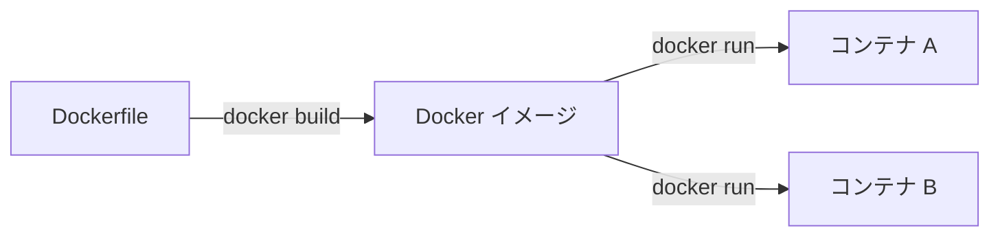
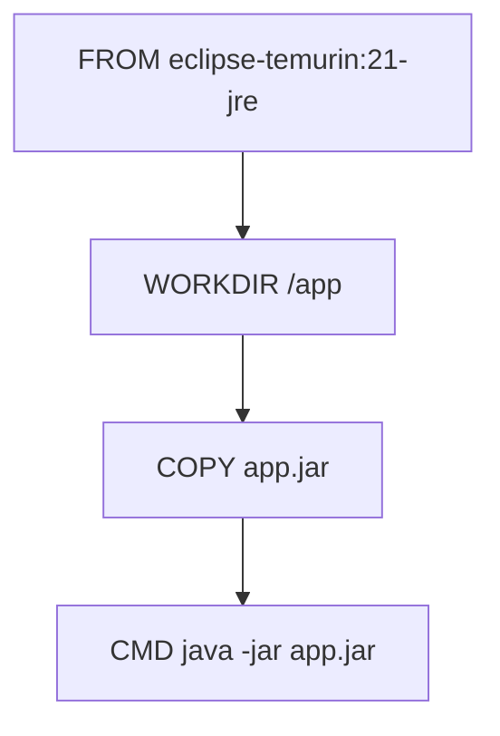
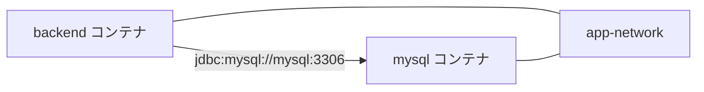

# 02. Docker：アプリを同じ環境で動かすための箱

> この章で学ぶこと: **Docker とは何か**、**イメージとコンテナ**、**Dockerfile**、**Docker Compose**、**ネットワークとボリューム**、**このプロジェクトでの MySQL と Spring Boot の動かし方**。

## 目次

1. [Docker とは](#docker-とは)
2. [イメージとコンテナ](#イメージとコンテナ)
3. [Dockerfile の基本](#dockerfile-の基本)
4. [Docker Compose の基本](#docker-compose-の基本)
5. [ネットワークとボリューム](#ネットワークとボリューム)
6. [このプロジェクトでの Docker](#このプロジェクトでの-docker)
7. [よく使うコマンド](#よく使うコマンド)
8. [セキュリティとパフォーマンスの注意点](#セキュリティとパフォーマンスの注意点)

---

## Docker とは

Docker は、アプリケーションを**コンテナ**という独立した実行環境で動かすための技術です。

コンテナには、アプリを動かすために必要なものをまとめられます。

| 含められるもの | 例 |
|----------------|----|
| 実行環境 | Java 21 の JRE |
| アプリ本体 | Spring Boot の JAR |
| OS レベルの部品 | Linux の最小限のファイル |
| 起動コマンド | `java -jar app.jar` |

Docker を使うと、開発者のPC、CI、本番サーバーで「同じように動く環境」を作りやすくなります。

### なぜ Docker が必要か

ローカルPCに直接 Java、MySQL、設定ファイルを入れていくと、環境差分が起きやすくなります。

```text
自分のPCでは動く
でも他の人のPCでは動かない
本番サーバーではさらに違うエラーが出る
```

Docker はこの問題を減らすために、アプリの実行環境をコードとして定義します。

---

## イメージとコンテナ

Docker で最初に覚える言葉は、**イメージ**と**コンテナ**です。

| 用語 | たとえ | 意味 |
|------|--------|------|
| イメージ | クラス、設計図、弁当のレシピ | コンテナを作る元になる読み取り専用のひな形 |
| コンテナ | インスタンス、実物の弁当 | イメージから起動した実行中または停止中の環境 |



同じイメージから複数のコンテナを起動できます。これは Java のクラスから複数のインスタンスを作れることに似ています。

---

## Dockerfile の基本

Dockerfile は、Docker イメージを作るための手順書です。

よく使う命令は次の通りです。

| 命令 | 役割 |
|------|------|
| `FROM` | 元にするイメージを指定する |
| `WORKDIR` | 以降の命令を実行する作業ディレクトリを指定する |
| `COPY` | ホスト側のファイルをイメージ内へコピーする |
| `RUN` | イメージ作成中にコマンドを実行する |
| `EXPOSE` | コンテナが使うポートを説明する |
| `CMD` | コンテナ起動時のコマンドを指定する |

たとえば `WORKDIR /app` と書くと、コンテナ内の `/app` を作業場所にします。
その後の `COPY` や `RUN` は、基本的に `/app` を基準に実行されます。

### レイヤー

Dockerfile の各命令は、基本的に**レイヤー**として積み重なります。



前のレイヤーと、その命令自体が変わっていなければ Docker はその命令に対して、キャッシュを使えます。
ただし `COPY` のようにファイルを扱う命令では、コピー元ファイルの中身が変わるとキャッシュは使われません。
これにより、変更がない部分は再利用されるため、2回目以降のビルドが速くなります。

---

## Docker Compose の基本

Docker Compose は、複数のコンテナをまとめて起動するための道具です。

たとえばこのプロジェクトでは、バックエンドだけではなく MySQL も必要です。手動でそれぞれ `docker run` する代わりに、Compose ファイルへまとめます。

```yaml
services:
  mysql:
    image: mysql:8.0

  backend:
    build:
      context: ./
      dockerfile: backend/Dockerfile
```

`services` の下に、起動したいコンテナを名前付きで定義します。

| Compose の項目 | 意味 |
|----------------|------|
| `services` | 起動するコンテナ群 |
| `image` | 既存の Docker イメージを使う |
| `build` | Dockerfile からイメージを作る |
| `ports` | ホストとコンテナのポートをつなぐ |
| `environment` | 環境変数を渡す |
| `volumes` | データや設定ファイルをマウントする |
| `depends_on` | 起動順やヘルスチェック条件を指定する |
| `networks` | コンテナ同士が通信するネットワークを指定する |

---

## ネットワークとボリューム

### ネットワーク

コンテナ同士は、同じ Docker ネットワークに入るとサービス名で通信できます。

このプロジェクトでは、バックエンドが MySQL に接続するときに `mysql` というホスト名を使います。

```env
SPRING_DATASOURCE_URL_PROD=jdbc:mysql://mysql:3306/household_book?...
```

Compose では `SPRING_DATASOURCE_URL: ${SPRING_DATASOURCE_URL_PROD}` として渡します。ここでの `mysql` は Compose のサービス名（詳細は [03. MySQL](./03-mysql.md)）。



### ボリューム

コンテナの中に保存したデータは、コンテナを削除すると消えることがあります。

MySQL のデータを残すため、このプロジェクトでは Docker ボリュームを使っています。

```yaml
volumes:
  - mysql_data_single:/var/lib/mysql
```

`mysql_data_single` はボリュームの名前で、Docker がホスト上に確保するデータ領域に付けるラベル

`/var/lib/mysql` は MySQL がデータを保存する場所です。ここをボリュームにすることで、コンテナを作り直しても DB データを残せます。

---

## このプロジェクトでの Docker

### ファイル構成

Docker に関係する主なファイルは次の通りです。

```text
.
├── backend/Dockerfile
├── docker/compose/docker-compose.dev.yaml
├── docker/compose/docker-compose.single-host.yaml
├── docker/compose/docker-compose.single-host.local.yaml
├── docker/compose/docker-compose.single-host.prod.yaml
├── docker/scripts/stack.sh            # Compose + Next.js の up / down（モードは引数で指定）
└── docker/mysql/my.cnf
```

それぞれ役割が違います。

| ファイル | 役割 |
|----------|------|
| `backend/Dockerfile` | Spring Boot バックエンドの Docker イメージを作る |
| `docker/compose/docker-compose.dev.yaml` | MySQL だけを起動し、Spring Boot はローカルで動かす |
| `docker/compose/docker-compose.single-host.yaml` | MySQL と Spring Boot を同一ホストでまとめて起動する基本設定 |
| `docker/compose/docker-compose.single-host.local.yaml` | ローカル開発向けの上書き設定 |
| `docker/compose/docker-compose.single-host.prod.yaml` | 本番寄せの上書き設定 |
| `docker/scripts/stack.sh` | Compose と Next.js を `up` / `down` とモード引数でまとめて操作する |

### `docker/scripts/stack.sh`

手動で `docker compose` と `npm run dev` を打ち分けなくてよいように、**第 1 引数に `up` または `down`、第 2 引数にモード**を渡します。

- `dev` … `docker-compose.dev.yaml`（MySQL のみ）。`up` のときだけ続けて Next.js の開発サーバーを起動します。
- `single-host-local` / `single-host-prod` … 単一ホスト用の 2 ファイルをマージして起動・停止します。
- `down` … 先に **ポート 3000** で待ち受けているプロセスを終了させ（`npm run dev` / `next dev -p 3000` 用）、続けて `docker compose down` します。別アプリが 3000 を使っている場合は注意してください。

```bash
./docker/scripts/stack.sh up dev
./docker/scripts/stack.sh down dev
./docker/scripts/stack.sh up single-host-local
./docker/scripts/stack.sh down single-host-prod
```

### バックエンドの Dockerfile

`backend/Dockerfile` は、マルチステージビルドを使っています。


### Build stage

Build stage では、Maven と JDK が入ったイメージを使って JAR を作ります。

```dockerfile
FROM maven:3.9.9-eclipse-temurin-21 AS builder
WORKDIR /app
```

`maven:3.9.9-eclipse-temurin-21` は、Maven と Java 21 の JDK が入った公式イメージです。

このステージでは、まず Maven Wrapper と `pom.xml` をコピーして依存関係を先にダウンロードします。

```dockerfile
COPY backend/mvnw backend/mvnw.cmd ./
COPY backend/.mvn .mvn
RUN chmod +x mvnw

COPY backend/pom.xml .
RUN ./mvnw -B dependency:go-offline
```

この順番には意味があります。

`pom.xml` が変わらない限り、依存関係のダウンロードレイヤーを再利用できます。ソースコードだけを変更した場合、毎回すべてのライブラリをダウンロードし直さずに済むため、ビルドが速くなります。

その後、ソースコードと OpenAPI 仕様をコピーして JAR を作ります。

```dockerfile
COPY backend/src ./src
COPY openapi ./openapi
RUN ./mvnw -B clean package -T 1C -DskipTests -Pdocker
```

`-Pdocker` は Maven の `docker` プロファイルを使う指定です。Docker コンテナ内では OpenAPI ファイルの場所が `openapi/openapi.yaml` になるためです。

### Runtime stage

Runtime stage では、JRE だけが入った軽いイメージに JAR をコピーします。

```dockerfile
FROM eclipse-temurin:25-jre

RUN groupadd --system app && useradd --system --gid app --home-dir /nonexistent --no-create-home app

WORKDIR /app

COPY --from=builder --chown=app:app /app/target/app.jar app.jar

USER app
EXPOSE 8080

CMD ["java", "-jar", "app.jar"]
```

ランタイムでは `app` ユーザーで Java を起動します（root 実行を避けるため）。`COPY --chown=app:app` で JAR の読み取り権限を合わせています。

`backend/pom.xml` の `<finalName>app</finalName>` により、ビルドステージの成果物は常に `/app/target/app.jar` です。ワイルドカードではなくこのパスを明示することで、意図しない JAR を拾うリスクを避けています。

ビルドには JDK と Maven が必要ですが、実行には JRE と JAR があれば十分です。

マルチステージビルドにすることで、最終イメージから Maven やソースコードを外せます。これはイメージサイズ削減とセキュリティ向上につながります。

`docker build -t 名前 .` でビルドしたとき、**`-t` が付く（最終成果物となる）のは Dockerfile 最後の `FROM` から始まるステージ（この例では Runtime）だけ**です。

### `docker/compose/docker-compose.dev.yaml`

`docker/compose/docker-compose.dev.yaml` は、MySQL だけを Docker で起動するための設定です。

Spring Boot はローカルの IDE や `./mvnw spring-boot:run` で動かしたい場合に使います。

```yaml
services:
  mysql:
    image: mysql:8.0
    container_name: mysql-dev
    ports:
      - "127.0.0.1:3306:3306"
```

この設定では、PC の `localhost:3306` から MySQL コンテナへ接続できます（ホストのループバックのみ公開）。

### `docker/compose/docker-compose.single-host.yaml`

`docker/compose/docker-compose.single-host.yaml` は、MySQL とバックエンドを同じ Docker ネットワーク内で起動する基本設定です。

```yaml
services:
  mysql:
    image: mysql:8.0

  backend:
    build:
      context: ./
      dockerfile: backend/Dockerfile
```

バックエンドの DB 接続先は次のように指定されています。

```yaml
SPRING_DATASOURCE_URL: ${SPRING_DATASOURCE_URL_PROD}
SPRING_DATASOURCE_USERNAME: ${MYSQL_APP_USER}
SPRING_FLYWAY_USER: ${MYSQL_FLYWAY_USER}
```

`mysql` はサービス名。DB ユーザー init は [03. MySQL](./03-mysql.md#初回起動時の-db-ユーザー作成docker-entrypoint-initdbd)。

### healthcheck と depends_on

MySQL はコンテナが起動しても、すぐに接続可能とは限りません。

そこで `healthcheck` で MySQL が応答できるか確認します。

```yaml
healthcheck:
  test: ["CMD", "mysqladmin", "ping", "-h", "localhost", "-u", "root", "-p${MYSQL_ROOT_PASSWORD}"]
  interval: 10s
  timeout: 5s
  retries: 10
```

バックエンド側では、MySQL が healthy になってから起動するようにしています。

```yaml
depends_on:
  mysql:
    condition: service_healthy
```

これにより、アプリ起動直後に DB 接続エラーが出る可能性を減らせます。

### local と prod の上書き

Compose は複数ファイルを重ねて使えます。

ローカル向け（リポジトリルートで実行。`--project-directory` で `./backend` などの相対パスをルート基準に解決します）:

```bash
docker compose --project-directory "$(pwd)" --env-file .env \
  -f docker/compose/docker-compose.single-host.yaml \
  -f docker/compose/docker-compose.single-host.local.yaml \
  up -d --build
```

`docker/compose/docker-compose.single-host.local.yaml` では、MySQL を `127.0.0.1:3306` に公開し、SQL ログを見やすくしています。

```yaml
mysql:
  ports:
    - "127.0.0.1:3306:3306"

backend:
  environment:
    SPRING_JPA_SHOW_SQL: "true"
```

本番寄せ:

```bash
docker compose --project-directory "$(pwd)" --env-file .env \
  -f docker/compose/docker-compose.single-host.yaml \
  -f docker/compose/docker-compose.single-host.prod.yaml \
  up -d --build
```

`docker/compose/docker-compose.single-host.prod.yaml` では SQL ログを無効化し、DDL 自動生成は `validate` のままにしています。

```yaml
SPRING_JPA_SHOW_SQL: "false"
SPRING_JPA_HIBERNATE_DDL_AUTO: validate
```

本番では SQL ログに個人情報や機密情報が混ざる可能性があるため、通常は出しません。

---

## よく使うコマンド

この節で出てくる `docker compose` のサブコマンドと主なオプションの意味です。`-f` は「使う Compose ファイルを指定する」ときと「ログを追いかける」ときで別物なので注意してください。

| 要素 | 意味 |
|------|------|
| `docker compose` | Docker Compose V2 の CLI。`compose.yaml` などに書いた複数コンテナをまとめて操作します。 |
| `-f` / `--file`（`compose` の直後） | 使う Compose ファイルのパス。複数回指定すると、後から指定したファイルの内容が前のファイルにマージされます（ローカル用・本番寄せ用の差分を分けるときに使います）。 |
| `--project-directory` | 相対パス（`build.context` やボリュームの `./docker/...` など）を解決するときの基準ディレクトリ。このリポジトリでは **リポジトリルート** を指定してください（Compose ファイルを `docker/compose/` に置いたため）。 |
| `--env-file` | 変数代入用に読み込む環境変数ファイル（例: `.env`）。Compose が `${VAR}` を展開するときや、`env_file` でコンテナに渡す値の元になります。 |
| `up` | ネットワーク・ボリューム・コンテナを作成し、定義どおり起動します。 |
| `-d` / `--detach` | バックグラウンドで起動し、端末はすぐに返ります。付けないとログが前面に出続け、`Ctrl+C` で止めるまでアタッチしたままになります。 |
| `--build` | 起動前にイメージをビルドし直します。Dockerfile やビルド引数を変えたあとに使います。 |
| `logs` | コンテナの標準出力・標準エラーなどのログを表示します。 |
| `-f` / `--follow`（`logs` の直後） | 新しいログ行が出るたびに表示を更新し続けます（`tail -f` に近い）。`compose` の `-f`（ファイル指定）とは別のオプションです。 |
| サービス名（例: `backend`） | Compose ファイル内の `services:` 下の名前。どのコンテナのログを見るかなどを指定します。 |
| `down` | `up` で作ったコンテナと Compose が作ったネットワークを停止・削除します。イメージやボリュームは通常そのまま残ります。 |
| `-v` / `--volumes`（`down` に付与） | Compose が管理する名前付きボリュームも削除します。DB の永続データが消えるため、学習用のリセット以外では慎重に使います。 |

### MySQL だけ起動する

Spring Boot をローカルで動かし、DB だけ Docker にしたい場合です。

```bash
docker compose --project-directory "$(pwd)" --env-file .env -f docker/compose/docker-compose.dev.yaml up -d
```

### MySQL とバックエンドをまとめて起動する

ローカル開発向けです。

```bash
docker compose --project-directory "$(pwd)" --env-file .env \
  -f docker/compose/docker-compose.single-host.yaml \
  -f docker/compose/docker-compose.single-host.local.yaml \
  up -d --build
```

### 本番寄せ設定で起動する

EC2 など単一ホスト上で、Nginx が `127.0.0.1:8080` にリバースプロキシする想定です。

```bash
docker compose --project-directory "$(pwd)" --env-file .env \
  -f docker/compose/docker-compose.single-host.yaml \
  -f docker/compose/docker-compose.single-host.prod.yaml \
  up -d --build
```

### ログを見る

```bash
docker compose --project-directory "$(pwd)" --env-file .env \
  -f docker/compose/docker-compose.single-host.yaml \
  -f docker/compose/docker-compose.single-host.local.yaml \
  logs -f backend
```

### 停止する

```bash
docker compose --project-directory "$(pwd)" --env-file .env \
  -f docker/compose/docker-compose.single-host.yaml \
  -f docker/compose/docker-compose.single-host.local.yaml \
  down
```

### ボリュームも消す

```bash
docker compose --project-directory "$(pwd)" --env-file .env \
  -f docker/compose/docker-compose.single-host.yaml \
  -f docker/compose/docker-compose.single-host.local.yaml \
  down -v
```

`-v` を付けると DB データを保存しているボリュームも削除されます。学習用に作り直したいときは便利ですが、必要なデータが消えるため注意してください。

---

## セキュリティとパフォーマンスの注意点

### セキュリティ

- `.env` には DB パスワード、Cognito、OpenAI API キーなどの秘密情報が入ります。Git にコミットしてはいけません。
- 本番では `8080:8080` のようにバックエンドをインターネットへ直接公開するより、Nginx などで TLS 終端し、アプリは `127.0.0.1:8080` に閉じる方が安全です。
- MySQL のポートも、必要がなければ外部公開しません。ローカル用設定では `127.0.0.1:3306:3306` としており、外部ネットワークから直接つながりにくい形にしています。
- 本番で SQL ログを出すと、個人情報やトークンなどがログに混ざる危険があります。`SPRING_JPA_SHOW_SQL` は本番では `false` が基本です。
- Docker イメージは定期的に更新します。ベースイメージに脆弱性修正が入るためです。

### パフォーマンス

- Dockerfile では `pom.xml` を先にコピーして依存関係をダウンロードしています。これにより Docker のキャッシュが効き、ソースコード変更時の再ビルドが速くなります。
- 最終イメージは `eclipse-temurin:21-jre` を使っています。JDK や Maven を含めないため、イメージサイズと攻撃対象を減らせます。
- `-T 1C` により Maven の並列ビルドを有効化しています。CPU に余裕がある環境ではビルド時間を短縮できます。
- MySQL のデータはボリュームに保存します。コンテナ再作成のたびにデータを初期化しないため、開発効率が上がります。

---

## まず覚えるポイント

- Docker はアプリの実行環境をコンテナとしてまとめる道具です。
- Dockerfile はイメージの作り方、Docker Compose は複数コンテナの起動方法を書きます。
- このプロジェクトでは、`backend/Dockerfile` で Spring Boot JAR を作り、Compose で MySQL とバックエンドをまとめて起動します。
- ローカルでは `docker/compose/docker-compose.dev.yaml` で MySQL だけを起動する方法と、`docker/compose/docker-compose.single-host.*.yaml` でバックエンドごと起動する方法があります。
- 本番寄せでは、アプリを直接外部公開せず、Nginx などの前段を置く想定になっています。
