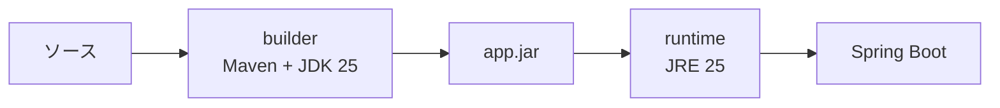

# 02. Docker：アプリを同じ環境で動かすための箱

> この章で学ぶこと: **Docker とは何か**、**イメージとコンテナ**、**Dockerfile**、**Docker Compose**、**ネットワークとボリューム**、**このプロジェクトでの MySQL / Backend / Frontend の動かし方**。

## 目次

1. [Docker とは](#docker-とは)
2. [イメージとコンテナ](#イメージとコンテナ)
3. [Dockerfile の基本](#dockerfile-の基本)
4. [Docker Compose の基本](#docker-compose-の基本)
5. [ネットワークとボリューム](#ネットワークとボリューム)
6. [このプロジェクトでの Docker](#このプロジェクトでの-docker)
7. [よく使うコマンド](#よく使うコマンド)
8. [セキュリティとパフォーマンスの注意点](#セキュリティとパフォーマンスの注意点)

---

## Docker とは

Docker は、アプリケーションを**コンテナ**という独立した実行環境で動かすための技術です。

コンテナには、アプリを動かすために必要なものをまとめられます。

| 含められるもの | 例 |
|----------------|----|
| 実行環境 | Java 25 の JRE / Node.js 20 |
| アプリ本体 | Spring Boot の JAR / Next.js standalone |
| OS レベルの部品 | Linux の最小限のファイル |
| 起動コマンド | `java -jar app.jar` / `node server.js` |

Docker を使うと、開発者のPC、CI、本番サーバーで「同じように動く環境」を作りやすくなります。

### なぜ Docker が必要か

ローカルPCに直接 Java、Node、MySQL、設定ファイルを入れていくと、環境差分が起きやすくなります。

```text
自分のPCでは動く
でも他の人のPCでは動かない
本番サーバーではさらに違うエラーが出る
```

Docker はこの問題を減らすために、アプリの実行環境をコードとして定義します。

---

## イメージとコンテナ

| 用語 | たとえ | 意味 |
|------|--------|------|
| イメージ | クラス、設計図 | コンテナを作る元になる読み取り専用のひな形 |
| コンテナ | インスタンス | イメージから起動した実行中または停止中の環境 |

---

## Dockerfile の基本

よく使う命令:

| 命令 | 役割 |
|------|------|
| `FROM` | 元にするイメージを指定する |
| `WORKDIR` | 作業ディレクトリ |
| `COPY` | ホストからイメージへコピー |
| `RUN` | ビルド時コマンド |
| `EXPOSE` | コンテナが使うポートの説明 |
| `CMD` | 起動時コマンド |

各命令は**レイヤー**として積み重なり、変更がなければキャッシュで再利用されます。

---

## Docker Compose の基本

複数コンテナをまとめて起動する道具です。このプロジェクトでは MySQL・Backend・Frontend を Compose で定義します。

| Compose の項目 | 意味 |
|----------------|------|
| `services` | 起動するコンテナ群 |
| `profiles` | どのサービスを起動するかの切り替え（`db` / `dev` / `prod`） |
| `build` / `image` | イメージの作り方 / 既存イメージ |
| `ports` | ホストとコンテナのポート |
| `environment` | 環境変数 |
| `volumes` | データやソースのマウント |
| `depends_on` | 起動順・ヘルス条件 |
| `networks` | コンテナ間通信 |

---

## ネットワークとボリューム

同一 Compose ネットワーク内では、サービス名（例: `mysql`）で名前解決できます。

```env
SPRING_DATASOURCE_URL_PROD=jdbc:mysql://mysql:3306/household_book?...
```

MySQL データは名前付きボリューム `mysql_data` に永続化します。

---

## このプロジェクトでの Docker

### ファイル構成

```text
.
├── .dockerignore
├── backend/Dockerfile
├── frontend-nextjs/
│   ├── Dockerfile          # 本番 standalone
│   ├── Dockerfile.dev      # 開発 next dev
│   └── next.config.mjs     # output: 'standalone'
├── docker/
│   ├── compose/
│   │   ├── docker-compose.yaml      # 本体（profiles）
│   │   └── docker-compose.aws.yaml  # ECR 用 override
│   ├── scripts/stack.sh             # 起動ショートカット
│   └── mysql/
└── ...
```

| ファイル | 役割 |
|----------|------|
| `docker-compose.yaml` | MySQL / Backend / Frontend（profiles: `db` / `dev` / `prod`） |
| `docker-compose.aws.yaml` | Backend / Frontend を ECR イメージに切替 |
| `stack.sh` | 長い `docker compose` を短く叩くラッパー |

### モード（profiles）

| モード | 起動内容 | 用途 |
|--------|----------|------|
| `db` | MySQL のみ | IDE で Spring を動かす |
| `dev` | MySQL + Backend + Frontend(`Dockerfile.dev` + バインドマウント) | 日常開発 |
| `prod` | MySQL + Backend + Frontend(standalone) | 通し確認・本番寄せ |

```bash
./docker/scripts/stack.sh up db
./docker/scripts/stack.sh up dev
./docker/scripts/stack.sh up prod
./docker/scripts/stack.sh down dev
./docker/scripts/stack.sh down prod -v   # ボリュームも削除
```

`up prod` は `SPRING_PROFILES_ACTIVE=prod` をセットします。日常の `dev` は `.env` の値（未設定なら `dev`）を使います。

ホストの `npm run dev` は使いません。Frontend も常にコンテナです。

### バックエンドの Dockerfile

マルチステージ（Maven + JDK 25 → JRE 25）。非 root（`app`）、healthcheck 用に `wget` を入れています。


```mermaid
flowchart LR
    Source["ソース"]
    Builder["builder<br/>Maven + JDK 25"]
    Jar["app.jar"]
    Runtime["runtime<br/>JRE 25"]
    Container["Spring Boot"]

    Source --> Builder --> Jar --> Runtime --> Container
```

### フロントエンドの Dockerfile

- **開発** (`Dockerfile.dev`): `npm ci` 後に `next dev -H 0.0.0.0`。ソースはバインドマウント、`node_modules` は名前付きボリューム。
- **本番** (`Dockerfile`): OpenAPI 生成 → `next build`（`output: 'standalone'`）→ `node server.js`。`NEXT_PUBLIC_*` は**ビルド時**に埋め込みます。

ブラウザから API を叩くため、`NEXT_PUBLIC_API_BASE_URL` は `http://localhost:8080`（ローカル）や公開アプリ URL（本番）です。Compose のサービス名 `backend` はブラウザからは使えません。

### healthcheck と depends_on

MySQL と Backend に healthcheck があります。Frontend は Backend が healthy になってから起動します。

### 最低限の hardening

- `security_opt: no-new-privileges:true`
- `cap_drop: ALL`
- `mem_limit`
- ポートは `127.0.0.1` のみ
- ルート `.dockerignore` で `.env` / `docs` などを build context から除外

---

## よく使うコマンド

```bash
# 起動・停止（推奨）
./docker/scripts/stack.sh up dev
./docker/scripts/stack.sh up prod
./docker/scripts/stack.sh down dev
./docker/scripts/stack.sh down prod -v

# ログ（compose を直接）
docker compose --project-directory . --env-file .env   -f docker/compose/docker-compose.yaml --profile dev logs -f backend
```

### イメージの脆弱性確認（任意）

```bash
docker scout cves smart_household_backend
```

---

## セキュリティとパフォーマンスの注意点

### セキュリティ

- `.env` の秘密情報は Git にコミットしない
- アプリは `127.0.0.1:3000` / `8080` に閉じ、本番は Nginx で TLS 終端
- MySQL も `127.0.0.1:3306` のみ（インターネット非公開）
- 本番の SQL ログは抑制（`SPRING_PROFILES_ACTIVE=prod`）
- ベースイメージは定期更新

### パフォーマンス

- Backend: `pom.xml` 先行コピーで依存キャッシュ
- Frontend: `package-lock.json` + `npm ci`、本番は standalone で軽量化
- MySQL データはボリューム永続化

---

## まず覚えるポイント

- アプリ（MySQL / Backend / Frontend）は Docker。Nginx（TLS）だけホスト（AWS）
- 起動は `./docker/scripts/stack.sh up db|dev|prod`
- Frontend の `NEXT_PUBLIC_*` はビルド時埋め込み
- AWS では `docker-compose.aws.yaml` で ECR イメージを pull
