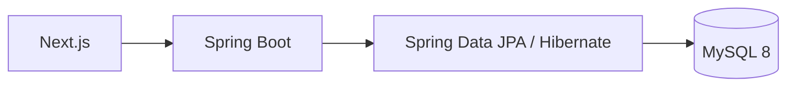
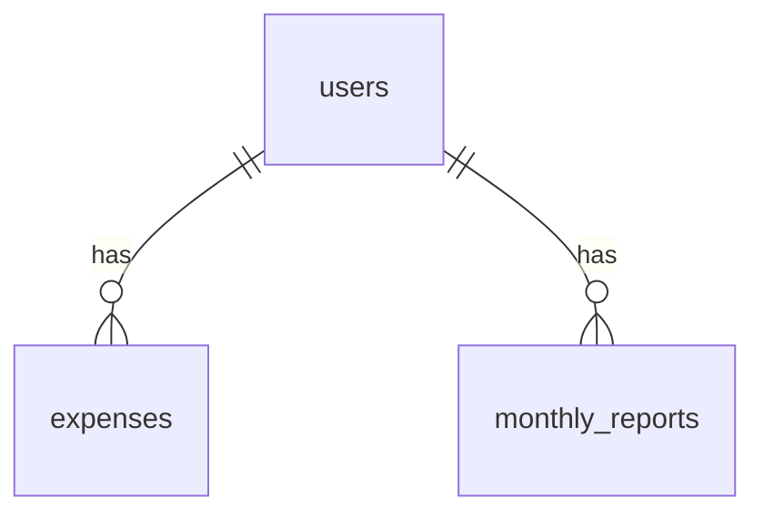

# 03. MySQL：このプロジェクトのデータ保存基盤

> この章で学ぶこと: **MySQL の役割**、**接続設定**、**init / Flyway / app ユーザーの分担**、**スキーマ・文字コード・タイムゾーン**、**よく使うコマンド**。

## 目次

1. [この資料の位置づけ](#この資料の位置づけ)
2. [このプロジェクトでの MySQL の役割](#このプロジェクトでの-mysql-の役割)
3. [MySQL 関連ファイル](#mysql-関連ファイル)
4. [接続設定の読み方](#接続設定の読み方)
5. [MySQL コンテナ設定](#mysql-コンテナ設定)
6. [初回起動時の DB ユーザー作成（docker-entrypoint-initdb.d）](#初回起動時の-db-ユーザー作成docker-entrypoint-initdbd)
7. [初期スキーマの読み方](#初期スキーマの読み方)
8. [文字コードとタイムゾーン](#文字コードとタイムゾーン)
9. [Flyway と Hibernate validate の境界](#flyway-と-hibernate-validate-の境界)
10. [よく使う確認コマンド](#よく使う確認コマンド)
11. [トラブルシュート](#トラブルシュート)
12. [セキュリティとパフォーマンスの注意点](#セキュリティとパフォーマンスの注意点)
13. [まず覚えるポイント](#まず覚えるポイント)

---

## この資料の位置づけ

この資料では、MySQL そのものの超基本ではなく、**このプロジェクトで MySQL をどう使っているか**に絞って説明します。

次の内容は別資料で詳しく説明済みなので、ここでは深掘りしません。

| 内容 | 参照先 |
|------|--------|
| JPA / Hibernate / Repository / トランザクション | [03. データ層](../backend/03-data.md) |
| Flyway の基本、命名規則、適用順 | [03. データ層](../backend/03-data.md#flywaydb-マイグレーション) |
| JDBC ドライバ、DataSource、HikariCP | [03. データ層](../backend/03-data.md#jdbc-ドライバと-datasource) |
| Docker Compose、ネットワーク、ボリューム、healthcheck | [02. Docker](./02-docker.md) |
| Maven の MySQL ドライバ依存関係 | [01. Maven](./01-maven.md) |

---

## このプロジェクトでの MySQL の役割

このプロジェクトは、支出・ユーザー・月次レポートを MySQL 8 に保存します。



MySQL 側で扱う主なテーブルは次の 3 つです。

| テーブル | 役割 |
|----------|------|
| `users` | Cognito のユーザーとアプリ内ユーザーを対応させる |
| `expenses` | 支出データを保存する |
| `monthly_reports` | AI が生成した月次レポートを保存する |

この資料で重要なのは、Java の Entity そのものではなく、**最終的に MySQL 上にどのようなテーブル・制約・インデックスが作られるか**です。

---

## MySQL 関連ファイル

MySQL に直接関係するファイルは次の通りです。

```text
.
├── docker/compose/docker-compose.dev.yaml
├── docker/compose/docker-compose.single-host.yaml
├── docker/compose/docker-compose.single-host.local.yaml
├── docker/compose/docker-compose.single-host.prod.yaml
├── docker/mysql/my.cnf
├── docker/mysql/init/01-create-db-users.sh
├── backend/src/main/resources/application.properties
└── backend/src/main/resources/db/migration/V1__initial_schema.sql
```

| ファイル | 見るポイント |
|----------|--------------|
| `docker/compose/docker-compose.dev.yaml` | MySQL だけをローカル開発用に起動する設定 |
| `docker/compose/docker-compose.single-host.yaml` | MySQL とバックエンドを同じ Docker ネットワークで起動する設定 |
| `docker/compose/docker-compose.single-host.local.yaml` | ローカル用のポート公開と SQL ログ設定 |
| `docker/compose/docker-compose.single-host.prod.yaml` | 本番寄せの SQL ログ抑制設定 |
| `docker/mysql/my.cnf` | MySQL サーバーの文字コード・タイムゾーン設定 |
| `docker/mysql/init/01-create-db-users.sh` | 初回起動時のみ DB ユーザー作成 |
| `application.properties` | app / Flyway 用の接続設定 |
| `V1__initial_schema.sql` | Flyway が作る初期テーブル |

---

## 接続設定の読み方

このプロジェクトでは、実行方法によって MySQL の接続先ホスト名が変わります。

| 実行方法 | Spring Boot の場所 | MySQL の見え方 | JDBC URL のホスト |
|----------|-------------------|----------------|-------------------|
| `docker/compose/docker-compose.dev.yaml` | ローカルPC / IDE | `localhost:3306` | `localhost` |
| `docker/compose/docker-compose.single-host.yaml` | Docker コンテナ内 | Compose サービス名 | `mysql` |

### ローカル開発時

`application.properties` では、ローカル開発用の URL を環境変数から読みます。

```properties
spring.datasource.url=${SPRING_DATASOURCE_URL_DEV}
spring.datasource.username=${MYSQL_APP_USER}
spring.datasource.password=${MYSQL_APP_PASSWORD}
spring.datasource.driver-class-name=com.mysql.cj.jdbc.Driver

# Flyway は DDL 権限を持つ専用ユーザーでマイグレーション
spring.flyway.user=${MYSQL_FLYWAY_USER}
spring.flyway.password=${MYSQL_FLYWAY_PASSWORD}
```

`.env` の変数一覧は `.env.example` を参照。`MYSQL_ROOT_PASSWORD` は init / 運用用で、Spring のランタイム接続には使わない。

`localhost` は Spring Boot をローカルPCで動かすため。

### 単一ホスト構成時

JDBC URL は **`.env` の `SPRING_DATASOURCE_URL_PROD` を正**とし、Compose ではそれをコンテナへ渡します（`single-host.local` / `single-host.prod` で URL は変えません）。

```yaml
SPRING_DATASOURCE_URL: ${SPRING_DATASOURCE_URL_PROD}
SPRING_DATASOURCE_USERNAME: ${MYSQL_APP_USER}
SPRING_DATASOURCE_PASSWORD: ${MYSQL_APP_PASSWORD}
SPRING_FLYWAY_USER: ${MYSQL_FLYWAY_USER}
SPRING_FLYWAY_PASSWORD: ${MYSQL_FLYWAY_PASSWORD}
```

| Compose の組み合わせ | 用途 | JDBC / MySQL ポート / SQL ログ |
|----------------------|------|--------------------------------|
| `docker-compose.dev.yaml` | 日常開発（Spring はホスト） | `SPRING_DATASOURCE_URL_DEV`、`127.0.0.1:3306` 公開 |
| `single-host.yaml` + `single-host.local.yaml` | デプロイ前の通し確認 | `SPRING_DATASOURCE_URL_PROD`、`127.0.0.1:3306` 公開、SQL ログ ON |
| `single-host.yaml` + `single-host.prod.yaml` | EC2 本番 | 同上 URL、MySQL ポート非公開、SQL ログ OFF |

`SPRING_*` は `spring.*` に対応（[01. Spring コア](../backend/01-spring-core.md)）。`mysql` は Compose のサービス名。
Docker Compose の同じネットワーク内では、サービス名がホスト名として使えます。

`localhost` は「自分自身」という意味なので、Docker 内のバックエンドから MySQL コンテナへつなぐ場合は `localhost` ではなく `mysql` を使います。

---

## MySQL コンテナ設定

`docker/compose/docker-compose.dev.yaml` では MySQL だけを起動します。

```yaml
services:
  mysql:
    image: mysql:8.0
    container_name: mysql-dev
    ports:
      - "127.0.0.1:3306:3306"
    environment:
      MYSQL_ROOT_PASSWORD: ${MYSQL_ROOT_PASSWORD}
      MYSQL_DATABASE: ${MYSQL_DATABASE}
      MYSQL_FLYWAY_USER: ${MYSQL_FLYWAY_USER}
      MYSQL_FLYWAY_PASSWORD: ${MYSQL_FLYWAY_PASSWORD}
      MYSQL_APP_USER: ${MYSQL_APP_USER}
      MYSQL_APP_PASSWORD: ${MYSQL_APP_PASSWORD}
    volumes:
      - mysql_dev_data:/var/lib/mysql
      - ./docker/mysql/my.cnf:/etc/mysql/conf.d/my.cnf
      - ./docker/mysql/init:/docker-entrypoint-initdb.d
```

| 設定 | 意味 |
|------|------|
| `MYSQL_DATABASE` | 初回起動時に作成する DB 名 |
| `/var/lib/mysql` | データ永続化（名前付きボリューム） |
| `./docker/mysql/my.cnf` | 文字コード・タイムゾーン |
| `./docker/mysql/init:...` | 初回のみユーザー作成（次節） |

MySQL のデータは `/var/lib/mysql` に保存されます。

```yaml
volumes:
  - mysql_dev_data:/var/lib/mysql
```

ここを名前付きボリュームにしているため、コンテナを消しても DB データは残ります。

単一ホスト構成では、MySQL が接続可能になってからバックエンドを起動するために `healthcheck` を使います。

```yaml
healthcheck:
  test: ["CMD", "mysqladmin", "ping", "-h", "localhost", "-u", "root", "-p${MYSQL_ROOT_PASSWORD}"]
  interval: 10s
  timeout: 5s
  retries: 10
```

Docker のネットワークやボリュームの基本は [02. Docker](./02-docker.md#ネットワークとボリューム) を参照してください。

---

## 初回起動時の DB ユーザー作成（docker-entrypoint-initdb.d）

```yaml
- ./docker/mysql/init:/docker-entrypoint-initdb.d
```

ホストの `docker/mysql/init/` を、MySQL 公式イメージの**初回セットアップ用ディレクトリ**にマウントする。`/var/lib/mysql` が**空のときだけ**中の `.sh` / `.sql` が実行され、2 回目以降やボリューム残存時は走らない。`.env` 変更を反映するには `down -v` か手動 SQL。

`01-create-db-users.sh` は `flyway_user`（DDL 可）と `app_user`（DML のみ）を作る。`root` は healthcheck / 手動操作用。

---

## 初期スキーマの読み方

初期スキーマは `backend/src/main/resources/db/migration/V1__initial_schema.sql` にあります。

```sql
CREATE TABLE users (
    id BIGINT NOT NULL AUTO_INCREMENT,
    cognito_sub VARCHAR(255) NOT NULL,
    email VARCHAR(255) NOT NULL,
    PRIMARY KEY (id),
    UNIQUE KEY uk_users_cognito_sub (cognito_sub)
) ENGINE=InnoDB DEFAULT CHARSET=utf8mb4 COLLATE=utf8mb4_unicode_ci;
```

この `CREATE TABLE` から、次のことが読み取れます。

| 部分 | 意味 |
|------|------|
| `BIGINT NOT NULL AUTO_INCREMENT` | MySQL が自動採番する ID |
| `PRIMARY KEY (id)` | `id` を主キーにする |
| `UNIQUE KEY uk_users_cognito_sub` | Cognito ユーザーIDの重複を防ぐ |
| `ENGINE=InnoDB` | トランザクションと外部キーに対応したストレージエンジンを使う |
| `DEFAULT CHARSET=utf8mb4` | 日本語や絵文字を扱いやすい文字コードを使う |
| `COLLATE=utf8mb4_unicode_ci` | 文字列を比較・並び替えするときのルールを指定する |

### テーブル同士の関係

`expenses` と `monthly_reports` は `users` を参照します。

```sql
CONSTRAINT fk_expenses_user FOREIGN KEY (user_id) REFERENCES users (id)
```

```sql
CONSTRAINT fk_monthly_reports_user FOREIGN KEY (user_id) REFERENCES users (id)
```

外部キーはアプリ側だけではなく、DB 側でもデータの整合性を守るための仕組みです。



### このプロジェクトのインデックス

`expenses` には、ユーザー別・日付別検索用のインデックスがあります。

```sql
KEY idx_expenses_user_id_and_date (user_id, date)
```

家計簿では「あるユーザーの、ある月の支出」を取得する処理が多くなります。
そのため、`user_id` と `date` の組み合わせにインデックスを付けています。

`monthly_reports` には、同じユーザー・同じ月のレポートが重複しないように UNIQUE 制約があります。

```sql
UNIQUE KEY idx_monthly_reports_user_id_month (user_id, report_month)
```

これは検索高速化だけでなく、「同じ月のレポートを 2 件作らない」という業務ルールも表しています。

`KEY` は検索を速くするための普通のインデックスで、同じ値が複数あっても問題ありません。
`UNIQUE KEY` は検索を速くするだけでなく、同じ値の重複登録も防ぎます。

---

## 文字コードとタイムゾーン

MySQL で特に意識したい設定は、文字コードとタイムゾーンです。

### `utf8mb4`

このプロジェクトでは `utf8mb4` を使います。

```ini
[mysqld]
character-set-server=utf8mb4
collation-server=utf8mb4_unicode_ci
init_connect='SET NAMES utf8mb4'
skip-character-set-client-handshake

[client]
default-character-set=utf8mb4

[mysql]
default-character-set=utf8mb4

[mysqldump]
default-character-set=utf8mb4
```

`utf8mb4` は、日本語、英数字、記号に加えて、絵文字のような 4 バイト文字も保存しやすい MySQL の文字コードです。

`docker/mysql/my.cnf` では、接続経路ごとに文字コードの方針をそろえています。

| 設定 | 意味 |
|------|------|
| `character-set-server=utf8mb4` | MySQL サーバー側の標準文字コードを `utf8mb4` にする |
| `collation-server=utf8mb4_unicode_ci` | MySQL サーバー側の標準の比較・並び替えルールを指定する |
| `skip-character-set-client-handshake` | クライアントから別の文字コード指定が来ても、サーバー側の `utf8mb4` 方針にそろえる |
| `init_connect='SET NAMES utf8mb4'` | 通常ユーザーで接続した直後に、接続の文字コードを `utf8mb4` にする |
| `[client]` / `[mysql]` / `[mysqldump]` の `default-character-set=utf8mb4` | CLI やダンプ取得でも文字化けしにくくする |

`V1__initial_schema.sql` でも各テーブルに同じ方針を指定しています。

```sql
DEFAULT CHARSET=utf8mb4 COLLATE=utf8mb4_unicode_ci
```

`DEFAULT CHARSET=utf8mb4` は、このテーブルで保存する文字の形式を `utf8mb4` にする指定です。
`COLLATE=utf8mb4_unicode_ci` は、文字列を比較したり並び替えたりするときのルールです。
`ci` は case-insensitive の略で、大文字・小文字を区別しにくい比較ルールを意味します。
たとえば検索や UNIQUE 判定では、保存する文字コードだけでなく「文字同士をどう比べるか」も重要になるため、`CHARSET` と `COLLATE` をセットで明示しています。

### UTC

MySQL サーバーのタイムゾーンは UTC にそろえています。

```ini
[mysqld]
default-time-zone='+00:00'
```

Spring Boot 側も UTC にそろえています。

```properties
spring.jpa.properties.hibernate.jdbc.time_zone=UTC
spring.jackson.time-zone=UTC
```

日時は、保存時は UTC にそろえ、画面表示で必要に応じて日本時間へ変換する方が安全です。
サーバーの場所や Docker 実行環境が変わっても、日時の解釈がぶれにくくなります。

---

## Flyway と Hibernate validate の境界

`spring-boot-starter-flyway` により起動時に Flyway が自動実行され、`db/migration/` の未適用 SQL を適用する。Hibernate は `ddl-auto=validate` で Entity と DB の整合のみ確認する。

**DB ユーザー（起動時の順）**: `spring.flyway.user` があればマイグレーションはそのユーザー（未設定なら `spring.datasource` と同じ）→ 以降 API は `spring.datasource` の app ユーザー。リクエストごとの切替ではない。

| 担当 | 実装 |
|------|------|
| MySQL ユーザー作成 | `docker/mysql/init/`（初回のみ） |
| テーブル作成・変更 | Flyway（`flyway_user`） |
| 日常の SQL | JPA（`app_user`） |
| スキーマ整合チェック | Hibernate `validate` |

**一度適用した `V1__...sql` は編集しない。** 変更は `V2__...` を追加。命名規則などは [03. データ層](../backend/03-data.md#flywaydb-マイグレーション) を参照。

---

## よく使う確認コマンド

### MySQL だけ起動する

```bash
docker compose --project-directory "$(pwd)" --env-file .env -f docker/compose/docker-compose.dev.yaml up -d
```

### MySQL とバックエンドをまとめて起動する

```bash
docker compose --project-directory "$(pwd)" --env-file .env \
  -f docker/compose/docker-compose.single-host.yaml \
  -f docker/compose/docker-compose.single-host.local.yaml \
  up -d --build
```

### MySQL コンテナに入る

```bash
docker exec -it mysql-dev mysql -u root -p
```

単一ホスト構成の場合です。

```bash
docker exec -it smart_household_mysql_single mysql -u root -p
```

### データベースとテーブルを確認する

```sql
SHOW DATABASES;
USE household_book;
SHOW TABLES;
```

データベース名の部分は `.env` の `MYSQL_DATABASE`（例: `household_book`）に合わせます。

### テーブル定義を見る

```sql
SHOW CREATE TABLE expenses\G
```

`\G` は MySQL クライアントの縦表示です。
外部キーやインデックスが長いときに読みやすくなります。

### Flyway の適用履歴を見る

```sql
SELECT installed_rank, version, description, success, installed_on
FROM flyway_schema_history
ORDER BY installed_rank;
```

### 支出データを軽く確認する

```sql
SELECT id, description, amount, date, category, user_id
FROM expenses
ORDER BY date DESC
LIMIT 10;
```

---

## トラブルシュート

### Spring Boot が MySQL に接続できない

まず JDBC URL のホスト名を確認します。

| Spring Boot の起動場所 | 正しいホスト名 |
|------------------------|----------------|
| ローカルPC / IDE | `localhost` |
| Docker コンテナ内 | `mysql` |

Docker 内のバックエンドから `localhost` を指定すると、MySQL ではなくバックエンドコンテナ自身を見に行きます。

### `Access denied for user` が出る

`.env` のユーザー名・パスワードを確認します。

```env
MYSQL_ROOT_PASSWORD=your-password
MYSQL_DATABASE=household_book
MYSQL_APP_USER=app_user
MYSQL_APP_PASSWORD=your-app-password
```

MySQL の初期化後に `.env` のパスワードを変えても、既存ボリューム内のユーザー設定は自動では変わりません（[初回起動時の DB ユーザー作成](#初回起動時の-db-ユーザー作成docker-entrypoint-initdbd) を参照）。
学習用に作り直す場合は、データ削除を理解したうえで `down -v` を使います。

### `Table ... doesn't exist` が出る

Flyway が初期スキーマを作れていない可能性があります。

確認するものは次の通りです。

- `backend/src/main/resources/db/migration/V1__initial_schema.sql`
- バックエンド起動ログの Flyway エラー
- `flyway_schema_history` の `success`

### 文字化けする

`docker/mysql/my.cnf` とテーブル定義の `utf8mb4` 設定を確認します。

```sql
SHOW CREATE TABLE users\G
```

`DEFAULT CHARSET=utf8mb4` が入っていれば、少なくともテーブル側の文字コード方針は合っています。

### 日時がずれる

MySQL、Hibernate、Jackson が UTC にそろっているか確認します。

```properties
spring.jpa.properties.hibernate.jdbc.time_zone=UTC
spring.jackson.time-zone=UTC
```

---

## セキュリティとパフォーマンスの注意点

### セキュリティ

- `.env` には DB パスワードや API キーが入るため、Git にコミットしません。
- 本番では MySQL ポートをインターネットへ公開しません（`single-host.prod` では `ports` を付けない）。
- 本番では SQL ログを出しっぱなしにしません。支出内容やメールアドレスがログに混ざる可能性があります。
- ランタイムは `app_user`、Flyway は `flyway_user`。`root` は init / healthcheck のみ。
- **JDBC の `useSSL=false`** は、backend と MySQL が同一 Docker ネットワーク内の single-host 向けです。DB をネットワーク越し（RDS 等）に置く場合は `.env` の URL を `sslMode=VERIFY_IDENTITY` 等に切り替え、`allowPublicKeyRetrieval=true` は原則外してください。
- SQL インジェクション対策は、文字列結合ではなく Repository / JPQL のパラメータバインディングに寄せます。詳しくは [03. データ層](../backend/03-data.md#sql-インジェクション対策の仕組み) を参照してください。

### パフォーマンス

- `expenses(user_id, date)` のように、よく使う検索条件へインデックスを張ります。
- インデックスは増やしすぎると書き込みが重くなるため、検索パターンに合わせて追加します。
- DB 接続を長く握る処理は避けます。コネクションプール枯渇の原因になります。
- N+1 問題は MySQL の問題というより JPA の使い方の問題です。詳しくは [03. データ層](../backend/03-data.md#n1-問題と対策) を参照してください。

---

## まず覚えるポイント

- このプロジェクトの MySQL は、`users`、`expenses`、`monthly_reports` を保存します。
- ローカル Spring Boot からは `localhost:3306`、Docker 内バックエンドからは `mysql:3306` に接続します。
- MySQL の実データは `/var/lib/mysql` にあり、Docker ボリュームで永続化しています。
- init は初回のみ `flyway_user` / `app_user` を作成。スキーマは Flyway、API は app ユーザー。`spring.flyway.user` 未設定時は DataSource と同じユーザーでマイグレーション。
- Hibernate は `validate` のみ（テーブルは作らない）。
- `utf8mb4` と UTC を明示して、文字化けや日時ずれを減らしています。
