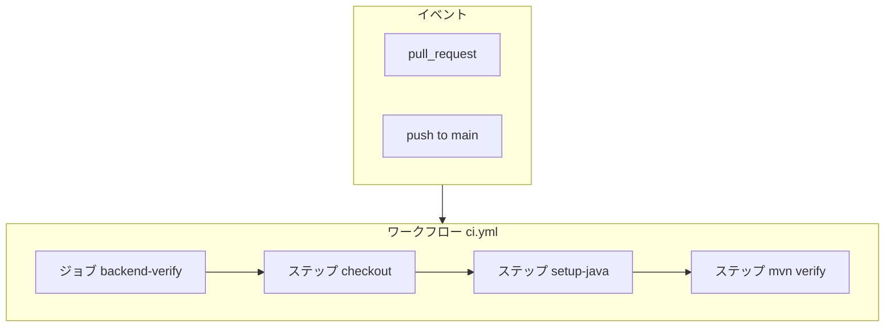

# 04. CI と PR レビュー：壊れ込みを防ぎ、人の見落としを減らす

> この章で学ぶこと: **GitHub Actions が何をするか**、**このリポジトリで CI が `mvn verify` になる理由**、**PR をきっかけにした自動化の流れ**、**Cursor Bugbot による PR レビュー**、**`.cursor/BUGBOT.md` の役割**、**セキュリティとパフォーマンスの注意点**。

## 目次

### 前半: GitHub Actions と CI

1. [なぜ CI が必要か](#なぜ-ci-が必要か)
2. [GitHub Actions のしくみ](#github-actions-のしくみ)
3. [このプロジェクトの CI で行うこと](#このプロジェクトの-ci-で行うこと)
4. [ワークフローファイルの読み方（概要）](#ワークフローファイルの読み方概要)
5. [CI 側のセキュリティとパフォーマンス](#ci-側のセキュリティとパフォーマンス)

### 後半: Cursor Bugbot と PR レビュー

6. [人間のレビューと AI レビュー](#人間のレビューと-ai-レビュー)
7. [Bugbot とは](#bugbot-とは)
8. [Bugbot を使い始める手順（リポジトリ外の作業）](#bugbot-を使い始める手順リポジトリ外の作業)
9. [`.cursor/BUGBOT.md` とは](#cursorbugbotmd-とは)
10. [Actions から Cursor SDK でレビューする代替案](#actions-から-cursor-sdk-でレビューする代替案)
11. [レビュー連携側のセキュリティ](#レビュー連携側のセキュリティ)
12. [CI と Bugbot を合わせて使うイメージ](#ci-と-bugbot-を合わせて使うイメージ)

---

## なぜ CI が必要か

チーム開発では、次のような事故が起きやすくなります。

```text
ローカルではテストが通った
が、他の人の環境や main ブランチと合わせたらビルドが壊れていた
```

**CI（Continuous Integration：継続的インテグレーション）**は、コードがリポジトリに入るタイミングで**決められたコマンドを自動実行**し、壊れた状態を早く見つける仕組みです。

代表的なトリガーは次の2つです。

| トリガー | いつ動くか | よくある目的 |
|----------|------------|--------------|
| `pull_request` | PR の作成や更新 | main にマージする前にビルドとテストを通す |
| `push` | 指定ブランチへの直接 push | main を常にビルド可能な状態に保つ |

CI が緑（成功）なら「この時点のコードは、定義したチェックを満たしている」という合図になります。逆に赤なら、マージ前に直すチャンスが得られます。

---

## GitHub Actions のしくみ

**GitHub Actions**は、GitHub が提供する CI/CD の仕組みです。リポジトリ内の YAML ファイルに「いつ・何をするか」を書きます。

ざっくり次の階層で覚えるとよいです。

| 用語 | 意味 |
|------|------|
| **イベント** | きっかけ。例: `pull_request`、`push` |
| **ワークフロー（Workflow）** | 1 つの YAML ファイルに対応する、一連の自動化の定義 |
| **ジョブ（Job）** | 同じランバー上でまとめて実行される処理のかたまり |
| **ステップ（Step）** | ジョブの中の 1 手順。シェルコマンドや既製アクションの実行 |
| **ランバー（Runner）** | ジョブが動く仮想マシン。`ubuntu-latest` など |



### `concurrency`（同時実行の制御）

PR に何度も push すると、CI が何本も並列で走ります。**古い実行は意味が薄い**ことが多いので、`concurrency` で「同じ PR の古い実行はキャンセルする」といった制御がよく使われます。無駄な待ち時間と計算資源の節約になります。

---

## このプロジェクトの CI で行うこと

このリポジトリのバックエンドは **Spring Boot** で、[Maven](./01-maven.md) がビルドとテストを担当します。CI の中心コマンドは **`mvn verify`** です。

`verify` は、コンパイルに加えてテストを実行し、品質チェックがあればそれも含めたうえで、成果物の検証まで進むフェーズです（プロジェクトの `pom.xml` の定義に従います）。

### なぜ `backend` ディレクトリで実行するのか

Maven の設定ファイル `pom.xml` は `backend` フォルダにあります。また、このプロジェクトでは **OpenAPI 仕様から Java コードを生成**してからビルドします。生成プラグインは `../openapi/openapi.yaml` を参照する前提になっているため、**リポジトリのルートを checkout したうえで `backend` に移動して Maven を実行**する形が自然です。

```text
リポジトリルート/
  openapi/openapi.yaml   ← 仕様
  backend/pom.xml        ← Maven がここを見る
  backend/src/...
```

もし `openapi` を checkout せずに `backend` だけ取得しようとすると、生成フェーズが失敗しやすくなります。

### Java のバージョン

`backend/pom.xml` の `java.version` に合わせ、CI でも同じ JDK を使います。ローカルと CI の JDK がずれると、「自分の PC では通るのに CI だけ失敗する」原因になります。

---

## ワークフローファイルの読み方（概要）

実体はリポジトリの `[.github/workflows/ci.yml](../../.github/workflows/ci.yml)` です。読むときのポイントだけ挙げます。

1. **`on:`** … いつこのワークフローが動くか。
2. **`jobs:`** … ジョブ名と中身。
3. **`runs-on:`** … どの OS のランバーで動かすか（例: `ubuntu-latest`）。
4. **`steps:`** … `uses:` で既製アクション（checkout や setup-java）、`run:` でシェルコマンド。
5. **`permissions:`** … GitHub トークンにどの権限を付けるか。CI が不要に広い権限を持たないようにするための設定。

**`actions/setup-java`** では JDK のディストリビューションとバージョンを指定し、`cache: maven` を付けると依存ライブラリの取得結果をキャッシュしやすくなり、**2 回目以降のビルドが速くなる**ことが多いです。

---

## CI 側のセキュリティとパフォーマンス

### セキュリティ

- **シークレット**（API キー、パスワードなど）は GitHub の **Repository secrets** や **Environments** に登録し、ワークフローから `${{ secrets.NAME }}` のように参照します。**リポジトリに平文でコミットしない**のが原則です。
- **`pull_request` イベントはフォークからの PR で権限が弱い**挙動になります。悪意のある PR がワークフローを改ざんしてシークレットを盗むのを防ぐための設計です。フォーク PR で追加の権限が必要な処理をするときは、GitHub のドキュメントで **「安全なパターン」**を確認してください。
- ログに **トークンやパスワードが出ない**よう、デバッグ出力に注意します。

### パフォーマンス

- **Maven キャッシュ**を有効にすると、依存の再ダウンロードが減り、CI 時間が短くなります。
- ジョブを無闇に増やすと待ち行列やメンテコストが増えます。**最初はバックエンドの `verify` だけ**に絞り、必要になったらフロントの lint などを足すのが現実的です。

---

## 人間のレビューと AI レビュー

**人間のレビュー**は、仕様の意図やプロダクト判断、チームの合意形成に強みがあります。

一方で、**セキュリティの見落とし**や**境界条件のテスト漏れ**は、どんなチームでも起こり得ます。そこで補助として、**AI が diff を読んで指摘を出す**仕組みがあります。置き換えではなく、**人が最終判断する前提の補助**と捉えると運用しやすいです。

---

## Bugbot とは

**Bugbot**は、Cursor が提供する **PR 向けの自動コードレビュー**です。PR の差分を解析し、バグになりそうな点やセキュリティ上の懸念、品質の改善点などをコメントとして残します。

公式ドキュメント: [Bugbot | Cursor Docs](https://cursor.com/docs/bugbot)

### GitHub Actions との違い

- **GitHub Actions**は、リポジトリ内の YAML で「コマンドを実行する」仕組みです。
- **Bugbot**は、Cursor 側の **GitHub 連携（GitHub App）**を通じて動きます。**ワークフローファイルだけでは Bugbot は有効になりません**。ダッシュボードでの有効化が必要です。

---

## Bugbot を使い始める手順（リポジトリ外の作業）

次の作業は **GitHub 上と Cursor のダッシュボード**で行います。リポジトリのコード変更だけでは完了しません。

### チェックリスト

1. [GitHub 連携のドキュメント](https://cursor.com/docs/integrations/github.md)に従い、対象の GitHub アカウントまたは組織に **Cursor / Bugbot 用の GitHub App** をインストールする。
2. [Bugbot ダッシュボード](https://cursor.com/dashboard/bugbot)を開き、この **リポジトリで Bugbot を有効化**する。
3. テスト用に **小さな PR** を作り、Bugbot がコメントするか確認する。動かない場合は、PR に `cursor review` または `bugbot run` とコメントして手動トリガーできる（公式ドキュメント参照）。
4. うまく動かないときは、PR に `cursor review verbose=true` のように **verbose** を付けてログを確認する（[トラブルシューティング](https://cursor.com/docs/bugbot)）。

### プランや料金のざっくりした注意

Bugbot には **無料枠**や **有料プラン**があり、利用状況に応じてレビューが一時停止することがあります。最新の料金と制限は公式ドキュメントを参照してください。

### 個人とチームの違い（ざっくり）

Cursor のドキュメントでは、**Individual** と **Team** で設定や対象 PR の範囲が変わることがあります。例えば Individual のリポジトリ設定では **自分が author の PR にだけ** Bugbot が走る、といった挙動が説明されている場合があります。チーム全員の PR を対象にしたい場合は、チーム向けの設定とライセンスを確認してください。

---

## `.cursor/BUGBOT.md` とは

リポジトリの **`.cursor/BUGBOT.md`** に、このプロジェクト特有のレビュー観点を書いておくと、Bugbot がそれをルールとして取り込みます。例: Spring Security の変更は重点的に、シークレットの混入は必ず指摘する、など。

公式では **Team Rules → リポジトリルール → BUGBOT.md** の順でマージされる説明があります。プロジェクト固有の「ここは必ず見てほしい」を **コードとして残せる**のが利点です。

このリポジトリではルートに `.cursor/BUGBOT.md` を置いています。内容をチームの方針に合わせて更新してください。

---

## Actions から Cursor SDK でレビューする代替案

「PR が開かれたら、GitHub Actions から **Cursor の TypeScript SDK**（`@cursor/sdk`）を呼んでレビューさせる」構成も理論上は可能です。API キーを GitHub Secrets に置き、スクリプトから `Agent.prompt` などを実行するイメージです。

ただし、**ローカル実行とクラウド実行の違い**、**課金**、**権限**、**diff の渡し方**など、学習コストと運用負荷が Bugbot より高くなりがちです。公式の Bugbot で足りる場合は、まず Bugbot を主軸にするのがおすすめです。

SDK の概要: [Cursor TypeScript SDK](https://cursor.com/docs/api/sdk/typescript)

---

## レビュー連携側のセキュリティ

- GitHub App に **どのリポジトリへのアクセスを許可するか**は、必要最小限にします。
- `.cursor/BUGBOT.md` や PR の説明に、**本番のシークレットや社内ホスト名**などを書かないようにします。ルールファイルもリポジトリにコミットされるため、全世界に公開される情報として扱います。

---

## CI と Bugbot を合わせて使うイメージ

1 つの PR に対して、**GitHub Actions が `mvn verify` で機械的な正しさ**（コンパイルとテスト）を保証し、**Bugbot が diff から人間が見落としやすい観点**をコメントとして補強します。どちらか一方だけでも価値はありますが、両方そろうと「動くこと」と「安全・保守しやすいこと」の両方に近づきやすくなります。最終的なマージ判断は **人間のレビューと CI の結果**を合わせて行うのが一般的です。

---

## まず覚えるポイント

- **CI**は、PR や main への変更のたびに **ビルドとテストを自動実行**し、壊れ込みを早く見つける仕組み。
- **GitHub Actions**は、`.github/workflows/*.yml` に **イベント・ジョブ・ステップ**を書く。
- このプロジェクトでは **`backend` で `mvn verify`** し、OpenAPI 生成を含む一連の検証を行う。
- **Bugbot**は Cursor の **GitHub 連携とダッシュボード設定**が必要で、**ワークフロー YAML だけでは有効にならない**。
- **`.cursor/BUGBOT.md`**にプロジェクト固有のレビュー観点を残せる。
