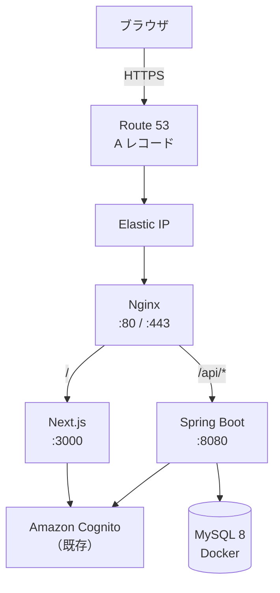
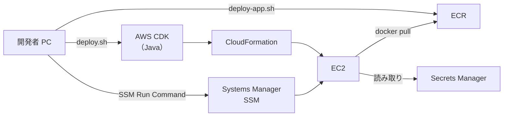

# 01. 全体像とアーキテクチャ

> この章で学ぶこと: **このプロジェクトの AWS 構成（案 A）**、**各 AWS サービスの役割**、**リクエストがどう流れるか**、**ローカル Docker との違い**。

## 目次

1. [このプロジェクトの AWS 方針](#このプロジェクトの-aws-方針)
2. [構成図](#構成図)
3. [AWS サービス一覧](#aws-サービス一覧)
4. [1 台の EC2 に載せる理由](#1-台の-ec2-に載せる理由)
5. [ローカル開発との対応関係](#ローカル開発との対応関係)
6. [まず覚えるポイント](#まず覚えるポイント)

---

## このプロジェクトの AWS 方針

```text
EC2 1 台 + Docker Compose + 既存 Cognito + Route 53 + HTTPS (Let's Encrypt)
```

ざっくり言うと、次のような設計です。


| 方針      | 内容                                               |
| ------- | ------------------------------------------------ |
| コンピュート  | EC2 1 台（既定: `t4g.small`、ARM64）                   |
| アプリ実行   | Docker Compose（MySQL + Spring Boot Backend）      |
| フロントエンド | EC2 上で Next.js をビルドし、systemd で起動                 |
| 認証      | **既存の** Amazon Cognito User Pool を利用（CDK では作らない） |
| ドメイン    | Route 53 の既存ホストゾーンに A レコードを追加                    |
| HTTPS   | EC2 上の Nginx + certbot（Let's Encrypt）            |
| 秘密情報    | AWS Secrets Manager                              |
| イメージ配布  | Amazon ECR（Backend の Docker イメージ）                |


---

## 構成図

### ユーザーから見た流れ




### インフラ管理の流れ




CDK は「インフラの設計図」を CloudFormation テンプレートに変換する道具です。`cdk deploy` を実行すると、VPC、EC2、ECR などが AWS 上に作られます。

---

## AWS サービス一覧


| サービス                    | このプロジェクトでの役割                         |
| ----------------------- | ------------------------------------ |
| **AWS CDK**             | Java コードでインフラを定義し、デプロイする             |
| **CloudFormation**      | CDK が生成したテンプレートを実際に適用する基盤            |
| **EC2**                 | アプリ本体（Nginx、Docker、Next.js）を動かすサーバー  |
| **VPC**                 | EC2 を置く仮想ネットワーク（NAT Gateway なしの最小構成） |
| **Elastic IP**          | EC2 のパブリック IP を固定する                  |
| **Security Group**      | 80/443（と任意で 22）だけ外部から開ける             |
| **Route 53**            | ドメイン名を Elastic IP に向ける               |
| **ECR**                 | Backend の Docker イメージを保存・配布する        |
| **Secrets Manager**     | DB パスワード、OpenAI API キーなどを保管する        |
| **SSM Parameter Store** | Cognito ID、ドメイン名など非機密の設定を EC2 に渡す    |
| **SSM Run Command**     | SSH なしで EC2 上のデプロイスクリプトを実行する         |
| **IAM Role**            | EC2 が ECR / Secrets / SSM を読める権限     |
| **Cognito**             | ユーザー認証（既存リソースを参照するだけ）                |


---

## 1 台の EC2 に載せる理由

### メリット

- **学習しやすい**: 1 台の Linux サーバーに Nginx、Docker、Node.js が載っている形は、従来の VPS 運用に近い
- **コストが読みやすい**: NAT Gateway や ALB、RDS を使わないため、固定費を抑えやすい
- **ローカルとの対応が明確**: [02. Docker](../02-docker.md) の `single-host` 構成をそのまま EC2 に持ち込める

### トレードオフ


| 項目       | 1 台 EC2 構成             | マネージド構成（例: ECS + RDS）     |
| -------- | ---------------------- | ------------------------- |
| 可用性      | EC2 停止で全体停止            | 複数 AZ やオートスケールで耐障害性を上げやすい |
| 運用       | OS パッチ、ディスク、メモリを自分で見る  | AWS が基盤を管理                |
| スケール     | 垂直スケール（インスタンスサイズ変更）が中心 | 水平スケールしやすい                |
| セキュリティ境界 | 1 台に DB も載る            | DB をネットワーク分離しやすい          |


---

## ローカル開発との対応関係

ローカルと AWS では、**同じ Docker Compose ファイル**をベースに、上書きファイルだけ変えています。


| 環境                        | Compose の組み合わせ                                                            | Backend の取得方法              |
| ------------------------- | ------------------------------------------------------------------------- | -------------------------- |
| ローカル（single-host-local）   | `single-host.yaml` + `single-host.local.yaml`                             | `docker build`（Dockerfile） |
| ローカル（single-host-prod 寄せ） | `single-host.yaml` + `single-host.prod.yaml`                              | `docker build`             |
| **AWS EC2**               | `single-host.yaml` + `single-host.prod.yaml` + `**single-host.aws.yaml`** | **ECR から `docker pull`**   |


AWS 用の `docker-compose.single-host.aws.yaml` は、Backend の `build` 定義を消し、ECR のイメージ URL を使うための差分です。EC2 上で Maven ビルドや `docker build` を毎回行わないようにしています。

MySQL のデータ永続化、ユーザー作成、Flyway の役割分担は [03. MySQL](../03-mysql.md) と同じ考え方です。

---

## まず覚えるポイント

- このプロジェクトの AWS 構成は **EC2 1 台 + Docker Compose + 既存 Cognito** です。
- ユーザーは **Route 53 → Elastic IP → Nginx → Next.js / Spring Boot** の順でアクセスします。
- Backend イメージは **ECR**、DB パスワードなどは **Secrets Manager** に置きます。
- インフラ定義は **AWS CDK（Java）** の `SmartHouseholdStack` にまとまっています。
- ローカルの `single-host` 構成をベースに、AWS では **ECR pull 用の compose 上書き**を足しています。

