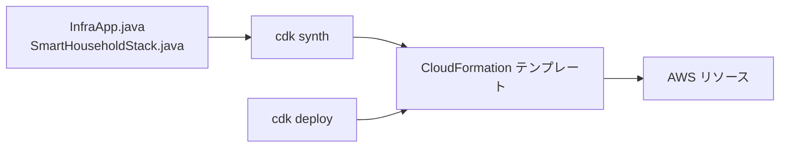
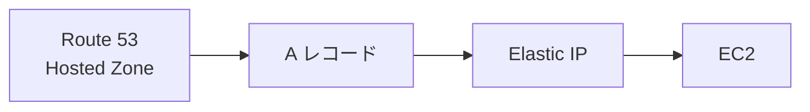
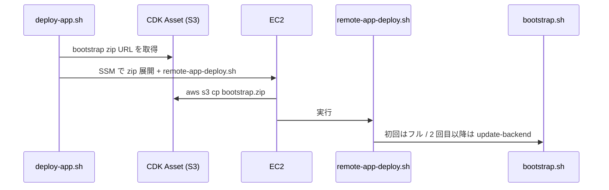

# 02. CDK スタック：インフラを Java コードで定義する

> この章で学ぶこと: **AWS CDK とは何か**、**`InfraApp` と `SmartHouseholdStack` の役割**、**`cdk.json` の context**、**スタックが作る AWS リソース**。

## 目次

1. [AWS CDK とは](#aws-cdk-とは)
2. [このプロジェクトの CDK ファイル構成](#このプロジェクトの-cdk-ファイル構成)
3. [InfraApp：エントリポイント](#infraappエントリポイント)
4. [cdk.json：設定の置き場所](#cdkjson設定の置き場所)
5. [SmartHouseholdStack が作るリソース](#smarthouseholdstack-が作るリソース)
6. [User Data と Bootstrap Asset](#user-data-と-bootstrap-asset)
7. [CloudFormation の Outputs](#cloudformation-の-outputs)
8. [セキュリティとパフォーマンスの注意点](#セキュリティとパフォーマンスの注意点)
9. [まず覚えるポイント](#まず覚えるポイント)

---

## AWS CDK とは

**AWS CDK（Cloud Development Kit）**は、プログラミング言語で AWS インフラを書くためのフレームワークです。

このプロジェクトでは **Java** を使っています。



手作業で AWS コンソールをクリックして EC2 や VPC を作る代わりに、コードに書いて再現できます。Git で履歴管理でき、レビューもしやすくなります。

---

## このプロジェクトの CDK ファイル構成

```text
infra/
├── cdk.json                          # CDK の起動設定と context
├── cdk.context.example.json          # context の記入例
├── pom.xml                           # Java 依存関係（aws-cdk-lib）
├── package.json                      # CDK CLI（npx cdk）
├── src/main/java/.../
│   ├── InfraApp.java                 # main、リージョン決定
│   └── SmartHouseholdStack.java      # 実際のリソース定義
├── assets/ec2-bootstrap/             # EC2 初回起動用スクリプト群
└── scripts/                          # デプロイ・運用ラッパー（下表）
```

| スクリプト | 用途 |
|-----------|------|
| `validate-config.sh` | `cdk.json` / `cdk.local.json` の検証 |
| `deploy.sh` | インフラ作成・更新（docker 設定の bootstrap 同梱同期を含む） |
| `init-secrets.sh` | Secrets Manager への秘密情報投入 |
| `deploy-app.sh` | ECR push + SSM 経由で EC2 更新 |
| `pause.sh` / `resume.sh` | EC2 の一時停止・再開 |
| `destroy.sh` | スタック完全削除 |
| `lib/` | 設定読み取りヘルパー |

`cdk.json` の `app` キーは次のようになっています。

```json
"app": "mvn -e -q compile exec:java"
```

つまり `cdk deploy` を実行すると、まず Maven が `InfraApp` を起動し、CloudFormation テンプレートを生成します。

---

## InfraApp：エントリポイント

`InfraApp.java` は CDK アプリケーションの入口です。

```java
App app = new App();
// ...
new SmartHouseholdStack(app, "SmartHouseholdStack", StackProps.builder()
        .env(env)
        .description("Smart Household Account Book - EC2 + Docker Compose (single host)")
        .build());
app.synth();
```

### リージョンの決め方

次の優先順位で AWS リージョンを決めます。

| 優先順位 | 設定元 | 例 |
|----------|--------|-----|
| 1 | `cdk.json` の `context.awsRegion` | `ap-northeast-1` |
| 2 | 環境変数 `CDK_DEFAULT_REGION` | CLI のデフォルト |
| 3 | コード内のフォールバック | `ap-northeast-1` |

アカウント ID は `CDK_DEFAULT_ACCOUNT` 環境変数から読み取ります。`deploy.sh` が `aws sts get-caller-identity` の結果をセットします。

### context ヘルパー

`InfraApp.contextString()` / `contextBoolean()` / `contextInt()` は、`cdk.json` の `context` から設定値を読む共通関数です。スタック側では次のように使います。

```java
final String projectName = InfraApp.contextString(this, "projectName", "smart-household");
final boolean enableSshAccess = InfraApp.contextBoolean(this, "enableSshAccess", false);
```

第 3 引数は、キーが未設定のときのデフォルト値です。

---

## cdk.json：設定の置き場所

`cdk.json` の `context` には、デプロイ前に埋めるべき値が並びます。

| キー | 意味 | 例 |
|------|------|-----|
| `projectName` | リソース名の接頭辞 | `smart-household` |
| `awsRegion` | デプロイ先リージョン | `ap-northeast-1` |
| `instanceType` | EC2 のサイズ | `t4g.small` |
| `rootVolumeGiB` | ルート EBS の容量（GB） | `30` |
| `gitRepositoryUrl` | EC2 が clone する Git URL | `https://github.com/...` |
| `gitRepositoryBranch` | clone するブランチ | `master` |
| `enableSshAccess` | SSH（22）を開けるか | `false`（既定） |
| `allowedSshCidr` | SSH を許可する送信元 CIDR | `0.0.0.0/0` |
| `domainName` | アプリの公開 URL（ルートまたはサブドメイン） | `app.example.com` |
| `hostedZoneName` | Route 53 ゾーン名 | `example.com` |
| `hostedZoneId` | Route 53 ゾーン ID | `Z0123456789ABCDEF` |
| `certbotEmail` | Let's Encrypt 通知先メール | `you@example.com` |
| `cognitoUserPoolId` | 既存 Cognito User Pool ID | `ap-northeast-1_XXXXX` |
| `cognitoClientId` | 既存 App Client ID | `xxxxxxxx` |

`domainName` は `hostedZoneName` の配下である必要があります。`validate-config.sh` と `SmartHouseholdStack` の両方で検証します。

**注意**: `cdk.json` にはメールアドレスや Cognito ID などが入ります。リポジトリを公開する場合は、実値をコミットしない運用を検討してください。例は `cdk.context.example.json` を参照します。

---

## SmartHouseholdStack が作るリソース

`SmartHouseholdStack.java` が 1 つの CloudFormation スタックとして定義する主なリソースです。

### VPC（最小構成）

```java
Vpc.Builder.create(this, "AppVpc")
        .maxAzs(1)
        .natGateways(0)
        .subnetConfiguration(...)
        .build();
```

| 設定 | 意味 |
|------|------|
| `maxAzs(1)` | 可用性ゾーンを 1 つだけ使う（コスト削減） |
| `natGateways(0)` | NAT Gateway を作らない（月額コスト削減） |
| Public サブネットのみ | EC2 をインターネットから直接到達可能にする |

**IGW（Internet Gateway）** は VPC とインターネットをつなぐ出入口です。

- **Public サブネット** — ルートテーブルに IGW への経路があるサブネット。EC2 は IGW 経由でインターネットと直接通信でき、セキュリティグループの設定次第で外部からも到達できます。
- **NAT Gateway** — Private サブネット内のリソースがインターネットへ**出る**ための出口（Public サブネット側に置く）。外向きのみで、外部から Private 内へ直接入ることはできません。時間課金があるため、本番の Private 構成では使うことが多いです。

`natGateways(0)` かつ Public サブネットのみのため、Private サブネットは作らず EC2 を Public に置いています。外向き通信（`git pull`、Docker イメージ取得など）も EC2 自身が IGW 経由で行います。

---

### SSM Parameter Store

Cognito やドメイン名など、**秘密ではないが EC2 に渡したい設定**を SSM に保存します。

```text
/smart-household/cognito/user-pool-id
/smart-household/cognito/client-id
/smart-household/cognito/issuer-url
/smart-household/domain/name
/smart-household/domain/app-url
/smart-household/domain/cors-allowed-origins
/smart-household/domain/certbot-email
/smart-household/deploy/git-repository-url
/smart-household/deploy/git-repository-branch
```

EC2 の `bootstrap.sh` は `deploy-app.sh` 実行時にこれらを読み、`.env` や Nginx 設定を組み立てます。

### Secrets Manager

```java
Secret appSecret = Secret.Builder.create(this, "AppSecret")
        .secretName(projectName + "/app")
        .description("MySQL passwords, OpenAI API key, and runtime secrets")
        .removalPolicy(RemovalPolicy.DESTROY)
        .build();
```

CDK は **空の Secret リソース**を作ります。実際の値（DB パスワードなど）は、デプロイ後に `init-secrets.sh` が投入します。

### ECR リポジトリ

```java
Repository backendRepository = Repository.Builder.create(this, "BackendRepository")
        .repositoryName(projectName + "/backend")
        .lifecycleRules(...)  // 直近 5 イメージだけ保持
        .build();
```

Backend の Docker イメージを push する場所です。古いイメージを自動削除し、ストレージコストを抑えます。

### EC2 インスタンス

**EC2** は AWS 上の仮想サーバーです。このプロジェクトでは 1 台の EC2 に Nginx + Docker Compose（Backend / Frontend / MySQL）を載せ、Public サブネットに配置します。

```java
Instance instance = Instance.Builder.create(this, "AppInstance")
        .vpc(vpc)
        .vpcSubnets(SubnetSelection.builder().subnetType(SubnetType.PUBLIC).build())
        .instanceType(instanceType)          // cdk.json の instanceType
        .machineImage(...)                   // Amazon Linux 2023（ARM64）
        .securityGroup(instanceSecurityGroup)
        .role(instanceRole)                  // 下記 IAM ロール
        .userData(userData)                  // 初回起動スクリプト
        .requireImdsv2(true)
        .blockDevices(...)                   // GP3・暗号化 EBS
        .build();
```

| 設定 | 値・意味 |
|------|----------|
| インスタンスタイプ | `cdk.json` の `instanceType`（既定 `t4g.small`） |
| AMI | Amazon Linux 2023（ARM64） |
| サブネット | Public（IGW 経由でインターネット通信） |
| IMDSv2 | 必須（`requireImdsv2(true)`）— メタデータ取得のセキュリティ強化 |
| EBS | GP3、暗号化、`deleteOnTermination(true)` で EC2 削除時に一緒に消える |
| セキュリティグループ | 80/443 を全世界に開放（SSH は `enableSshAccess` 時のみ） |

起動時の User Data は `aws-cli` / `unzip` のインストールのみです。アプリの bootstrap は `deploy-app.sh`（SSM）が担当します（詳細は後述）。

### IAM ロール（EC2 用）

**IAM ロール**は、EC2 が AWS の他サービスにアクセスするときの「権限の束」です。アクセスキーを User Data に埋め込まず、インスタンスに一時的な認証情報を自動付与できます。

```java
Role instanceRole = Role.Builder.create(this, "Ec2InstanceRole")
        .assumedBy(new ServicePrincipal("ec2.amazonaws.com"))
        .managedPolicies(List.of(
                ManagedPolicy.fromAwsManagedPolicyName("AmazonSSMManagedInstanceCore")))
        .build();

appSecret.grantRead(instanceRole);           // Secrets Manager
backendRepository.grantPull(instanceRole);   // ECR イメージ pull
bootstrapAsset.grantRead(instanceRole);      // bootstrap zip（S3）
// + SSM Parameter（/smart-household/*）の GetParameter
```

| 権限 | 用途 |
|------|------|
| `AmazonSSMManagedInstanceCore` | SSM Session Manager / Run Command（SSH なし運用） |
| Secrets Manager 読み取り | DB パスワード・API キーなど |
| ECR pull | Backend イメージの取得 |
| SSM Parameter 読み取り | Cognito ID、ドメイン名、Git URL など |
| Bootstrap Asset（S3）読み取り | deploy-app 時の bootstrap zip ダウンロード |

### Elastic IP と Route 53

**Elastic IP（EIP）** は固定のパブリック IP です。EC2 を停止・再起動すると通常は IP が変わりますが、EIP を割り当てれば同じ IP を維持できます。

```java
CfnEIP elasticIp = CfnEIP.Builder.create(this, "AppElasticIp")
        .domain("vpc")
        .build();

CfnEIPAssociation.Builder.create(this, "AppElasticIpAssociation")
        .allocationId(elasticIp.getAttrAllocationId())
        .instanceId(instance.getInstanceId())
        .build();
```



EIP の IP を **Route 53 の A レコード**に登録し、`domainName`（例: `smart-household-account-book.com`）が EC2 を指すようにします。`www` は既存の CNAME → apex を想定（CDK では `www` 用レコードは作りません）。EIP は EC2 にアタッチ中は無料、未使用のまま確保すると課金されます。

---

## User Data と Bootstrap Asset

### User Data とは

**User Data** は EC2 起動時に自動実行されるスクリプトです。CDK では `UserData.forLinux()` で作成し、`.userData(userData)` でインスタンスに渡します。CloudFormation 経由で EC2 に埋め込まれるため、**User Data を変更すると EC2 の再作成**が必要になることが多いです。

```java
UserData userData = UserData.forLinux();
userData.addCommands(
        "#!/bin/bash",
        "set -euxo pipefail",
        "exec > >(tee /var/log/smart-household-user-data.log) 2>&1",
        "dnf install -y aws-cli unzip",
        "mkdir -p /opt/smart-household/bootstrap",
        "echo '[user-data] Ready. Run init-secrets.sh then deploy-app.sh ...'");

Instance.Builder.create(this, "AppInstance")
        // ...
        .userData(userData)
        .build();
```

| 処理 / 変数 | 意味 |
|-------------|------|
| `set -euxo pipefail` | エラーで即停止、実行コマンドをログ出力 |
| `/var/log/smart-household-user-data.log` | User Data のログ |
| `aws-cli` / `unzip` | deploy-app 時の S3 zip 取得に必要 |

User Data は **OS 準備だけ**に留め、アプリのセットアップは `deploy-app.sh` → `remote-app-deploy.sh` に任せます。bootstrap ロジックを User Data に載せないことで、EC2 再作成なしに bootstrap スクリプトだけ更新できます。

### Bootstrap Asset

CDK の **Asset** はローカルディレクトリをデプロイ時に S3 へアップロードし、署名付き URL を生成します。

```java
Asset bootstrapAsset = Asset.Builder.create(this, "BootstrapAsset")
        .path("assets/ec2-bootstrap")
        .build();
bootstrapAsset.grantRead(instanceRole);  // EC2 が S3 から zip を取得可能に
```



1. CDK が `infra/assets/ec2-bootstrap/` を S3 にアップロード
2. `deploy-app.sh` が SSM 経由で EC2 に zip を取得・展開
3. `remote-app-deploy.sh` → `bootstrap.sh`（Nginx 設定・Docker Compose 起動など）

---

## CloudFormation の Outputs

`cdk deploy` 後に表示される主な Output です。

| OutputKey | 用途 |
|-----------|------|
| `InstanceId` | SSM で EC2 を操作するとき |
| `ElasticIp` | 公開 IP の確認 |
| `AppUrl` | `https://{domainName}` |
| `BackendRepositoryUri` | `deploy-app.sh` が ECR に push するとき |
| `AppSecretArn` | bootstrap が Secrets を読むとき |
| `BootstrapAssetS3Url` | bootstrap 修復用 zip の場所 |
| `CognitoIssuerUrl` | Spring Boot の JWT 検証設定の確認 |
| `CognitoCallbackUrlHint` | Cognito コンソールに登録する URL |

`deploy-app.sh` は `aws cloudformation describe-stacks` でこれらを取得し、SSM コマンドに渡します。

---

## セキュリティとパフォーマンスの注意点

### セキュリティ

- **SSH は既定で無効**（`enableSshAccess: false`）。運用は SSM Run Command を使います。
- **IMDSv2 必須**にし、メタデータサービスへの不正アクセスリスクを下げています。
- **EBS 暗号化**を有効にし、ディスク上のデータを保護します。
- **Security Group** は 80/443 のみ開放（SSH は任意）。
- Cognito の User Pool は CDK で新規作成せず、**既存リソースの ID を context で渡す**方式です。

### パフォーマンス / コスト

- `t4g.small`（2 GB RAM）は Backend + Frontend ビルドを想定。`t4g.micro` では Next.js ビルドが OOM になりやすいです。
- ECR のライフサイクルルールで古いイメージを削除し、ストレージ課金を抑えます。
- NAT Gateway なしの VPC で、月額の固定ネットワークコストを避けています。

---

## まず覚えるポイント

- CDK は Java コードから CloudFormation を生成し、AWS リソースを作る道具です。
- 設定の多くは `cdk.json` の `context` に書き、`InfraApp` が読み取ります。
- `SmartHouseholdStack` は VPC、EC2、ECR、Secrets、Route 53 などを 1 スタックにまとめます。
- アプリの bootstrap は **`deploy-app.sh` → S3 から bootstrap zip → `remote-app-deploy.sh` → `bootstrap.sh`** の 1 経路です。
- デプロイ後の接続情報は CloudFormation の **Outputs** に出ます。
