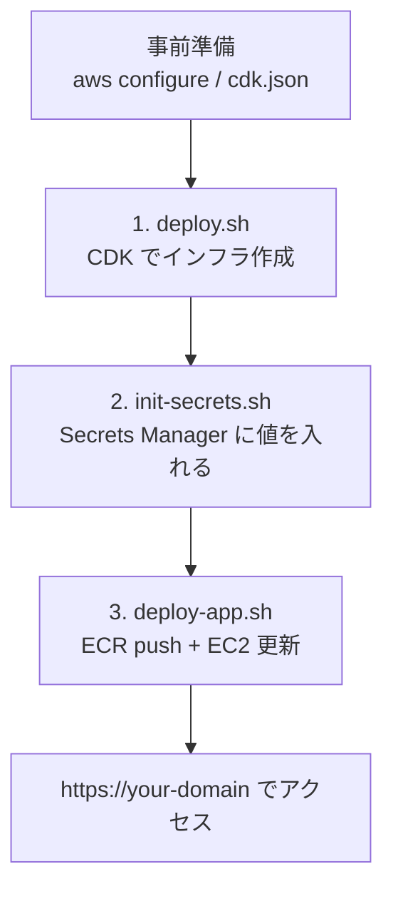
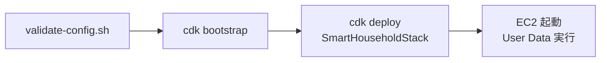
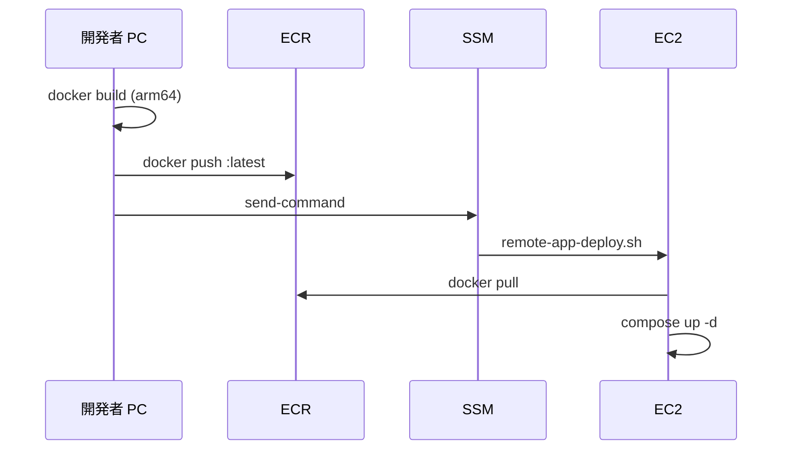

# 03. デプロイの流れ：3 つのスクリプトで AWS に載せる

> この章で学ぶこと: **`deploy.sh` → `init-secrets.sh` → `deploy-app.sh` の順序**、**各スクリプトが何をするか**、**初回と 2 回目以降の違い**。

## 目次

1. [デプロイ全体の流れ](#デプロイ全体の流れ)
2. [事前準備](#事前準備)
3. [Step 1: deploy.sh（インフラ作成）](#step-1-deployshインフラ作成)
4. [Step 2: init-secrets.sh（秘密情報の投入）](#step-2-init-secretssh秘密情報の投入)
5. [Step 3: deploy-app.sh（アプリ更新）](#step-3-deploy-appshアプリ更新)
6. [初回起動と 2 回目以降](#初回起動と-2-回目以降)
7. [設定変更時の再デプロイ](#設定変更時の再デプロイ)
8. [よく使うコマンド一覧](#よく使うコマンド一覧)
9. [まず覚えるポイント](#まず覚えるポイント)

---

## デプロイ全体の流れ

AWS へのデプロイは、**3 段階**に分かれています。



| 段階 | 対象 | 何が起きるか |
|------|------|--------------|
| 1 | AWS インフラ | VPC、EC2、ECR、Secrets（空）、Route 53 などができる |
| 2 | 秘密情報 | DB パスワード、OpenAI キーなどが Secrets に入る |
| 3 | アプリ | Backend イメージを ECR に push し、EC2 で pull・起動する |

**順番を入れ替えないでください。** 特に Step 2 を飛ばすと、EC2 の bootstrap が DB パスワード待ちで失敗します。

---

## 事前準備

### AWS CLI の認証

```bash
aws configure
aws sts get-caller-identity   # Account と User/Role が表示されれば OK
```

### cdk.json の context

[02. CDK スタック](./02-cdk-stack.md#cdkjson設定の置き場所) の必須キーを埋めます。

```bash
./infra/scripts/validate-config.sh
```

### Cognito App Client の URL 登録

Cognito コンソールで、App Client に次を追加します。

- 許可コールバック URL: `https://{domainName}/`
- 許可サインアウト URL: `https://{domainName}/`
- `www` も使う場合は `https://www.{domainName}/` も追加

### Docker（deploy-app 用）

ローカル PC で Backend イメージをビルドして ECR に push するため、Docker が必要です。EC2 は ARM64（`t4g`）のため、`deploy-app.sh` は `--platform linux/arm64` でビルドします。

---

## Step 1: deploy.sh（インフラ作成）

```bash
./infra/scripts/deploy.sh
```

### 内部で行うこと



| 処理 | 説明 |
|------|------|
| `validate-config.sh` | `cdk.json` の必須項目を検証 |
| `npm install` | CDK CLI をローカルに入れる（初回） |
| `cdk bootstrap` | CDK 用の S3 バケットなどをアカウントに用意（初回のみ） |
| `cdk deploy` | CloudFormation スタックを作成・更新 |

デプロイが完了すると EC2 が起動し、User Data から `bootstrap.sh` が走り始めます。この時点では Secrets が空の可能性があるため、bootstrap は DB パスワードが入るまで待機します。

### deploy.sh 完了後のメッセージ

スクリプトは次のステップを案内します。

```text
1. ./infra/scripts/init-secrets.sh
2. infra/cdk.json の gitRepositoryUrl を確認
3. ./infra/scripts/deploy-app.sh
```

---

## Step 2: init-secrets.sh（秘密情報の投入）

```bash
./infra/scripts/init-secrets.sh
```

### 何をするか

1. `cdk.json` から `domainName` を読み、CORS のデフォルトを `https://{domain}` に設定
2. OpenAI API Key と CORS を対話的に入力（Enter でデフォルト可）
3. MySQL の 3 種類のパスワードを **ランダム生成**
4. Secrets Manager の `smart-household/app` に JSON を書き込む

生成される JSON のキーは次の通りです。

| キー | 内容 |
|------|------|
| `MYSQL_ROOT_PASSWORD` | root パスワード |
| `MYSQL_FLYWAY_PASSWORD` | Flyway 用ユーザー |
| `MYSQL_APP_PASSWORD` | アプリ用ユーザー |
| `MYSQL_DATABASE` | `household_book` |
| `OPENAI_API_KEY` | OpenAI API キー |
| `OPENAI_API_URL` | Chat Completions の URL |
| `CORS_ALLOWED_ORIGINS` | フロントの Origin 許可リスト |

**パスワードは端末に表示されません。** Secrets Manager にだけ保存されます。紛失した場合はスクリプトを再実行して上書きするか、AWS コンソールで手動更新します。

### なぜ CDK の後に実行するのか

CDK が先に **Secret リソースの箱**を作り、`init-secrets.sh` が **中身**を入れる役割分担です。箱がないと `put-secret-value` は失敗します。

---

## Step 3: deploy-app.sh（アプリ更新）

```bash
./infra/scripts/deploy-app.sh
```

### 内部で行うこと



| 処理 | 説明 |
|------|------|
| CloudFormation Outputs 取得 | ECR URI、InstanceId、Secret ARN など |
| `docker build --platform linux/arm64` | Backend イメージを ARM 向けにビルド |
| `docker push` | ECR の `:latest` にアップロード |
| `aws ssm send-command` | EC2 上で `remote-app-deploy.sh` を実行 |
| ポーリング | 最大 90 分、SSM の完了を待つ |

SSH ポートを開かずに EC2 を更新できるのが SSM の利点です。EC2 の IAM ロールに `AmazonSSMManagedInstanceCore` が付いています。

### remote-app-deploy.sh の分岐

EC2 上では状況に応じて処理が変わります（詳細は [04. EC2 ブートストラップ](./04-ec2-bootstrap.md)）。

| 状態 | 動作 |
|------|------|
| 初回（bootstrap 未完了） | `bootstrap.sh` をフル実行 |
| 通常更新 | `.env` を Secrets から再生成 → `docker pull` → `compose up` |
| Frontend 未構築 | `BOOTSTRAP_MODE=frontend-only` で Next.js ビルド |

---

## 初回起動と 2 回目以降

### 初回（インフラを作った直後）

```text
deploy.sh
  → EC2 起動、User Data が bootstrap 開始
init-secrets.sh
  → Secrets にパスワード投入、bootstrap の待機が解ける
deploy-app.sh
  → ECR にイメージ push、EC2 で pull & 起動
  → Next.js ビルド（数分〜十数分かかることがある）
```

初回の Frontend ビルドは `t4g.small` でも時間がかかります。swap を追加するなど、bootstrap 側でメモリ不足対策をしています。

### 2 回目以降（アプリのコード変更のみ）

```bash
./infra/scripts/deploy-app.sh
```

インフラ（EC2 サイズ、ドメイン、User Data）を変えていなければ、**deploy-app だけ**で十分です。Backend の Docker イメージが更新され、EC2 上のコンテナが再起動します。

---

## 設定変更時の再デプロイ

| 変更内容 | 必要な操作 |
|----------|------------|
| Java / Spring のコード | `deploy-app.sh` のみ |
| `docker/compose/*.yaml` | `sync-bootstrap-bundle.sh` → `deploy.sh`（User Data 変更時）または `deploy-app.sh` |
| `cdk.json` の `instanceType` など | `deploy.sh`（EC2 が置き換わる場合あり） |
| Secrets の値（API キー等） | `init-secrets.sh` → `deploy-app.sh`（`.env` 再生成） |
| `domainName` / Route 53 | `cdk.json` 更新 → `deploy.sh`、Cognito URL も更新 |

`infra/scripts/sync-bootstrap-bundle.sh` は、リポジトリの `docker/` 配下を `infra/assets/ec2-bootstrap/bundled/docker/` にコピーします。Compose や MySQL 設定を変えたら、CDK デプロイ前に実行してください。

---

## よく使うコマンド一覧

| コマンド | 目的 |
|----------|------|
| `./infra/scripts/validate-config.sh` | `cdk.json` の検証 |
| `./infra/scripts/deploy.sh` | インフラの作成・更新 |
| `./infra/scripts/init-secrets.sh` | Secrets の投入・更新 |
| `./infra/scripts/deploy-app.sh` | Backend デプロイ + EC2 更新 |
| `./infra/scripts/sync-bootstrap-bundle.sh` | bootstrap 同梱用 docker 設定の同期 |
| `./infra/scripts/list-hosted-zones.sh` | Route 53 ゾーン一覧の確認 |
| `./infra/scripts/list-cognito-clients.sh` | Cognito Client ID の確認 |

---

## まず覚えるポイント

- デプロイは **`deploy.sh` → `init-secrets.sh` → `deploy-app.sh`** の 3 段階です。
- `deploy.sh` は CDK でインフラを作り、EC2 の初回 bootstrap を始めます。
- `init-secrets.sh` は DB パスワードなどを Secrets Manager に入れます。
- `deploy-app.sh` は ECR に push し、SSM 経由で EC2 を更新します。
- コード変更だけなら、通常は **`deploy-app.sh` だけ**で足ります。
