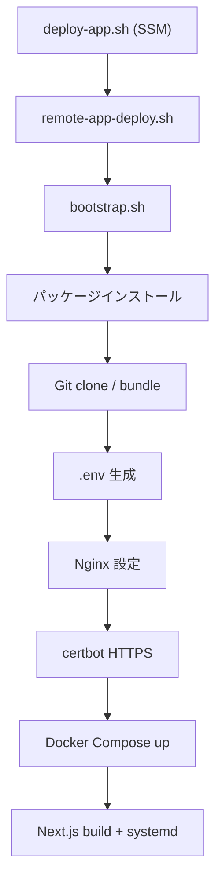
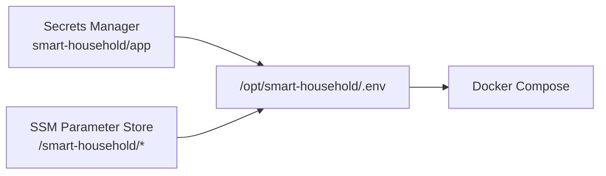
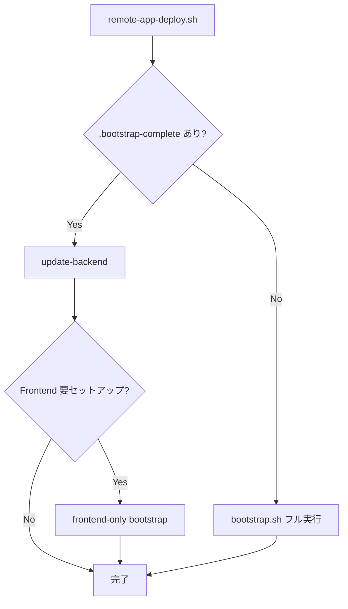

# 04. EC2 ブートストラップ：サーバー起動時に何が起きるか

> この章で学ぶこと: **`bootstrap.sh` の処理順**、**`.env` の組み立て方**、**Nginx / HTTPS / Docker Compose / Next.js の配置**、**`remote-app-deploy.sh` による更新**。

## 目次

1. [ブートストラップとは](#ブートストラップとは)
2. [ファイルとディレクトリ](#ファイルとディレクトリ)
3. [bootstrap.sh の処理フロー](#bootstrapsh-の処理フロー)
4. [アプリケーションソースの取得](#アプリケーションソースの取得)
5. [.env ファイルの生成](#env-ファイルの生成)
6. [Nginx と HTTPS](#nginx-と-https)
7. [Docker Compose の起動（AWS 用）](#docker-compose-の起動aws-用)
8. [Next.js（Frontend）のセットアップ](#nextjsfrontendのセットアップ)
9. [remote-app-deploy.sh](#remote-app-deploysh)
10. [セキュリティとパフォーマンスの注意点](#セキュリティとパフォーマンスの注意点)
11. [まず覚えるポイント](#まず覚えるポイント)

---

## ブートストラップとは

**ブートストラップ**とは、`deploy-app.sh` 実行時に EC2 上で行う、OS の準備からアプリ起動までの自動セットアップです。



EC2 起動時の User Data は `aws-cli` / `unzip` のインストールのみです。**アプリのセットアップはすべて `deploy-app.sh` → `remote-app-deploy.sh` → `bootstrap.sh` の 1 経路**で行います（二重実行を防ぐため）。

---

## ファイルとディレクトリ

```text
/opt/smart-household/
├── bootstrap/                    # CDK Asset から展開
│   ├── bootstrap.sh
│   ├── remote-app-deploy.sh
│   ├── nginx/smart-household.conf
│   └── bundled/docker/           # compose / mysql の同梱コピー（deploy.sh が生成・Git 管理外）
├── app/                          # Git clone 先（または docker のみ）
│   ├── docker/compose/...
│   └── frontend-nextjs/...
├── .env                          # ランタイム環境変数（Secrets + SSM から生成）
├── .bootstrap-complete           # 初回完了マーカー
└── .frontend-complete            # Frontend 完了マーカー
```

| パス | 役割 |
|------|------|
| `/opt/smart-household/.env` | Docker Compose とアプリが読む環境変数 |
| `/etc/nginx/conf.d/smart-household.conf` | リバースプロキシ設定 |
| `/etc/systemd/system/smart-household-frontend.service` | Next.js 本番起動用 |

---

## bootstrap.sh の処理フロー

### 通常モード（初回フル bootstrap）

1. `install_packages` — Docker、Nginx、git、certbot、Node.js 20、Java 21 など
2. `fetch_application_source` — Git clone または bundled docker のみ
3. `write_env_file` — Secrets Manager + SSM から `.env` を生成
4. `configure_nginx` — テンプレートにドメイン名を埋めて Nginx 再起動
5. `setup_https` — DNS が向いたら certbot で Let's Encrypt 証明書取得
6. ECR ログイン → `docker pull` → Docker Compose `up -d`
7. `setup_frontend_unit` — Next.js ビルドと systemd 登録

### 特殊モード（環境変数 `BOOTSTRAP_MODE`）

| 値 | 用途 |
|----|------|
| （未設定） | フル bootstrap |
| `update-backend` | `.env` 再生成 → ECR login → `pull backend` → `compose up -d` |
| `frontend-only` | Next.js のビルドと systemd 起動だけ |

`deploy-app.sh` からの通常更新では `update-backend` が使われます。

---

## アプリケーションソースの取得

`fetch_application_source` は SSM の `git-repository-url` を読みます。

| git URL | 動作 |
|---------|------|
| 有効な HTTPS URL | `git clone --depth 1` で `/opt/smart-household/app` に取得 |
| `none` / 空 | bundled の `docker/` だけコピー（Frontend なし） |

clone 後は常に `apply_bundled_docker_overlays` で、bootstrap 同梱の `docker/` を上書きコピーします。リポジトリに AWS 用 compose が無くても、EC2 デプロイ用の設定が確実に載るためです。

---

## .env ファイルの生成

`write_env_file` は **Secrets Manager** と **SSM Parameter Store** を組み合わせて `.env` を作ります。



### Secrets から入る値

- `MYSQL_ROOT_PASSWORD` / `MYSQL_FLYWAY_PASSWORD` / `MYSQL_APP_PASSWORD`
- `MYSQL_DATABASE`
- `OPENAI_API_KEY` / `OPENAI_API_URL`

### SSM から入る値

- `COGNITO_JWK_SET_URL`（issuer + `/.well-known/jwks.json`）
- `COGNITO_ISSUER_URL`
- `COGNITO_CLIENT_ID`
- `CORS_ALLOWED_ORIGINS`（`/domain/cors-allowed-origins`。無い場合は `/domain/app-url` にフォールバック）

### 固定・派生される値

```env
SPRING_DATASOURCE_URL_PROD=jdbc:mysql://mysql:3306/household_book?...
ECR_BACKEND_IMAGE={ECR URI}:latest
```

`mysql` は Docker Compose のサービス名です（[03. MySQL](../03-mysql.md#接続設定の読み方) と同じ考え方）。

Secrets が空のときは最大 40 回 × 15 秒待機します。`init-secrets.sh` 前に bootstrap が走っても、後から Secrets が入れば続行できます。

---

## Nginx と HTTPS

### Nginx の役割

Nginx は EC2 上で **唯一の入口**（80/443）として動き、内部の Next.js と Spring Boot へ振り分けます。

```text
/api/*      → http://127.0.0.1:8080  (Spring Boot)
/actuator/* → http://127.0.0.1:8080
/           → http://127.0.0.1:3000  (Next.js)
```

設定テンプレートは `infra/assets/ec2-bootstrap/nginx/smart-household.conf` です。`DOMAIN_NAME_PLACEHOLDER` を実ドメインに置換して `/etc/nginx/conf.d/` に配置します。

Backend と Frontend は **127.0.0.1 にだけバインド**し、インターネットから直接 8080/3000 へ触れない構成にします（[02. Docker](../02-docker.md#セキュリティとパフォーマンスの注意点) と同じ方針）。

### HTTPS（certbot）

1. `domain/name` と `domain/certbot-email` が未設定なら **bootstrap はエラー終了**（スキップしない）
2. `dig` で証明書対象ドメインが EC2 の Elastic IP を向いているか確認（最大 20 回 × 15 秒 ≒ 5 分待機）
3. `certbot --nginx` で証明書取得（失敗時もエラー終了）
4. HTTP → HTTPS リダイレクトを設定
5. `certbot-renew.timer` で自動更新

証明書は **`domainName` 1 件のみ**（`certbot --nginx -d "${domain_name}"`）。CDK が作る Route 53 レコードも **`domainName` 向けの A レコード 1 本**（apex またはサブドメイン）のみです。

---

## Docker Compose の起動（AWS 用）

EC2 では次の 3 ファイルをマージして起動します。

```bash
docker compose \
  -f docker/compose/docker-compose.single-host.yaml \
  -f docker/compose/docker-compose.single-host.prod.yaml \
  -f docker/compose/docker-compose.single-host.aws.yaml \
  up -d
```

### `docker-compose.single-host.aws.yaml` の意味

```yaml
services:
  backend:
    image: ${ECR_BACKEND_IMAGE:?Set ECR_BACKEND_IMAGE in .env}
    pull_policy: always
    build: !reset null
```

| 設定 | 意味 |
|------|------|
| `image` | ECR の URI（`.env` の `ECR_BACKEND_IMAGE`） |
| `pull_policy: always` | 毎回最新イメージを取りに行く |
| `build: !reset null` | ベースファイルの `build:` 定義を消し、EC2 上でビルドしない |

EC2 上で Maven ビルドしない理由は、**メモリと時間の節約**、**ビルド環境の統一**（常に開発者 PC / CI 側でビルド）です。

起動前に `aws ecr get-login-password | docker login` で ECR に認証します。EC2 の IAM ロールに `grantPull` 権限があります。

---

## Next.js（Frontend）のセットアップ

`setup_frontend_unit` は `frontend-nextjs/package.json` がある場合だけ実行します。

### 処理の概要

1. `.env.local` に `NEXT_PUBLIC_*`（API URL、Cognito、リージョン）を書く
2. **Frontend ビルドのため一時的に Docker Compose を stop**（RAM 確保）
3. `npm ci` → `npm run generate:api` → `npm run build`
4. Compose を再 `up -d`
5. systemd ユニット `smart-household-frontend.service` で `npm run start`（ポート 3000）

`t4g.small` でも Next.js ビルドは重いため、bootstrap では次の対策をしています。

- swap を最大 4 GB まで追加
- `NODE_OPTIONS=--max-old-space-size=1536`
- ビルド中だけ MySQL / Backend コンテナを停止

---

## remote-app-deploy.sh

`deploy-app.sh` が SSM 経由で呼ぶ **唯一のエントリポイント**です。bootstrap zip の展開は `deploy-app.sh` が毎回行います。



bootstrap zip の展開は `deploy-app.sh`（SSM コマンド）が毎回行います。`.bootstrap-complete` が無い EC2 ではフル bootstrap、ある EC2 では Backend 更新のみ実行されます。

---

## セキュリティとパフォーマンスの注意点

### セキュリティ

- `.env` には DB パスワードや API キーが平文で載ります。EC2 上のファイル権限と、不要な SSH 公開に注意してください。
- IMDSv2 トークン付きでメタデータを取得し、古い IMDSv1 依存を避けています。
- Nginx 経由のみ外部公開し、アプリポートは localhost に閉じます。
- Secrets は EC2 ディスクに永続化せず、必要時に API で取得して `.env` を再生成します。

### パフォーマンス

- Frontend ビルドは初回のみ重い。2 回目以降の Backend 更新は `docker pull` が中心で速いです。
- ECR の `:latest` を使うため、イメージのタグ戦略を厳密にしたい場合は将来 `git sha` タグへの拡張を検討できます。
- swap はビルド用の安全弁であり、平常時の性能には向きません。インスタンスサイズを上げる方が根本解決です。

---

## まず覚えるポイント

- アプリの bootstrap は **`deploy-app.sh` → `remote-app-deploy.sh` → `bootstrap.sh`** の 1 経路のみです。
- EC2 起動時の User Data は `aws-cli` / `unzip` の準備だけを行います。
- `.env` は Secrets Manager と SSM から動的に組み立てられます。
- Nginx が 80/443 の入口になり、内部の 3000/8080 へプロキシします。
- Backend は ECR から pull し、AWS 用 compose で `build` を無効化しています。
- `deploy-app.sh` は `remote-app-deploy.sh` 経由で、未セットアップならフル bootstrap、済みなら pull のみ更新します。
