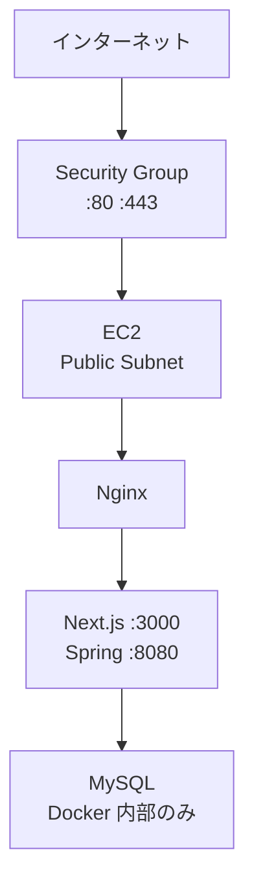
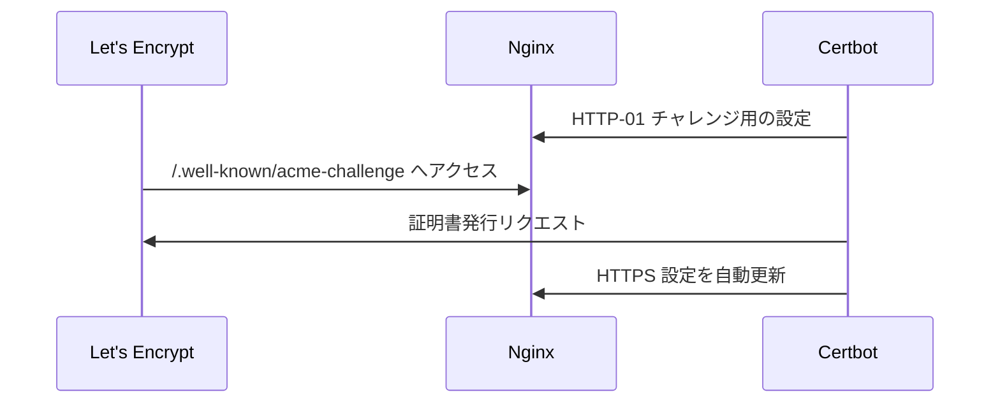

# 05. ネットワークとセキュリティ

> この章で学ぶこと: **VPC とサブネット**、**Security Group**、**Route 53 と Elastic IP**、**HTTPS の仕組み**、**IAM ロールと秘密情報の扱い**。

## 目次

1. [ネットワーク全体像](#ネットワーク全体像)
2. [VPC：最小構成の意味](#vpc最小構成の意味)
3. [Security Group：どのポートを開けるか](#security-groupどのポートを開けるか)
4. [Route 53 と Elastic IP](#route-53-と-elastic-ip)
5. [HTTPS：Let's Encrypt と Nginx](#httpslets-s-encrypt-と-nginx)
6. [IAM ロール：EC2 ができること](#iam-ロールec2-ができること)
7. [秘密情報の分類](#秘密情報の分類)
8. [Cognito 連携のセキュリティ](#cognito-連携のセキュリティ)
9. [セキュリティチェックリスト](#セキュリティチェックリスト)
10. [まず覚えるポイント](#まず覚えるポイント)

---

## ネットワーク全体像



ユーザーはインターネットから **80/443 だけ** EC2 に到達します。MySQL は Docker ネットワーク内に閉じ、Security Group では 3306 を開放していません。

---

## VPC：最小構成の意味

このプロジェクトの VPC は意図的に **小さく・安く** 作っています。

| 設定 | 値 | 理由 |
|------|-----|------|
| AZ 数 | 1 | 学習用・コスト優先。マルチ AZ 冗長は不要 |
| NAT Gateway | 0 | 月額コストがかかるため使わない |
| サブネット | Public のみ | EC2 をインターネットから直接到達させる |

### Public サブネットとは

Public サブネットに置いた EC2 は、Elastic IP により **インターネットから入ってくる通信**を受けられます。外向き通信（`dnf install`、`docker pull`、Let's Encrypt）もインスタンス自身が行います。

NAT Gateway がない構成では、プライベートサブネット内のリソースは外部と通信しにくいため、このスタックでは EC2 を Public に置く設計になっています。

---

## Security Group：どのポートを開けるか

Security Group（SG）は、仮想ファイアウォールです。

| 方向 | ポート | 送信元 | 用途 |
|------|--------|--------|------|
| Ingress | 80 | `0.0.0.0/0` | HTTP（certbot 検証 + HTTPS リダイレクト） |
| Ingress | 443 | `0.0.0.0/0` | HTTPS |
| Ingress | 22 | `allowedSshCidr`（任意） | SSH（`enableSshAccess: true` のときのみ） |
| Egress | すべて | 許可 | パッケージ更新、ECR、Secrets API など |

**開いていないポート**

| ポート | 理由 |
|--------|------|
| 3306（MySQL） | DB をインターネットに晒さない |
| 8080（Spring Boot） | Nginx 経由のみ。直接公開しない |
| 3000（Next.js） | 同上 |

ローカル開発の `127.0.0.1:3306` 公開（[02. Docker](../02-docker.md)）と同様、本番では必要最小限の公開に絞るのが基本です。

---

## Route 53 と Elastic IP

### Elastic IP

EC2 のパブリック IP は、停止・起動で変わることがあります。**Elastic IP** を割り当てると、固定の IPv4 アドレスを維持できます。

```text
ユーザー → domainName → Route 53 A レコード → Elastic IP → EC2
```

CDK デプロイ時に、既存の A レコード（手動で設定した IP など）が **Elastic IP に置き換わる**点に注意してください。

### Route 53 の既存ゾーンを参照

CDK は新しいホストゾーンを作らず、`hostedZoneId` で **既存ゾーン**をインポートします。

```java
HostedZone.fromHostedZoneAttributes(this, "HostedZone", ...)
```

`domainName` がゾーン apex（`example.com`）のとき、A レコードの `recordName` は省略されます。サブドメイン（`app.example.com`）のときは、ラベル部分だけが record 名になります。

### DNS と certbot

bootstrap は certbot 実行前に `dig` で DNS が Elastic IP を向いているか確認します。Route 53 の変更が伝播する前に certbot を走らせると失敗するため、最大約 5 分待機するロジックがあります。

---

## HTTPS：Let's Encrypt と Nginx

### なぜ ACM ではなく certbot か

**ACM（AWS Certificate Manager）**の証明書は、主に ALB や CloudFront など AWS のマネージドサービス向けです。EC2 上の Nginx に直接 ACM 証明書を載せる標準的な方法はありません。

そのためこの構成では、EC2 上で **certbot + Let's Encrypt** を使います。



### 証明書の自動更新

`certbot-renew.timer` を有効化し、期限前に更新します。Nginx の設定も certbot が書き換えます。

---

## IAM ロール：EC2 ができること

EC2 には **IAM ロール**（インスタンスプロファイル）が付与されます。アクセスキーを EC2 に置かずに AWS API を呼べます。

| 権限 | 用途 |
|------|------|
| `AmazonSSMManagedInstanceCore` | SSM セッション・Run Command |
| `secretsmanager:GetSecretValue`（grantRead） | `.env` 生成 |
| `ecr:BatchGetImage` など（grantPull） | Backend イメージの pull |
| `ssm:GetParameter`（`/{projectName}/*`） | Cognito・ドメイン設定の取得 |
| S3 読み取り（bootstrap Asset） | 初回 zip のダウンロード |

### IMDSv2

`requireImdsv2(true)` により、メタデータ取得にはトークンが必要です。SSRF 経由のメタデータ窃取対策として推奨される設定です。

`bootstrap.sh` の `ec2_metadata` 関数も IMDSv2 トークンを使っています。

---

## 秘密情報の分類

| 種類 | 保存場所 | 例 |
|------|----------|-----|
| 高機密 | Secrets Manager | DB パスワード、OpenAI API キー |
| 低〜中機密 | SSM Parameter Store | Cognito Client ID、ドメイン名、CORS 許可 Origin |
| 公開前提 | フロントの `NEXT_PUBLIC_*` | User Pool ID、Client ID、API Base URL |
| ローカル生成 | `/opt/smart-household/.env` | 上記をまとめた実行時設定 |

**Git に入れてはいけないもの**

- `cdk.json` の本番メール（可能なら example に置き換え）
- `.env` ファイル
- `init-secrets.sh` で生成したパスワードの控え（Secrets Manager を正とする）

---

## Cognito 連携のセキュリティ

このプロジェクトは **既存 Cognito** を使います。CDK は User Pool を作らず、ID を SSM に書いて EC2 / Spring Boot が参照します。

### Spring Boot 側

- `COGNITO_ISSUER_URL` と `COGNITO_JWK_SET_URL` で JWT を検証
- 詳細はバックエンドの Security ドキュメントを参照

### Cognito コンソール側で必要な設定

| 設定 | 値 |
|------|-----|
| 許可コールバック URL | `https://{domainName}/` |
| 許可サインアウト URL | `https://{domainName}/` |
| OAuth フロー | フロントの Amplify / Cognito 設定に合わせる |

デプロイ後にドメインを変えたら、Cognito の URL 一覧も必ず更新してください。不一致だとログイン後のリダイレクトが失敗します。

### CORS

CDK（`SmartHouseholdStack`）が `domainName` から CORS 許可 Origin を組み立て、SSM `/domain/cors-allowed-origins` に保存します。apex ドメインのときは `https://{domain}` と `https://www.{domain}` の両方を含めます。Spring Boot がフロントからの API 呼び出しを許可するために必要です。

---

## セキュリティチェックリスト

デプロイ前後に確認するとよい項目です。

| 項目 | 確認方法 |
|------|----------|
| SSH が不要なら閉じている | `enableSshAccess: false` |
| 80/443 以外が外部に開いていない | AWS コンソールの SG を確認 |
| MySQL が外部公開されていない | `single-host.prod` に `ports` が無いこと |
| Secrets が入っている | `aws secretsmanager get-secret-value --secret-id smart-household/app` |
| HTTPS が有効 | ブラウザで鍵マーク、HTTP が HTTPS にリダイレクト |
| Cognito コールバック URL | 本番ドメインと一致 |
| EBS 暗号化 | CDK で `encrypted(true)` |
| IMDSv2 | EC2 設定で必須になっている |

---

## まず覚えるポイント

- 外部から開くのは基本的に **80 と 443 だけ**です。
- VPC は NAT なし・Public サブネット 1 つで、コストとシンプルさを優先しています。
- 固定 IP は **Elastic IP**、名前解決は **Route 53 の A レコード**です。
- HTTPS は **EC2 上の certbot + Nginx** で実現します（ACM は使わない）。
- DB パスワードは **Secrets Manager**、Cognito ID と CORS は **SSM** に分けて保管します。
